% EusLisp version 9.15 Reference Manual Featuring Multithread and XToolKit
  ETL-TR-95-2 January, 1995
% 
% 

**EusLisp** **version 9.15** **Reference Manual** Featuring Multithread and XToolKit \
 ETL-TR-95-2 January, 1995
======================================================================================

**Toshihiro Matsui**

*matsui@etl.go.jp*

Intelligent Systems Division

EusLisp Basics
==============

Introduction
============

EusLisp is an integrated programming system for the research on
intelligent robots based on Common Lisp and Object-Oriented programming.
The principal subjects in the field of robotics research are sensory
data processing, visual environment recognition, collision avoiding
motion planning, and task planning. In either problem, three dimensional
shape models of robots and environment play crucial roles. A motivation
to the development of EusLisp was a demand for an extensible solid
modeler that can easily be made use of from higher level symbolic
processing system. Investigations into traditional solid modelers proved
that the vital requirement for their implementation language was the
list processing capability to represent and manage topology among model
components. Numerical computation power was also important, but locality
of geometric computation suggested the provision of vector/matrix
functions as built-ins would greatly ease programming.

Thus the primary decision to build a solid modeler in a Lisp equipped
with a geometric computation package was obtained. Although a solid
modeler provides facilities to define shapes of 3D objects, to simulate
their behaviors, and to display them graphically, its applications are
limited until it is incorporated in robot modules mentioned above. These
modules also need to be tightly interconnected to achieve fully
integrated robot systems. EusLisp sought for the framework of this
integration in object-oriented programming (OOP). While OOP promotes
modular programming, it facilitates incremental extension of existing
functions by using inheritance of classes. In fact, components in the
solid modeler, such as bodies, faces, and edges, can orderly be
inplemented by extending one of the most basic class *coordinates*.
These components may have further subclasses to provide individual
functions for particular robot applications.

Based upon these considerations, EusLisp has been developped as an
object-oriented Lisp which implements an extensible solid
modeler[\#!Eus7!\#]. Other features include intertask communication
needed for the cooperative task coordination, graphics facilities on
X-window for visual user interface, and foreign language interface to
support mixed language programming.

In the implementation of the language, two performance-effective
techniques were invented in type discrimination and memory management
[\#!Eus4!\#,\#!Eus5!\#,\#!Eus6!\#]. The new type discrimination method
guarantees constant-time discrimination between types in tree structured
hiearchy without regard to the depth of trees. Heap memory is managed in
Fibonacci buddy method, which improves memory efficiency without
sacrificing runtime or garbage-collection performance.

This reference manual describes EusLisp version 7.27 in two parts,
*EusLisp Basics and EusLisp Extensions*. The first part describes Common
Lisp features and object-oriented programming. Since a number of
literatures are available on both topics, the first part is rather
indifferent except EusLisp's specific features as described in
*Interprocess Communication and Network*, *Toplevel Interaction*, *Disk
Save*, etc. Beginners of EusLisp are advised to get familiar with Common
Lisp and object oriented programming in other ways
[\#!CLtL!\#,\#!CLOS:Keene!\#]. The second part deals with features more
related with robot applications, such as *Geometric Modelling*, *Image
Processing*, *Manipulator Model* and so on. Unfortunately, the
descriptions in this part may become incomplete or inaccurate because of
EusLisp's rapid evolution. The update information is available via
euslisp mailing list as mentioned in section [1.6](#License).

EusLisp's Object-Oriented Programming
-------------------------------------

Unlike other Lisp-based object-oriented programming languages like CLOS
[\#!CLOS:Keene!\#], EusLisp is a Lisp system built on the basis of
object-orientation. In the former approach, Lisp is used as an
implementation language for the object-oriented programming, and there
is apparent distinction between system defined objects and user defined
objects, since system data types do not have corresponding classes. On
the other hand, every data structure in EusLisp except number is
represented by an object, and there is no inherent difference between
built-in data types, such as `cons` and `symbols`, and user defined
classes. This implies that even the system built-in data types can be
extended (inherited) by user-defined classes. Also, when a user defines
his own class as a subclass of a built-in class, he can use built-in
methods and functions for the new class, and the amount of description
for a new program can be reduced. For example, you may extend the `cons`
class to have extra field other than `car` and `cdr` to define queues,
trees, stacks, etc. Even for these instances, built-in functions for
built-in cons are also applicable without any loss of efficiency, since
those functions recognize type hierarchy in a constant time. Thus,
EusLisp makes all the system built-in facilities open to programmers in
the form of extensible data types. This uniformity is also beneficial to
the implementation of EusLisp, because, after defining a few kernel
functions such as **defclass**, **send**, and **instantiate**, in the
implementation language, most of house-keeping functions to access the
internal structure of built-in data types can be coded in EusLisp
itself. This has much improved the reliability and maintainability of
EusLisp.

Features
--------

**object-oriented programming**
  ~ EusLisp provides single-inheritance Object-Oriented programming. All
    data types except numbers are represented by objects whose behaviors
    are defined in their classes.
**Common Lisp**
  ~ EusLisp follows the specifications of Common Lisp described in
    [\#!CLtL!\#] and [\#!CLtL2!\#] as long as they are consistent with
    EusLisp's goal and object-orientation. See next subsection for
    incompatibilities.
**compiler**
  ~ EusLisp's compiler can boost the execution 5 to 30 times as fast as
    the interpreted execution. The compiler keeps the same semantics as
    the interpreter.
**memory management**
  ~ Fibonacci buddy method, which is memory efficient, GC efficient, and
    robust, is used for the memory management. EusLisp can run on
    machines with relatively modest amount of memory. Users are free
    from the optimization of page allocation for each type of data.
**geometric primitives**
  ~ Since numbers are always represented as immediate data, no garbage
    is generated by numeric computation. A number of geometric functions
    for arbitrary-sized vectors and matrices are provided as built-in
    functions.
**geometric modeler**
  ~ Solid models can be defined from primitive bodies using CSG set
    operations. Mass properties, interference checking, contact
    detection, and so on, are available.
**graphics**
  ~ Hidden-line eliminated drawing and hidden-surface eliminated
    rendering are available. Postscript output to idraw can be
    generated.
**image processing**
  ~ Edge based image processing facility is provided.
**manipulator model**
  ~ 6 D.O.F.s robot manipulator can easily be modeled.
**Xwindow interface**
  ~ Three levels of Xwindow interface, the Xlib foreign functions, the
    Xlib classes and the original XToolKit classes are provided.
**foreign-language interface**
  ~ Functions written in C or other languages can be linked into
    EusLisp. Bidirectional call between EusLisp and other language are
    supported. Functions in libraries like LINPACK become available
    through this interface. Call-back functions in X toolkits can be
    defined in Lisp.
**unix binding**
  ~ Most of unix system calls and unix library functions are assorted as
    Lisp functions. Signal handling and asynchronous I/O are also
    possible.
**multithread**
  ~ multithread programming, which enables multiple contexts sharing
    global data, is available on Solaris 2 operating system. Multithread
    facilitates asynchronous programming and improves real-time
    response[\#!MTEus1!\#,\#!MTEus2!\#]. If EusLisp runs on
    multi-processor machines, it can utilize parallel processors' higher
    computating power.

Compatibility with Common Lisp
------------------------------

Common Lisp has become the well-documented and widely-available standard
Lisp [\#!CLtL!\#,\#!CLtL2!\#]. Although EusLisp has introduced lots of
Common Lisp features such as variable scoping rules, packages,
sequences, generalized variables, blocks, structures, keyword
parameters, etc., incompatibilities still remain. Here is a list of
missing features:

1.  multiple values: multiple-value-call,multiple-value-prog1, etc.
2.  some of data types: complex number, bignum, ratio, character and
    deftype
3.  some of special forms: progv, compiler-let,macrolet

Following features are incomplete:

1.  closure - only valid for dynamic extent
2.  declare,proclaim - inline and ignore are unrecognized

Revision History
----------------

**1986**
  ~ The first version of EusLisp ran on Unix-System5/Ustation-E20.
    Fibonacci buddy memory management, simple compiler generating M68020
    assembly code, and vector/matrix functions were tested.
**1987**
  ~ The new fast type checking method is implemented. The foreign
    language interface and the SunView interface were incorporated.
**1988**
  ~ The compiler was changed to generate C programs as intermediate
    code. Since the compiler became processor independent, EusLisp was
    ported on Ultrix/VAX8800 and on SunOS3.5/Sun3 and /Sun4 . IPC
    facility using socket streams was added. The solid modeler was
    implemented. Lots of Common Lisp features such as keyword
    parameters, labeled print format to handle recursive data objects,
    generic sequence functions, readtables, tagbody, go, flet, and
    labels special forms, etc., were added.
**1989**
  ~ The Xlib interface was introduced. % read macro to read C-like
    mathematical expressions was made. manipulator class is defined.
**1990**
  ~ The XView interface was written by M.Inaba. Ray tracer was written.
    Solid modeler was modified to keep CSG operation history.
    Asynchronous I/O was added.
**1991**
  ~ The motion constraint program was written by H.Hirukawa. Ported to
    DEC station. Coordinates class changed to handle both 2D and 3D
    coordinate systems. Body composition functions were enhanced to
    handle contacting objects. CSG operation for contacting objects. The
    package system became compatible with Common Lisp.
**1992**
  ~ **Face+** and **face\*** for union and intersection of two coplanar
    faces were added. Image processing facility was added. The first
    completed reference manual was printed and delivered.
**1993**
  ~ EusLisp was stable.
**1994**
  ~ Ported to Solaris 2. Multi-context implementation using Solaris's
    multithread facility. XToolKit is built. Multi robot simulator, MARS
    was written by Dr. Kuniyoshi. EusLisp organized session at RSJ 94,
    in Fukuoka.
**1995**
  ~ The second version of the reference manual is published.
**2010**
  ~ Version 9.00 is releaced, The licence is changed to BSD.
**2011**
  ~ Add Darwin OS Support, Add model files.
**2013**
  ~ Add Cygwin 64 Bit support, expand MXSTACK from 65536 to 8388608,
    KEYWORDPARAMETERLIMIT from 32 to 128.
**2014**
  ~ Use UTF-8 for documents, Version 9.10 is releaced.
**2015**
  ~ more error check on min/max, support arbitrary length for vplus,
    more quiet for non-ttyp mode, Version 9.11 is releaced.
**2015**
  ~ Version 9.12 is released, support ARM Version 9.13 is released,
    support class documentation Version 9.14 is released, fix assert
    API. Now message is optional (defmacro assert (pred &optional
    message) Version 9.15 is released, fix char comparison function
    (previous version retuns opossite result), support multiple argument
    at function /=, add url encode feature (escape-url function),
    support microsecond add/subtract in interval-time class

Installation
------------

The installation procedure is described in `README`. The installation
directory, which is assumed to be `"/usr/local/eus/"`, should be set to
the global variable `*eusdir*`, since this location is referenced by
**load** and the compiler.

Subdirectories in `*eusdir*` are described in table [1](#Directories).
Among these, `c/, l/, comp/, geo/, clib/,` and `xwindow` contain
essential files to make eus and eusx. Others are optional libraries,
demonstration programs and contributions from users.

**Table 1:** Directories in `*eusdir*`

  ----------- ---------------------------------------------------------------------------------------------------------
  FILES       this document
  README      a brief guide to lisence, installation and sample run
  VERSION     EUSLisp version number
  bin         executables (eus, euscomp and eusx)
  c/          EusLisp kernel written in C
  l/          kernel functions written in EusLisp
  comp/       EusLisp compiler written in EusLisp
  clib/       library functions written in C
  doc/        documentation (latex and jlatex sources and memos)
  geo/        geometric and graphic programs
  lib/        shared libraries (.so) and start-up files
  llib/       Lisp library
  llib2/      secondary Lisp library developed at UTYO
  xwindow/    X11 interface
  makefile@   symbolic link to one of makefile.sun[34]os[34],.vax, etc.
  pprolog/    tiny prolog interpreter
  xview/      xview tool kit interface
  tool/       
  vxworks/    interface with VxWorks real-time OS
  robot/      robot models and simulators
  vision/     image processing programs
  contact/    motion constraint solver by H.Hirukawa [\#!Hirukawa:1991a!\#,\#!Hirukawa:1991b!\#,\#!Hirukawa:1991c!\#]
  demo/       demonstrative programs
  bench/      benchmark programs
  ----------- ---------------------------------------------------------------------------------------------------------

License
-------

EusLisp is distributed under the following BSD License.

    Copyright (c) 1984-2001, National Institute of Advanced Industrial Science
     and Technology (AIST)
    All rights reserved.

    Redistribution and use in source and binary forms, with or without modification,
    are permitted provided that the following conditions are met:

    * Redistributions of source code must retain the above copyright notice,
      this list of conditions and the following disclaimer.
    * Redistributions in binary form must reproduce the above copyright notice,
      this list of conditions and the following disclaimer in the documentation
      and/or other materials provided with the distribution.
    * Neither the name of the National Institute of Advanced Industrial Science
      and Technology (AIST) nor the names of its contributors may be used to 
      endorse or promote products derived from this software without specific prior 
      written permission.

    THIS SOFTWARE IS PROVIDED BY THE COPYRIGHT HOLDERS AND CONTRIBUTORS "AS IS" 
    AND ANY EXPRESS OR IMPLIED WARRANTIES, INCLUDING, BUT NOT LIMITED TO, 
    THE IMPLIED WARRANTIES OF MERCHANTABILITY AND FITNESS FOR A PARTICULAR PURPOSE 
    ARE DISCLAIMED. IN NO EVENT SHALL THE COPYRIGHT HOLDER OR CONTRIBUTORS BE 
    LIABLE FOR ANY DIRECT, INDIRECT, INCIDENTAL, SPECIAL, EXEMPLARY, OR 
    CONSEQUENTIAL DAMAGES (INCLUDING, BUT NOT LIMITED TO, PROCUREMENT OF SUBSTITUTE 
    GOODS OR SERVICES; LOSS OF USE, DATA, OR PROFITS; OR BUSINESS INTERRUPTION) 
    HOWEVER CAUSED AND ON ANY THEORY OF LIABILITY, WHETHER IN CONTRACT, STRICT 
    LIABILITY, OR TORT (INCLUDING NEGLIGENCE OR OTHERWISE) ARISING IN ANY WAY OUT 
    OF THE USE OF THIS SOFTWARE, EVEN IF ADVISED OF THE POSSIBILITY OF SUCH DAMAGE.

Until version 8.25, Euslisp is distributed under following licence.

EusLisp can be obtained with its source code via ftp from
etlport.etl.go.jp (192.31.197.99). Those who use EusLisp must observe
following articles and submit a copy of license agreement (doc/LICENCE)
to the author.

    Toshihiro MATSUI   
    Intelligent Systems Division,         
    Electrotechnical Laboratory           
    1-1-4 Umezono,Tsukuba, Ibaraki 3058568, JAPAN.       email: matsui@etl.go.jp 

Users are registered in the euslisp mailing list (euslisp@etl.go.jp),
where information for Q&A, bug fix, and upgrade information is
circulated. This information has been accumulated in
`*eusdir*/doc/mails`.

1.  The copyright of EusLisp belongs to the author (Toshihiro Matsui)
    and Electrotechnical Laboratory. The user must get agreement of use
    from the author.
2.  Licensee may use EusLisp for any purpose other than military
    purpose.
3.  EusLisp can be obtained freely from Elecrotechnical Laboratory via
    ftp.
4.  EusLisp may be copied or sold as long as articles described here are
    observed. When it is sold, the seller must inform the customers that
    the original EusLisp is free.
5.  When licensees publicize their researches or studies which used
    EusLisp, the use of EusLisp must be cited with appropriate
    bibliography.
6.  Licensees may add changes to the source code of EusLisp. The
    resulted program is still EusLisp as long as the change does not
    exceed 50% of codes, and these articles must be observed for
    unchanged part.
7.  The copyright of programs developped in EusLisp belongs to the
    developper. However, he cannot extend his copyright over the main
    body of EusLisp.
8.  Neither the author nor ETL provides warranty.

Demonstrations
--------------

Demonstration programs are found in `demo` subdirectory. `cd` to
`*eusdir*` and run eusx.

**Robot Animation**
  ~ Load `demo/animdemo.l` from eusx. Smooth animation of eta3
    manipulator will be shown after a precomputation of approximately 20
    minutes.
**Ray-Tracing**
  ~ If you have 8-bit pseudo color display, a ray-tracing image can be
    generated by loading `demo/renderdemo.l`. Make sure `geo/render.l`
    has already been compiled.
**Edge Vision**
  ~ Loading `demo/edgedemo.l`, a sample gray-scale image is displayed.
    You give parameters for choosing the gradient operator and edge
    thresholds. Edges are found in a few second and overlayed on the
    original image.

**Figure 1:** Animation of Collision Avoidance Path Planning

No References!
--------------

Data Types
==========

Like other Lisps, it is data objects that are typed, not variables. Any
variable can have any object as its value. Although it is possible to
declare the type of object which is bound to a variable, but usually it
is only advisory information to the compiler to generate faster code.
Numbers are represented as immediate values in pointers and all the
others are represented by objects referenced by pointers.

In the implementation of Sun4, a pointer or a number is represented by a
long word as depicted in fig.[2](#Pointer). Two bits at LSB of a pointer
are used as tag bits to discriminate between a pointer, an integer, and
a float. Since a pointer's tags are all zero and it can use all 32 bits
for addressing an object, EusLisp can utilize up to 4GB of process
address space.

**Figure 2:** Pointer and Immediate Value

Numbers
-------

There are two kinds of numbers, integer and float (floating-point
number), both are represented with 29 bits value and 1 bit sign. Thus,
integers range from -536,870,912 to 536,870,911. Floats can represent
plus/minus from 4.8E-38 to 3.8E38 with the approximate accuracy of 6
digits in decimal, i.e., floating-point epsilon is approximately
1/1,000,000.

Numbers are always represented by immediate data, and not by objects.
This is the only exception of EusLisp's object orientation. However,
since numbers never waste heap memory, number crunching applications run
efficiently without causing garbage collection.

EusLisp does not have the character type, and characters are represented
by integers. In order to write a program independent of character code
sets, `#\` reader dispatch macro is used. However, when the character is
read, it is converted to numerical representation, and the printer does
not know how to reconvert it to `#\` notation.

A number has two tag bits in a long word Figure [2](#Pointer), which
must be stripped off by shifting or masking when used in arithmetic
computation. Note that an integer should ignore two MSB bits by
arithmetic shifting, while a float should ignore two LSB bits by
masking. Byte swap is also necessary for an architecture like VAX which
does not use the rightmost byte as the least-significant mantissa byte.

Objects
-------

Every data other than number is represented by an object which is
allocated in heap. Each memory cell of an object has the object header
and fixed number of slots for object variables. Since vectors may
consist of arbitrary number of elements, they have 'size' slot
immediately after the header. Fig. [3](#ObjectFig) depicts the
structures of object and vector, and their header word. Only the words
indicated as *slot* and *element* are accessible from users.

**Figure 3:** Structures of object, vector, and object header

A header is composed of six fields. Two MSB bits, *m* and *b*, are used
to indicate the side of the neighbor cell in Fibonacci-buddy memory
management. There are three mark bits in the *mark* field, each of which
is used by the garbage collector to identify accessible cells, by the
printer to recognize circular objects in printing in `#n=` and `#n#`
notations, and by **copy-object** to copy shared objects. The *elmt*
field discriminates one of seven possible data types of vector elements,
*pointer, bit, character, byte, integer, float* and *foreign-string*.
Although *elmt* can be available in the class, it is provided in the
header to make the memory manager independent of the structure of a
class and to make the element accessing faster. The *bid* field
represents the physical size of a memory cell. 31 different sizes up to
16 MB are represented by the five bits in this field. The lower short
word (16 bits) is used for the class id. This is used to retrieve the
class of an object via the system's class table. This class id can be
regarded as the type tag of traditional Lisps. Currently only the lower
8 bits of the cid are used and the upper 8 bits are ignored. Therefore,
the maximum number of classes is limited to 256, though this limit can
be raised up to 65536 by reconfiguring the EusLisp to allocate more
memory to the system's class table.

Class Hierarchy
---------------

The data structure of objects are defined by classes, and their
behaviors are defined by methods in the classes. In EusLisp, a few
dozens of classes have already been defined in tree structured hierarchy
as depicted in fig. [4](#ClassHierarchy). You can browse the real
inheritance structure by the **class-hierarchy** function. The class
'object' at the leftmost is the ultimate super-class of all the classes
in EusLisp. User-defined classes can inherit any of these built-in
classes.

**Figure 4:** Hierarchy of Predefined Classes

A class is defined the **defclass** macro or by the **defstruct** macro.

     (defclass class-name &key :super   class 
    :slots       () 
    :metaclass       metaclass 
    :element-type        t 
    :size  -1
    ) 
    (defstruct struct-name slots...) 
    (defstruct (struct-name [struct-options ...]) 
             (slot-name1 [slot-option...]) 
             (slot-name2 [slot-option...]) 
              ...) 

Methods are defined by the **defmethod** special form. **Defmethod** can
appear any times for a particular class.

     (defmethod class-name  
    (:method-name1 (parameter...) . body1) 
    (:method-name2 (parameter...) . body2) 
    ...) 

Field definitions for most of built-in classes are found in
`*eusdir*/c/eus.h` header file. `(describe)` *class*) gives the
description of all the slots in *class*, namely, super class, slot
names, slot types, method list, and so on. Definitions of built-in
classes follow. Note that the superclass of class **object** is NIL
since it has no super class.

     (defclass object :super NIL :slots ()) 

     (defclass cons :super object :slots (car cdr)) 

     (defclass propertied-object :super object 
      :slots (plist))   ;property list 

     (defclass symbol :super propertied-object 
      :slots (value   ;specially bound value 
    vtype                       ;const(0),var(1),special(2)  
    function                     ;global func def 
    pname         ;print name string 
    homepkg))                   ;home package 

     (defclass foreign-pod :super symbol 
      :slots (podcode   ;entry code 
    paramtypes            ;type of arguments  
    resulttype)) 

     (defclass package :super propertied-object 
      :slots (names   ;list of package name and nicknames
    uses          ;spread use-package list 
    symvector        ;hashed obvector 
    symcount          ;number of interned symbols 
    intsymvector         ;hashed obvector of internal symbols 
    intsymcount           ;number of interned internal symbols 
    shadows          ;shadowed symbols 
    used-by))         ;packages using this package 

     (defclass stream :super propertied-object   
      :slots (direction   ;:input or :output, nil if closed 
    buffer        ;buffer string 
    count        ;current character index 
    tail))        ;last character index 

     (defclass file-stream :super stream 
      :slots (fd   ;file descriptor (integer)
    fname))      ;file name str; qid for msgq 

     (defclass broadcast-stream :super stream
      :slots (destinations))   ;streams to which output is delivered 

     (defclass io-stream :super propertied-object
    :slots (instream outstream)) 

     (defclass socket-stream :super io-stream
    :slots (address))   ; socket address 

     (defclass read-table  :super propertied-object 
           :slots (syntax   ; byte vector representing character types 
    ; 0:illegal, 1:white, 2:comment, 3:macro
    ; 4:constituent, 5:single_escape
    ; 6:multi_escape, 7:term_macro, 8:nonterm_macro 
    macro        ;character macro expansion function
    dispatch-macro)) 

     (defclass array :super propertied-object 
      :slots (entity  ;simple vector storing array entity 
    rank         ;number of dimensions: 0-7 
    fillpointer             ;pointer to push next element 
    offset          ;offset for displaced array 
    dim0,dim1,dim2,dim3,dim4,dim5,dim6))  ;dimensions 

     (defclass metaclass :super propertied-object 
        :slots   (name    ;class name symbol 
    super          ;super class 
    cix               ;class id 
    vars             ;var name vector including inherited vars 
    types           ;type vector of object variables 
    forwards          ;components to which messages are forwarded 
    methods))         ;method list 

     (defclass vectorclass :super metaclass  
      :slots (element-type    ;vector element type 0-7
    size))        ;vector size; 0 if unspecified 

     (defclass cstructclass :super vectorclass  
      :slots (slotlist))    ;cstruct slot descriptors

     (defclass vector :super object :slots (size)) 

     (defclass float-vector :super vector :element-type :float) 

     (defclass string :super vector :element-type :char) 

     (defclass hash-table :super propertied-object 
       :slots   (lisp::key  ;hashed key vector
    value        ; value vector
    size         ; the size of the hash table
    count        ; number of elements entered in the table
    lisp::hash-function          
    lisp::test-function 
    lisp::rehash-size 
    lisp::empty  lisp::deleted      ) 

     (defclass pathname :super propertied-object 
       :slots   (lisp::host device  ; not used
    directory        ; list of directories
    name         ; file name before the last "."
    type         ; type field after the last "."
    lisp::version)       ; not used 

     (defclass label-reference    ;for reading #n=, #n# objects 
      :super object 
    :slots (label value unsolved next)) 

     (defclass compiled-code :super object 
       :slots   (codevector 
    quotevector 
    type   ;0=func, 1=macro, 2=special 
    entry))           ;entry offset  

     (defclass closure :super compiled-code 
    :slots (env1 env2));environment 

     (defclass foreign-code  :super compiled-code  
       :slots   (paramtypes    ;list of parameter types
    resulttype))         ;function result type 

     (defclass load-module  :super compiled-code  
       :slots  (symbol-table   ;hashtable of symbols defined 
    object-file          ;name of the object file loaded, needed for unloading 
    handle       ;file handle returned by ''dlopen'' 

Type Specifier
--------------

Though EusLisp does not have the **d**eftype special form, type names
are used in declarations and functions requesting to specify the type of
results or contents, as in **coerce, map, concatenate, make-array**,
etc. Usually, class names can be used as type specifiers, as in
`(concatenate cons "ab" "cd") = (97 98 99 100)`, where Common Lisp uses
`(quote list)` instead of `cons`.

As EusLisp does not have classes to represent numbers, types for numbers
need to be given by keywords. **:**integer, **i**nteger, **:**int,
**f**ixnum, or **:**fixnum is used to represent the integer type,
**:**float or **f**loat, the floating point number type. As the
*e*lement-type argument of **m**ake-array, **:**character,
**c**haracter, **:**byte, and **b**yte are recognized to make strings.
Low level functions such as **d**efcstruct, **s**ys:peek, and
**s**ys:poke, also recognize **:**character, **c**haracter, **:**byte,
or **b**yte for the byte access, and **:**short or **s**hort for short
word access. In any cases, keywords are preferable to lisp package
symbols with the same pname.

Forms and Evaluation
====================

Atoms
-----

A data object other than a cons is always an atom, no matter what
complex structure it may have. Note that NIL, which is sometimes noted
as () to represent an empty list, is also an atom. Every atom except a
symbol is always evaluated to itself, although quoting is required in
some other Common Lisp implementations.

Scoping
-------

Every symbol may have associated value. A symbol is evaluated to its
value determined in the current binding context. There are two kinds of
variable bindings; the lexical or static binding and the special or
dynamic binding. Lexically bound variables are introduced by **lambda**
form or **let** and **let\*** special forms unless they are declared
special. Lexical binding can be nested and the only one binding which is
introduced innermost level is visible, hiding outer lexical bindings and
the special binding. Special variables are used in two ways: one is for
global variables, and the other is for dynamically scoped local
variables which are visible even at the outside of the lexical scope as
long as the binding is in effect. In the latter case, special variables
are needed to be declared special. The declaration is recognized not
only by the compiler, but also by the interpreter. According to the
Common Lisp's terms, special variables are said to have indefinite scope
and dynamic extent.

Even if there exists a lexical variable in a certain scope, the same
variable name can be redeclared to be special in inner scope. Function
**symbol-value** can be used to retrieve the special values regardless
to the lexical scopes. Note that **set** function works only for special
variable, i.e. it cannot be used to change the value of lambda or let
variables unless they are declared special.

    (let ((x 1))
       (declare (special x))
       (let* ((x (+ x x)) (y x))
          (let* ((y (+ y y)) (z (+ x x)))
             (declare (special x))
             (format t "x=~S y=~s z=~s~%" x y z) ) ) )
    --> x=1 y=4 z=2

A symbol can be declared to be a constant by **defconstant** macro. Once
declared, an attempt to change the value signals an error thereafter.
Moreover, such a constant symbol is inhibited to be used as the name of
a variable even for a local variable. NIL and T are examples of such
constants. Symbols in the keyword package are always declared to be
constants when they are created. In contrast, **defvar** and
**defparameter** macro declare symbols to be special variables.
**defvar** initializes the value only if the symbol is unbound, and does
nothing when it already has a value assigned, while **defparameter**
always resets the value.

When a symbol is referenced and there is no lexical binding for the
symbol, its special value is retrieved. However, if no value has been
assigned to its special value yet, unbound variable error is signaled.

Generalized Variables
---------------------

Generally, any values or attributes are represented in slots of objects
(or in stack frames). To retrieve and alter the value of a slot, two
primitive operations, *access* and *update*, must be provided. Instead
of defining two distinct primitives for every slot of objects, EusLisp,
like Common Lisp, provides uniform update operations based on the
generalized variable concept. In this concept, a common form is
recognized either as a value access form or as a slot location
specifier. Thus, you only need to remember accessing form for each slot
and update is achieved by **setf** macro used in conjunction with the
access form. For example, `(car x)` can be used to replace the value in
the car slot of `x` when used with **setf** as in
`(setf (car  '(a b) 'c)`, as well as to take the car value out of the
list.

This method is also applicable to all the user defined objects. When a
class or a structure is defined, the access and update forms for each
slot are automatically defined. Each of those forms is defined as a
macro whose name is the concatenation of the class name and slot name.
For example, car of a cons can be addressed by `(cons-car '(a b c))`.

    (defclass person :super object :slots (name age))
    (defclass programmer :super person :slots (language machine))
    (setq x (instantiate programmer))
    (setf (programmer-name x) "MATSUI"
          (person-age x) 30)
    (incf (programmer-age x))
    (programmer-age x)   --> 31
    (setf (programmer-language x) 'EUSLISP
          (programmer-machine x) 'SUN4)

Array elements can be accessed in the same manner.

    (setq a (make-array '(3 3) :element-type :float))
    (setf (aref a 0 0) 1.0 (aref a 1 1) 1.0 (aref a 2 2) 1.0)
    a --> #2f((1.0 0.0 0.0) (0.0 1.0 0.0) (0.0 0.0 1.0))

    (setq b (instantiate bit-vector 10))  --> #*0000000000
    (setf (bit b 5) 1)
    b --> #*0000010000

In order to define special setf methods for particular objects,
**defsetf** macro is provided.

    (defsetf symbol-value set)
    (defsetf get (sym prop) (val) `(putprop ,sym ,val ,prop))

Special Forms
-------------

**Table 2:** EusLisp's special forms

  ----------- ---------- ----------------
  and         flet       quote
  block       function   return-from
  catch       go         setq
  cond        if         tagbody
  declare     labels     the
  defmacro    let        throw
  defmethod   let\*      unwind-protect
  defun       progn      while
  eval-when   or         
  ----------- ---------- ----------------

All the special forms are listed in Table [2](#SpecialForms).
**macrolet, compiler-let,** and **progv** have not been implemented.
Special forms are essential language constructs for the management of
evaluation contexts and control flows. The interpreter and compiler have
special knowledge to process each of these constructs properly, while
the application method is uniform for all functions. Users cannot add
their own special form definition.

Macros
------

Macro is a convenient method to expand language constructs. When a macro
is called, arguments are passed to the macro body, which is a macro
expansion function, without being evaluated. Then, the macro expansion
function expands the arguments, and returns the new form. The resulted
form is then evaluated again outside the macro. It is an error to apply
a macro or special form to a list of arguments. **Macroexpand** function
can be used for the explicit macro expansion.

Though macro runs slowly when interpreted, it speeds up compiled code
execution, because macro expansion is taken at compile-time only once
and no overhead is left to run-time. Note that explicit call to eval or
apply in the macro function may produce different results between
interpreted execution and the compiled execution.

Functions
---------

A function is expressed by a lambda form which is merely a list whose
first element is **lambda**. If a lambda form is defined for a symbol
using **defun**, it can be referred as a global function name. Lambda
form takes following syntax.

     (lambda ({var}* )}*] )  ((keyword var) [initform])}* ] )}*]) 
      {declaration}* 
      {form}*) 

There is no function type such as EXPR, LEXPR, FEXPR, etc.: arguments to
a function are always evaluated before its application, and the number
of acceptable arguments is determined by lambda-list. Lambda-list
specifies the sequence of parameters to the lambda form. Each of
**&optional, &rest, &key** and **&aux** has special meaning in
lambda-lists, and these symbols cannot be used as variable names.
Supplied-p variables for &optional or &key parameters are not supported.

Since a lambda form is indistinguishable from normal list data,
**function** special form must be used to inform the interpreter and
compiler the form is intended to be a function.
[^1^](manual-footnode.html#foot975)**Function** is also important to
freeze the environment onto the function, so that all the lexical
variables can be accessible in the function even the function is passed
to another function of different lexical scope. The following program
does not work either interpretedly nor after compiled, since `sum` from
the `let` is invisible inside lambda form.

    (let ((x '(1 2 3)) (sum 0))
      (mapc '(lambda (x) (setq sum (+ sum x))) x))

To get the expected result, it should be written as follows:

    (let ((x '(1 2 3)) (sum 0))
       (mapc #'(lambda (x) (setq sum (+ sum x))) x ))

\#' is the abbreviated notation of **function**, i.e. `#'(lambda (x) x)`
is equivalent to `(function (lambda (x) x))`. Here is another example of
what is called a funarg problem:

    (defun mapvector (f v)
        (do ((i 0 (1+ i)))
           ((>= i (length v)))
           (funcall f (aref v i))))
    (defun vector-sum (v)
        (let ((i 0))
           (mapvector #'(lambda (x) (setq i (+ i x))) v)
           i))
    (vector-sum #(1 2 3 4)) --> 10

EusLisp's closure cannot have indefinite extent: i.e. a closure can only
survive as long as its outer extent is in effect. This means that a
closure cannot be used for programming of \`\`generators". The following
program does not work.

    (proclaim '(special gen))
    (let ((index 0))
       (setq gen #'(lambda () (setq index (1+ index)))))
    (funcall gen)

However, the same purpose is accomplished by object oriented
programming, because an object can hold its own static variables:

    (defclass generator object (index))
    (defmethod generator
     (:next () (setq index (1+ index)))
     (:init (&optional (start 0)) (setq index start) self))
    (defvar gen (instance generator :init 0))
    (send gen :next)

Control Structures
==================

Conditionals
------------

Although **and, or** and **cond** are advised to be macros by Common
Lisp, they are implemented as special forms in EusLisp to improve the
interpreting performance.

**and** *{form}\**[special]

*Form*s are evaluated from left to right until NIL appears. If all forms
are evaluated to non-NIL, the last value is returned.

**or** *{form}\**[special]

*Form*s are evaluated from left to right until non-NIL appears, and the
value is returned. If all forms are evaluated to NIL, NIL is returned.

**if** *test then [else]*[special]

**if** can only have single *then* and *else* forms. To allow multiple
*then* or *else* forms, they must be grouped by **progn**.

**when** *test forms*[macro]

Unlike **if**, **when** and **unless** allow you to write multiple
*forms* which are executed when *test* holds (**when**) or does not
*unless*. On the other hand, these macros cannot have the *else* forms.

**unless** *test forms*[macro]

is equivalent to `(when (not test) . forms)`.

**cond** *(test {form}\*)\**[special]

Arbitrary number of cond-clauses can follow **cond**. In each clause,
the first form, that is *test*, is evaluated. If it is non-nil, the rest
of the forms in that clause are evaluated sequentially, and the last
value is returned. If no forms are given after the *test*, the value of
the *test* is returned. When the *test* fails, next clause is tried
until a *test* which is evaluated to non-nil is found or all clauses are
exhausted. In the latter case, **cond** returns NIL.

**case** *key {({label 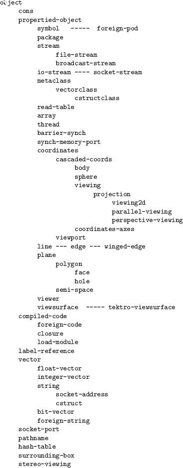 ({lab}\*)
{form}\*)}\**[macro]

For the clause whose *label* matches with *key*, *form*s are evaluated
and the last value is returned. Equality between *key* and *label* is
tested with **eq** or **memq**, not with **equal**.

Sequencing and Lets
-------------------

**prog1** *form1 &rest forms*[function]

*form1* and *forms* are evaluated sequentially, and the value returned
by *form1* is returned as the value of **prog1**.

**progn** *{form}\**[special]

*Form*s are evaluated sequentially, and the value of the rightmost form
is returned. **Progn** is a special form because it has a special
meaning when it appeared at top level in a file. When such a form is
compiled, all inner forms are regarded as they appear at top level. This
is useful for a macro which expands to a series of **defun**s or
**defmethod**s, which must appear at top level.

**setf** *{access-form value}\**[macro]

assigns *value* to a generalized-variable *access-form*.

**let** *({var  (var [value])}\*)
{declare}\* {form}\**[special]

introduces local variables. All *value*s are evaluated and assigned to
*var*s in parallel, i.e.,
`(let ((a 1)) (let ((a (1+ a)) (b a)) (list a b)))` produces (2 1).

**let\*** *({var  (var [value])}\*)
{declare}\* {form}\**[special]

introduces local variables. All *value*s are evaluated sequentially, and
assigned to *var*s i.e.,
`(let ((a 1)) (let* ((a (1+ a)) (b a)) (list a b)))` produces (2 2).

Local Functions
---------------

**flet** *({(fname lambda-list . body)}\*) {form}\**[special]

defines local functions.

**labels** *({(fname lambda-list . body)}\*) {form}\**[special]

defines locally scoped functions. The difference between *flet* and
*labels* is, the local functions defined by *flet* cannot reference each
other or recursively, whereas *labels* allows such mutual references.

Blocks and Exits
----------------

**block** *tag {form}\**[special]

makes a lexical block from which you can exit by **return-from**. *Tag*
is lexically scoped and is not evaluated.

**return-from** *tag value*[special]

exits the block labeled by *tag*. **return-from** can be used to exit
from a function or a method which automatically establishes block
labeled by its function or method name surrounding the entire body.

**return** *value*[macro]

`(return x)` is equivalent to `(return-from nil x)`. This is convenient
to use in conjunction with **loop, while, do, dolist,** and **dotimes**
which implicitly establish blocks labeled NIL.

**catch** *tag {form}\**[special]

establishes a dynamic block from which you can exit and return a value
by **throw**. *Tag* is evaluated. The list of all visible catch tags can
be obtained by `sys:list-all-catchers`.

**throw** *tag value*[special]

exits and returns *value* from a catch block. *tag* and *value* are
evaluated.

**unwind-protect** *protected-form {cleanup-form}\**[special]

After the evaluation of *protected-form* finishes, *cleanup-form* is
evaluated. You may make a block or a catch block outside the
`unwind-protect`. Even **return-from** or **throw** is executed in
*protected-form* to escape from such blocks, *cleanup-form* is assured
to be evaluated. Also, if you had an error while executing
*protected-form*, *cleanup-form* would always be executed by *reset*.

Iteration
---------

**while** *test {form}\**[special]

While *test* is evaluated to non-nil, *form*s are evaluated repeatedly.
**While** special form automatically establishes a block by name of nil
around *form*s, and **return** can be used to exit from the loop.

**tagbody** *{tag  statement}\**[special]

*tag*s are labels for **go**. You can use **go** only in **tagbody**.

**go** *tag*[special]

transfers control to the form just after *tag* which appears in a
lexically scoped **tagbody**. **Go** to the tag in a different
**tagbody** across the lexical scope is inhibited.

**prog** *({var  (var [init])}\*) {tag
 statement}\**[macro]

**prog** is a macro, which expands as follows:

     (block nil     (let var (tagbody  tag  statement))) 

**do** *({(var init [next])}\*) (endtest [result]){declare} {form}
\**[macro]

*var*s are local variables. To each *var*, *init* is evaluated in
parallel and assigned. Next, *endtest* is evaluated and if it is true,
**do** returns *result* (defaulted to NIL). If *endtest* returns NIL,
each *form* is evaluated sequentially. After the evaluation of forms,
*next* is evaluated and the value is reassigned to each *var*, and the
next iteration starts.

**do\*** *({var init [next]}\*) (endtest [result]){declare}
{form}\**[macro]

**do\*** is same as **do** except that the evaluation of *init* and
*next*, and their assignment to *var* occur sequentially.

**dotimes** *(var count [result]) {forms}\**[macro]

evaluates *forms* *count* times. *count* is evaluated only once. In each
evaluation, *var* increments from integer zero to *count* minus one.

**dolist** *(var list [result]) {forms}\**[macro]

Each element of *list* is sequentially bound to *var*, and *forms* are
evaluated for each binding. **Dolist** runs faster than other iteration
constructs such as **mapcar** and recursive functions, since **dolist**
does not have to create a function closure or to apply it, and no new
parameter binding is needed.

**until** *condition {forms}\**[macro]

evaluates forms until *condition* holds.

**loop** *{forms}\**[macro]

evaluates *forms* forever. To terminate execution, **return-from,
throw** or **go** needed to be evaluated in *forms*.

Predicates
----------

**Typep** and **subtypep** of Common Lisp are not provided, and should
be simulated by **subclassp** and **derivedp**.

**eq** *obj1 obj2*[function]

returns T, if *obj1* and *obj2* are pointers to the same object, or the
same numbers. Examples: `(eq 'a 'a)` is T, `(eq 1 1)` is T,
`(eq 1. 1.0)` is nil, `(eq "a" "a")` is nil.

**eql** *obj1 obj2*[function]

**Eq** and **eql** are identical since all the numbers in EusLisp are
represented as immediate values.

**equal** *obj1 obj2*[function]

Checks the equality of any structured objects, such as strings, vectors
or matrices, as long as they do not have recursive references. If there
is recursive reference in *obj1* or *obj2*, **equal** loops infinitely.

**superequal** *obj1 obj2*[function]

Slow but robust **equal**, since **superequal** checks circular
reference.

**null** *object*[function]

T if *object* is nil. Equivalent to (eq *object* nil).

**not** *object*[function]

**not** is identical to **null**.

**atom** *object*[function]

returns NIL only if object is a cons. `(atom nil) = (atom '()) = T)`.
Note that **atom** returns T for vectors, strings, read-table,
hash-table, etc., no matter what complex objects they are.

**every** *pred &rest args*[function]

returns T if all *args* return T for *pred*. **Every** is used to test
whether *pred* holds for every *args*.

**some** *pred &rest args*[function]

returns T if at least one of *args* return T for *pred*. **Some** is
used to test whether *pred* holds for any of *args*.

**functionp** *object*[function]

T if *object* is a function object that can be given to **apply** and
**funcall**. Note that macros cannot be *apply*'ed or *funcall*'ed.
**Functionp** returns T, if *object* is either a compiled-code with
type=0, a symbol that has function definition, a lambda-form, or a
lambda-closure. Examples: (functionp 'car) = T, (functionp 'do) = NIL

**compiled-function-p** *object*[function]

T if *object* is an instance of compiled-code. In order to know the
compiled-code is a function or a macro, send `:type` message to the
object, and `function` or `macro` is returned.

Object Oriented Programming
===========================

The structures and behaviors of objects are described in classes, which
are defined by **defclass** macro and **defmethod** special form.
**defclass** defines the name of the class, its super class, and slot
variable names, optionally with their types and message forwarding.
**defmethod** defines methods which will invoked when corresponding
messages are sent. Class definition is assigned to the symbol's special
value. You may think of **class** as the counter part of Common Lisp's
**structure**. Slot accessing functions and **setf** methods are
automatically defined for each slot by **defclass**.

Most classes are instantiated from the built-in class **metaclass**.
Class **vector-class**, which is a subclass of **metaclass**, is a
metaclass for vectors. If you need to use class-variables and
class-methods, you may make your own metaclass by subclassing
**metaclass**, and the metaclass name should be given to **defclass**
with `:metaclass` keyword.

Vectors are different from other record-like objects because an instance
of the vector can have arbitrary number of elements, while record-like
objects have fixed number of slots. EusLisp's object is either a
record-like object or a vector, not both at the same time.

Vectors whose elements are typed or the number of elements are
unchangeable can also be defined by **defclass**. In the following
example, class `intvec5` which has five integer elements is defined.
Automatic type check and conversion are performed when the elements are
accessed by the interpreter. When compiled with proper declaration,
faster accessing code is produced.

    (defclass intvec5 :super vector :element-type :integer :size 5)
    (setq x (instantiate intvec5))  --> #i(0 0 0 0 0)

When a message is sent to an object, the corresponding method is
searched for, first in its class, and next in its superclasses toward
**object**, until all superclasses are exhausted. If the method is
undefined, forward list is searched. This forwarding mechanism is
introduced to simulate multiple inheritance. If the search fails again,
a method named `:nomethod` is searched, and the method is invoked with a
list of all the arguments. In the following example, the messages
`:telephone` and `:mail` are sent to `secretary` slot object which is
typed `person`, and `:go-home` message is sent to `chauffeur` slot.

    (defclass president :super object
                        :slots ((name :type string)
                                (age  :type :integer)
                                (secretary  :type person
                                            :forward (:telephone :mail))
                                (chauffeur  :forward (:go-home))))

In a method, two more local variables, **class** and **self**, become
accessible. You should not change either of these variables. If you do
that, the ones supplied by the system are hidden, and **send-super** and
**send self** are confused.

Classes and Methods
-------------------

creates or redefine a class. When a class is redefined to have different
superclass or slot variables, old objects instantiated from the previous
class definition will behave unexpectedly, since method definitions
assume the new slots disposition.

**defmethod** *classname {(selector lambda-list . body)}\**[special]

defines one or more methods of *classname*. Each *selector* must be a
keyword symbol.

**defclassmethod** *classname {(selector lambda-list . body)}\**[macro]

**classp** *object*[function]

T if *object* is a class object, that is, an instance of class
**metaclass** or its subclasses.

**subclassp** *class super*[function]

Checks *class* is a subclass of *super*.

**vector-class-p** *x*[function]

T if *x* is an instance of **vector-class**.

**delete-method** *class method-name*[function]

The method definition is removed from the specified class.

**class-hierarchy** *class*[function]

prints inheritance hierarchy below *class*.

**system:list-all-classes** [function]

lists up all the classes defined so far.

**system:find-method** *object selector*[function]

tries to find a method specified by *selector* in the class of *object*
and in its superclass. This is used to know whether *object* can respond
to *selector*.

**system:method-cache** *[flag]*[function]

Interrogates the hit ratio of the method cache, and returns a list of
two numbers, hit and miss. If *flag* is NIL, method caching is disabled.
If non-nil flag is given, method cache is purged and caching is enabled.

Message Sending
---------------

**send** *object selector {arg}\**[function]

send a message consisting of *selector* and *arg* to *object*. *object*
can be anything but number. *selector* must be evaluated to be a
keyword.

**send-message** *target search selector {arg}\**[function]

Low level primitive to implement **send-super**.

**send\*** *object selector &rest msg-list*[macro]

**send\*** applies **send-message** to a list of arguments. The relation
between **send** and **send\*** is like the one between **funcall** and
**apply**, or **list** and **list\***.

**send-all** *receivers selector &rest mesg*[function]

sends the same message to all the receivers, and collects the result in
a list.

**send-super** *selector &rest msgs*[macro]

sends *msgs* to self, but begins method searching at the superclass of
the class where the method currently being executed is defined. It is an
error to *send-super* outside a method (i.e. in a function).

**send-super\*** *selector &rest msg-list*[macro]

**send-super\*** is apply version of send-super.

Instance Management
-------------------

**instantiate** *class &optional size*[function]

the lowest primitive to create a new object from a class. If the class
is a vector-class, *size* should be supplied.

**instance** *class &rest message*[macro]

An instance is created, and the message is sent to it.

**make-instance** *class &rest var-val-pairs*[function]

creates an instance of *class* and sets its slot variables according to
*var-val-pairs*. For example, `(make-instance cons :car 1 :cdr 2)` is
equivalent to `(cons 1 2)`.

**copy-object** *object*[function]

**copy-object** function is used to copy objects keeping the referencing
topologies even they have recursive references. **Copy-object** copies
any objects accessible from *object* except symbols and packages, which
are untouched to keep the uniqueness of symbols. **copy-object**
traverses all the references in an object twice: once to create new
objects and to mark original objects that they have already copied, and
again to remove marks. This two-step process makes copy-object work
slower than copy-seq. If what you wish to copy is definitely a sequence,
use of **copy-seq** or **copy-tree** is recommended.

**become** *object class*[function]

changes the class of *object* to *class*. The slot structure of both the
old class and the new class must be consistent. Usually, this can be
safely used only for changing class between binary vectors, for example
from an integer-vector to a bit-vector.

**replace-object** *dest src*[function]

dest must be an instance of the subclass of src.

**class** *object*[function]

returns the class object of *object*. To get the name of the class, send
:name message to the class object.

**derivedp** *object class*[function]

**derivedp** checks if an object is instantiated from *class* or
*class*'s subclasses. **subclassp** and **derivedp** functions do not
search in class hierarchy: type check always finishes within a constant
time.

**slot** *object class (index 
slot-name)*[function]

Returns the named or indexed slot value.

**setslot** *object class (index  slot-name)
value*[function]

**Setslot** is a internal function and users should not use it. Use,
instead, combination of **setf** and **slot**.

Basic Classes
-------------

\
 **object** [class]

      :super    
      :slots         

Object is the most basic class that is located at the top of class
hierarchy. Since it defines no slot variables, it is no use to make an
instance of **object**.

**:prin1** *&optional stream &rest mesg*[method]

prints the object in the standard re-readable object format, that is,
the class name and the address, enclosed by angle brackets and preceded
by a pound sign. Any subclasses of **object** can use this method to
print itself with more comprehensive information by using **send-super**
macro specifying *mesg* string. An object is re-readable if it begins
with \#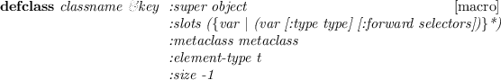, followed by its class name, correct
address, any lisp-readable information, and `>`. Since every data object
except numbers inherits **object**, you can get print forms in this
notation, even for symbols or strings. Specifying this notation, you can
catch data objects that you forgot to **setq** to a symbol, as long as
there happened no garbage collection after it is printed.

**:slots** [method]

returns the list of variable-name and value pair of all the slots of the
object. You can get the value of a specific slot by applying **assoc**
to this list, although you cannot alter them.

**propertied-object** [class]

      :super   object 
      :slots         plist 

defines objects that have property list. Unlike other Common Lisp,
EusLisp allows any objects that inherit propertied-object to have
property lists, even if they are not symbols.

**:plist** *&optional plist*[method]

if *plist* is specified, it is set to the plist slot of this object.
Previous plist, if there had been one, is lost. Legal plist should be of
the form of `((indicator1 . value1) (indicator2 . value2) ...)`. Each
`indicator` can be any lisp form that are tested its equality with the
**eq** function. When a symbol is used for an indicator, use of keyword
is recommended to ensure the equality check will be performed
interpacakge-widely. **:plist** returns the current plist.

**:get** *indicator*[method]

returns the value associated with *indicator* in the property list.
`(send x :get :y) == (cdr (assoc :y (send x :plist)))`.

**:put** *indicator value*[method]

associates *value* to *indicator* in the plist.

**:remprop** *indicator*[method]

removes *indicator* and value pair from the plist. Further attempt to
*:get* the value returns nil.

**:name** *&optional name*[method]

defines and retrieves the `:name` property in the plist. This property
is used for printing.

**:prin1** *&optional stream &rest mesg*[method]

prints the object in the re-readable form. If the object has **:name**
property, it is printed after the address of the object.

**:slots** [method]

returns a list of variable and value pairs of this object.

**:methods** [method]

returns a list of all method names defined for this object. In other
words, this object can accept method calls listed by :methods.

**:get-val** *variable-name*[method]

returns the value of the slot designated by *variable-name*. If the
object does not have the variable-name slot, an error is reported.

**:set-val** *variable-name value*[method]

sets *value* in the variable-name slot of this object. If the object
does not have the variable-name slot, an error is reported.

**metaclass** [class]

      :super   propertied-object 
      :slots         name super cix vars types forwards methods 

Metaclass defines classes. Classes that have own class variables should
be defined with **metaclass** as their superclass.

**:new** [method]

creates an instance of this class and returns it after filling all the
slots with NIL.

**:super** [method]

returns the super class object of this class. You cannot alter
superclass once defclassed.

**:methods** [method]

returns a list of all the methods defined in this class. The list is
composed of lists each of which describes the name of the method,
parameters, and body.

**:method** *name*[method]

returns the method definition associated with *name*. If not found, NIL
is returned.

**:method-names** *subname*[method]

returns a list of all the method names each of which contains *subname*
in its method name. Methods are searched only in this class.

**:all-methods** [method]

returns a list of all methods that are defined in this class and its all
the super classes. In other words, an instance of this class can execute
each of these methods.

**:all-method-names** *subname*[method]

returns a list of all the method names each of which matches with
*subname*. The search is made from this class up to **object**.

**:slots** [method]

returns the slot-name vector.

**:name** [method]

returns the name symbol of this class.

**:cid** [method]

returns an integer that is assigned to every instance of this class to
identify its class. This is an index to the system-internal class table,
and is changed when a new subclass is defined under this class.

**:subclasses** [method]

returns a list of the direct subclass of this class.

**:hierarchy** [method]

returns a list of all the subclasses defined under this class. You can
also call the **class-hierarchy** function to get a comprehensive
listing of all the class hierarchy.

**find-method** *object selector*[function]

searches for the method identified by *selector* in *object*'s class and
its super classes. This function is useful when object's class is
uncertain and you want to know whether the object can handle the message
without causing nomethod error.

Arithmetic Functions
====================

Arithmetic Constants
--------------------

**most-positive-fixnum** [constant]

\#x1fffffff=536,870,911

**most-negative-fixnum** [constant]

-\#x20000000= -536,870,912

**short-float-epsilon** [constant]

A floating point number on machines with IEEE floating-point format is
represented by 21 bit mantissa with 1 bit sign and 7 bit exponent with 1
bit sign. Therefore, floating point epsilon is .

**single-float-epsilon** [constant]

same as **short-float-epsilon**, 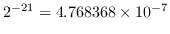.

**long-float-epsilon** [constant]

same as **short-float-epsilon** since there is no double or long float.
.

**pi** [constant]

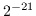, actually 3.14159203, not 3.14159265.

**2pi** [constant]

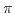

**pi/2** [constant]

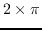

**-pi** [constant]

-3.14159203

**-2pi** [constant]

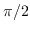

**-pi/2** [constant]

Arithmetic Predicates
---------------------

**numberp** *object*[function]

T if *object* is number, namely integer or float. Note that characters
are also represented by numbers.

**integerp** *object*[function]

T if *object* is an integer number. A float can be converted to an
integer by **round, trunc** and **ceiling** functions.

**floatp** *object*[function]

T if *object* is a floating-point number. An integer can be converted to
a float by the **float** function.

**zerop** *number*[function]

T if the number is integer zero or float 0.0.

**plusp** *number*[function]

equivalent to (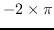 number 0).

**minusp** *number*[function]

equivalent to ( number 0).

**oddp** *integer*[function]

The argument must be an integer. T if *integer* is odd.

**evenp** *integer*[function]

The argument must be an integer. T if *integer* is an even number.

**/=** *n1 n2 &rest more-numbers*[function]

Both *n1*, *n2* and all elements of *more-numbers* must be numbers. T if
no two of its arguments are numerically equal, NIL otherwise.

**=** *num1 num2 &rest more-numbers*[function]

Both *n1* and *n2* and all elements of *more-numbers* must be numbers. T
if *n1*, *n2* and all elements of *more-numbers* are the same in value,
NIL otherwise.

**** *num1 num2 &rest more-numbers*[function]

Both *n1* and *n2* and all elements of *more-numbers* must be numbers. T
if *n1*, *n2* and all elements of *more-numbers* are in monotonically
decreasing order, NIL otherwise. For numerical comparisons with
tolerance, use functions prefixed by **eps** as described in the section
[16](#Geometry).

**** *num1 num2 &rest more-numbers*[function]

Both *n1* and *n2* and all elements of *more-numbers* must be numbers. T
if *n1*, *n2* and all elements of *more-numbers* are in monotonically
increasing order, NIL otherwise. For numerical comparisons with
tolerance, use functions prefixed by **eps** as described in the section
[16](#Geometry).

**** *num1 num2 &rest more-numbers*[function]

Both *n1* and *n2* and all elements of *more-numbers* must be numbers. T
if *n1*, *n2* and all elements of *more-numbers* are in monotonically
nonincreasing order, NIL otherwise. For numerical comparisons with
tolerance, use functions prefixed by **eps** as described in the section
[16](#Geometry).

**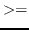** *num1 num2 &rest more-numbers*[function]

Both *n1* and *n2* and all elements of *more-numbers* must be numbers. T
if *n1*, *n2* and all elements of *more-numbers* are in monotonically
nondecreasing order, NIL otherwise. For numerical comparisons with
tolerance, use functions prefixed by **eps** as described in the section
[16](#Geometry).

Integer and Bit-Wise Operations
-------------------------------

Following functions request arguments to be integers.

**mod** *dividend divisor*[function]

returns remainder when *dividend* is divided by *divisor*.
`(mod 6 5)=1, (mod -6 5)=-1, (mod 6 -5)=1, (mod -6 -5)=-1`.

**1-** *integer*[function]

The compiler assumes the argument to be an integer.
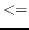 is returned.

**1+** *integer*[function]

Arguments to 1+ and 1- must be an integer.
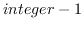 is returned.

**logand** *&rest integers*[function]

bitwise-and of *integers*.

**logior** *&rest integers*[function]

bitwise-inclusive-or of *integers*.

**logxor** *&rest integers*[function]

bitwise-exclusive-or of *integers*.

**logeqv** *&rest integers*[function]

**logeqv** is equivalent to (lognot (logxor ...)).

**lognand** *&rest integers*[function]

bitwise-nand of *integers*.

**lognor** *&rest integers*[function]

bitwise-nor of *integers*.

**lognot** *integer*[function]

bit reverse of *integer*.

**logtest** *integer1 integer2*[function]

T if (logand *integer1 integer2*) is not zero.

**logbitp** *index integer*[function]

T if *index*th bit of *integer* (counted from the LSB) is 1, otherwise
NIL.

**ash** *integer count*[function]

Arithmetic Shift Left. If *count* is positive, shift direction is left,
and if *count* is negative, *integer* is shifted to right by
abs(*count*) bits.

**ldb** *target position width*[function]

LoaD Byte. Byte specifier for **ldb** and **dpb** does not exist in
EusLisp. Use a pair of integers instead. The field of *width* bits at
*position* within *target* is extracted. For example, `(ldb #x1234 4 4)`
is 3.

**dpb** *value integer position width*[function]

DePosit byte. *Width* bits of *value* is put in *integer* at
*position*th bits from LSB.

Generic Number Functions
------------------------

**+** *&rest numbers*[function]

returns the sum of *numbers*.

**-** *num &rest more-numbers*[function]

If *more-numbers* are given, they are subtracted from *num*. Otherwise,
*num* is negated.

**\*** *&rest numbers*[function]

returns the product of *numbers*.

**/** *num1 num2 &rest more-numbers*[function]

*num1* is divided by *num2* and *more-numbers*. The result is an integer
if all the arguments are integers, and an float if at least one of the
arguments is a float.

**abs** *number*[function]

returns absolute number.

**round** *number*[function]

rounds to the nearest integer. `(round 1.5)=2, (round -1.5)=2`.

**floor** *number*[function]

rounds to the nearest smaller integer. `(floor 1.5)=1, (floor -1.5)=-2`.

**ceiling** *number*[function]

rounds to the nearest larger integer.
`(ceiling 1.5)=2, (ceiling -1.5)=-1`.

**truncate** *number*[function]

rounds to the absolutely smaller and nearest integer.
`(truncate 1.5)=1, (truncate -1.5)=-1`.

**float** *number*[function]

returns floating-point representation of *number*.

**max** *&rest numbers*[function]

finds the maximum value among *numbers*.

**min** *&rest numbers*[function]

finds the minimum number in *numbers*.

**random** *range &optional (randstate \*random-state\*)*[function]

Returns a random number between 0 or 0.0 and *range*. If *range* is an
integer, the result is truncated to an integer. Otherwise, a floating
value is returned. Optional *randstate* can be specified to get
predictable random number sequence. There is no special data type for
random-state, and it is represented with an integer vector of two
elements.

**incf** *variable &optional (increment 1)*[macro]

*variable* is a generalized variable. The value of *variable* is
incremented by *increment*, and it is set back to *variable*.

**decf** *variable &optional decrement*[macro]

*variable* is a generalized variable. The value of *variable* is
decremented by *decrement*, and it is set back to *variable*.

**reduce** *func seq*[function]

combines all the elements in *seq* using the binary operator *func*. For
an example, `(reduce #'expt '(2 3 4)) = (expt (expt 2 3) 4)=4096`.

**rad2deg** *radian*[function]

Radian value is converted to degree notation. \#R does the same thing at
read time. Note that the official representation of angle in EusLisp is
radian and every EusLisp function that accepts angle argument requests
it to be represented by radian.

**deg2rad** *degree*[function]

Conversion from degree to radian. Also accomplished by \#D reader's
dispatch macros.

Trigonometric and Related Functions
-----------------------------------

**sin** *theta*[function]

*theta* is a float representing angle by radian. returns
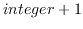.

**cos** *theta*[function]

*theta* is a float representing angle by radian. returns
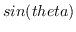.

**tan** *theta*[function]

*theta* is a float representing angle by radian. returns
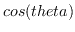.

**sinh** *x*[function]

hyperbolic sine, that is,
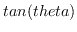.

**cosh** *x*[function]

hyperbolic cosine, that is,
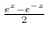.

**tanh** *x*[function]

hyperbolic tangent, that is,
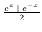.

**asin** *number*[function]

arc sine of *number*.

**acos** *number*[function]

arc cosine of *number*.

**atan** *y &optional x*[function]

When **atan** is called with one argument, its arctangent is calculated.
When called with two arguments,  is
returned.

**asinh** *x*[function]

hyperbolic arc sine.

**acosh** *x*[function]

hyperbolic arc cosine.

**atanh** *x*[function]

hyperbolic arc tangent.

**sqrt** *number*[function]

returns square root of *number*.

**log** *number*[function]

returns natural logarithm of *number*.

**exp** *x*[function]

returns exponential, 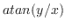.

**expt** *a x*[function]

returns *x*th power to *a*.

Symbols and Packages
====================

Symbols
-------

A symbols is assured to be unique if it is interned in a package. The
uniqueness is tested by symbol's print-names. There are no duplicated
symbols in a package which have the same print-name as other symbols in
the package. When EusLisp is running, there always is a special package
called the current package, which is referred by **lisp:\*package\***.
When a symbol without a package name is read by the reader, the current
package is searched for to locate the symbol with the same print-name.
If no such symbol is found, search is continued in the packages listed
in the package use list of the current package. If still no such symbol
is found, a new symbol object with the designated print-name is created
and is interned in the current package. The package can be specified by
prefixing the package name followd by a colon(:). If a symbol name is
preceeded by a package name, the search begins in the designated
package.

Every symbol may have at most one home package. If a symbol has no such
home package, it is said to be an uninterned symbol. Uninterned symbols
can be created by the **gensym** or **make-symbol** function, and they
are prefixed by "\#:" when printed. Since these symbols are not
interned, two such symbols with the same print-name are not guaranteed
to be equal.

Usually, when the lisp reader encounters a symbol, the reader converts
the print-name string of the symbol to uppper case. Thus, for example,
if you input `(symbol-name 'car)`, EusLisp responds `"CAR"` instead of
`"car"`. Note that `(make-symbol "car")` returns
`car` instead of
`car` or `CAR`. If you want the reader to make symbols constituted by
lower case letters, use reader's escapes,
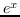 and
.

**symbolp** *object*[function]

returns T if *object* is an instance of CLASS symbol or its subclasses.

**symbol-value** *symbol*[function]

gets *symbol*'s special value. Lexical (local) variables' values cannot
be retrieved by this function.

**symbol-function** *symbol*[function]

gets *symbol*'s global function definition. Lexical (local) function
cannot be taken by this function.

**symbol-package** *sym*[function]

returns the package where *sym* is interned.

**symbol-name** *sym*[function]

returns *sym*'s print-name. Note that **symbol-name** does not copy the
pname string, whereas **string** does. Thus, if you change the string
returned by **symbol-name**, the symbol becomes inaccessible through
normal intern procedure.

**symbol-plist** *sym*[function]

Returns *sym*'s property list (plist). EusLisp's plist takes the same
form as an association list, which consists of dotted pairs of an
attribute name and its value. This is incompatible with Common Lisp
definition which requests a plist to have linear lists of attribute name
and value. In EusLisp, plist is not the unique facility of symbols. Any
objects instantiated from a class that inherits **propertied-object**
can have property lists. To set and retrieve these plists in
propertied-objects, **propertied-object-plist** macro should be used
instead of **symbol-plist**. However, **get** and **putprop** work for
either object.

**boundp** *symbol*[function]

Checks if *symbol* has a globally bound value. Note that symbols used
for local and object variables always have bound value and **boundp**
cannot test the bound state of these local variables.

**fboundp** *symbol*[function]

Checks if *symbol* has a globally bound function definition.

**makunbound** *symbol*[function]

*symbol* is forced to be unbound (to have no special value). Note that
lexical (local) variables always have values assigned and cannot be
*makunbound*ed.

**get** *sym attribute*[function]

retrieves *sym*'s value associated with *attribute* in its plist.
`= (cdr (assoc attribute (symbol-plist sym)))`

**putprop** *sym val attribute*[function]

Putprop should be replaced with the combination of **setf** and **get**.

**remprop** *sym attr*[function]

removes attribute-value pair from *sym*'s property list.

**setq** *{var value}\**[special]

assigns *value* to *var* which is either a symbol or a dotted-pair.
*Var* is searched for in the name spaces of local variables, object
variables, and special variables in this order unless explicitly
declared special.

**set** *sym val*[function]

assigns *val* to the special value of *sym*. **Set** cannot assign
values to local or object variables.

**defun** *symbol [documentation] lambda-list . body*[special]

defines a global function to *symbol*. Use *flet* or *labels* for
defining local functions. If no *documentation* is given, a default
documentation string describing the lambda-list is entered.

**defmacro** *symbol [documentation] lambda-list . body*[special]

defines a global macro. EusLisp does not have facilities for defining
locally scoped macros.

**defvar** *var &optional (init nil) doc*[macro]

If *var* symbol has any special value, **defvar** does nothing. If *var*
is unbound, it is declared to be special and *init* is set to its value.

**defparameter** *var init &optional doc*[macro]

*defparameter* declares *var* to be special and *init* is set to its
value, even if *var* already has value.

**defconstant** *sym val &optional doc*[macro]

*defconstant* sets *val* as *sym*'s special value. Unlike *defvar,
defparameter* and *setq*, the value set by *defconstant* cannot be
altered by these forms. If the value of a constant symbol is tried to be
changed, an error is reported. However, another *defconstant* can
override the previous constant value, issuing a warning message.

**keywordp** *obj*[function]

T if *obj* is a symbol and its home package is **KEYWORD**.

**constantp** *symbol*[function]

T if the symbol is declared to be constant with defconstant macro.

**documentation** *sym &optional type*[function]

retrieves documentation string of *sym*.

**gensym** *&optional x*[function]

creates a new uninterned symbol composed of a prefix string and a suffix
number like `g001`. Uninterned symbols are denoted by the \#: package
prefix indicating no package is associated with the symbols. Symbols
with \#: prefix are unreadable symbols and the reader cannot create
references to these uninterned symbols. *X* can either be a string or an
integer, which is used as the prefix or the suffix.

**gentemp** *&optional (prefix "T") (pkg \*package\*)*[function]

creates a new symbol interned in *pkg*. In most applications, **gensym**
is preferable to **gentemp**, because creation of uninterned symbols is
faster and uninterned symbols are garbage collect-able.

Packages
--------

Packages provide separate name spaces for groups of symbols. Common Lisp
introduced the package system in order to reduce the symbol (function
and variable name) conflict problems in the course of developing huge
software systems which require more than one programmer to work
together. Each package may have internal symbols and external symbols.
When a symbol is created in a package, it is always internal, and it
becomes external by **export**. External symbols in different packages
are referenced by prefixing the package name and a single colon, as
`x:*display*`, while referencing internal symbols in other packages
requires double colons, as `sys::free-threads`. In order to omit this
package prefixing, a package may **i**mport symbols from other packages.
Moreover, **u**se-package allows importing all external symbols from
another package at once. When symbols are exported or imported, symbol
name conflicts can be detected, since every symbol in any packages must
have the unique print name. **S**hadow allows creating a symbol with the
same print name as the existing symbol in a package by virtually
removing the old symbol from the package.

EusLisp defines following eight packages;

**lisp:**
  ~ All the lisp functions, macros, constants, etc.
**keyword:**
  ~ keyword symbols
**unix:**
  ~ unix system calls and library functions
**system:**
  ~ system management or dangerous functions; nicknames=sys,si
**compiler:**
  ~ EusLisp compiler; nicknames=comp
**user:**
  ~ User's work space
**geometry:**
  ~ geometric classes and functions
**xwindow:**
  ~ X-window interface; nickname=x

These packages and user-defined packages are linked in the system's
package list, which can be obtained by **list-all-packages**. Each
package manages two hash tables to find and locate internal and external
symbols. Also, a package records its name (string or symbol) and a list
of nick names, and a list of other packages that the package is using.
**\*Package\*** is a special variable that holds the current package for
read and print. If **\***package\* is not `user:`, top-level prompt
changes to indicate the current package, like `mypkg:eus`$.

**\*lisp-package\*** [constant]

Lisp package.

**\*user-package\*** [constant]

User package.

**\*unix-package\*** [constant]

Unix package.

**\*system-package\*** [constant]

System Package.

**\*keyword-package\*** [constant]

Keyword Package.

**find-symbol** *string &optional (package \*package\*)*[function]

finds and locates the symbol which has *string* as its print name in
*pacakge*. If found, the symbol is returned, NIL otherwise.

**make-symbol** *string*[function]

makes a new uninterned symbol by the print name of *string*.

**intern** *string &optional (package \*package\*) (klass
symbol)*[function]

tries to find a symbol whose print-name is same with *string*. If the
search succeeds, the symbol is returned. If fails, a symbol whose
print-name is *string* is newly made, and is located in *package*.

**list-all-packages** [function]

returns the list of all packages ever made.

**find-package** *name*[function]

find the package whose name or nickname is equal to the *name* string.

**make-package** *name &key nicknames (use '(lisp))*[function]

makes a new package by the name of *name*. *Name* can either be a string
or a symbol. If the package already exists, error is reported.

**in-package** *pkg &key nicknames (uses '(lisp))*[function]

changes the current pacakge (the value of **\*pacakge\***) to *pkg*.

**package-name** *pkg*[function]

returns the string name of the *pkg* package.

**package-nicknames** *pkg*[function]

returns a list of nicknames of *pkg*.

**rename-package** *pkg new-name &optional new-nicknames*[function]

changes the name of *pkg* to *new-name* and its nicknames to
*new-nicknames*, which can either be a symbol, a string, or a list of
symbols or strings.

**package-use-list** *pkg*[function]

returns the list of packages which are used by *pkg*.

**packagep** *pkg*[function]

T if *pkg* is a package.

**use-package** *pkg &optional (curpkg \*package\*)*[function]

adds *pkg* to *curpkg*'s use-list. Once added, symbols in *pkg* become
visible from *curpkg* without package prefix.

**unuse-package** *pkg &optional (curpkg \*package\*)*[function]

removes *pkg* from *curpkg*'s use-list.

**shadow** *sym &optional(pkg \*package\*)*[function]

makes a symbol interned in *pkg*, by hiding existing *sym*.

**export** *sym &optional (pkg \*package\*)*[function]

*sym* is a symbol or a list of symbols. **export** makes *sym*
accessible from other packages as external symbol(s). Actually, *sym* is
registered as an external symbol in *pkg*. If a symbol is exported, it
becomes accessible using a single colon ":" as package marker, whereas
unexported symbols require double colons. In addition, exported symbols
do not need colons when they are used by **use-package** or they are
imported into the package. Whether a symbol is exported or not is
attributed to packages where it is interned, not to each symbol. So, a
symbol can be internal in a package and external in another. **Export**
checks *sym* to have name conflict with symbols in other packages using
*pkg*. If there is a symbol having the same print name with *sym*,
\`\`symbol conflict" error is reported.

**unexport** *sym &optional pkg*[function]

If *sym* is an external symbol in *pkg*, it is unexported and becomes an
internal symbol.

**import** *sym &optional (pkg \*package\*)*[function]

*sym* is a symbol or a list of symbols. **import** makes symbols defined
in other packages visible in *pkg* as an internal symbol without package
prefix. If there is already a symbol that has the same print name as
*sym*, then an \`\`name conflict" error is reported.

**do-symbols** *(var pkg) &rest forms*[macro]

repeats evaluatiing forms for each binding of *var* to symbols (internal
or external) in *pkg*.

**do-external-symbols** *(var pkg) &rest forms*[macro]

repeats evaluating forms for each binding of *var* to external symbols
in *pkg*.

**do-all-symbols** *(var [result]) &rest forms*[macro]

repeats evaluating forms for each binding of *var* to symbols in all
packages. Note that forms may be evaluated more than once to a symbol if
it appears more than one package.

Sequences, Arrays and Tables
============================

General Sequences
-----------------

Vectors (one dimensional arrays) and lists are generic sequences. A
string is a sequence, since it is a vector of characters.

For the specification of result type in **map, concatenate** and
**coerce**, use class name symbol, such as
`cons, string, integer-vector, float-vector`, etc. without quotes, since
the class object is bound to the symbol.

**elt** *sequence pos*[function]

**elt** is the most general function to get and put (in conjunction with
**setf**) value at the specific position *pos* in *sequence*. *Sequence*
may be a list, or a vector of arbitrary object, bit, char, integer, or
float. **Elt** cannot be applied to a multi-dimensional array.

**length** *sequence*[function]

returns the length of *sequence*. For vectors, **length** finishes in
constant time, but time proportional to the length is required for a
list. **Length** never terminates if *sequence* is a circular list. Use
**l**ist-length, instead. If *sequence* is an array with a fill-pointer,
**length** returns the fill-pointer, not the entire size of the array
entity. Use **array-total-size** to know the entire size of those
arrays.

**subseq** *sequence start [end]*[function]

makes a copy of the subsequence from *start*th through (*end*-1)th
inclusively out of *sequence*. *end* is defaulted to the length of
*sequence*.

**copy-seq** *sequence*[function]

does shallow-copying of *sequence*, that is, only the top-level
references in *sequence* are copied. Use **copy-tree** to copy a nested
list, or **copy-object** for deep-copying of a sequence containing
recursive references.

**reverse** *sequence*[function]

reverse the order of *sequence* and returns a new sequence of the same
type as *sequence*.

**nreverse** *sequence*[function]

**Nreverse** is the destructive version of **reverse**. **Nreverse**
does not allocate memory, while **reverse** does.

**concatenate** *result-type sequence\**[function]

concatenates all *sequence*s. Each *sequence* may be of any sequence
type. Unlike **append**, all the sequences including the last one are
copied. *Result-type* should be a class such as cons, string, vector,
float-vector etc.

**coerce** *sequence result-type*[function]

changes the type of *sequence*. For examples,
`(coerce '(a b c) vector) = #(a b c)` and
`(coerce "ABC" cons) = (a b c)`. A new sequence of type *result-type* is
created, and each element of *sequence* is copied to it. *result-type*
should be one of vector, integer-vector, float-vector, bit-vector,
string, cons or other user-defined classes inheriting one of these. Note
that *sequence* is copied even if its type equals to *result-type*.

**map** *result-type function seq &rest more-seqs*[function]

*function* is applied to a list of arguments taken from *seq* and
*more-seqs* orderly, and the result is accumulated in a sequence of type
*result-type*.

**fill** *sequence item &key (:start 0) (:end (length
sequence))*[function]

fills *item* from *start*th through (*end*-1)th in *sequence*.

**replace** *dest source &key :start1 :end1 :start2 :end2*[function]

elements in *dest* sequence indexed between *start1* and *end1* are
replaced with elements in *source* indexed between *start2* and *end2*.
*start1* and *start2* are defaulted to zero, and *end1* and *end2* to
the length of each sequence. If the one of subsequences is longer than
the other, its end is truncated to match with the shorter subsequence.

**sort** *sequence compare &optional key*[function]

*sequence* is destructively sorted using Unix's quick-sort subroutine.
*key* is not a keyword parameter. Be careful with the sorting of a
sequence which have same elements. For example, `(sort '(1 1) #'>)`
fails because comparisons between 1 and 1 in both direction fail. To
avoid this problem, use functions like \#' or
\#' for comparison.

**merge** *result-type seq1 seq2 pred &key (key \#'identity)*[function]

two sequences *seq1* and *seq2* are merged to form a single sequence of
*result-type* whose elements satisfy the comparison specified by *pred*.

**merge-list** *list1 list2 pred key*[function]

merges two lists. Unlike **merge** no general sequences are allowed for
the arguments, but **merge-list** runs faster than **merge**.

Following functions consist of one basic function and its variants
suffixed by -if and -if-not. The basic form takes at least the item and
sequence arguments, and compares item with each element in the sequence,
and do some processing, such as finding the index, counting the number
of appearances, removing the item, etc. Variant forms take predicate and
sequence arguments, applies the predicate to each element of sequence,
and do something if the predicate returns non-nil (-if version), or nil
(-if-not version).

**position** *item seq &key :start :end :test :test-not :key (:count
1)*[function]

finds *count*th appearance of *item* in *seq* and returns its index. The
search begins from the *start*th element, ignoring elements before it.
By default, the search is performed by **eql**, which can be altered by
the *test* or *test-not* parameter.

**position-if** *predicate seq &key :start :end :key*[function]

**position-if-not** *predicate seq &key :start :end :key*[function]

**find** *item seq &key :start :end :test :test-not :key (:count
1)*[function]

finds *count*th element between the *start*th element and the *end*th
element in *seq*. The element found, which is eql to *item* if no *test*
or *test-not* other than \#'eql is specified, is returned.

**find-if** *predicate seq &key :start :end :key (:count 1)*[function]

finds *count*th element in *seq* for which *pred* returns non nil.

**find-if-not** *predicate seq &key :start :end :key*[function]

**count** *item seq &key :start :end :test :test-not :key*[function]

counts the number of *item*s which appear between the *start*th element
and the *end*th element in *seq*.

**count-if** *predicate seq &key :start :end :key*[function]

count the number of elements in *seq* for which *pred* returns non nil.

**count-if-not** *predicate seq &key :start :end :key*[function]

**remove** *item seq &key :start :end :test :test-not :key
:count*[function]

creates a new sequence which has eliminated *count* (defaulted to
infinity) occurrences of of *item*(s) between the *start*th element and
the *end*th element in *seq*. If you are sure that there is only one
occurrence of *item*, *count=1* should be specified to avoid meaningless
scan over the whole sequence.

**remove-if** *predicate seq &key :start :end :key :count*[function]

**remove-if-not** *predicate seq &key :start :end :key :count*[function]

**remove-duplicates** *seq &key :start :end :key :test :test-not
:count*[function]

removes duplicated items in *seq* and creates a new sequence.

**delete** *item seq &key :start :end :test :test-not :key
:count*[function]

is same with **remove** except that **delete** modifies *seq*
destructively and does not create a new sequence. If you are sure that
there is only one occurrence of *item*, *count=1* should be specified to
avoid meaningless scan over the whole sequence.

**delete-if** *predicate seq &key :start :end :key :count*[function]

**delete-if-not** *predicate seq &key :start :end :key :count*[function]

*count* for *remove*s and *delete*s is defaulted to 1,000,000. If you
have a long sequence and you want to delete an element which appears
only once, :count should be specified as 1.

**substitute** *newitem olditem seq &key :start :end :test :test-not
:key :count*[function]

returns a new sequence which has substituted the *count* occurrence(s)
of *olditem* in *seq* with *newitem*. By default, all the *olditems* are
substituted.

**substitute-if** *newitem predicate seq &key :start :end :key
:count*[function]

**substitute-if-not** *newitem predicate seq &key :start :end :key
:count*[function]

**nsubstitute** *newitem olditem seq &key :start :end :test :test-not
:key :count*[function]

substitute the *count* occurrences of *olditem* in *seq* with *newitem*
destructively. By default, all the *olditem*s are substituted.

**nsubstitute-if** *newitem predicate seq &key :start :end :key
:count*[function]

**nsubstitute-if-not** *newitem predicate seq &key :start :end :key
:count*[function]

Lists
-----

**listp** *object*[function]

returns T if object is an instance of cons or NIL.

**consp** *object*[function]

equivalent to (not (atom object)). (consp '()) is nil.

**car** *list*[function]

returns the first element in *list*. **car** of NIL is NIL. **car** of
atom is error.

**cdr** *list*[function]

returns the list which removed the first element of *list*. **cdr** of
NIL is NIL. **cdr** of atom is error.

**cadr** *list*[function]

**cddr** *list*[function]

**cdar** *list*[function]

**caar** *list*[function]

**caddr** *list*[function]

**caadr** *list*[function]

**caaar** *list*[function]

**cdadr** *list*[function]

**cdadr** *list*[function]

**cdaar** *list*[function]

**cdddr** *list*[function]

**cdddr** *list*[function]

**cddar** *list*[function]

**first** *list*[function]

retrieves the first element in *list*. **s**econd, third, fourth, fifth,
sixth, seventh, eighth are also available.

**nth** *count list*[function]

returns the *count*-th element in *list*. Note that `(nth 1 list)` is
equivalent to `(second list)`, and to `(elt list 1)`.

**nthcdr** *count list*[function]

applies **cdr** *count* times to *list*.

**last** *list*[function]

the last cons is returned, not the last element.

**butlast** *list &optional (n 1)*[function]

returns a list which does not contain the last *n* elements.

**cons** *car cdr*[function]

makes a new cons whose car is *car* and cdr is *cdr*.

**list** *{element}\**[function]

makes a list of *element*s.

**list\*** *{element}\**[function]

makes a list of *element*s, but the last element is consed in cdr: for
example, `(list* 1 2 3 '(4 5)) = (1 2 3 4 5)`.

**list-length** *list*[function]

returns the length of the *list*. *List* can be circular.

**make-list** *size &key (initial-element nil)*[function]

makes a list whose length is *size* and elements are *initial-element*.

**rplaca** *cons a*[function]

replace the car of *cons* with a. Use of **setf** to **car** is
recommended.

**rplacd** *cons d*[function]

replace the cdr of *cons* with d. Use of **setf** to **cdr** is
recommended.

**memq** *item list*[function]

resembles **member**, but test is always done by **eq**.

**member** *item list &key :key (:test \#'eq) :test-not*[function]

The *list* is searched for an element that satisfies the *test*. If none
is found, NIL is returned; otherwise, the tail of *list* beginning with
the first element that satisfied the test is returned. The *list* is
searched on the top level only.

**assq** *item alist*[function]

**assoc** *item alist &key :key (:test \#'eq) :test-not*[function]

searches the association list *alist*. The value returned is the first
pair in the *alist* such that the *car* of the pair satisfies the
*test*, or NIL if there is no such pair in the *alist*.

**rassoc** *item alist*[function]

returns the first pair in *alist* whose cdr is equal to *item*.

**pairlis** *l1 l2 &optional alist*[function]

makes a list of pairs consing corresponding elements in *l1* and *l2*.
If *alist* is given, it is concatenated at the tail of the pair list
made from *l1* and *l2*.

**acons** *key val alist*[function]

add the *key val* pair to *alist*, that is,
`(cons (cons key val) alist)`.

**append** *{list}\**[function]

appends *list* to form a new list. All the elements in *list*, except
the last list, are copied.

**nconc** *{list}\**[function]

concatenates *list* destructively by replacing the last cdr of each
*list*.

**subst** *new old tree*[function]

substitutes every *old* in *tree* with *new*.

**flatten** *complex-list*[function]

*Complex-list* composed of atoms and lists of any depth is transformed
into a single level linear list which have all the elements in
*complex-list* at the top level. For example,
`(flatten '(a (b (c d) e))) = (a b c d e)`

**push** *item place*[macro]

pushes item into a stack (list) bound to *place*.

**pop** *stack*[macro]

removes the first item from *stack* and returns it. If *stack* is empty
(nil), nil is returned.

**pushnew** *item place &key test test-not key*[macro]

pushes *item* in the *place* list if *item* is not a member of *place*.
The *test*, *test-not* and *key* arguments are passed to the member
function.

**adjoin** *item list*[function]

The item is added at the head of the list if it is not included in the
list.

**union** *list1 list2 &key (test \#'eq) (test-not) (key
\#'identity)*[function]

returns union set of two lists.

**subsetp** *list1 list2 &key (test \#'eq) (test-not) (key
\#'identity)*[function]

tests if *list1* is a subset of *list2*, i.e. if each element of *list1*
is a member of *list2*.

**intersection** *list1 list2 &key (test \#'eq) (test-not) (key
\#'identity)*[function]

returns the intersection of two sets, *list1* and *list2*.

**set-difference** *list1 list2 &key (test \#'eq) (test-not) (key
\#'identity)*[function]

returns the list whose elements are only contained in *list1* and not in
*list2*.

**set-exclusive-or** *list1 list2 &key (test \#'eq) (test-not) (key
\#'identity)*[function]

returns the list of elements that appear only either in *list1* or
*list2*.

**list-insert** *item pos list*[function]

Insert *item* as the *pos*'th element in *list* destructively. If *pos*
is bigger than the length of *list*, *item* is nconc'ed at the tail. For
example, `(list-insert 'x 2 '(a b c d)) = (a b x c d)`

**copy-tree** *tree*[function]

returns the copy of *tree* which may be a nested list but cannot have
circular reference. Circular lists can be copied by **copy-object**.
Actually, **copy-tree** is simply coded as `(subst t t tree)`.

**mapc** *func arg-list &rest more-arg-lists*[function]

applies *func* to a list of N-th elements in *arg-list* and each of
*more-arg-lists*. The results of application are ignored and *arg-list*
is returned.

**mapcar** *func &rest arg-list*[function]

maps *func* to each element of *arg-list*, and makes a list from all the
results. Before using **mapcar**, try **dolist**.

**mapcan** *func arg-list &rest more-arg-lists*[function]

maps *func* to each element of *arg-list*, and makes a list from all the
results by **nconc**. **Mapcan** is suitable for filtering (selecting)
elements in *arg-list*, since nconc does nothing with NIL.

Vectors and Arrays
------------------

Up to seven dimensional arrays are allowed. A one-dimensional array is
called vector. Vectors and lists are grouped as sequence. If the
elements of an array is of any type, the array is said to be general. If
an array does not have fill-pointer, is not displaced to another array,
or is adjustable, the array is said to be simple.

Every array element can be recalled by **aref** and set by **setf** in
conjunction with aref. But for simple vectors, there are simpler and
faster access functions: **svref** for simple general vectors, **char**
and **schar** for simple character vectors (string), **bit** and
**sbit** for simple bit vectors. When these functions are compiled, the
access is expanded in-line and no type check and boundary check are
performed.

Since a vector is also an object, it can be made by instantiating some
vector-class. There are five kinds of built-in vector-classes; vector,
string, float-vector, integer-vector and bit-vector. In order to ease
instantiation of vectors, the function make-array is provided.
Element-type should be one of **:integer, :bit, :character, :float,
:foreign** or user-defined vector class. **:initial-element** and
**:initial-contents** key word arguments are available to set initial
values of the array you make.

**array-rank-limit** [constant]

7

**array-dimension-limit** [constant]

\#x1fffffff, logically, but stricter limit is imposed by the physical or
virtual memory size of the system.

**vectorp** *object*[function]

An array is not a vector even if it is one dimensional. T is returned
for vectors, integer-vectors, float-vectors, strings, bit-vectors or
other user-defined vectors.

**vector** *&rest elements*[function]

makes a simple vector from *elements*.

makes a vector or array. *dims* is either an integer or a list. If
*dims* is an integer, a simple-vector is created.

**svref** *vector pos*[function]

returns *pos*th element of *vector*. *Vector* must be a simple general
vector.

**aref** *vector &rest (indices)*[function]

returns the element indexed by *indices*. **Aref** is not very efficient
because it needs to dispatch according to the type of *vector*. Type
declarations should be given to improve the speed of compiled code
whenever possible.

**vector-push** *val array*[function]

store *val* at the *fill-pointer*th slot in *array*. *array* must have a
*fill-pointer*. After val is stored, the fill-pointer is advanced by one
to point to the next location. If it exceeds the array boundary, an
error is reported.

**vector-push-extend** *val array*[function]

Similar to **vector-push** except that the size of the array is
automatically extended when *array*'s fill-pointer reaches the end.

**arrayp** *obj*[function]

T if *obj* is an instance of array or vector.

**array-total-size** *array*[function]

returns the total number of elements of *array*.

**fill-pointer** *array*[function]

**array-rank** *array*[function]

**array-dimensions** *array*[function]

returns a list of array-dimensions.

**array-dimension** *array axis*[function]

Axis starts from 0. **array-dimension** returns the *axis*th dimension
of *array*.

**bit** *bitvec index*[function]

returns the *index*th element of *bitvec*. Use **setf** and **bit** to
change an element of a bit-vector.

**bit-and** *bits1 bits2 &optional result*[function]

**bit-ior** *bits1 bits2 &optional result*[function]

**bit-xor** *bits1 bits2 &optional result*[function]

**bit-eqv** *bits1 bits2 &optional result*[function]

**bit-nand** *bits1 bits2 &optional result*[function]

**bit-nor** *bits1 bits2 &optional result*[function]

**bit-not** *bits1 &optional result*[function]

For bit vectors *bits1* and *bits2* of the same length, their boolean
and, inclusive-or, exclusive-or, equivalence, not-and, not-or and not
are returned, respectively.

Characters and Strings
----------------------

There is no character type in EusLisp; a character is represented by an
integer. In order to handle strings representing file names, use
**pathname**s described in [11.6](#Pathnames).

**digit-char-p** *ch*[function]

T if *ch* is \#0 through
\#9.

**alpha-char-p** *ch*[function]

T if *ch* is \#A through
\#Z or
\#a through
\#z.

**upper-case-p** *ch*[function]

T if *ch* is \#A through
\#Z.

**lower-case-p** *ch*[function]

T if *ch* is \#a through
\#z.

**alphanumeric-p** *ch*[function]

T if *ch* is \#0 through
\#9,
\#A through
\#Z or
\#a through
\#z.

**char-upcase** *ch*[function]

convert the case of *ch* to upper.

**char-downcase** *ch*[function]

convert the case of *ch* to lower.

**char** *string index*[function]

returns *index*th character in *string*.

**schar** *string index*[function]

extracts a character from *string*. Use **schar** only if the type of
*string* is definitely known and no type check is required.

**stringp** *object*[function]

*string* is a vector of bytes (integers less than 256).

**string-upcase** *str &key start end*[function]

converts *str* to upper case string and returns a new string.

**string-downcase** *str &key start end*[function]

converts *str* to lower case string and returns a new string.

**nstring-upcase** *str*[function]

converts *str* to upper case string destructively.

**nstring-downcase** *str &key start end*[function]

converts *str* to lower case string destructively.

**string=** *str1 str2 &key start1 end1 start2 end2*[function]

T if *str1* is equal to *str2*. *string=* is case sensitive.

**string-equal** *str1 str2 &key start1 end1 start2 end2*[function]

tests equality of *str1* and *str2*. **string-equal** is not case
sensitive.

**string** *object*[function]

gets string notation of *object*. If *object* is a string, the *object*
is returned. If *object* is a symbol, its pname is copied and returned.
Note that (equal (string 'a) (symbol-pname 'a))==T, but (eq (string 'a)
(symbol-pname 'a))==NIL. If object is number its string representation
is returned (this is incompatible with Common Lisp). In order to get
string representation for more complex objects, use **format** with NIL
in the first argument.

**string** *str1 str2*[function]

**string** *str1 str2*[function]

**string** *str1 str2*[function]

**string** *str1 str2*[function]

**string-left-trim** *bag str*[function]

**string-right-trim** *bag str*[function]

*str* is scanned from the left(or right), and its elements are removed
if it is included in the *bag* list. Once a character other than the
ones in the *bag* is found, further scan is aborted and the rest of
*str* is returned.

**string-trim** *bag str*[function]

*Bag* is a sequence of character codes. A new copy of *str* which does
not contain characters specified in *bag* in its both end is made and
returned.

**substringp** *sub string*[function]

T if string *sub* is contained in *string* as a substring. Not case
sensitive.

Foreign Strings
---------------

A foreign-string is a kind of byte-vector whose entity is held somewhere
outside EusLisp's heap. While a normal string is represented by a
sequence of bytes and its length, a foreign-string holds the length and
the address of the string entity. Although foreign-string is a string,
some string and sequence functions cannot be applicable. Only
**length**, **aref**, **replace**, **subseq** and **copy-seq** recognize
the foreign-string, and application of other functions may cause a
crash.

A foreign-string may refer to a part of I/O space usually taken in
/dev/a??d?? special file where ?? is either 32 or 16. In case the device
attached in one of these I/O space only responds to byte access,
**replace** always copies element byte by byte, which is relatively slow
when a large chunk of memory is accessed consecutively.

**make-foreign-string** *address length*[function]

makes an instance of foreign-string located at *address* and spanning
for *length* bytes. For example,
`(make-foreign-string (unix:malloc 32) 32)` makes a reference to a
32-byte memory located outside EusLisp's heap.

Hash Tables
-----------

Hash-table is a class to search for the value associated with a key, as
accomplished by **assoc**. For a relatively large problem, hash-table
performs better than assoc, since time required for searching remains
constant even the number of key-value pairs increases. Roughly speaking,
hash-table should be used in search spaces with more than 100 elements,
and assoc in smaller spaces.

Hash-tables automatically expands if the number of elements in the table
exceeds rehash-size. By default, expansion occurs when a half of the
table is filled. **sxhash** function returns a hash value which is
independent of memory address of an object, and hash values for
**equal** objects are always the same. So, hash tables can be
re-loadable since they use sxhash as their default hashing functions.
While sxhash is robust and safe, it is relatively slow because it scans
all the elements in a sequence or a tree. For faster hashing, you may
choose another hash function appropriate for your application. To change
the hash function, send `:hash-function` message to the hash-table. In
simple cases, it is useful to change hash function from \#'**sxhash** to
\#'**sys:address**. This is possible because the addresses of any
objects never change in a EusLisp process.

**sxhash** *obj*[function]

calculates the hash value for *obj*. Two objects which are **equal** are
guaranteed to yield the same hash value. For a symbol, hash value for
its pname is returned. For numbers, their integer representations are
returned. For a list, sum of hash values for all its elements is
returned. For a string, shifted sum of each character code is returned.
For any other objects, **sxhash** is recursively called to calculate the
hash value of each slot, and the sum of them is returned.

**make-hash-table** *&key (size 30) (test \#'eq) (rehash-size
2.0)*[function]

creates a hash table and returns it.

**gethash** *key htab*[function]

gets the value that corresponds to *key* in *htab*. **Gethash** is also
used to set a value to key by combining with **setf**. When a new entry
is entered in a hash table, and the number of filled slots in the table
exceeds 1/rehash-size, then the hash table is automatically expanded to
twice larger size.

**remhash** *key htab*[function]

removes a hash entry designated by *key* in *htab*.

**maphash** *function htab*[function]

maps *function* to all the elements of *htab*.

**hash-table-p** *x*[function]

T if *x* is an instance of class hash-table.

**hash-table** [class]

      :super   object 
      :slots         (key value count 
    hash-function test-function 
    rehash-size empty deleted) 

defines hash table. *Key* and *value* are simple-vectors of the same
*size*. *Count* is the number of filled slots in *key* and *value*.
*Hash-function* is defaulted to **sxhash** and *test-function* to
**eq**. *Empty* and *deleted* are uninterned symbols to indicate slots
are empty or deleted in the *key* vector.

**:hash-function** *newhash*[method]

changes the hash function of this hash table to *newhash*. *Newhash*
must be a function with one argument and returns an integer. One of
candidates for *newhash* is **system:address**.

Queue
-----

A queue is a data structure that allows insertion and retrieval of data
in the FIFO manner, i.e. the first-in first-out order. Since the queue
class is defined by extending the cons class, ordinary list functions
can be applied to a queue. For example, caar retrieves the next element
to be dequeued, and cadr gets the element that is queued most recently.

**queue** [class]

      :super   cons 
      :slots         (car cdr) 

defines queue (FIFO) objects.

**:init** [method]

initializes the queue to have no elements.

**:enqueue** *val*[method]

puts val in the queue as the most recent element.

**:dequeue** *&optional (error-p nil)*[method]

retrieves the oldest value in the queue, and removes it of the queue. If
the queue is empty, it reports an error when error-p is non-nil, or
returns NIL otherwise.

**:empty?** [method]

returns T if the queue is empty.

**:length** [method]

returns the length of the queue.

Text Processing
===============

Japanese Text
-------------

Japanese characters are encoded in 16-bit, i.e. two bytes. Inside
EusLisp, there is no provision to handle Japanese 16-bit character as a
representation of Japanese. They are just regarded as a series of
byte-encoded characters. The following code will print a Japanese
character "AI" that means *love* in English, if you are using a terminal
that can display EUC kanji, like kterm.

    (setq AI-str 
          (let ((jstr (make-string 2)))
              (setf (aref jstr 0) #xb0
                (aref jstr 1) #xa6)
          jstr))
    (print AI-str)

In a similar manner, (intern AI-str) will create a symbol with its
printname "AI".

    (set (intern AI-str) "love")

Conversion functions for different character codes and Roman-ji
representation are provided.

**romkan** *romanji-str*[function]

Roman-ji representation is converted into EUC coded Japanese. Numbers
are converted into pronunciation in hiragana.

**romanji** *kana-str*[function]

kana-str which represents Japanese in hiragana or in katakana coded in
EUC is converted into a roman-ji representation. English alphabets and
numbers are unchanged.

**sjis2euc** *kana-str*[function]

kana-str coded in shift-jis is converted into EUC.

**euc2sjis** *kana-str*[function]

kana-str coded in EUC is converted into shift-JIS.

**jis2euc** *kana-str*[function]

kana-str coded in EUC is converted into JIS coding, which enters kana
mode by `ESC\$B` and exits by `ESC(J`. Note that there is no euc2jis
function is provided yet.

**kana-date** *time*[function]

time is converted a Japanese date pronunciation represented in roman-ji.
The default time is the current time.

**kana-date** *time*[function]

time is converted a Japanese time pronunciation represented in roman-ji.
The default time is the current time.

**hira2kata** *hiragana-str*[function]

hiragana-str is converted into katakana representation.

**kata2hira** *katakana-str*[function]

katakana-str is converted into hiragana representation.

ICONV - Character Code Conversion
---------------------------------

ICONV is a set of the gnu standard library functions for character code
conversion. The interface is programmed in eus/lib/clib/charconv.c.

**iconv-open** *to-code from-code*[function]

returns a descriptor for converting characters from from-code to
to-code.

Regular Expression
------------------

**regmatch** *regpat string*[function]

searches for an occurence of a regular expression, *regpat* in *string*.
If found, a list of the starting index and the ending index of the found
pattern is returned. example; (regmatch "ca[ad]+r" "any string ...")
will look for cadr, caar, cadadr ... in the second argument.

Base64 encoding
---------------

Base64 is an encoding scheme to represent binary data using only
printable graphic characters. The scheme is applied to
uuencode/uudecode. The following functions are defined in
lib/llib/base64.l.

**base64encode** *binstr*[function]

A binary string, *binstr* is converted to an ASCII string consisting
only of

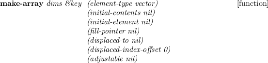

\

letters according to the base-64 encoding rule. The resulted string is
33% longer than the original. A newline is inserted every 76 characters.
One or two '=' characters are padded at the end to adjust the length of
the result to be a multiple of four.

**base64decode** *ascstr*[function]

An ASCII string, *ascstr*, is converted to a binary string according to
the base-64 encodeing. Error is reported if ascstr includes an invalid
character.

DES cryptography
----------------

Linux and other UNIX employs the DES (Data Encryption Standard) to
encrypt password strings. The function is provided in the libcrypt.so
library. lib/llib/crypt.l links this library and provides the following
functions for string encryption. Note that the
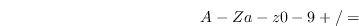 key space of DES is not large enough to
reject challenges by current powerful computers. Note also that only the
encrypting functions are provided and no rational decrypting is
possible.

**crypt** *str salt*[function]

The raw function provided by libcrypt.so. *Str* is encrypted by using
the *salt* string. *Salt* is a string of two characters, and used to
randamize the output of encryption in 4096 ways. The output string is
always 13 characters regardless to the length of *str*. In other words,
only the first eight characters from *str* are taken for encryption, and
the rest are ignored. The same string encrypted with the same salt is
the same. The same string yields different encryption result with
different salts. The salt becomes the first two characters of the
resulted encrypted string.

**rcrypt** *str &optional (salt (random-string 2))*[function]

The plain string, *str*, is converted into its encrypted representation.
The *salt* is randomly generated if not given.

**random-string** *len &optional random-string*[function]

This is a utility function to generate a random string which constitutes
of elements in the *random-string*. By default, "A-Za-z0-9/." is taken
for the *random-string*. In order not to make mistakes between i, I, l,
1, O, 0, and o, you can specify \*safe-salt-string\* for the
*random-string*.

**compcrypt** *input cryption*[function]

*Input* is a plain string and *cryption* is a encrypted string. *Input*
is encrypted with the salt found in the *cryption* and the result is
compared with it. If both are the same, T is returnd, NIL, otherwise.

Date and Time
=============

The time class defines both calendar time and time period.

**time** [class]

      :super   propertied-object 
      :slots         (micro second minute hour day month weekday year 
    timezone dst seconds) 

defines time objects.

**:now** [method]

`(instance time :now)` creates a time object for the current time.

**:init** *&optional sec micro dst tzone*[method]

creates a time object which represents *sec* second after January 1,
1970.

**:make** *&key (year 1970) (month 0) (day 1) (weekday 4) (hour 0)
(minute 0) (second 0) (micro 0) (timezone (\* -9 3600)))*[method]

creates a time object which is represented by a calendar notation. The
timezone is defaulted to JST.

**:year** [method]

returns the year component of the time object. Note that the year is
represented in a full (four) digit notation, not the least two digits.

**:month** [method]

returns the month component of the time object. Note that the month
begins from 0 for January.

**:day** [method]

returns the day component of the time object. Note that the day begins
from 1 for the first of a month.

**:weekday** [method]

returns the weekday component of the time object. Note that the weekday
begins from 0 for Sunday.

**:hour** [method]

returns the hour component of the time object in 24-hour representation.
Note that the hour ranges from 0 to 23.

**:minute** [method]

returns the minute component of the time object. Note that the hour
ranges from 0 to 59.

**:second** [method]

returns the second component of the time object. Note that the hour
ranges from 0 to 59.

**:seconds** [method]

returns the seconds component of the time object. Seconds represents
time after the origin of the unix time, i.e., the midnight of January 1,
1970.

**:year-day** [method]

returns the number of days after the beginning of the year. For example,
year-day of a time object representing February 2nd is 32.

**:difference** *atime*[method]

returns a new time object representing the time difference of self from
atime.

**:add** *atime*[method]

returns a new time object representing the added time of self and atime.

Streams and Input/Output
========================

Streams
-------

Echo-streams and concatenated-streams are not available. Predefined
streams are following:

**\*standard-input\***
  ~ stdin fd=0
**\*standard-output\***
  ~ stdout fd=1
**\*error-output\***
  ~ stderr fd=2 bufsize=1
**\*terminal-io\***
  ~ two-way stream made of **\*standard-input\*** and
    **\*standard-output\***

**streamp** *object*[function]

Any object created from **s**tream, **i**o-stream, or their subclasses
returns T.

**input-stream-p** *object*[function]

T if *object* is a stream and capable of reading.

**output-stream-p** *object*[function]

T if *object* is a stream and capable of writing.

**io-stream-p** *object*[function]

T if *object* is a two-way stream.

![\\begin{emtabbing} {\\bf open} \\it path \\&key \\= :direction :input
\\\\lq [function]\\\\... ...\\\\ \\\> :permission \\char93 o644 \\\\
\\\> :buffer-size 512\\\\ \\rm \\end{emtabbing}](manual-img33.png)

**Open** makes a stream associated with a file designated by *path*.
*path* may either be a string or a pathname. Direction should be one of
**:input, :output** or **:io**. Several open options, **:append,
:new-version, :overwrite, :error** and nil are allowed for
**:if-exists** parameter. However, this parameter is ignored when
*direction* is **:input**. Alternatives for **:if-does-not-exist** are
**:error, :create** and nil. **:new-version**, **:rename** and
**:supersede** are not recognized. By default, the file is overwritten
if *direction* is either **:output** or **:io** when the file exists.
For :input files, an error is reported when the file does not exist. To
know the existence of a file, **probe-file** can be used. Default value
for **buffer-size** is 512 bytes, and \#O644 for **:permission**. SunOS4
allows to open as many as sixty files at the same time.

**with-open-file** *(svar path . open-options) &rest forms*[macro]

A file named *path* is opened with *open-options* and the stream is
bound to *svar*. Then *forms* are evaluated. The stream is automatically
closed when evaluation of *forms* finishes or exits with **throw**,
**return-from** or error. **With-open-file** is a macro defined by
**unwind-protect** with **close** in its clean-up forms.

**close** *stream*[function]

closes the *stream*, and returns T if successful. The stream may have
already been closed, in which case nil is returned. Streams are
automatically closed by GC if there is no reference to that stream
object.

**make-string-input-stream** *string*[function]

makes an input stream from a string.

**make-string-output-stream** *size*[function]

makes an output stream to a string of *size* length. Actually, the
length is automatically expanded, so *size* is only advisory information
to allocate string at initialization.

**get-output-stream-string** *string-stream*[function]

gets a string out of a *string-stream*.

**make-broadcast-stream** *&rest output-streams*[function]

makes a broad-cast stream which forwards all the messages written to
this stream to each of *output-streams*.

Reader
------

Reader's global variables:

**\*read-base\***
  ~ number base to be read; default is decimal ten
**\*readtable\***
  ~ current readtable which determines reader syntax

Reader's default macro characters:

    (   read list 
    "          read string 
    '          read quoted expression 
    #          dispatch macro 
    ;          comment until end of line 
    `          back-quote 
    ,          list-time eval 
    @          append 
    %          read C-like mathematical forms 

Escape characters:

       single character escape 
            multiple character escape 

When an unescaped symbol is read, all the constituent characters are
converted to upcase by default, and upcase-character symbol is stored
internally. For example, 'abc and 'ABC are regarded as the same symbol.
Escape is necessary to distinguish between them.
'ABC, 'ABC and
'abc are identical, while
'abc and 'abc
are different symbols. By default, even if you enter a symbol with
upcase letters, When symbols are printed, EusLisp's printer converts
them into lowercase from internal upcase representation. This conversion
is suppressed by setting **\*print-case\*** to **:UPCASE**.

Note that 10. is read as integer 10, not floating 10.0. Since ':' is
reserved for package marker, it must be escaped when used as a
constituent of a symbol, like '. This restriction is imposed not by
the syntax of the character ':', but by the attribute which determines
the alphabetical order and the meaning of the letter. The attributes of
characters are hardwired in the reader. Thus, although you may change
the syntax of a certain character by creating a new readtable by
**copy-readtable** and resetting the syntactic meaning for the character
by **set-syntax-from-char**, you cannot change its attribute anyway. In
other words, digits are always digits, alphabets are alphabets, and we
cannot use letters like '\#$%@' to represent numbers.

String is denoted by two double quotes '"' at the beginning and at the
end. No case conversion is taken inside the quotes. A back-slash 'ís
used as an escape to include a double quote. Therefore, "He said, Ï like
Lisp.SPMquot;" is read as a string including two double quotes. To enter
a back-slash, two back-slashes are needed. Note that shift-JIS encoding
of Japanese text is inadequate for this read-string convention, since
some characters happen to have the code of a back-slash (`#x5c`) as
their second byte. Use of EUC coding is preferrable.

**%** is an extended read-macro character specific to EusLisp. Preceding
% to a mathematical formula written in infix notation, the formula is
converted to lisp's prefix form. For an instance, `%(1 + 2 * 3 / 4.0)`
is transformed to `(+ 1 (/ (* 2 3) 4.0))` and `2.5` is resulted. C-like
function calls and array references are converted to lisp forms, too,
thus, `%(sin(x) + a[1])` is evaluated to `(+ (sin x) (aref a 1))`.
Functions having more than one arguments and arrays of more than two
dimeisions are notated as `func(a b c ...)` and `ary[1 2 3 ...]`, not
`func(a,b,c)` nor `ary[1][2][3]`. Relative expressions and assignments
are also properly handled, so, `%(a  b)` is converted to `( a b)`, and
`%(a[0] = b[0] * c[0])` is to
`(setf (aref b 0) (* (aref b 0) (aref c 0)))`. A simple optimization is
performed to reduce duplicated function calls and array references.
`%(sin(x) + cos(x) / sin(x))` is converted into
`(let* ((temp (sin x))) (+ temp (/ (cos x) temp)))`.

Dispatch macros are preceeded by the `#` character. A number (integer)
argument can be given between `#` and a dispatch macro character. This
means that any digits (0 .. 9) cannot be defined as dispatch macro
characters. Reader's standard dispatch macro characters follow:

**`#nA(..)`**
  ~ array
**`#B`**
  ~ binary number
**`#D`**
  ~ degree to radian conversion; \#D180 = 3.14
**`#F(...)`**
  ~ floatvector
**`#nF((..))`**
  ~ float array; \#2F((..) (..)) is matrix
**`#I(...)`**
  ~ integer-vector
**`#nI((...))`**
  ~ integer array
**`#J(...)`**
  ~ general object \#J(myclass ....); obsolete
**`#O`**
  ~ octal number
**`#P`**
  ~ pathname
**`#R`**
  ~ radian to degree conversion; \#R3.14 = 180.0
**`#S(classname slotname1 val1 slotname2 val2 ...)`**
  ~ structure (any object)
**`#V(...)`**
  ~ vector \#V(vectorclass ...)
**`#X`**
  ~ hexadecimal number
**`#(...)`**
  ~ vector
**`#n#`**
  ~ label reference
**`#n=`**
  ~ label definition
**`#'`**
  ~ FUNCTION; compiled-code or lambda-closure
**`#`**
  ~ character
**`#,`**
  ~ read-time evaluation
**`#+`**
  ~ conditional read (positive)
**`#-`**
  ~ conditional read (negative)
**`#*`**
  ~ bit vector
**`#:`**
  ~ uninterned symbol
**`#...#`**
  ~ comment; can be nested

Some reader functions have *eof-error-p, eof-value* and *recursive-p*
parameters. The first two parameters control the behavior when the
reader encounters with end-of-file. The default of *eof-error-p* is t,
which causes an error at eof. If you want to know the occurrence of eof
and don't want the system's error-handler to snatch control, specify nil
to *eof-error-p*. Thus, when an eof appears during reading, the reader
returns the *eof-value* instead of entering an error loop. *Eof-value*
is defaulted to nil. So, you cannot know if nil is actually read, or eof
appears. To distinguish them, give a value which can never appear in the
stream. Use **cons** or **gensym** to make such unique data object.

*Recursive-p* is often used in read-macro functions, which call reader
recursively. Non-nil value of *recursive-p* tells the reader that the
read operation has been started somewhere else and it should not reset
the internal table for reading forms labeled by `#n=` and `#n#`.

**read** *&optional stream (eof-error-p t) (eof-value nil)
recursive-p*[function]

reads one S-expression.

**read-delimited-list** *delim-char &optional stream
recursive-p*[function]

reads s-expression which is delimited by *delim-char*. This is useful to
read comma-separated list, or to read a sequence terminated by a special
character like `#]`.

**read-line** *&optional stream (eof-error-p t) (eof-value
nil)*[function]

reads a line which is terminated by a `#newline`. The string returned
does not contain the last newline character.

**read-char** *&optional stream (eof-error-p t) (eof-value
nil)*[function]

reads one character and returns its integer representation.

**read-from-string** *string &optional (eof-error-p t) (eof-value
nil)*[function]

reads one s-expression from *string*. Only the first s-expression can be
read. If successive read operations need to be performed on a string
containing more than one expression, use string-stream made by
**m**ake-string-input-stream.

**unread-char** *char &optional stream*[function]

puts the *char* back to the *stream*. More than one characters cannot be
put back successively.

**peek-char** *&optional stream (eof-error-p t) (eof-value
nil)*[function]

reads a character from the *stream* without removing it from the buffer
of the *stream*. This is equivalent to a *read-char* followed by a
*unread-char*.

**y-or-n-p** *&optional format-string &rest args*[function]

prints *format-string* and *args* on your terminal, and asks
\`\`y-or-n''. Repeat query until your response begins with either of
\`\`y'' or \`\`n'', and returns T or NIL. Case does not matter.

**yes-or-no-p** *&optional stream*[function]

prints *format-string* and *args* on your terminal, and asks
\`\`yes-or-no''. Repeat query until your response is either of \`\`yes''
or \`\`no'', and returns T or NIL. Case does not matter.

In the readtable manipulating functions, the default value of readtable
is the value of the global variable **\*readtable\***.

**readtable-p** *x*[function]

T if *x* is an readtable.

**copy-readtable** *&optional from-readtable to-readtable*[function]

If no *to-readtable* is specified, a new one is created. All the
information in *from-readtable* is transferd to *to-readtable*. The
information included is, syntax table, read-macro table and
dispatch-macro table, each of which has 256 elements.

**set-syntax-from-char** *to-char to-char [to-readtable
from-readtable]*[function]

copies syntax and read-macro definition of *from-char* in
*from-readtable* to that of *to-char* in *to-readtable*.

**set-macro-character** *char func [non-teminating-p
readtable]*[function]

defines *func* as the read-macro function for *char*.

**get-macro-character** *char [readtable]*[function]

returns the read-macro function for *char*.

**set-dispatch-macro-character** *dispchar char func
[readtable]*[function]

defines *func* as the dispatch read-macro function for the combination
of *dispchar* and *char*.

**get-dispatch-macro-character** *dispchar char [readtable]*[function]

returns the dispatch read-macro function for the combination of
*dispchar* and *char*.

Printer
-------

The followings are special variables controlling printer's behaviors.

**\*print-case\***
  ~ if this is `:downcase`, all symbols are printed in lowercase
    althought symbols are represented in uppercase internally unless
    they are escaped.
**\*print-circle\***
  ~ print objects preserving recursive refernce
**\*print-object\***
  ~ print the details of all objects
**\*print-structure\***
  ~ print objects using \#s format.
**\*print-level\***
  ~ printable depth of a sequence
**\*print-length\***
  ~ printable length of a sequence
**\*print-escape\***
  ~ currently not used
**\*print-pretty\***
  ~ currently not used
**\*print-base\***
  ~ number base in printing; defaulted to decimal ten

In order to print objects containing recursive references so that they
can be read back again, print the objects with both **\*print-circle\***
and **\*print-structure\*** set to T. Although most of the user defined
objects can be printed in re-readable forms, classes, compiled-codes and
packages cannot be dumped in that way, because classes and compiled-code
include unrelocatable executable codes, and the rereading packages
damages the consistency among symbols.

**print** *obj &optional stream*[function]

is **prin1** followed by **terpri**.

**prin1** *obj &optional stream*[function]

outputs one s-expression in the format that they can be read back again
by **read**. The format includes slashes (escapes) and quotation marks.

**princ** *obj &optional stream*[function]

same as **print** except that **princ** does not add escape or quote.
Objects printed by **princ** cannot be read back. For example, the
output of `(princ 'abc)` is identical with that of `(princ "abc")` and
the reader cannot distinguish between them.

**terpri** *&optional stream*[function]

outputs \#newline and flush *stream*.

**finish-output** *&optional stream*[function]

flushes output stream.

**princ-to-string** *x &optional (l 16)*[function]

**prin1-to-string** *x &optional (l 16)*[function]

makes a string-output-stream, writes to it, and
get-output-stream-string.

**format** *stream format-string &rest args*[function]

**Format** only recognizes 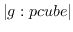A(ascii),
S(S-expression),
D(decimal),
X(hexadicimal),
O(octal),
C(character),
F(floating),
E(exponential),
G(general float),
V(dynamic number parameter),
T(tab) and
%(newline) format specifiers.

           (format t "~s ~s ~a ~a ~10,3f~%" "abc" 'a#b "abc" 'a#b 1.2)
           --->  "abc" |A#B| abc a#b     1.200

**pprint** *obj &optional (stream \*standard-output\*) (tab 0) (platen
75)*[function]

pretty-prints *obj*.

**print-functions** *file &rest fns*[function]

write the "defun" forms of function definitions of *fns* out to *file*.

**write-byte** *integer stream*[function]

**write-word** *integer stream*[function]

**write-long** *integer stream*[function]

write *integer* as a one-, two- or four-byte binary.

**spaces** *n &optional stream*[function]

outputs spaces *n* times.

**pf** *func &optional stream \*standard-output\*)*[macro]

pretty-prints a function. Compiled function cannot be printed.

**pp-method** *class selector &optional (stream
\*standard-output\*)*[function]

pretty-prints the method defined in *class* by the name of *selector*.

**tprint** *obj tab &optional (indent 0) (platen 79) (cpos 0)*[function]

print *obj* in tabular format.

**print-size** *obj*[function]

returns inexact length of obj when it is printed.

InterProcess Communication and Network
--------------------------------------

EusLisp provides four kinds of IPC facilities, *shared memory,
message-queue, FIFO* and *socket*.
[^2^](manual-footnode.html#foot15558)Normally, efficiency decreases in
this order. If you are using multithread facility, synchronization
functions described in the section [14](#mthread) are also used for
communications. Availability of these facilities depends on the
configuration and the version of Unix.

### Shared Memory

EusLisp supports the shared memory provided by SunOS's mmap, not by
System5's shmem. Shared memory is allocated by the **map-file**
function. **Map-file** maps a file into the EusLisp process memory space
and an instance of **foreign-string** is returned. Data can be written
and retrieved using string functions on this foreign-string. Since
shared memory is allocated at system-dependent page boundary, you should
not specify the map address. Mapping a file with the **:share**
keyparameter set to NIL or **:private** set to T means the file should
be accessed privately (exclusively). Since this is not useful for the
purpose of memory sharing, the default value of **:share** key is T.
When a file is shared between two users, the read/write permission must
be properly set for both users. Unfortunately, SunOS does not support
file sharing through networks between different workstations.

Example programs to share a file of 64 byte length between two euslisp
are shown below.

    ;; Create a file of 64 bytes
    (with-open-file (f "afile" :direction :output)  (princ (make-string 64) f))
    ;; Map it
    (setq shared-string1 (map-file "afile" :direction :io))
    ;;
    ;; In another process
    (setq shared-string2 (map-file "afile" :direction :io))

Then, data written to `shared-string1` immediately appears in
`shared-string2`, and vice versa. Writing to a foreign string can be
made by **replace** or **setf** in conjunction with **aref**.

**map-file** *filename &key (direction :input) length (offset 0) (share
t) (address 0)*[function]

maps the file named *filename* to memory space. *Filename* can be either
of a local file, an NFS-mounted remote file, or a memory device in
`/dev`. A **f**oreign-string, whose elements can be accessed by
**aref**, is returned. Writing data into a foreign-string mapped by
`map-file` with *direction=:input* will result a segmentation fault.

### Message Queues and FIFOs

A message-queue is created by **make-msgq-input-stream** or
**make-msgq-output-stream**. Each of these returns an instance of
file-stream, which can then accept read and print operations like other
streams connected to files. The `fname` slot of message-queue stream is
set to the key when it is created.

To make a stream to FIFO, you first create a FIFO node with
**unix:mknod** function by setting its second argument *mode*=\#o10000,
and you open it as a normal file. Message-queues and FIFOs are created
locally on a machine and only provide communication channels within the
machine.

Note that message-queues and FIFOs are not removed from the system even
after the owner process terminates. Explicit use of **unix:msgctl** or
**ipcrm** command is needed to delete them.

**make-msgq-input-stream** *key &optional (buffer-size 128)*[function]

returns an input file-stream which is connected to a message-queue
identified by *key*.

**make-msgq-output-stream** *key &optional (buffer-size 128)*[function]

returns an output file-stream which is connected to a message-queue
identified by *key*.

### Sockets

The socket is more versatile than other communication mechanisms because
it can operate either host-locally (in unix domain) or network-widely
(in internet domain). Connection-oriented socket (SOCK\_STREAM) and
unconnected socket (SOCK\_DGRAM) are supported. In both cases, you must
first create a socket address object by **make-socket-address**
function, which returns an instance of `socket-address`. In unix domain,
a socket address is specified by a path-name in the unix file system. In
internet domain, the address is specified by combining the host machine
name, the port number, and optionally the protocol number. If the port
number is defined in `/etc/services`, it can be referred through the
symbol specified by the service name. The function
**unix:getservbyname** can be used to retrieve the port number from the
symbolic service name. Port numbers less than 1024 are reserved for root
users, and non-priviledged users are advised to use port numbers greater
than 1024 for their private sockets.

Although connected streams provide bidirectional communication channels,
the connection establishment operation is asymmetric. One endpoint is
refered to server and other to client. The endpoint on the behalf of the
server (service access point) must be first established. It is created
by **make-socket-port** function which returns an instance of
`socket-port`. The socket-port object is then used to accept connections
from one or more clients by **make-server-socket-stream**. A call to
**make-server-socket-stream** may be blocked until a connection request
from a client really happens. Clients can make socket streams by
**make-client-socket-stream** specifying a socket-address.

    ;;; an example of IPC through a socket stream:
    ;;; server side
    (setq saddr  (make-socket-address :domain af_inet :host "etlic2" :port 2000))
    (setq sport  (make-socket-port saddr))
    (setq sstream (make-server-socket-stream sport))
    ;;;
    ;;; client side
    (setq caddr (make-socket-address :domain af_inet :host "etlic2" :port 2000))
    (setq cstream (make-client-socket-stream caddr))

In applications like a database or an environment simulator for mobile
robots, *multiple connection service* between one server and many
clients is required. This type of server can be programmed by the
**open-server** function. From the current host name and given port
number, **open-server** creates a socket port (service access point) on
which connection requests are listened for. Since this port is
attributed to be asynchronous, **open-server** is not blocked and
returns immediately. Thereafter, each connection request interrupts
EusLisp's main loop, and an socket-stream is created asynchronously.
This socket-stream also works in asynchronous mode: the asynchronous
input processing function which is the second argument to
**open-server** is invoked whenever new data appear in this stream. Up
to 30 connections can be established so that as many clients can access
the server's data at the same time.

    ;; server side
    (defun server-func (s) 
       (case (read s) ...    ;do appropriate jobs according to inputs
    (open-server 3000 #'server-func)
    ... do other jobs in parallel
    ;; client-1 through client-N
    (setq s (connect-server "etlmmd" 3000))
    (format s "..." ...) (finish-output s)  ;issue a command to the server
    (read s)                                ;receive response

In contrast to the *connection-oriented* streams which provide reliable
communication channels, the *connectionless* sockets are unreliable:
messages may be lost, duplicated, and may arrive out-of-order. The
*connectionless* sockets, however, have advantages that they do not need
to assign file descriptor to each connection, and sending process is
never blocked even if the receiver is not reading data and the buffer
overflows.

To make connectionless sockets, use the following procedures. Messages
are transferred by the **unix:sendto** and **unix:recvfrom**.

    ;;; receiver side
    (setq saddr  (make-socket-address :domain af_inet :host "etlic2" :port 2001))
    (setq sock   (make-dgram-socket saddr))
    (unix:recvfrom sock)
    ;;;
    ;;; client side
    (setq caddr (make-socket-address :domain af_inet :host "etlic2" :port 2001))
    (setq sock (unix:socket (send caddr :domain) 2 0))
    (unix:sendto sock caddr "this is a message")
    ;;;
    ;;; how to use echo service which is registered in /etc/services.
    (setq caddr (make-socket-address :domain af_inet :host "etlic2"
                                     :port (car (unix:getservbyname "echo"))))
    (setq echosock (unix:socket (send caddr :domain) 2 0))
    (unix:sendto echosock caddr "this is a message")
    (unix:recvfrom echosock)  --> "this is a message"

**make-socket-address** *&key domain pathname host port proto
service*[function]

makes a sockaddr structure.

**make-socket-port** *sockaddr*[function]

makes a server-side socket port which is used to establish a connection
with a client.

**make-server-socket-stream** *sockport &optional (size 100)*[function]

accepts a connection from a client and returns a two-way stream.

**make-client-socket-stream** *sockaddr &optional (size 100)*[function]

connects to a server port and returns a two-way stream.

**open-server** *port remote-func*[function]

prepares a socket port designated by the host name and *port* in
internetnet domain, and waits for the connection requests
asynchronously. Each time a connection is requested, it is accepted and
a new socket-stream is opened. When a message arrives at the
socket-port, *remote-func* is invoked with the socket port as the
argument.

**connect-server** *host port*[function]

This is a shorhand of successive calls to make-socket-address and
make-client-socket-stream. A socket-stream for a client to communicate
with the server specified by *host* and *port* is returned. The port is
made in internet domain.

Asynchronous Input/Output
-------------------------

**select-stream** *stream-list timeout*[function]

finds a list of streams which are ready for input operation, in
*stream-list*. NIL is returned if *timeout* seconds have expired before
any streams become ready. **Select-stream** is useful when you choose
active streams out of a list of input-streams on which input operation
becomes possible asynchronously. *Timeout* specifies the time when the
select operation is aborted. It can be a float number. If no timeout is
specified, select-stream blocks until input arrives at least one stream.
If *timeout* is specified and no input appears on any streams,
select-stream aborts and returns NIL.

**def-async** *stream function*[macro]

defines *function* to be called when data arrives at *stream*. *stream*
is either a file-stream or a socket-port. When data comes to the
file-stream or a connection request appears on the socket-port,
*function* is invoked with the stream as its argument. This macro
installs a SIGIO handler that dispatches to user supplied *function*
which is expected to perform actual input operation, and uses
**unix:fcntl** on *stream* to issue SIGIO asynchronously when *stream*
becomes ready to be read.

Pathnames
---------

Pathnames give the way to analyze and compose file names
OS-independently. A typical path name is assumed to be consisted of
following components:
host:device/directory1/.../directory-n/name.type.version. Since EusLisp
only runs on Unix, host, device and version fields are ignored. The
**pathname** function decomposes a string into a list of directory
components, name and type, and returns a pathname object, which is
printed as a string prefixed by `#P`.

**pathnamep** *name*[function]

returns T if *name* is a pathname.

**pathname** *name*[function]

*name* is pathname or string. *name* is converted to pathname. To
indicate the last name is a directory name, don't forget to suffix with
"/". The inverse conversion is performed by *namestring*.

**pathname-directory** *path*[function]

returns a list of directory names of *path*. Root directory (/) is
represented by :ROOT. *path* can be either of string or pathname.

**pathname-name** *path*[function]

returns the file-name portion of *path*. *path* can be either of string
or pathname.

**pathname-type** *path*[function]

extracts the file-type portion out of *path*. *path* can be either of
string or pathname.

**make-pathname** *&key host device directory name type version
defaults*[function]

makes a new pathname from *directory*, *name* and *type*. On unix, other
parameters are ignored.

**merge-pathnames** *name &optional (defaults
\*default-pathname-defaults\*))*[function]

**namestring** *path*[function]

returns string representation of *path*.

**parse-namestring** *name*[function]

**truename** *path*[function]

tries to find the absolute pathname for the file named *path*.

URL-Pathnames
-------------

URL-Pathname is an extension of pathname to have slots for a protocol
and a port. A URL is composed of six components; protocol, server, port,
directories, filename, and file-type, like
`http://shock2.etl.go.jp/matsui/index.html`.

**url-pathname** *name*[function]

*name* is pathname or string. *name* is converted to pathname. To
indicate the last name is a directory name, don't forget to suffix with
"/". The inverse conversion is performed by *namestring*.

File-name generation
--------------------

**digits-string** *n digits &optional (base 10))*[function]

generates a string representing the integer *n* in n columns of digits.
Zeros are padded before the number if n is too small to represent in
digits.

**sequential-file-name** *head num extension &optional (digits
4))*[function]

generates a filename string with an advancing number part. This is
similar to gentemp, but differs in that an extension can be specified
and the result is a string.

**timed-file-name** *head extension &optional (dt
(unix:localtime)))*[function]

generates a filename string that consists of head, hour, minute, second,
and extension. For example, (timed-file-name "img" "jpg") generates
"img191015.jpg" at 7:10:15 pm.

**dated-file-name** *head extension &optional (dt
(unix:localtime)))*[function]

generates a filename string formatted as "headyymmmdd.extension", where
yy is the lower two digits of the year, mmm is the abbreviated month
name, and dd is the date.

File System Interface
---------------------

**probe-file** *path*[function]

checks if a file named *path* exists.

**file-size** *path*[function]

returns the size of the file named *path* in bytes.

**directory-p** *path*[function]

returns T if *path* is a directory, NIL otherwise even *path* does not
exist.

**find-executable** *file*[function]

returns the full pathname for the Unix command named *file*.
*Find-executable* provides almost the same functionality with Unix's
'which' command that searches the executable file in your path list.

**file-write-date** *file*[function]

returns the integer representation of the time when the *file* was last
modified. String representation can be obtained by
`(unix:asctime (unix:localtime (file-write-date file)))`

**file-newer** *new old*[function]

returns T if the *new* file is modified more recently than the *old*
file.

**object-file-p** *file*[function]

returns T if the *file* is an object file by looking at the file's magic
number in the header.

**directory** *&optional (path ".")*[function]

makes a list of all the files in the *path*.

**dir** *&optional (dir ".")*[function]

prints file names in the specified directory.

Evaluation
==========

Evaluators
----------

In order to specify the behaviors upon an error and an
interrupt(signal), set an appropriate function to each of the special
variables **\*error-handler\*** and **\*signal-handler\*** in advance.
There is no correctable or continue-able error. After analyzing errors
you must abort the current execution by **reset** or appropriate
**throw** to upper level catchers. **reset** is equivalent to
`(throw 0 NIL)`, since EusLisp's top-level creates catch frame named
`0`.

Error handlers should be programmed as functions with three or four
arguments: *code msg1 form &optional (msg2)*. *Code* is the error code
which identifies system defined errors, such as 14 for 'mismatch
argument' or 13 for 'undefined function'. These mappings are described
in "c/eus.h". *msg1* and *msg1* are messages displayed to the user.
*form* is the S-expression which caused the error.

Signal handlers should be programmed as functions receiving two
arguments: *sig* and *code*. *Sig* is the signal number ranging from 1
to 31, and *code* is the minor signal code defined in signal-number
dependent manners.

`^`D (*end-of-file*) at the top-level terminates eus session. This is
useful when eus is programmed as a filter.

**Eval-dynamic** is the function to find the dynamic value bound to a
symbol used as a let or lambda variable. This is useful for debugging.

**identity** *obj*[function]

returns obj itself. Note the difference between **identity** and
**quote**. **identity** is a function whereas **quote** is a special
form. Therefore, `(identity 'abc)` is evaluated to `abc` and
`(quote 'abc) == (quote (quote abc))` is evaluated to `'abc`.
**Identity** is often used as the default value for `:key` parameters of
many generic sequence functions.

**eval** *form [environment]*[function]

evaluates form and returns its value. Hook function can be called before
entering the evaluation, if **\*evalhook\*** is set to some function
that accept form and environment.

**apply** *func &rest args*[function]

*func* is applied to *args*. *Func* must be evaluated to be a function
symbol (a symbol which has a function definition), a lambda form, or a
closure. Macros and special forms cannot be applied. The last element of
*args* must be a list of arguments while other args should be bare
arguments. Thus, if the last *args* is NIL, then apply is almost
equivalent to funcall, except that apply has one more arguments than
funcall. `(apply #'max 2 5 3 '(8 2)) -> 8`.

**funcall** *func &rest args*[function]

applies *func* to *args*. The number of *args* must coincide to the
number of arguments the *func* requests.

**quote** *obj*[special]

evaluates to *obj* itself.

**function** *func*[special]

makes a function closure. If *func* is a symbol, its function definition
is retrieved.

**evalhook** *hookfunc form [env]*[function]

evaluates *form* once after binding *hookfunc* to **\*evalhook\***.

**eval-dynamic** *variable*[function]

finds the value of *variable* (symbol) on the stack.

**macroexpand** *form*[function]

expands *form* if it is a macro call. If *form* is expanded to a macro
call again, expansion is repeated until non macro call results.

**eval-when** *situation {form}\**[special]

Situation is a list of `compile, load and eval`. Forms are evaluated
when the current execution mode matches with situation. **eval-when** is
important to control the behavior and environment of the compiler. If
`compile` is specified, *forms* are evaluated by the compiler so that
the result will affect the consequent compilation. For example,
*defmacro* should be evaluated by the compiler in order to let the
compiler expand macro calls at compile time. If `load` is given in the
*situation* list, *forms* are compiled to be loaded (evaluated) at load
time, i.e., compiled functions are defined at load time. This is the
normal effect that we expect to the compiler. `load` situation is used
to control the compiler's environment. If `eval` is included in
situation list, *forms* are evaluated when their source code is loaded.

**the** *type form*[special]

Declares *form* is of *type*. *type* is either a class object, :integer,
:fixnum, or :float.

**declare** *declaration\**[special]

Each *declaration* is a list of a declaration specifier and an integer
or target symbols. Declarations are important to let the compiler
produce faster code.

  ~ special declares special variables
  ~ type declares the type of variables; `(type integer count)`; valid
    type specifiers are *i*nteger, *:*integer *f*ixnum, *:*float and
    *f*loat. The **type** keyword may be omitted if type specifier is
    either one listed here. So `(integer count)` is a correct
    declaration. Other types (classes) such as *float-vector*,
    *integer-vector*, etc. need to be preceded by **type**, as
    `(type float-vector vec1)`.
  ~ ftype declares the result type of functions
  ~ optimize set \*optimize\* parameter (0-3) of the compiler
  ~ safety set \*safety\* parameter (0-3) of the compiler
  ~ space set \*space\* parameter (0-3) of the compiler
  ~ inline not recognized
  ~ not-inline not recognized

**proclaim** *proclamation*[function]

globally declares the types of variables and compiler options. The same
declarations are accepted as described for **declare** special form.
However, **proclaim** is a function of one argument and proclamation is
evaluated.

**warn** *format-string &rest args*[function]

prints warning-message given as *format-string* and *args* to
\*error-output\*.

**error** *format-string &rest args*[function]

calls the current error-handler function bound to **\*error-handler\***.
The default error-handler 'euserror' first prints arguments to
**\*error-output\*** using **format**, then enters a new top level
session. The prompt shows you the depth of your error session.
**Throw**ing to the number, you can go back to the lower level error
session.

In the multithread EusLisp, special variables are shared among threads
and the same **\*error-handler\*** is referenced by different threads.
To avoid this inconvenience, multithread EusLisp provides the
**install-error-handler** function which installs different error
handler for each thread.

**install-error-handler** *handler*[function]

installs the *handler* as the error handler of the current thread.

Top-level Interaction
---------------------

EusLisp's standard top-level read-eval-print loop is controlled by
**eustop**. When EusLisp is invoked, **eustop** tries to load the file
named `".eusrc"` in your home directory or the file specified by the
`EUSRC` environment variable. It also tries to load a file named
`".eusrc"` in the current working directory. So, if you are in your home
directory, note that .eusrc is loaded twice. Then EusLisp loads files
specified in its argument list. After these loading, **eustop** enters
normal interactive session.

When **\*standard-input\*** is connected to user's tty, **eustop**
prints prompt generated by the **toplevel-prompt** function. The default
toplevel-prompt prints `"eus$ "`. The effect of changing the definition
of toplevel-prompt appears when eustop is invoked next time. One way to
change the prompt from the first time is to define toplevel-prompt in
your `.eusrc` file.

Inputs are read from **\*terminal-io\*** stream. If the input is
parenthesized, it is taken as a lisp form and is evaluated by **eval**.
Else if the first symbol of the input line has function definition, the
line is automatically parenthesized and evaluated. If no function
definition is found, then its special value is examined and the value is
printed. If the symbol is unbound, the line is regarded as UNIX command
and passed to sh (Bourn's shell). If sh cannot find corresponding unix
command, \`\`command unrecognized" message is printed. Thus, **eustop**
works both as a lisp interpreter and as a unix shell. If you do not wish
to execute the input as UNIX command, you may escape the form by
preceeding a comma ',' at the begining of the line. This is also useful
to see the dynamic value binding when an error occured in the
interpretive execution. Since EusLisp adopts lexical scope, we cannot
examine the value of local variables outside of the scope unless they
are declared special.

If the environment variable, **USE\_TOP\_SELECTOR**, is defined, the
toplevel input is read in an asynchronous manner using the `select`
library call. The input stream (`*standard-input*`) is registered to the
`*top-selector*`, which is an instance of the **port-selector** class,
together with the read-eval-print function (`repsel`) Therefore arrival
of key inputs invokes the evaluation of the `repsel`. This feature is
particularly useful when EusLisp is to handle multiple events, i.e., key
inputs, X window events, and socket connection requests, at the same
time. In order to exploit this asynchronous toplevel interaction, users
should never write a code that blocks at the `read` operation. Instead,
the input stream should be registered to the `*top-selector*` with its
handler function by using the `:add-port` method. The handler function
is expected to read from the stream, which is already known ready to
return the input without blocking.

Note that Xwindow event handlers are defined to use the `*top-selector*`
implicitly when `USE_TOP_SELECTOR` is defined, and user programs do not
have to call `x:window-main-loop` at all to catch X events.

Using the time-out of the select call, users may define a timer handler.
Each time the select call times out, the function bound to `*timer-job*`
is invoked with no argument. The timer interval is defined by
\*top-selector-interval\*, which is defaulted to 10.0 second. Note that
the timer function invokation is not precisely periodic when there are
inputs to the \*top-selector\*.

In the toplevel interaction, each line input is remembered in
**\*history\*** vector with a sequence number. You can recall a specific
input by **!** function as if you were in csh. The difference from csh's
history is, you need at least one white space between the exclamaition
mark and the sequence number since **!** is a function, and you can edit
the line interactively with control keys, as in emacs.

`^`D (EOF) terminates EusLisp normally. To return abnormal termination
code to upper level (usually a csh), use **exit** with an appropriate
condition code.

**eustop** sets a signal handler only for SIGINT and SIGPIPE, and other
signals are not caught. Thus, signals such as SIGTERM or SIGQUIT cause
EusLisp to terminate. In order to catch these signals to avoid
termination, use **unix:signal** function to set user-defined signal
handlers.

**-** [variable]

current input.

**+** [variable]

previous input.

**++** [variable]

old input.

**+++** [variable]

ancient input.

**\*** [variable]

previous result.

**\*\*** [variable]

old result.

**\*\*\*** [variable]

ancient result.

**\*prompt-string\*** [variable]

prompt string used by **eustop**.

**\*program-name\*** [variable]

the command that invoked this EusLisp, possibly eus, eusx, eusxview or
user-saved euslisp.

**eustop** *&rest argv*[function]

is the default toplevel loop.

**eussig** *sig code*[function]

is the default signal hander for SIGPIPE. **eussig** prints signal
number upon its arrival and enters another toplevel loop.

**sigint-handler** *sig code*[function]

is the default signal handler for SIGINT (control-C). It enters a new
top level session.

**euserror** *code message &rest arg*[function]

the default error handler that prints *message* and enters a new error
session.

**reset** [function]

quits error loop and goes back to the outermost eustop session.

**exit** *&optional termination-code*[function]

terminates EusLisp process and returns *termination-code* (0..255) as
the process status code (0..255).

**\*top-selector\*** [variable]

The port-selector object to handle asynchronous function invocation
according to inputs from multiple streams.

**h** [function]

prints all the inputs remembered in **\*history\*** vector with
associated sequence numbers.

**!** *&optional (seq 0)*[function]

recalls the input line associated with the sequence number *seq*. When
*seq* is 0, the most recent command is recalled, and if *seq* is
negative, the line is specified relatively to the current input. The
recalled line is printed and the cursor is located at the end of the
line. You can go backward by control-H (backspace) or control-B, go
forward by control-F or control-K, go to the beginning of line by
control-A, to the end of line by control-L. control-C cancels the line
editing. control-M (carriage-return) or control-J (line-feed) finishes
editing the line and starts evaluation of the edited line. If *seq* is
not a number and is a symbol or a string, the history list is searched
toward old input, and a command line which include the symbol or a
string as a substring is returned.

**new-history** *depth*[function]

initializes **\*history\*** vector to have *depth* length. *Depth* input
lines are remembered. All the input lines recorded in the current
**\*history\*** are discarded.

Compilation
-----------

EusLisp compiler is used to speed the execution of Lisp programs. You
can expect 5 to 30 times faster execution and notable reduction of
garbage collection time elapsed by macro expansion.

Euscomp does optimization for arithmetic operation and vector access.
Sometimes proper type declarations are needed to inform the compiler
applicability of optimization.

**Compile-function** compiles functions one by one. **Compile-file**
compiles an entire source file. During the execution of
**Compile-file**, each form in a file is read and evaluated. This may
change the current EusLisp environment. For examples, **defparameter**
may set a new value to a symbol and **defun** may substitute the
existing compiled function with its non-compiled version. To avoid these
unexpected effects, use the **eval-when** special form without compile
time situation, or use **euscomp** command to run the compiler as a
separate process.

**Euscomp** is a unix command, which is usually a symbolic link to
**eus**. It recognizes several options. -O flag indicates optimization
of the C compiler. Each of -O1,-O2, -O3 indicates optimization level of
EusLisp compiler, which is equivalent to proclaiming (optimize 1 or 2 or
3). Each of -S0, -S1, -S2, -S3 set 0,1,2 and 3 to compiler:\*safety\*.
If \*safety\* is less than 2, no code for checking interrupt is emitted,
and you will lose control if the program enters an infinite loop. If
\*safety\* is zero, the number of required arguments is not checked. -V
flag is used to print function names when they are compiled (verbose).
-c flag prevents from forking and exec'ing cc. -D pushes next argument
to the **\*features\*** list, which can be used for conditional
compilation in conjunction with \#- and \#+ read-macro.

The compiler translates EusLisp source program named as "xxx.l" into the
intermediate C program file named "xxx.c" and the header file named
"xxx.h". Then the C compiler is run and "xxx.o" is generated.
Intermediate files "xxx.c" and "xxx.h" are left for the purpose of cross
compilation: usually you only need to compile "xxx.c" files by cc unix
command when you wish to use the code on machines of different
architecture. Compiled code is loaded to EusLisp by '(load "xxx")'.

Each intermediate file refers to the "eus.h" header file, which is
supposed to be located in the `*eusdir*/c` directory. `*eusdir*` is
copied from the `EUSDIR` environment variable. If none is set,
`/usr/local/eus/` is taken as the default directory.

When compiled, intermediate C programs are usually much bigger than the
original source code. For example, 1,161 lines of "l/common.l" lisp
source expands to 8,194 lines of "l/common.c" and 544 lines of
"l/common.h". Compiling 1,000 lines of lisp source is not a hard task,
but optimized compililation of nearly 10,000 lines of C program not only
takes long time (several minutes), but also consumes much disk space. So
if you are compiling relatively big programs, be sure your machine has
sufficient /var/tmp disk, otherwise CC may die. Setting the `TEMPDIR`
environment variable to a bigger disk slice may help.

As the linkage is performed at load-time or at run-time, no
recompilation is required even the eus kernel is updated. On the other
hand, run-time linkage may impose you another inconvenience. Suppose you
have two functions A and B in a file "x.l" and A calls B. After
compiling "x.l", you load "x.o" and tries to call A which internally
calles B. Then you find a bug in B, and probably you would redefine B.
Here, you have compiled A and non-compiled B. You may call A again, but
nothing will change, since A still calls old compiled B which is linked
regidly when A first called B. To avoid this problem, A must be
redefined again, or B must be redefined just after "x.o" is loaded and
before A is called.

When a compiled-code is loaded, its top level code, which is normally a
series of defun, defmethod, etc., is excuted. This top level code is
defined as the entry function of the load module. The compiler names the
entry function, and the loader has to know the exact name of this
function. To make the situation simple, both the compiler and the loader
assume the entry function name is identical to the basename of the
object file. For example, if you are compile and load "fib.l", the
compiler produce "fib(...)" as the entry function of "fib.c", and the
loader looks for "fib" in the "fib.o" object file. Since the final
object file is produced by "cc" and "ld" of unix, this entry function
name has to satisfy the naming rule of C functions. Therefore, you have
to avoid C's reserved keywords such as "int", "struct", "union",
"register", "extern", etc., or the private identifiers defined in
"c/eus.h" such as "pointer", "cons", "makeint", etc., to be used as the
name of the file. If you have to use one of these reserved words as the
name of the source file, you specify it for *:entry* arguments of the
compiler and the loader.

A restriction exists for the usage of closure: **return-from** special
form in closures and clean-up forms in unwind-protect is not always
correctly compiled.

**Disassemble** is not implemented. In order to analyze compiled code,
see the intermediate C program or use `adb`.

**euscomp** *{filename}\**[unix-command]

Invokes EusLisp compiler.

compiles a file. ".l" is assumed for the suffix of the *srcfile*. If
*:verbose* is T, names of functions and methods being compiled are
printed to make it easy to find the expressions where errors occurred.
*:Optimize, :c-optimize* and *:safety* specifies the optimization
levels. *:Pic* should be set T, unless the module is hard-linked in the
EusLisp core during the make stage.

**compile** *funcname*[function]

compiles a function. **Compile** first prints the function definition
into a temporary file. The file is compiled by **compile-file** and then
is loaded by **load**. Temporary files are deleted.

**compile-file-if-src-newer** *srcfile &key compiler-options*[function]

compiles the *srcfile* if it is newer (more recently modified) than its
corresponding object file. The object file is supposed to have the ".o"
suffix.

**\*optimize\*** [variable]

controls optimization level.

**\*verbose\*** [variable]

When set to non-nil, the name of a function or a method being compiled,
and the time required for the compilation are displayed.

**\*safety\*** [variable]

controls safety level.

Program Loading
---------------

**Load** is the function to read either a source file or an compiled
object file into the EusLisp process. If the file specified by *fname*
exists, it is loaded. Whether the file is source or binary is
automatically checked by seeing its magic number. If the file does not
exist but a file with the file type '.o' exists, the file is loaded as
an object file. on Sun based systems. Else if a file with the '.l'
suffix is found, it is loaded as a source program. Therefore, there is a
case where you specified "foo.so" expecting "foo.l" is already compiled,
but "foo.l" is actually loaded, since it has not yet been compiled in
reality. In other words, if you just specify a base-name of a file, its
compiled version is first tried to be loaded, and the source file
suffixed by ".l" is tried later. If the file name is not specified in
the absolute path by prefixing the name with a slash "/",

**load** searches for the file in the directories specified by the
**\*load-path\*** global variable. For example, if `*load-path*` is
`("/user/eus/" "/usr/lisp/")`, and `"llib/math"` is given as *fname*,
**load** tries to find
`"/user/eus/llib/math.o",  "/usr/lisp/llib/math.o", "/user/eus/llib/math.l"`
and `"/usr/lisp/llib/math.l"` in this order. If no appropriate file
could be found, an error is reported.

*:entry* option specifies the entry address to initialize the load
module. For example, `:entry "_myfunc"` option means that the execution
begins at `_myfunc`. Default entry is the basename of the file loaded as
described in the section [12.3](#compiler). Library module names can be
specified in **:ld-option** option string. For example, in order to link
a module which uses suncore libraries, **:ld-option**
`"-lsuncore -lsunwindow -lpixrect -lm -lc"` should be given. On non
Solaris systems, ld runs twice when libraries are included; once to
determine the size of the linked module, and again to link them actually
with a proper memory allocation.

**:symbol-input** and **:symbol-output** options are used to solve
references from one object module to another or to avoid duplicated
loading of libraries. Suppose you have two object modules A and B which
has reference to symbols defined in A. You first load the module A
specifying `:symbol-output = "a.out"`. Symbol information generated by
this linking is written to `a.out`. In order to load the module B, you
have to specify `:symbol-input = "a.out"` to solve the references from B
to A.

On Solaris2 OS, the loading of compiled code is done by calling *dlopen*
in the dynamic loader library. Application of *dlopen* is restricted to
shared objects which are compiled position independently with "-K pic"
option. Also, since *dlopen* cannot open the same file twice, load first
does *dlclose* on the file already loaded.

**:print** option decides whether load should produce output to
\*standard-output\* for each input expression. This option is provided
to find which expression (usually defun, defmethod, etc.) results error
in loading.

**load-files** *&rest files*[function]

loads *files* successively with setting `:verbose` to T.

**\*modules\*** [variable]

holds a list of names of the modules that have been loaded so far.

**provide** *module-name*[function]

adds *module-name* in `*modules*` as the name of the module being
loaded. *module-name* should be a symbol or a string. Calls to
**require** should appear at the beginning of files that compose a
complete modules.

**require** *module-name &optional file*[function]

loads *file* unless *module-name* is found in `*modules*`. **provide**
and **require** control dependency among modules and are used to avoid
duplicated loading of basic modules. Suppose you have one basic module
named "A" and two application modules named "B" and "C" which are
independent from each other but rely on "A" module. At the beginning of
each file, module name is declared by **provide**. Since "A" module does
not depend on any other modules it does not **require** anything.
`(require "A" "a.o")` follows calls to **provide** in "B" and "C". If
you load "B" (more precisely, "b.o"), "a.o" is also loaded since it is
found in `*modules*` and two module names "A" and "B" are added to
`*modules*`. Then if you load "C", "A" module is not loaded and "C" is
added to `*modules*`.

link-load a binary file.

**system:txtload** *fname*[function]

Debugging Aid
-------------

**describe** *obj &optional (stream \*standard-output\*)*[function]

**Describe** prints the contents of an object slot by slot.

**describe-list** *list &optional (stream
\*standard-output\*)*[function]

**describe**s each element in *list*.

**inspect** *obj*[macro]

**Inspect** is the interactive version of **describe**. It accepts
subcommands to print each slot of an object, to go deeper into a slot,
or set a new value to a slot, etc. Use '?' command to see the subcommand
menu.

**more** *&rest forms*[function]

After evaluating forms with the binding of \*standard-output\* to a
temporary file, the temporary file is output to \*standard-output\* with
Unix's 'more' command. **More** is useful to see a long output generated
by functions like **describe**.

**break** *&optional (prompt ":: ")*[function]

Enters a break loop. Since the current binding context is in effect,
local variables can be seen by prefixing "," to an input. To end break,
type control-D.

**help** *topic*[function]

**Help** prints the brief description on the topic which is usually a
function symbol. The help description has been created from the
reference manual (this document). The environment variable `LANG` is
referrenced to determine one of two reference manuals, Japanese or
English. If `LANG` is constituted either with `"ja", "JA", "jp"`, or
`"JP"`, Japanese is selected. Otherwise, English. This determination is
made when EusLisp start up. The actual reading of the help document is
made at the first time when the 'help' is invoked to save memory if
unnecessary.

**apropos** *key*[function]

**Apropos** is useful when you forget the exact name of a function or a
variable and you only know its partial or ambiguous name. It prints all
the symbols whose symbol-names include the *key* as a substring. Case
insensitive.

**apropos-list** *key*[function]

is similar to **appropos** but does no printing and returns the result
as a list.

**constants** *&optional (string "") (pkg \*package\*)*[function]

lists every symbol in pkg which has defined constant and matches with
*string*.

**variables** *&optional (string "") (pkg \*package\*)*[function]

lists every symbol in pkg which has global value assigned and matches
with *string*.

**functions** *&optional (string "") (pkg \*package\*)*[function]

lists every symbol in pkg which has global function defined and matches
with *string*.

**btrace** *&optional (depth 10)*[function]

prints call history of *depth* levels.

**step-hook** *form env*[function]

**step** *form*[function]

**Step** and **trace** work correctly only for functions, and not for
macro or special forms.

**trace** *&rest functions*[function]

begins tracing of *functions*. Each time functions are called, their
arguments and results are prited.

**untrace** *&rest functions*[function]

stops tracing.

**timing** *count &rest forms*[macro]

executes *forms* count times, and calculates time required for one
execution of forms.

**time** *function*[macro]

begins measurement of time elapsed by *function*.

**sys:list-all-catchers** [function]

returns a list of all **catch** tags.

**sys:list-all-instances** *aclass [scan-sub]*[function]

scans in the overall heap, and collects all the instances of the
specified class. If *scan-sub* is NIL, then instances of exactly the
*aclass* are listed, otherwise, instances of *aclass* or its subclasses
are collected.

**sys:list-all-bindings** [function]

scans bind stack, and returns a list of all the accessible value
bindings.

**sys:list-all-special-bindings** [function]

scans the stack and list up all value bindings.

Dump Objects
------------

EusLisp's reader and printer are designed so that they can write any
objects out to files in the forms that are rereadable. The objects may
have mutual or recursive references. This feature is enabled when
`*print-circle*` and `*print-object*` are set to T. Following functions
set these variables to T, open a file, and print objects. The most
important application of these functions is to dump the structures of 3D
models that have mutual references.

**dump-object** *file &rest objects*[function]

**dump-structure** *file &rest objects*[function]

dumps objects to *file* in a format as they can be read back again.

**dump-loadable-structure** *file &rest symbols*[function]

dumps objects bound to symbols to *file*. The file can be read back
again by simply loading it.

Process Image Saving
--------------------

This process image saving is no longer supported on Solaris2 based
EusLisp, since it heavily depends on Solaris's dynamic loading facility
which loads shared objects position-independently above the `sbrk`
point.

**save** *path &optional (symbol-file "") starter*[function]

**Save** dumps the current EusLisp process environment to a file which
can be invoked as a Unix command later. If a function name is specified
for *starter*, the function is evaluated when the command begins
execution. Each command line argument is coerced to string in EusLisp
and they are passed to *starter* as its arguments, so that it can parse
the command line. Be sure that you have closed all the streams except
**\*standard-input\*** and **\*standard-output\***. File open states
cannot be saved. Also, be sure you have not attempted **mmap**, which
unnoticeably happens when you make internetwork socket-stream. Sun's
network library always memory-maps NIS information such as host-by-name
table and locates them at the uppermost available location of a process
that cannot be saved. When the saved image is run later, any access to
the network library fails and causes core dump. Note that Xwindow also
uses this library, thus you cannot save your process image once you
opened connection to Xserver.

Customization of Toplevel
-------------------------

When EusLisp is invoked from Unix, execution is initiated by the
toplevel function bound to **\*toplevel\***. This function is `eustop`
in `eus` and `xtop` in `eusx`. You can change this toplevel function by
specifying your own function to the third argument to **save**.

The toplevel function should be programmed to accept arbitrary number of
arguments. Each argument on the command line is coerced to a string and
transfered to the toplevel function. The program below repeatedly reads
expressions from the file given by the first argument and pretty-prints
them to the second argument file.

    (defun pprint-copy (infile outfile)
      (with-open-file (in infile)
         (with-open-file (out outfile :direction :output)
            (let ((eof (cons nil nil)) (exp))
               (while (not (eq (setq exp (read in nil eof)) eof))
                  (pprint exp out))))))
    (defun pprint-copy-top (&rest argv)
       (when (= (length argv) 2)
          (pprint-copy (first argv) (second argv))))

Once you defined these functions in EusLisp,
`(save "ppcopy" "" 'pprint-copy-top)` creates a unix executable command
named `ppcopy`.

In Solaris based EusLisp, the toplevel evaluator cannot change in this
manner, since **save** is not available. Instead, edit `lib/eusrt.l` to
define the custom toplevel evaluator and set it to **\*toplevel\***.
`lib/eusrt.l` defines initialization procedures evaluated at every
invocation of the EusLisp.

Miscelaneous Functions
----------------------

**lisp-implementation-type** [function]

returns `"EusLisp"`.

**lisp-implementation-version** [function]

returns the name, the version and the make-date of this EusLisp. This
string is also printed at the opening of a session.
`"MT-EusLisp 7.50 X 1.2 for Solaris Sat Jan  7 11:13:28 1995"`

EusLisp Extensions
==================

System Functions
================

Memory Management
-----------------

The design of memory management scheme affects much to the flexibility
and efficiency of object-oriented languages. EusLisp allocates memory to
any sort of objects in a unified manner based on the *Fibonacci buddy
method*. In this method, each of large memory pools called chunks is
split into small cells which are unequally sized but aligned at
Fibonacci numbers. A memory chunk is a homogeneous data container for
any types of objects such as `symbol, cons, string, float-vector`, etc.
as long as their sizes fit in the chunk. A chunk has no special
attributes, like static, dynamic, relocatable, alternate, etc. EusLisp's
heap memory is the collection of chunks, and the heap can extend
dynamically by getting new chunks from UNIX. The expansion occurs either
automatically on the fly or on user's explicit demand by calling
**system:alloc** function. When it is managed automatically, free memory
size is kept about 25% of total heap size. This ratio can be changed by
setting a value between 0.1 and 0.9 to the **sys:\*gc-margin\***
parameter.

When all the heap memory is exhausted, mark-and-sweep type garbage
collection runs. Cells accessible from the root (packages, classes and
stacks) remain at the same place where they were. Other inaccessible
cells are reclaimed and linked to the free-lists. No copying or
compactification occurs during GC. When a garbage cell is reclaimed, its
neighbor is examined whether it is also free, and they are merged
together to form a larger cell if possible. This merging, however, is
sometimes meaningless, since `cons`, which is the most frequently called
memory allocator, requests the merged cell to be divided to the smallest
cell. Therefore, EusLisp allows to leave a particular amount of heap
unmerged to speed up cons. This ratio is determined by
**sys:\*gc-merge\*** parameter, which is set to 0.3 by default. With the
larger **sys:\*gc-merge\***, the greater portion of heap is left
unmerged. This improves the performance of consing, since buddy-cell
splitting rarely occurs when conses are requested. This is also true for
every allocation of relatively small cells, like three dimensional
float-vectors.

**SYS:GC** invokes garbage collector explicitly, returning a list of two
integers, numbers of free words and total words (not bytes) allocated in
the heap. **SYS:\*GC-HOOK\*** is a variable to hold a function that is
called upon the completion of a GC. The hook function should receive two
arguments representing the sizes of the free heap and the total heap.

If "fatal error: stack overflow" is reported during execution, and you
are convinced that the error is not caused by a infinite loop or
recursion, you can expand the size of the Lisp stack by
**sys:newstack**. **reset** should be performed before **sys:newstack**,
since it discards everything in the current stack such as special
bindings and clean-up forms of *unwind-protect*. After a new stack is
allocated, execution starts over from the point of printing the opening
message. The default stack size is 65Kword. The Lisp stack is different
from the system stack. The former is allocated in the heap, while the
latter is allocated in the stack segment by the operating system. If you
get "segmentation fault" error, it might be caused by the shortage of
the system stack. You can increase the system stack size by the `limit`
csh command.

**Sys:reclaim** and **sys:reclaim-tree** function put cells occupied by
objects back to the memory manager, so that they can be reused later
without invoking garbage collection. You must be assured that there
remains no reference to the cell.

**memory-report** and **room** function display statistics on memory
usage sorted by cell sizes and classes respectively.

**address** returns the byte address of the object and is useful as a
hash function when used with hash-table, since this address is unique in
the process.

**Peek** and **poke** are the functions to read/write data directly
from/to a memory location. The type of access should be either of
**:char, :byte, :short, :long, :integer, :float** and **:double**. For
an instance, `(SYS:PEEK (+ 2 (SYS:ADDRESS '(a b))) :short)` returns
class id of a cons cell, normally 1.

There are several functions prefixed with 'list-all-'. These functions
returns the list of a system resource or environment, and are useful for
dynamic debugging.

**sys:gc** [function]

starts garbage collection, and returns a list of the numbers of free
words and total words allocated.

**sys:\*gc-hook\*** [variable]

Defines a function that is called upon the completion of a GC.

**sys:gctime** [function]

returns a list of three integers: the count of gc invoked, the time
elapsed for marking cells (in 1/60 sec. unit), and the time elapsed for
reclamation (unmarking and merging).

**sys:alloc** *size*[function]

allocates at least *size* words of memory in the heap, and returns the
number of words really allocated.

**sys:newstack** *size*[function]

relinquishes the current stack, and allocates a new stack of *size*
words.

**sys:\*gc-merge\*** [variable]

is a memory management parameter. **\*gc-merge\*** is the ratio the
ratio of heap memory which is left unmerged at GC. This unmerged area
will soon filled with smallest cells whose size is the same as a cons.
The default value is 0.3. The larger values, like 0.4, which specifies
40% of free heap should be unmerged, favors for consing but do harm to
instantiating bigger cells like float-vectors, edges, faces, etc.

**sys:\*gc-margin\*** [variable]

is a memory management parameter. **\*gc-margin** determines the ratio
of free heap size versus the total heap. Memory is acquired from UNIX so
that the free space does not go below this ratio. The default value 0.25
means that 25% of free space is maintained at every GC.

**sys:reclaim** *object*[function]

relinquishes *object* as a garbage. It must be guaranteed that it is no
longer referenced from any other objects.

**sys:reclaim-tree** *object*[function]

reclaims all the objects except symbols traversable from *object*.

**sys:btrace** *num*[function]

prints the back-trace information of *num* depth on the Lisp stack.

**sys:memory-report** *&optional strm*[function]

prints a table of memory usage report sorted by cell sizes to the *strm*
stream.

**sys:room** *output-stream*[function]

outputs memory allocation information ordered by classes.

**sys:address** *object*[function]

returns the address of *object* in the process memory space.

**sys:peek** *[vector] address type*[function]

reads data at the memory location specified by *address* and returns it
as an integer. *type* is one of **:char, :byte, :short, :long, :integer,
:float**, and **:double**. If no *vector* is given, the address is taken
in the unix's process space. For example, since the a.out header is
located at `#x2000` on SunOS4, `(sys:peek #x2000 :short)` returns the
magic number (usually `#o403`). Solaris2 locates the ELF header at
`#10000`, and `(sys:peek #x10000 :long)` returns `#xff454c46` whose
string representation is "ELF".

If *vector*, which can be a foreign-string, is specified, address is
recognized as an offset from the vector's origin.
`(sys:peek "123456" 2 :short)` returns short word representation of
"34", namely \#x3334 (13108).

Be careful about the address alignment: reading short, integer, long,
float, double word at odd address may cause bus error by most CPU
architectures.

**sys:poke** *value [vector] address value-type*[function]

writes *value* at the location specified by *address*. Special care
should be taken since you can write to anywhere in the process memory
space. Writing to outside the process space surely causes segmentation
fault. Writing short, integer, long, float, double word at odd address
causes bus error.

**sys:list-all-chunks** [function]

list up all allocated heap chunks. Not useful for other than the
implementor.

**sys:object-size** *obj*[function]

counts the number of cells and words accessible from *obj*. All the
objects reference-able from obj are traversed, and a list of three
numbers is returned: the number of cells, the number of words logically
allocated to these objects (i.e. accessible from users), and the number
of words physically allocated including headers and extra slots for
memory management. Traversing stops at symbols, i.e. objects referenced
from a symbol such as property-list or print-name string are not
counted.

Unix System Calls
-----------------

EusLisp assorts functions which directly correspond to the system calls
and library functions of UNIX operating system. For further detail of
these functions, consult UNIX system interface reference (2). These
low-level functions defined in `*unix-package*` are sometimes dangerous.
Use higher level functions defined in other packages if possible. For
example, use IPC facilities described in the section [11.4](#IPC)
instead of `unix:socket, unix:bind, unix:connect`, and so on.

### Times

**unix:ptimes** [function]

a list of five elements, elapsed time, system time, user time,
subprocess's system time, subprocess's user time, is returned. Unit is
always one sixtieth second. This function is obsolete and use of
**unix:getrusage** is recommended.

**unix:runtime** [function]

Sum of the process's system and user time is returned. Unit is 1/60
second.

**unix:localtime** [function]

Current time and date is returned in an integer vector. Elements are
second, minute, hour, day-of-a-month, year, weekday.

**unix:asctime** *tm\_intvector*[function]

Converts localtime represented with an integer-vector into a string
notation. `(unix:asctime (unix:localtime))` returns a string
representation of the current real time.

### Process

**unix:getpid** [function]

returns the process id (16bit integer) of this process.

**unix:getppid** [function]

returns the process id of the parent process.

**unix:getpgrp** *integer*[function]

returns the process group id.

**unix:setpgrp** *integer*[function]

sets a new process group id.

**unix:getuid** [function]

gets user id of this process.

**unix:geteuid** [function]

returns the effective user id of this process.

**unix:getgid** [function]

returns the group id of this process.

**unix:getegid** [function]

returns the effective group id of this process.

**unix:setuid** *integer*[function]

sets effective user id of this process.

**unix:setgid** *integer*[function]

sets the effective group id of this process.

**unix:fork** [function]

creates another EusLisp. 0 is returned to the subprocess and the pid of
the forked process is returned to the parent process. Use
**system:piped-fork** described in section [13.3](#UnixProcess) to make
a process connected via pipes.

**unix:vfork** [function]

forks another EusLisp, and suspends the parent process from execution
until the new EusLisp process terminates.

**unix:exec** *path*[function]

replaces executing EusLisp with another program.

**unix:wait** [function]

waits for the completion of one of subprocesses.

**unix:exit** *code*[function]

terminates execution and returns *code* as its completion status. Zero
means normal termination.

**sys:\*exit-hook\*** [variable]

Defines a function that is called just before the process is exited.

**unix:getpriority** *which who*[function]

returns the highest priority (nice value) enjoyed by this process.
*Which* is one of 0(process), 1(process-group) or 2(user).

**unix:setpriority** *which who priority*[function]

sets priority of the resource determined by *which* and *who*. *which*
is one of 0(process), 1(process-group) or 2(user). *who* is interpreted
relative to *which* (a process identifier for
, process group identifier for
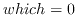, and a user ID for
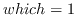. A zero value of who denotes the current
process, process group, or user. To lower the priority (nice value) of
your EusLisp process, `(unix:setpriority 0 0 10)` will sets the nice
value to 10. Bigger nice value makes your process get less favored.

**unix:getrusage** *who*[function]

returns list of system resource usage information about *who* process.
Elements are ordered as follows: More comprehensive display is obtained
by **lisp:rusage**.

        float ru_utime (sec.) /* user time used */
        float ru_stime (sec.) /* system time used */
        int  ru_maxrss;       /* maximum resident set size */
        int  ru_ixrss;        /* currently 0 */
        int  ru_idrss;        /* integral resident set size */
        int  ru_isrss;        /* currently 0 */
        int  ru_minflt;       /* page faults without physical I/O */
        int  ru_majflt;       /* page faults with physical I/O */
        int  ru_nswap;        /* number of swaps */
        int  ru_inblock;      /* block input operations */
        int  ru_oublock;      /* block output operations */
        int  ru_msgsnd;       /* messages sent */
        int  ru_msgrcv;       /* messages received */
        int  ru_nsignals;     /* signals received */
        int  ru_nvcsw;        /* voluntary context switches */
        int  ru_nivcsw;       /* involuntary context switches */

**unix:system** *[command]*[function]

executes *command* in a sub shell. *command* must be recognizable by
Bourn-shell.

**unix:getenv** *env-var*[function]

gets the value for the environment variable *env-var*.

**unix:putenv** *env*[function]

adds *env* in the process's environment variable list. *env* is a string
which equates var to value like `"VARIABLE=value"`.

**unix:sleep** *time*[function]

suspends execution of this process for *time* seconds.

**unix:usleep** *time*[function]

suspends execution of this process for *time* micro-seconds (**u**
represents micro). **Usleep** is not available on Solaris2 or other Sys5
based systems.

### File Systems and I/O

**unix:uread** *stream [buffer] [size]*[function]

reads *size* bytes from *stream*. *stream* may either be a stream object
or an integer representing fd. If *buffer* is given, the input is stored
there. Otherwise, input goes to the buffer-string in *stream*.
Therefore, if *stream* is fd, *buffer* must be given. **unix:uread**
never allocates a new string buffer. **unix:uread** returns the byte
count actually read.

**unix:write** *stream string &optional size*[function]

writes *size* bytes of *string* to *stream*. If *size* is omitted, the
full length of *string* is output.

**unix:fcntl** *stream command argument*[function]

**unix:ioctl** *stream command buffer*[function]

**unix:ioctl\_** *stream command1 command2*[function]

**unix:ioctl\_R** *stream command1 command2 buffer [size]*[function]

**unix:ioctl\_W** *stream command1 command2 buffer [size]*[function]

**unix:ioctl\_WR** *stream command1 command2 buffer [size]*[function]

**unix:close** *fd*[function]

close a file specifying its file descriptor *fd*.

**unix:dup** *fd*[function]

returns the duplicated file descriptor for *fd*.

**unix:pipe** [function]

creates a pipe. An io-stream for this pipe is returned.

**unix:lseek** *stream position [whence 0]*[function]

sets the file pointer for *stream* at *position* counted from *whence*.

**unix:link** *path1 path2*[function]

makes a hard link.

**unix:unlink** *path*[function]

removes a hard link to the file specified by *path*. If no reference to
the file lefts, it is deleted.

**unix:mknod** *path mode*[function]

makes inode in a file system. *path* must be a string, not a pathname
object.

**unix:mkdir** *path mode*[function]

makes directory in a file system. *path* must be a string, not a
pathname object.

**unix:access** *path mode*[function]

checks the access rights to *path*.

**unix:stat** *path*[function]

gets inode information of *path* and returns a list of integers
described below.

      st_ctime  ; file last status change time
      st_mtime  ; file last modify time
      st_atime  ; file last access time
      st_size   ; total size of file, in bytes
      st_gid    ; group ID of owne
      st_uid    ; user ID of owner
      st_nlink  ; number of hard links to the file
      st_rdev   ; the device identifier (special files only)
      st_dev    ; device file resides on
      st_ino    ; the file serial number
      st_mode   ; file mode

**unix:chdir** *path*[function]

changes the current working directory to *path*.

**unix:getwd** [function]

gets current working directory.

**unix:chmod** *path integer*[function]

changes access mode (permission) for *path*.

**unix:chown** *path integer*[function]

changes the owner of the file *path*.

**unix:isatty** *(stream  fd)*[function]

returns T if *stream* is connected to a tty-type device (a serial port
or a pseudo tty) .

**unix:msgget** *key mode*[function]

creates or allocates a message queue which is addressed by *key*.

**unix:msgsnd** *qid buf [mtype [flag]]*[function]

**unix:msgrcv** *qid buf [size [mtype [flag]]]*[function]

**unix:socket** *domain type &optional proto*[function]

creates a socket whose name is defined in *domain* and whose abstract
type is *type*. *type* should be one of 1 (SOCK\_STREAM), 2
(SOCK\_DGRAM), 3 (SOCK\_RAW), 4 (SOCK\_RDM) and 5 (SOCK\_SEQPACKET).

**unix:bind** *socket name*[function]

associates *name* to *socket*. *name* should be a unix path-name if the
socket is defined in unix-domain.

**unix:connect** *socket addr*[function]

connects *socket* to another socket specified by *addr*.

**unix:listen** *socket &optional backlog*[function]

begins to accept connection request on *socket*. *backlog* specifies the
length of the queue waiting for the establishment of connection.

**unix:accept** *socket*[function]

accepts the connection request on *socket* and returns a file-descriptor
on which messages can be exchanged bidirectionally.

**unix:recvfrom** *socket &optional mesg from flag*[function]

receives a datagram message from *socket*. The socket must be assigned a
name by **unix:bind**. *mesg* is a string in which the incoming message
will be stored. If *mesg* is given, **recvfrom** returns the number of
bytes received. If it is omitted, a new string is created for the
storage of the message and returned.

**unix:sendto** *socket addr mesg &optional len flag*[function]

sends a datagram message to another socket specified by *addr*. *Socket*
must be a datagram-type socket which has no name assigned. *Mesg* is a
string to be sent and *len* is the length of the message counting from
the beginning of the string. If omitted, whole string is sent.

**unix:getservbyname** *servicename*[function]

returns the service number (integer) for *servicename* registered in
`/etc/services` or in NIS database.

**unix:gethostbyname** *hostname*[function]

returns the list of ip address of *hostname* and its address type
(currently always AF\_INET==2).

**unix:syserrlist** *errno*[function]

returns a string describing the error information for the error code
*errno*.

### Signals

**unix:signal** *signal func [option]*[function]

installs the signal handler *func* for *signal*. In BSD4.2 systems,
signals caught during system call processing cause the system call to be
retried. This means that if the process is issuing a read system call,
signals are ignored. If *option=2* is specified, signals are handled in
the system-5 manner, which causes the system call to fail.

**unix:kill** *pid signal*[function]

sends a signal to a process named by *pid*.

**unix:pause** [function]

suspends execution of this process until a signal arrives.

**unix:alarm** *time*[function]

sends an alarm clock signal (SIGALRM 14) after *time* seconds. Calling
**unix:alarm** with *time*=0 resets the alarm clock.

**unix:ualarm** *time*[function]

same as **unix:alarm** except that the unit of *time* is micro seconds.
**ualarm** is not available on Solaris2 or on other Sys5 based systems.

**unix:getitimer** *timer*[function]

One Unix process is attached with three interval timers, i.e., a
real-time timer that decrements as the real time passes, a virtual-timer
that decrements as the process executes in the user space, and a
prof-timer that decrements as the kernel executes on behalf of the user
process. *timer* is either 0 (`ITIMER_REAL`), 1 (`ITIMER_VIRTUAL`), or
2(`ITIMER_PROF`). A list of two elements is returned, the value of the
timer in second and the interval. Both are floating-point numbers.

**unix:setitimer** *timer value interval*[function]

sets *value* and *interval* in *timer*. *timer* is eiterh 0
(`ITIMER_REAL`), 1 (`ITIMER_VIRTUAL`), or 2(`ITIMER_PROF`).
`ITIMER_REAL` delivers SIGALRM when *value* expires. `ITIMER_VIRTUAL`
delivers SIGVTALRM, and `ITIMER_PROF` delivers SIGPROF.

**unix:select** *inlist outlist exceptlist timeout*[function]

*inlist, outlist* and *exceptlist* are bitvectors indicating file
descriptors whose I/O events should be tested. For example, if
*inlist*=\#b0110, *outlist*=\#b100, and *exceptlist*=NIL, then whether
it is possible to read on fd=1 or 2, or to write on fd=2 is tested.
*Timeout* specifies seconds for which **select** is allowed to wait.
Immediately after incoming data appear on one of the ports specified in
*inlist*, or writing become available on one of the ports specified in
*outlist*, or exceptional condition arises in one of the ports specified
in *exceptlist*, **select** returns the number of ports that are
available for I/O operation, setting ones for the possible port s in
each of *inlist, outlist and exceptlist*.

**unix:select-read-fd** *read-fdset timeout*[function]

I/O selection is usually meaningful only for input operation.
**unix:select-read-fd** is a short-hand for
`select fdset nil nil timeout`. *Read-fdset* is not a bit-vector, but an
integer that specifies the reading fd set.

### Multithread

There is no way to create bound threads. Therefore only one signal stack
and one interval timer are available in a EusLisp process. On Solaris2,
the main top-level runs in a separated thread.

**unix:thr-self** [function]

returns the id (integer) of the thread currently running.

**unix:thr-getprio** *id*[function]

returns the execution priority of the thread specified by *id*.

**unix:thr-setprio** *id newprio*[function]

sets the execution priority of the thread specified by *id* to
*newprio*. The smaller numerical value of *newprio* means the higher
priority. In other words, a thread with a numerically greater *newprio*
gets less access to CPU. Users cannot raise the execution priority
higher than the process's nice value, which is usually 0.

**unix:thr-getconcurrency** [function]

returns the concurrency value (integer) which represents the number of
threads that can run concurrently.

**unix:thr-setconcurrency** *concurrency*[function]

The concurrency value is the number of LWP in the process. If the
concurrency is 1, which is the default, many threads you created are
assigned to one LWP in turn even though all of them are runnable. If the
program is running on a multi-processor machine and you want to utilize
more than one CPU at the same time, you should set a value bigger than
one to *concurrency*. Note that a big concurrency value let the
operating system consume more resource. Usually *concurrency* should be
smaller than or equal to the number of processors.

**unix:thr-create** *func arg-list &optional (size 64\*1024)*[function]

creates a new thread with *size* words of Lisp stack and *size* bytes of
C stack, and let it apply *func* to *arg-list*. The thread cannot return
any results to the caller. Use of this function is discouraged.

### Low-Level Memory Management

**unix:malloc** *integer*[function]

allocates memory outside EusLisp memory space.

**unix:free** *integer*[function]

deallocates a memory block allocated by *unix:malloc*.

**unix:valloc** *integer*[function]

**unix:mmap** *address length protection share stream offset*[function]

**unix:munmap** *address length*[function]

**unix:vadvise** *integer*[function]

### IOCTL

Although Unix controls terminal device by a set of commands (second
argument) to `ioctl`, EusLisp provides them in the forms of function to
eliminate to reference the include files and or'ing argument with the
command codes. For the detail, refer to the *termio* manual pages of
Unix.

There are two sets of terminal io-controls: TIOC\* and TC\*. Be careful
about the availability of these functions on your operating system.
Basically, BSD supports TIOC\* io-controls and Sys5 supports TC\*.

  ~ SunOS 4.1 Both TIOC\* and TC\*
  ~ Solaris2 only TC\*
  ~ mips, ultrix? only TIOC\*

**unix:tiocgetp** *stream [sgttybuf]*[function]

gets parameters.

**unix:tiocsetp** *stream sgttybuf*[function]

sets parameters.

**unix:tiocsetn** *stream [sgttybuf]*[function]

**unix:tiocgetd** *stream [sgttybuf]*[function]

**unix:tiocflush** *stream*[function]

flushes output buffer

**unix:tiocgpgrp** *stream integer*[function]

gets process group id.

**unix:tiocspgrp** *stream integer*[function]

sets process group id.

**unix:tiocoutq** *stream integer*[function]

**unix:fionread** *stream integer*[function]

**unix:tiocsetc** *stream buf*[function]

**unix:tioclbis** *stream buf*[function]

**unix:tioclbic** *stream buf*[function]

**unix:tioclset** *stream buf*[function]

**unix:tioclget** *stream buf*[function]

**unix:tcseta** *stream buffer*[function]

sets terminal parameters immediately.

**unix:tcsets** *stream buffer*[function]

sets terminal parameters.

**unix:tcsetsw** *stream buffer*[function]

sets terminal parameters after all characters queued for output have
been transmitted.

**unix:tcsetsf** *stream buffer*[function]

sets terminal parameters after all characters queued for output have
been transmitted and all characters queued for input are discarded.

**unix:tiocsetc** *stream buffer*[function]

**unix:tcsetaf** *stream buffer*[function]

**unix:tcsetaw** *stream buffer*[function]

**unix:tcgeta** *stream buffer*[function]

**unix:tcgets** *stream buffer*[function]

**unix:tcgetattr** *stream buffer*[function]

**unix:tcsetattr** *stream buffer*[function]

### Keyed Indexed Files

Recent Unix provides with the *dbm* or *ndbm* library for the management
of keyed index files. Making use of this library, you can build a data
base that is composed of many pairs of key and datum association.
Following functions are defined in clib/ndbm.c. On Sun, it should be
compiled by `cc -c -Dsun4 -Bstatic`, and loaded into EusLisp by
`(load "clib/ndbm" :ld-option "-lc")`.

**dbm-open** *dbname mode flag*[function]

**Dbm-open** must be called first to create a data base file, and to
begin read/write operations to the data base. *Dbname* is the name of
the data base. Actually, ndbm manager creates two files which have
suffixes `".pag"` and `".dir"`. *Mode* specifies file-open mode; 0 for
read-only access, 1 for write-only, and 2 for read-write; also \#x200
should be *or*ed when you create the file at the first time. *Flag*
gives access permission that is changed by chmod. \#o666 or \#o664 is
good for *flag*. **Dbm-open** returns an integer that identifies the
data base in the process. This value is used by other dbm functions to
identify the data base. In other words, you can open several data bases
at the same time.

**dbm-store** *db key datum mode*[function]

stores *key-datum* association in *db*. *Db* is an integer to identify
the data base. *Key and datum* are strings. *Mode* is 0 (insert) or 1
(replace).

**dbm-fetch** *db key*[function]

retrieves datum that is associated with *key* in *db*.

Unix Processes
--------------

In order to launch unix commands from EusLisp, use the **unix:system**
function. **Piped-fork** creates a subprocess whose standard input and
standard output are connected to EusLisp's bidirectional stream through
pipes. **Piped-fork** returns the stream. Following is a function to
count the number of lines contained in a file by using `"wc"`.

    (defun count-lines (file) (read (piped-fork "wc" file)))

The next example creates eus process on another workstation identified
by "etlic0" and provides a port for distributed computation.

    (setq ic0eus (piped-fork "rsh" "etlic0" "eus"))
    (format ic0eus "(list 1 2 3)~%")
    (read ic0eus) --> (1 2 3)

For source code editing, you can call `ez` from the EusLisp. The screen
editor ez communicates with EusLisp through message-queues. If you have
an ez process already running in parallel with the EusLisp, **ez**
restarts ez and it gains the terminal control. By issuing esc-P or esc-M
commands in ez, texts are sent back and evaluated by EusLisp. This is
useful for the debugging since entire file does not need to be loaded
when you add a little modification to the file. Similar function is
available on emacs by M-X run-lisp command.

**cd** *&optional (dir (unix:getenv "HOME"))*[function]

changes the current working directory.

**ez** *&optional key*[function]

enters display editor ez, and reads Lisp forms from it, and evaluates
them.

**piped-fork** *&optional (exec) &rest args*[function]

forks a process, and makes a two-way stream between the current EusLisp
and the subprocess. Exec is the file name of a unix command and args are
arguments to the command. If exec (string) includes one or more space,
it is assumed a shell command, and executed by /bin/sh calling the
unix:system function. If no exec is given, another euslisp is created as
the subprocess.

**xfork** *exec &key (stdin \*standard-input\*) (stdout
\*standard-output\*) (stderr \*error-output\*) (args nil)*[function]

forks a process, replaces its stdin, stdout, and stderr streams to
specified ones, and exec's "exec" with the args arguments. piped-fork is
roughly equivalent to
` (xfork exec :stdin (unix:pipe) :stdout (unix:pipe))` Though xfork
returns an io-stream to stdin and stdout with their directions reversed,
it is not always useful unless they are pipes. The name of this
function, xfork (cross-fork), comes from this reversed io-stream,
namely, the io-stream's input comes from the stdout of the subprocess
and the output comes from the stdin.

**rusage** [function]

prints resource usage of this process.

Adding Lisp Functions Coded in C
--------------------------------

Programs that heavily refer to C include files or frequently access
arrays perform better or are more clearly described if written in C or
other languages rather than in EusLisp. EusLisp provides the way to link
programs coded in C.

If you want to define EusLisp function written in C, each
EusLisp-callable C-function must be coded to accept three arguments: the
context pointer, the number of arguments and the pointer to the Lisp
argument block. These arguments must be named as `ctx, n` and `argv`,
since the macros in `c/eus.h` assume these names. The C program must
include `*eusdir*/c/eus.h`. The programmer should be familiar with the
types and macros described there. The entry function should be named by
the basename of the source file.

A sample code for C function AVERAGE which computes the arithmetic
average of arbitrary number of floats is shown below. In this example,
you can see how to get float values from arguments, how to make the
pointer of a float, how to set a pointer in the special variable
AVERAGE, and how to define a function and a symbol in the entry function
`ave`. Compile this program by `'cc -c -Dsun4 -DSolaris2 -K pic'`.
`-Dsun4` and `-DSolaris2` are needed to chose proper definitions in
`c/eus.h`. `-K pic` is needed to let the c compiler generate position
independent code necessary for the loadable shared object. Then the
resulted '.o' file can be loaded into EusLisp. More complete examples
can be found in `*eusdir*/clib/*.c`, which are defined and loaded in the
same manner described here.

    /* ave.c */
    /* (average &rest numbers) */
    #include "/usr/local/eus/c/eus.h"
    static pointer AVESYM;
    pointer AVERAGE(ctx,n,argv)
    context *ctx;
    int n;
    pointer argv[];
    { register int i;
      float sum=0.0, a, av;
      pointer result;
      numunion nu;
      for (i=0; i<n; i++) {
        a=ckfltval(argv[i]);
        sum += a;} /*get floating value from args*/
      av=sum/n;
      result=makeflt(av);
      AVESYM->c.sym.speval=result;  /*kindly set the result in symbol*/
      return(result);}

    ave(ctx,n,argv)
    context *ctx;
    int n;
    pointer argv[];
    { char *p;
      p="AVERAGE";
      defun(ctx,p,argv[0],AVERAGE);
      AVESYM=intern(ctx,p,strlen(p),userpkg); /* make a new symbol*/
      }

Foreign Language Interface
--------------------------

Functions written in C without concern about linking with EusLisp can be
loaded onto EusLisp, too. These functions are called foreign functions.
Such programs are loaded by **load-foreign** macro which returns an
instance of **foreign-module**. External symbol definitions in the
object file is registered in the module object. **Defforeign** is used
to make entries to C functions to be called from EusLisp.
**Defun-c-callable** defines lisp functions callable from C. C-callable
functions have special code piece called *pod-code* for converting
parameters and transferring control to the corresponding EusLisp
function. **Pod-address** returns the address of this code piece which
should be informed to C functions.

Here is an example of C program and its interface functions to EusLisp.

    /* C program named cfunc.c*/

    static int (*g)();  /* variable to store Lisp function entry */

    double sync(x)
    double x;
    { extern double sin();
      return(sin(x)/x);}

    char *upperstring(s)
    char *s;
    { char *ss=s;
      while (*s) { if (islower(*s)) *s=toupper(*s); s++;}
      return(ss);}

    int setlfunc(f)      /* remember the argument in g just to see */
    int (*f)();          /* how Lisp function can be called from C */
    { g=f;}

    int callfunc(x)      /* apply the Lisp function saved in g to the arg.*/
    int x;
    { return((*g)(x));}

    ;;;; Example program for EusLisp's foreign language interface
    ;;;; make foreign-module
    (setq m (load-foreign "cfunc.o"))

    ;; define foreign functions so that they can be callable from lisp
    (defforeign sync m "sync" (:float) :float)
    (defforeign toupper m "upperstring" (:string) :string)
    (defforeign setlfunc m "setlfunc" (:integer) :integer)
    (defforeign callfunc m "callfunc" (:integer) :integer)

    ;; call them
    (sync 1.0)  --> 0.841471
    (print (toupper "abc123"))  --> "ABC123"

    ;; define a test function which is callable from C.
    (defun-c-callable TEST ((a :integer)) :integer
          (format t "TEST is called, arg=~s~%" a)
          (* a a))    ;; return the square of the arg
    ;;  call it from C
    ;;setlfunc remembers the entry address of Lisp TEST function.
    (setlfunc (pod-address (intern "TEST")))
    (callfunc 12)  --> TEST is called, arg=12  144

Data representations in EusLisp are converted to those of C in the
following manners: EusLisp's 30-bits integer (including character) is
sign-extended and passed to a C function via stack. 30-bit float is
extended to double and passed via stack. As for string, integer-vector
and float-vector, only the address of the first element is passed on the
stack, and the entire array remains uncopied. The string can either be a
normal string or a foreign-string. A string may contain null codes,
though it is guaranteed that the string also has a null code at the end.
EusLisp does not know how to pass arrays of more than one dimension.
Every array of more than one dimension has correspoiding one dimensional
vector that holds the entire elements linearly. This vector is obtained
by the **array-entity** macro. Also, note that a two-dimensional matrix
should be transposed if it is sent to the FORTRAN subroutines, since
rows and columns are ordered oppositely in FORTRAN.

Since EusLisp's representation of floating-point numbers is always
single precision, conversion is required when you pass a vector of
double precision floating point numbers. For this purpose, the
conversion functions, **double2float** and **float2double** are provided
by `clib/double.c`. For an instance, if you have a 3x3 float-matrix and
want to pass it to a C function named cfun as a matrix of double, use
the following forms.

         (setq mat (make-matrix 3 3))
         (cfun (float2double (array-entity mat)))

Struct in C can be defined by the **defcstruct** macro. **Defcstruct**
accepts struct-name followed by field definition forms.

         (defcstruct <struct-name>
            {(<field> <type> [*] [size])}*)

For example, following struct definition is represented by the next
defcstruct.

         /* C definition */
         struct example {
            char  a[2];
            short b;
            long  *c;
            float *d[2];};

         /* equivalent EusLisp definition */
         (defcstruct example
            (a :char 2)
            (b :short)
            (c :long *)
            (d :float * 2))

**load-foreign** *objfile &key symbol-input symbol-output (symbol-file
objfile) ld-option)*[macro]

loads an object module written in languages other than EusLisp. In
Solaris2, **load-foreign** just calls **load** with a null string as its
*:entry* parameter. A compiled-code object is returned. This result is
necessary to make entries to the functions in the module by
**defforeign** called later on. Libraries can be specified in
*ld-option*. However, the symbols defined in the libraries cannot be
captured in the default symbol-output file. In order to allow EusLisp to
call functions defined in the libraries, *symbol-output* and
*symbol-file* must be given explicitly. (These arguments are not needed
if you are not going to call the library functions directly from
EusLisp, i.e. if you are referring them only from functions in
*objfile*). **Load-foreign** links *objfile* with libraries specified
and global symbols in EusLisp which is in core, and writes the linked
object in *symbol-output*. Then, symbols in *symbol-file* are searched
and listed in the foreign-module. Since *symbol-file* is defaulted to be
*objfile*, only the symbols defined in *objfile* are recognized if
*symbol-file* is not given. To find all the global entries both in
*objfile* and libraries, the linked (merged) symbol table resulted from
the first link process of load-foreign must be examined. For this
reason, an identical file name must be given both to *symbol-output* and
to *symbol-file*.

As shown below, the intermediate symbol file can be removed by
**unix:unlink**. However, if you are loading more than one foreign
modules both of which refer to the same library, and if you want to
avoid loading the library duplicatedly, you have to use *symbol-input*
argument. Suppose you have loaded all the functions in "linpack.a" in
the above example and you are going to load another file "linapp.o" that
calls functions in "linpack.a". The following call of load-foreign
should be issued before you unlink "euslinpack".
`(load-foreign "linapp.o" :symbol-input "euslinpack")` See
`*eusdir*/llib/linpack.l` for more complete examples of **load-foreign**
and **defforeign**.

    (setq linpack-module
        (load-foreign "/usr/local/eus/clib/linpackref.o"
            :ld-option  "-L/usr/local/lib -llinpack -lF77 -lm -lc"
            :symbol-output "euslinpack"
            :symbol-file "euslinpack"
            ))
    (unix:unlink "euslinpack")

**defforeign** *funcname module cname paramspec resulttype*[macro]

makes a function entry in a foreign language module. *funcname* is a
symbol to be created in EusLisp. *module* is a compiled-code object
returned by **load-foreign**. *cname* is the name of the C-function
defined in the foreign program. It is a string like "\_myfunc".
*paramspec* is a list of parameter type specifications which is used for
the data type conversion and coercion when arguments are passed from
EusLisp to the C function. *Paramspec* can be NIL if no data conversion
or type check is required. One of **:integer, :float , :string**, or
*(:string n)* must be given to *resulttype*. **:Integer** means that the
c function returns either char, short or int (long). **:Float** should
be specified both for float and double. **:String** means the C function
returns a pointer to a string, and EusLisp should add a long-word header
to the string to accomodate it as a EusLisp string. The length of the
string is found by *strlen*. Note that the writing a header just before
the string may cause a disastrous result. On the other hand, **(:string
n)** is safer but slower because a EusLisp string of length **n** is
newly created and the contents of C string is copied there.
`(:string 4)` should be used for a C function that returns a pointer to
an integer. The resulted integer value of the result can be obtained by
`(sys:peek result :long)`, where result is a variable set to the result
of the C function. You may also specify `(:foreign-string [n])` for C
functions that return a string or a struct. The result is a
foreign-string whose content is held somewhere outside EusLisp control.
If the result string is null-terminated and the length of the string is
known by strlen, you don't need to specify the length [n]. However, if
the result contains null codes, which is usual for structs, the length
of the foreign-string should be explicitly given. Whether you should use
(:string n) or (:foreign-string n) is not only the matter of speed, but
the matter of structure sharing. The difference is whether the result is
copied or not.

Fortran users should note that every argument to a Fortran function or a
subroutine is passed by call-by-reference. Therefore, even a simple
integer or float type argument must be put in a integer-vector or a
float-vector before it is passed to Fortran.

**defun-c-callable** *funcname paramspec resulttype . body*[macro]

defines a EusLisp function that can be called from foreign language
code. *funcname* is a symbol for which a EusLisp function is defined.
*paramspec* is a list of type specifiers as in **defforeign**. Unlike
**defforeign**'s paramspec, **defun-c-callable**'s paramspec cannot be
omitted unless the function does not receive any argument. *:integer*
should be used for all of int, short and char types and *:float* for
both of float and double. *resulttype* is the type of the Lisp function.
*resulttype* can be omitted unless you need type check or type coercion
from integer to float. *body* is lisp expressions that are executed when
this function is called from C. The function defined by
**defun-c-callable** can be called from Lisp expressions, too.
**Defun-c-callable** returns *funcname*. It looks like a symbol, but it
is not, but an instance of **f**oreign-pod which is a subclass of
symbol.

**pod-address** *funcname*[function]

returns the address of a foreign-to-EusLisp interface code of the
c-callable Lisp function *funcname* defined by **defun-c-callable**.
This is used to inform a foreign language program of the location of a
Lisp function.

**array-entity** *array-of-more-than-one-dimension*[macro]

returns one-dimensional vector which holds all the elements of a
multi-dimensional array. This is needed to pass a multi-dimensional or
general array to a foreign function, although a simple vector can be
passed directly.

**float2double** *float-vector [doublevector]*[function]

converts a float-vector to double precision representation. The result
is of type float-vector but the length is twice as much as the first
argument.

**double2float** *doublevector [float-vector]*[function]

A vector of double precision numbers is converted to single precision
float-vector.

Multithread
===========

The multithread is the concurrent and asynchronous programming facility
on the Solaris operating system. Asynchronous programming is required
for programs to respond to external events via multiple sensors
occurring independently of the program's state. Parallel programming is
effective to improve performance of computation bound processing such as
image processing and interference checking in path planning.

Design of Multithread EusLisp
-----------------------------

### Multithread in Solaris 2 operating system

Multithread EusLisp (MT-Eus) runs on the Solaris 2 operating system with
one or more processors. Solaris's threads are units for allocating CPU
in a traditional UNIX process, having shared memory and different
contexts. The thread library provided by the Solaris OS allocates each
thread to a single LWP (light weight process), which is a kernel
resource. The Unix kernel schedules the allocation of LWPs to one or
more physical CPUs based on thread priorities assigned to each thread.
Fig.[5](#threadmodel) depicts the relations between threads, LWPs, and
CPUs. Two major changes in the design of the contexts and the memory
management of EusLisp have been made to upgrade it to multithread
capabilities.

### Context Separation

MT-Eus allocates private stacks and contexts to each threads so that
they can run independently of each other. Objects such as symbols and
conses are allocated in the shared heap memory as in sequential EusLisp.
Therefore, thread-private data such as block labels, catch tags, and
local variables are protected from other threads, whereas values
(objects) pointed by global variables are visible to all threads
allowing information exchange among threads.

**Figure 5:** Solaris operating system's thread model

A context consists of a C-stack, a binding-stack and frame pointers that
chain lexical blocks such as `lambda, block, catch, let, flet`, and so
on, and is established when a new thread is created. Since more than one
context can be active at the same time on a real multi-processor
machine, we cannot hold a single pointer to the current context in a
global variable. Rather we have to add one more argument to every
internal function to transfer the context pointer from the topmost eval
to the memory manager at the bottom.

### Memory Management

EusLisp adopts a Fibonacci buddy memory management scheme in a single
heap for every type of object. After running programs having different
memory request characteristics, we have been convinced that Fibonacci
buddy can allocate objects of various sizes equally fast,
garbage-collects quickly without copying , and exhibits high memory
utilization (the internal loss is 10 to 15% and the external loss is
negligible). For multithreading, the second point, i.e., non-copying GC,
is very important. If addresses of objects were changed by copying-GC,
pointers in the stack and CPU registers of all thread contexts would
have to be redirected to new locations, which is impossible or very
difficult.

All memory allocation requests are handled by the `alloc` function at
the lowest level. `Alloc` does mutex-locking because it manipulates the
global database of free lists. Since we cannot predict when a garbage
collection begins and which thread causes it, every thread must prepare
for sporadic GCs. All pointers to living objects have to be arranged to
be accessible by the GC anytime to prevent them from being reclaimed as
garbage. This is done by storing the pointers to the most recently
allocated objects in fixed slots of each context, instead of trusting
they are maintained on the stacks.

Fig. [6](#parathreads) illustrates flow of threads requesting memory and
forked inside GC to process marking and sweeping in parallel. Note that
threads that do not request memory or manipulate pointers can run in
parallel with the GC, improving real-time response of the low-level
tasks such as signal processing and image acquisition.

**Figure 6:** Parallel threads requesting memory and GC running in
parallel

Asynchronous and Parallel Programming Constructs
------------------------------------------------

### Thread Creation and Thread Pool

In order for Solaris to execute a program in parallel on many
processors, the program needs to be written as a collection of
functions, each of which is executed by a thread dynamically created in
a process. Although the time required for thread creation is faster than
process creation, it takes a few mili-seconds for EusLisp to start off a
thread after allocating stacks and setting a page attribute for
detecting stack-overflow. Since this delay, which should be compared to
a function invocation, is intolerable, sufficient number of threads are
created by the `make-thread` function beforehand and put in the system's
thread pool, eliminating the need for system calls at evaluation time.
Each thread in the thread pool is represented by a thread object, as
depicted in Fig.[7](#threadobj), consisted of thread-id, several
semaphores for synchronization, and slots for argument and evaluation
result transfer.

**Figure 7:** Thread-object for transferring control and data between
threads (left) and the collection of threads put in the thread-pool.

### Parallel Execution of Threads

For the allocation of parallel computation to threads, the thread
function is used. Thread takes one free thread out of the thread pool,
transfers arguments via shared memory, wakes up the thread by signaling
the semaphore as indicated in fig. [7](#threadobj), and returns a thread
object to the caller without blocking. The woken-up thread begins
evaluation of the argument running in parallel to the calling thread.
The caller uses `wait-thread` to receive the evaluation result from the
forked thread. The `plist` macro is a more convenient form to describe
parallel evaluation of arguments. `Plist` attaches threads to evaluate
each argument and lists up results after waiting for all threads to
finish evaluation.

### Synchronization primitives

MT-Eus has three kinds of synchronization primitives, namely *mutex
locks, condition variables*, and *semaphores*. Mutex locks are used to
serialize accesses to shared variables between threads. Condition
variables allow a thread to wait for a condition to become true in a
mutex-locked section by temporarily releasing and re-acquiring the lock.
Semaphores are used to inform occurrences of events, or to control
sharing of finite resources. These synchronization primitives cause
voluntary context switching, while the Solaris kernel generates
involuntary task switching on a time-sliced scheduling basis.

**Figure 8:** Barrier synchronization and synchronozed memory port

### Barrier synchronization

*Barrier-synch* is a mechanism for more than two threads to synchronize
at the same time (Fig. [8](#synchports)). For this purpose, an instance
of the barrier class is created and threads that participate in the
synchronization register themselves in the object. Then, each thread
sends the `:wait` message to the barrier object, and the thread is
blocked. When the last thread registered in the object sends its `:wait`
message, the waits are released and all waiting threads get a return
value of T. Barrier-sync plays an important role of global clocking in a
multi-robot simulation.

### Synchronized memory port

Synchronized memory port is a kind of stream to exchange data between
threads (Fig. [8](#synchports)). Since all threads in a process share
the heap memory, if one thread binds an object to a global variable, it
instantly becomes visible to other threads. However, shared memory lacks
capability to send events that the global data is updated. Synchronized
memory port ensures this synchronization for accessing a shared object.
A synchronized memory port object consists of one buffer slot and two
semaphores used for synchronizing read and write.

### Timers

Real-time programs often require functions to execute at predetermined
timing or to repeat in particular intervals. Sequential EusLisp could
run user' functions triggered by signals generated periodically by
Unix's interval timers. This preemption can cause deadlock in MT-Eus,
because interruption may occur within a mutex-ed block. Therefore,
control must be transferred at secured points such as at the beginning
of `eval`. To avoid delays caused by the above synchronization, MT-Eus
also provides signal-notification via semaphores. In other words, the
signal function takes either a function or a semaphore that is called or
posted upon the signal arrival. Since the semaphore is posted at the
lowest level, latency for synchronization is minimal.

The following a example image processing program coded by using the
multithread facilities. Image input thread and filtering threads are
created. samp-image takes image data periodically by waiting for
samp-sem to be posted every 33msec. Two threads synchronize via
read-and-write of a thread-port. Filter-image employs two more threads
for parallel computation of filtering.

    (make-threads 8)
    (defun samp-image (p)
       (let ((samp-sem (make-semaphore)))
            (periodic-sema-post 0.03 samp-sem)
            (loop (sema-wait samp-sem)
                  (send p :write (read-image))))
    (defun filter-image (p)
      (let (img)
           (loop (setf img (send p :read))
                 (plist (filter-up-half img)
                        (filter-low-half img)))))
    (setf port (make-thread-port))
    (setf sampler (thread #'samp-image port))
    (setf filter (thread #'filter-image port))

Measured Parallel Gains
-----------------------

Table. [3](#paragain) shows the parallel execution performance measured
on a Cray Supserserver configured with 32 CPUs. Linear parallel gain was
obtained for the compiled Fibonacci function, because there is no shared
memory access and the program code is small enough to be fully loaded
onto the cache memory of each processor. Contrally, when the same
program was interpreted, linearly high performance could not be
attained, since memory access scatters. Further, some programs that
frequently refer to shared memory and request memory allocation cannot
exhibit better performance than a single processor execution. This can
be understood as the result of frequent cache memory purging.

**Table 3:** Parallel gains of programs executed on multi-processors

  --------------------------- ----- ------ ------ ------ ------------
  processors                  1     2      4      8      GC (ratio)
  (a) compiled Fibonacci      1.0   2.0    4.0    7.8    0
  (b) interpreted Fibonacci   1.0   1.7    2.7    4.4    0
  (c) copy-seq                1.0   1.3    0.76   0.71   0.15
  (d) make-cube               1.0   0.91   0.40   0.39   0.15
  (e) interference-check      1.0   0.88   0.55   0.34   0.21
  --------------------------- ----- ------ ------ ------ ------------

Thread creation
---------------

A thread is a unit for assigning computation, usually evaluation of a
lisp form. Threads in EusLisp are represented by instances of the
**thread** class. This object is actually a control port of a thread to
pass arguments and result, and let it start evaluation, rather than the
thread's entity representing the context.

**sys:make-thread** *num &optional (lsize 32\*1024) (csize
lsize)*[function]

creates *num* threads with *lsize* words of Lisp stack and *csize* words
of C stack, and put them in the system's thread pool. All the threads in
the thread pool is bound to sys:\*threads\*, which is extended each time
**make-thread** is called. By the **thread** function, a computation is
assigned to one of free threads in the thread pool. Therefore it is not
a good idea to change stack sizes from thread to thread, since you
cannot control which thread is assigned to a specific computation.

**sys:\*threads\*** [variable]

returns the list of all the threads created by **make-threads**.

**sys::free-threads** [function]

returns the list of threads in the free thread pool. If the result is
NIL, new commitment of a task to a thread is blocked until any currently
running threads finish evaluation or new threads are created by
**make-thread** in the free thread pool.

**sys:thread** *func &rest args*[function]

picks up one free thread from the thread pool, and assigns it for
evaluation of *(func . args)*. **Sys:thread** can be regarded as
asynchronous **funcall**, since **sys:thread** applies *func* to the
spread list of *args* but it does not accept the result of the function
application. Rather, **sys:thread** returns the thread object assigned
to the funcall, so that the real result can be obtained later by
**sys:wait-thread**.

    (defun compute-pi (digits) ...)
    (setq trd (sys:thread \#'compute-pi 1000)) ;assign compute-pi to a thread
    ...  ;; other computation 
    (sys:wait-thread trd) ;get the result of (compute-pi 1000)

**sys:thread-no-wait** *func &rest args*[function]

assigns computation to one of free threads. The thread is reclaimed in
the free thread pool when it finishes evaluation without being
**wait-thread**'ed.

**sys:wait-thread** *thread*[function]

waits for *thread* to finish evaluation of funcall given by the
**sys:thread** function, and retrieves the result and returns it.
**Sys:wait-thread** is mandatory if the thread is assigned evaluation by
**sys:thread** because the thread is not returned to the free thread
pool until it finishes transferring the result.

**sys:plist** *&rest forms*[macro]

evaluates *forms* by different threads in parallel and waits for the
completion of all evaluation, and the list of results is returned.
**Sys:plist** may be regarded as *parallel-list* except that each form
listed must be a function call.

Synchronization
---------------

Among Solaris operating systems four synchronization primitives for
multithread programs, EusLisp provides mutex locks, conditional
variables, and semaphores. Reader-writer lock is not available now.

Based on these primitives, higher level synchronization mechanisms, such
as synchronized memory port and barrier synchronization, are realized.

**sys:make-mutex-lock** [function]

makes a mutex-lock and returns it. A mutex-lock is represented by an
integer-vector of six elements.

**sys:mutex-lock** *mlock*[function]

locks the mutex lock *mlock*. If the *mlock* is already locked by
another thread, *mutex-lock* waits for the lock to be released.

**sys:mutex-unlock** *mlock*[function]

releases *mlock* and let one of other threads waiting for this lock
resume running.

**sys:mutex** *mlock &rest forms*[macro]

Mutex-lock and mutex-unlock have to be used as a pair. **Mutex** is a
macro that brackets a critical section. *Mlock* is locked before
evaluating *forms* are evaluated, and the lock is released when the
evaluation finishes. This macro expands to the following progn form.
Note that **unwind-protect** is used to ensure unlocking even an error
occurs during the evaluation of *forms*.

      (progn
          (sys:mutex-lock mlock)
          (unwind-protect
              (progn . forms)
              (sys:mutex-unlock mlock)))

**sys:make-cond** [function]

makes a condition variable object which is an integer vector of four
elements. The returned condition variable is in unlocked state.

**sys:cond-wait** *condvar mlock*[function]

waits for *condvar* to be signaled. If *condvar* has already been
acquired by another thread, it releases *mlock* and waits for *condvar*
to be signaled.

**sys:cond-signal** *condvar*[function]

signals the *condvar* condition variable.

**sys:make-semaphore** [function]

makes a semaphore object which is represented by an integer vector of
twelve elements.

**sys:sema-post** *sem*[function]

signals *sem*.

**sys:sema-wait** *sem*[function]

waits for the *sem* semaphore to be posted.

**sys:barrier-synch** [class]

      :super   propertied-object 
      :slots         threads n-threads count barrier-cond threads-lock count-lock 

represents a structure for barrier-synchronization. Threads waiting for
the synchronization are put in *threads* which is mutually excluded by
*threads-lock*. When a **barrier-synch** object is created, *count* is
initialized to zero. Synchronizing threads are put in the *threads* list
by sending `:add` message. Sending `:wait` to this barrier-sync object
causes *count* to be incremented, and the sending thread is put in the
wait state. When all the threads in *threads* send the `:wait` message,
the waits are unblocked and all threads resume execution. The
synchronization is implemented by the combination of the *count-lock*
mutex-lock and the *barrier-cond* condition-variable.

**:init** [method]

initializes this barrier-synch object. Two mutex-lock and one
condition-variable are created.

**:add** *thr*[method]

adds the *thr* thread in the *threads* list.

**:remove** *thr*[method]

removes the *thr* thread of the *threads* list.

**:wait** [method]

waits for all threads in the *threads* list to issue `:wait`.

**sys:synch-memory-port** [class]

      :super   propertied-object 
      :slots         sema-in sema-out buf empty lock 

realizes the one-directional synchronized memory port, which
synchronizes for two threads to transfer datum via this object. Control
transfer is implemented by using semaphores.

**:read** [method]

reads datum buffered in this synch-memory-port. If it has not been
written yet, the :read blocks.

**:write** *datum*[method]

writes *datum* in the buffer. Since only one word of buffer is
available, if another datum has already been written and not yet read
out, :write waits for the datum to be transferred by :read.

**:init** [method]

initializes this synch-memory-port where two semaphores are created and
:write is made acceptable.

Geometric Functions
===================

Float-vectors
-------------

A float-vector is a simple vector whose elements are specialized to
floating point numbers. A float-vector can be of any size. When *result*
is specified in an argument list, it should be a float-vector that holds
the result.

**float-vector** *&rest numbers*[function]

makes a new float-vector whose elements are *numbers*. Note the
difference between `(float-vector 1 2 3)` and `#F(1 2 3)`. While the
former create a vector each time it is called, the latter does when it
is read.

**float-vector-p** *obj*[function]

returns T if *obj* is a float-vector.

**v+** *fltvec1 fltvec2 &optional result*[function]

adds two float-vectors.

**v-** *fltvec1 &optional fltvec2 result*[function]

subtract float-vectors. If fltvec2 is omitted, fltvec1 is negated.

**v.** *fltvec1 fltvec2*[function]

computes the inner product of two float-vectors.

**v\*** *fltvec1 fltvec2 &optional result*[function]

computes the outer product of two float-vectors.

**v.\*** *fltvec1 fltvec2 fltvec3*[function]

computes the scaler triple product [A,B,C]=(V. A (V\* B C))=(V. (V\* A
B) C).

**v** *fltvec1 fltvec2*[function]

returns T if every element of fltvec1 is smaller than the corresponding
element of fltvec2.

**v** *fltvec1 fltvec2*[function]

returns T if every element of fltvec1 is larger than the corresponding
element of fltvec2.

**vmin** *&rest fltvec*[function]

finds the smallest values for each dimension in *fltvec*, and makes a
float-vector from the values. **Vmin** and **vmax** are used to find the
minimal bounding box from coordinates of vertices.

**vmax** *&rest fltvec*[function]

finds the greatest values for each dimension in *fltvec*, and makes a
float-vector from the values.

**minimal-box** *v-list minvec maxvec [err]*[function]

computes the minimal bounding box for a given vertex-list, and stores
results in *minvec* and *maxvec*. If a floating number err is specified,
the minimal box is grown by the ratio, i.e. if the err is 0.01, each
element of minvec is decreased by 1% of the distance between minvec and
maxvec, and each element of maxvec is increased by 1%. **Minimal-box**
returns the distance between minvec and maxvec.

**scale** *number fltvec &optional result*[function]

the scaler *number* is multiplied to the every element of fltvec.

**norm** *fltvec*[function]

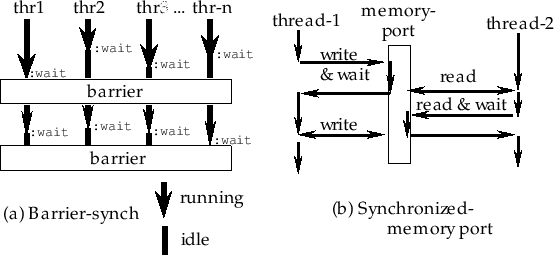

**norm2** *fltvec*[function]

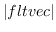

**normalize-vector** *fltvec [result]*[function]

normalizes *fltvec* to have the norm 1.0.

**distance** *fltvec1 fltvec2*[function]

returns the distance 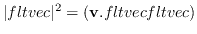
between two float-vectors.

**distance2** *fltvec1 fltvec2*[function]

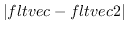

**homo2normal** *homovec &optional normalvec*[function]

A homogeneous vector *homovec* is converted to its normal
representation.

**homogenize** *normalvec &optional homovec*[function]

A normal vector *normalvec* is converted to its homogenous
representation.

**midpoint** *p p1 p2 &optional result*[function]

*P* is float, and *p1* and *p2* are float-vectors of the same dimension.
A point 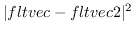, which is the point that
breaks *p1-p2* by the ratio 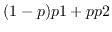, is returned.

**rotate-vector** *fltvec theta axis &optional result*[function]

rotates 2D or 3D *fltvec* by *theta* radian around *axis*. *Axis* can be
one of *:x, :y, :z, 0, 1, 2* or NIL. When *axis* is NIL, *fltvec* is
taken to be two dimensional. To rotate a vector around an arbitrary axis
in 3D space, make a rotation matrix by the **rotation-matrix** function
and multiply it to the vector.

Matrix and Transformation
-------------------------

A matrix is a two-dimensional array whose elements are all floats. In
most functions a matrix can be of any size, but the **v\*, v.\***,
**Euler-angle** and **rpy-angle** functions can only handle three
dimensional matrices. **Transform, m\*** and **transpose** do not
restrict the matrices to be square, and they operate on general n\*m
size matrices.

Functions that can accept result parameter places the computed result
there, and no heap is wasted. All matrix functions are intended for the
transformation in the normal coordinate systems, and not in the
homogeneous coordinates.

The **rpy-angle** function decomposes a rotation matrix into three
components of rotation angles around z, y and x axes of the world
coordinates. The **Euler-angle** function is similar to **rpy-angle**
but decomposes into rotation angles around local z, y and again z axes.
Both of these functions return two solutions since angles can be taken
in the opposite directions.

    ; Mat is a 3X3 rotation matrix.
    (setq rots (rpy-angle mat))
    (setq r (unit-matrix 3))
    (rotate-matrix r (car rots) :x t r)
    (rotate-matrix r (cadr rots) :y t r)
    (rotate-matrix r (caddr rots) :z t r)
    ;--> resulted r is equivalent to mat

To keep track of pairs of a position and a orientation in 3D space, use
the **coordinates** and **cascaded-coords** classes detailed in the
section [15.4](#Coordinates).

**matrix** *&rest elements*[function]

makes a new matrix from *elements*. Row x Col = (number of elements) x
(length of the 1st element). Each of *elements* can be of any type of
sequence. Each sequence is lined up as a row vector in the matrix.

**make-matrix** *rowsize columnsize &optional init*[function]

makes a matrix of 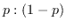.

**matrixp** *obj*[function]

T if *obj* is a matrix, i.e. *obj* is a two dimensional array and its
elements are floats.

**matrix-row** *mat row-index*[function]

extracts a row vector out of matrix *mat*. **matrix-row** is also used
to set a vector in a particular row of a matrix using in conjunction
with **setf**.

**matrix-column** *mat column-index*[function]

extracts a column vector out of *mat*. **matrix-column** is also used to
set a vector in a particular column of a matrix using in conjunction
with **setf**.

**m\*** *matrix1 matrix2 &optional result*[function]

concatenates *matrix1* and *matrix2*.

**transpose** *matrix &optional result*[function]

transposes *matrix*, i.e. columns of *matrix* are exchanged with *rows*.

**unit-matrix** *dim*[function]

makes an identity matrix of *dim* 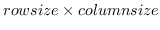 *dim*.

**replace-matrix** *dest src*[function]

replaces all the elements of dest matrix with ones of src matrix.

**scale-matrix** *scalar mat*[function]

multiplies *scaler* to all the elements of *mat*.

**copy-matrix** *matrix*[function]

makes a copy of *matrix*.

**transform** *matrix fltvector &optional result*[function]

multiplies *matrix* to *fltvector* from the left.

**transform** *fltvector matrix &optional result*[function]

multiplies *matrix* to *fltvector* from the right.

**rotate-matrix** *matrix theta axis &optional world-p result*[function]

multiplies a rotation matrix from the left (when world-p is non-nil) or
from the right (when world-p is nil). When a matrix is rotated by
**rotate-matrix**, the rotation axis **:x, :y, :z** or 0,1,2 may be
taken either in the world coordinates or in the local coordinates. If
*world-p* is specified nil, it means rotation along the axis in the
local coordinate system and the rotation matrix is multiplied from the
right. Else if worldp is non-nil, the rotation is made in the world
coordinates and the rotation matrix is multiplied from the left. If NIL
is given to *axis*, *matrix* should be two dimensional and the rotation
is taken in 2D space where *world-p* does not make sense.

**rotation-matrix** *theta axis &optional result*[function]

makes a 2D or 3D rotation matrix around *axis* which can be any of :x,
:y, :z, 0, 1, 2, a 3D float-vector or NIL. When you make a 2D rotation
matrix, axis should be NIL.

**rotation-angle** *rotation-matrix*[function]

extracts a equivalent rotation axis and angle from *rotation-matrix* and
a list of float and float-vector is returned. NIL is returned when
*rotation-matrix* is a unit-matrix. Also if the rotation angle is too
small, the result may have errors. When *rotation-matrix* is 2D, the
single angle value is returned.

**rpy-matrix** *ang-z ang-y ang-x*[function]

makes a rotation matrix defined by roll-pitch-yaw angles. First, a
unit-matrix is rotated by ang-x radian along X-axis. Next, ang-y around
Y-axis and finally ang-z around Z-axis. All the rotation axes are taken
in the world coordinates.

**rpy-angle** *matrix*[function]

extracts two triplets of roll-pitch-yaw angles of *matrix*.

**Euler-matrix** *ang-z ang-y ang2-z*[function]

makes a rotation matrix defined by three Euler angles. First, a
unit-matrix is rotated *ang-z* around Z-axis, next, *ang-y* around
Y-axis and finally *ang2-z* again around Z-axis. All the rotation axes
are taken in the local coordinates.

**Euler-angle** *matrix*[function]

extracts two tuples of Euler angles.

LU decomposition
----------------

**lu-decompose** and **lu-solve** are provided to solve simultaneous
linear equations. First, **lu-decompose** decomposes a matrix into a
lower triangle matrix and an upper triable matrix. If the given matrix
is singular, **LU-decompose** returns NIL, otherwise it returns the
permutation vector which should be supplied to **LU-solve**.
**Lu-solve** computes the solution for a LU matrix with a given constant
vector. This method is efficient if solutions for many combinations of
different constant vectors and the same factor matrix are required.
**Simultaneous-equation** would be more handy when you wish to get only
one solution. **Lu-determinant** computes a determinant of a
lu-decomposed matrix. **Inverse-matrix** function computes an inverse
matrix using **lu-decompose** once, and **lu-solve** n times.
Computation time for a 3\*3 matrix is estimated to be 4 milli-sec.

**lu-decompose** *matrix &optional result*[function]

performs lu-decomposition of *matrix*.

**lu-solve** *lu-mat perm-vector bvector [result]*[function]

solves a linear simultaneous equations which has already been
lu-decomposed. *perm-vector* should be the result returned by
**lu-decompose**.

**lu-determinant** *lu-mat perm-vector*[function]

computes the determinant value for a matrix which has already been
lu-decomposed.

**simultaneous-equation** *mat vec*[function]

solves a linear simultaneous equations whose coefficients are described
in *mat* and constant values in *vec*.

**inverse-matrix** *mat*[function]

makes the inverse matrix of the square matrix, *mat*.

**pseudo-inverse** *mat*[function]

computes the pseudo inverse matrix using the singular value
decomposition.

Coordinates
-----------

Coordinate systems and their transformations are represented by the
**coordinates** class. Instead of 4\*4 (homogeneous) matrix
representation, coordinate system in EusLisp is represented by a
combination of a 3\*3 rotation matrix and a 3D position vector mainly
for speed and generality.

**coordinates** [class]

      :super   propertied-object 
      :slots         (pos :type float-vector 
    rot :type array) 

defines a coordinate system with a pair of a position vector and a 3x3
rotation matrix.

**coordinates-p** *obj*[function]

returns T when obj is an instance of coordinates class or its
subclasses.

**:rot** [method]

returns the 3X3 rotation matrix of this coords.

**:pos** [method]

returns the 3-D position vector of this coords.

**:newcoords** *newrot &optional newpos*[method]

updates the coords with newrot and newpos. Whenever a condition that
changes the state of this coords occurs, this method should be called
with the new rotation matrix and the position vector. This message may
invoke another :update method to propagate the event. If newpos is not
given, newrot is given as a instance of coordinate class.

**:replace-coords** *newrot &optional newpos*[method]

changes the rot and pos slots to be updated without calling newcoords
method. If newpos is not given, newrot is given as a instance of
coordinate class.

**:coords** [method]

**:copy-coords** *&optional dest*[method]

If dest is not given, :copy-coords makes another coordinates object
which has the same rot and pos slots. If dest is given, rot and pos of
this coordinates is copied to the dest coordinates.

**:reset-coords** [method]

forces the rotation matrix of this coords to be identity matrix, and pos
vector to be all zero.

**:worldpos** [method]

**:worldrot** [method]

**:worldcoords** [method]

Computes the position vector, the rotation matrix and the coordinates of
this object represented in the world coordinates. The coordinates class
is always assumed to be represented in world, these method can simply
return pos, rot and self. These methods are provided for the
compatibility with cascaded-coords class which cannot be assumed to be
represented in world.

**:copy-worldcoords** *&optional dest*[method]

First, worldcoords is computed, and it is copied to dest. If no dest is
specified, a coordinates object to store the result is newly created.

**:rotate-vector** *vec*[method]

A vector is rotated by the rotation of this coords, i.e., an orientation
vector represented in this coords is converted to the representation in
the world. The position of this coords does not affect rotation.

**:transform-vector** *vec*[method]

A vector in this local coords is transformed to the representation in
the world.

**:inverse-transform-vector** *vec*[method]

A vector in the world is inversely transformed to the representation in
this local coordinate system.

**:transform** *trans &optional (wrt :local)*[method]

Transform this coords by the trans represented in wrt coords. Trans must
be of type coordinates, and wrt must be one of keywords
`:local, :parent, :world` or an instance of coordinates. If wrt is
`:local`, the trans is applied from the right to this coords, and if wrt
is `:world` or `:parent`, the trans is multiplied from the left. Else,
if wrt is of type coordinates, the trans represented in the wrt coords
is first transformed to the representation in the world, and it is
applied from the left.

**:move-to** *trans &optional (wrt :local)*[method]

Replaces the rot and pos of the coords with trans represented in wrt.

**:translate** *p &optional (wrt :local)*[method]

changes the position of this object relatively with respective to wrt
coords.

**:locate** *p &optional (wrt :local)*[method]

Changes the location of this coords with the parameter represented in
wrt. If wrt is `:local`, then the effect is identical to **:translate**
with *wrt*=`:local`.

**:rotate** *theta axis &optional (wrt :local)*[method]

Rotates this coords relatively by *theta* radian around the *axis*.
*Axis* is one of axis-keywords (`:x, :y` and `:z`) or an arbitrary
float-vector. *Axis* is considered to be represented in the *wrt*
coords. Thus, if *wrt*=`:local` and *axis*=`:z`, the coordinates is
rotated around the z axis of this local coords, and *wrt*=`:world` or
`:parent`, the coords is rotated around the z axis of world coords. In
other words, if *wrt*=`:local`, a rotation matrix is multiplied from the
right of this coords, and if *wrt*=`:world` or `:parent`, a rotation
matrix is multiplied from the left. Note that even *wrt* is either
`:world` or `:parent`, the *pos* vector of this coordinates does not
change. For the true rotation around the world axis, an instance of
coordinates class representing the rotation should be given to
**:transform** method.

**:orient** *theta axis &optional (wrt :local)*[method]

forces setting rot. This is an absolute version of :**rotate** method.

**:inverse-transformation** [method]

makes a new coords that is inverse to self.

**:transformation** *coords (wrt :local)*[method]

makes the transformation (an instance of coordinates) between this
coords and the coords given as the argument. If *wrt*=`:local`, the
result is represented in local coords, i.e., if the resulted
transformation is given as an argument to :transform with
*wrt*=`:local`, this coords is transformed to be identical with the
coords.

**:Euler** *az1 ay az2*[method]

sets rot with Euler angles, that are, rotation angles around z (*az1*, y
(*ay*) and again z *az2* axis of this local coordinates system.

**:roll-pitch-yaw** *roll pitch yaw*[method]

sets rot with roll-pitch-yaw angles: rotation angles around x (*yaw*), y
(*pitch*) and z (*roll*) axes of the world coordinate system.

**:4x4** *&optional mat44*[method]

If a matrix of 4x4 is given as *mat44*, it is converted to coordinates
representation with a 3x3 rotation matrix and a 3D position vector. If
*mat44* is not given, this coordinates is converted to 4x4 matrix
representation.

initializes this coordinates object and sets rot and pos. The meaning of
each keyword follows:

**:dimension**
  ~ 2 or 3 (default is 3)
**:pos**
  ~ specifies a position vector (defaulted to \#f(0 0 0))
**:rot**
  ~ specifies a rotation matrix (defaulted to a unit-matrix)
**:Euler**
  ~ gives a sequence of three elements for Euler angles
**:rpy**
  ~ gives a sequence of three elements for roll-pitch-yaw
**:axis**
  ~ rotation axis (:x,:y,:z or an arbitrary float-vector)
**:angle**
  ~ rotation angle (used with :axis)
**:wrt**
  ~ where the rotation axis is taken (default is :local)
**:4X4**
  ~ 4X4 matrix is used to specify both pos and rot
**:coords**
  ~ copies pos and rot from coords
**:name**
  ~ set :name property

`:Angle` can only be used in conjunction with the `:axis` that is
determined in the `:wrt` coordinates. Without regard to `:wrt`, `:Euler`
always specifies the Euler angles, *az1, ay* and *az2*, defined in the
local coordinates, and `:rpy` specifies the angles around *z*, *y* and
*x* axes of the world coordinates. Two or more of
`:rot, :Euler, :rpy, :axis` and `:4X4` cannot be specified
simultaneously, although no error is reported. Sequences can be supplied
to the `:axis` and `:angle` parameters, which mean successive rotations
around the given axes. List of pairs of an attribute and its value can
be given as `:properties` argument. These pairs are copied in the plist
of this coordinates.

CascadedCoords
--------------

**cascaded-coords** [class]

      :super   coordinates 
      :slots         (parent descendants worldcoords manager changed) 

defines a linked coordinates. **Cascaded-coords** is often abbreviated
as **c**ascoords.

**:inheritance** [method]

returns the inheritance tree list describing all the descendants of the
cascoords. If `a` and `b` are the direct descendants of this coords, and
`c` is a descendant of `a`, `((a (c)) (b))` is returned.

**:assoc** *childcoords &optional relative-coords*[method]

*childcoords* is associated to this cascoords as a descendant. If
childcoords has been already assoc'ed to some other cascoords, first
childcoords is dissoc'ed since each cascoords can have only one parent.
The orientation or location of childcoords in the world does not change.

**:dissoc** *childcoords*[method]

dissociates (removes) *childcoords* from the descendants list of this
coords. The orientation or location of childcoords in the world does not
change.

**:changed** [method]

informs this coords that the coordinates of parent has changed, and the
re-computation of worldcoords is needed when it is requested later.

**:update** [method]

is called by the **:worldcoords** method to recompute the current
worldcoord.

**:worldcoords** [method]

returns a coordinates object which represents this coord in the world by
concatenating all the cascoords from the root to this coords. The result
is held in this object and reused later. Thus, you should not modify the
resulted coords.

**:worldpos** [method]

returns rot of this coordinates represented in the world.

**:worldrot** [method]

returns pos of this coordinates represented in the world.

**:transform-vector** *vec*[method]

Regarding *vec* represented in this local coords, transforms it to the
representation in the world.

**:inverse-transform-vector** *vec*[method]

*vec* represented in the world is inversely transformed into the
representation in this local coords.

**:inverse-transformation** [method]

makes an instance of coordinates which represents inverse transformation
of this coord.

**:transform** *trans &optional (wrt :local)*[method]

**:translate** *fltvec &optional (wrt :local)*[method]

**:locate** *fltvec &optional (wrt :local)*[method]

**:rotate** *theta axis &optional (wrt :local)*[method]

**:orient** *theta axis &optional (wrt :local)*[method]

Refer to the descriptions in class **coordinates**.

**make-coords** *&key :pos :rot :rpy :Euler :angle :axis :4X4 :coords
:name*[function]

**make-cascoords** *&key :pos :rot :rpy :Euler :angle :axis :4X4 :coords
:name*[function]

**coords** *&key :pos :rot :rpy :Euler :angle :axis :4X4 :coords
:name*[function]

**cascoords** *&key :pos :rot :rpy :Euler :angle :axis :4X4 :coords
:name*[function]

All these functions make new coordinates or cascaded-coordinates. For
the keyword parameter, see **:init** method of class coordinates.

**transform-coords** *coords1 coords2 &optional (coords3
(coords))*[function]

Coords1 is applied (multiplied) to the coords2 from the left. The
product is stored in coords3.

**transform-coords\*** *&rest coords*[function]

concatenates transformations listed in *coords*. An instance of
coordinates that represents the concatenated transformation is returned.

**wrt** *coords vec*[function]

transforms *vec* into the representation in *coords*. The result is
equivalent to `(send coords :transform-vector vec)`.

Geometric Modeling
==================

EusLisp adopts *B*rep (Boundary Representation) as the internal
representation of 3D geometric models. Components in Breps are
represented by classes **edge, plane, polygon, face, hole,** and
**body**. Primitive body creating functions and body composition
functions create new instances of these classes. In order to use your
private geometric classes having more attributes, set special variables
**\*edge-class\*, \*face-class\*** and **\*body-class\*** to your class
objects.

**Figure 9:** Arrangements of vertices, edges, and faces

Miscellaneous Geometric Functions
---------------------------------

**vplus** *vector-list*[function]

returns a newly created float-vector that is the sum of all the elements
of *vector-list*. The difference from **v+** is that **vplus** computes
the sum of more than two arguments and no result vector can be
specified.

**vector-mean** *vector-list*[function]

returns the mean vector of *vector-list*.

**triangle** *a b c &optional (normal \#f(0 0 1))*[function]

*a, b, c* are float-vectors representing 2 or 3 dimensional points.
normal is the normal vector of the plane on which *a,b*, and *c* lie.
**Triangle** returns 2\*area of a triangle formed by *a,b,c*.
**Triangle** is positive if *a,b*, and *c* turn clockwise when you are
looking in the same direction as *normal*. In other words, if
**triangle** is positive, *c* locates at the left hand side of line
*a-b*, and *b* lies at the right side of *ac*.

**triangle-normal** *a b c*[function]

finds a normal vector which is vertical to the triangle defined by three
points *a,b,*and *c*.

**vector-angle** *v1 v2 &optional (normal (v\* v1 v2))*[function]

Computes an angle between two vectors, denoted by . *v1,v2* and *normal*
must be normalized vectors. When *normal* is not given, a normalized
vector commonly perpendicular to *v1* and *v2* is used, in which case
the result is always a positive angle in the range between
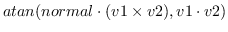 and . In order to
obtain a signed angle, *normal* must be specified explicitly.

**face-normal-vector** *vertices*[function]

Computes surface normal vector from a list of float-vectors which lie on
the same plane.

**farthest** *p points*[function]

finds the farthest point from *p* in the list of 3D float-vectors,
*points*.

**farthest-pair** *points*[function]

finds the farthest point pair in the list of 3D float-vectors, *points*.

**maxindex** *3D-floatvec*[function]

Finds the index of the absolute maximum value of three elements.

**random-vector** *&optional (range 1.0)*[function]

Generates a random vector which is distributed homogeneously in 3D
Cartesian space.

**random-normalized-vector** *&optional (range 1.0)*[function]

returns a normalized-3D random vector.

**random-vectors** *count range*[function]

returns a list of random vectors.

**line-intersection** *p1 p2 p3 p4*[function]

*p1, p2, p3* and *p4* are all float-vectors of more than two dimensions.
*p1-p2* and *p3-p4* define two lines on a plane. **line-intersection**
returns a list of two parameters of the intersection point for these two
lines. When used in three dimension, *p1, p2, p3* and *p4* must be
coplanar.

**collinear-p** *p1 p2 p3 &optional tolerance*[function]

*p1, p2, p3* are all three-dimensional float-vectors representing three
point locations. **Collinear-p** returns the parameter for *p2* on the
line *p1-p3* if  is
smaller than `*coplanar-threshold*`, otherwise NIL.

**find-coplanar-vertices** *p1 p2 p3 vlist*[function]

*p1, p2, p3* are all three-dimensional float-vectors representing a
plane. **Find-coplanar-vertices** looks for coplanar points in *vlist*
that lie on the plane.

**find-connecting-edge** *vertex edgelist*[function]

finds an edge in *edgelist* that connects to *vertex*.

**make-vertex-edge-htab** *bodfacs*[function]

*bodfacs* is a body or a list of faces. **make-vertex-edge-htab** makes
a hash-table which allows retrieving of edges connected to a vertex.

**left-points** *points p1 p2 normal*[function]

Assume *points, p1*, and *p2* lie on the plane whose normal vector is
*normal*. **Left-points** searches in *points* and collects ones lying
in the left hand side of the line passing on *p1, p2*.

**right-points** *points p1 p2 normal*[function]

Assume *points, p1*, and *p2* lie on the plane whose normal vector is
*normal*. **Right-points** searches in *points* and collects ones lying
in the right hand side of the line determined by *p1, p2*.

**left-most-point** *points p1 p2 normal*[function]

Assume *points, p1*, and *p2* lie on a plane whose normal vector is
*normal*. **left-points** searches in *points* which lie in the
left-hand side of the line determined by *p1, p2* and returns the
farthest one.

**right-most-point** *points p1 p2 normal*[function]

Assume *points, p1*, and *p2* lie on a plane whose normal vector is
*normal*. **right-most-point** searches in *points* which lie in the
right-hand side of the line determined by *p1, p2* and returns the
farthest one.

**eps=** *num1 num2 [(tolerance \*epsilon\*)]*[function]

compares two float numbers *num1* and *num2* for equality with the
tolerance of **\*epsilon\***.

**eps** *num1 num2 [(tolerance
\*epsilon\*)]*[function]

returns T if 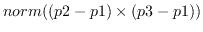 is apparently less than
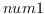, i.e. .

**eps** *num1 num2 [(tolerance
\*epsilon\*)]*[function]

returns T if  is possibly less than or equal
to , i.e. .

**eps** *num1 num2 [(tolerance
\*epsilon\*)]*[function]

returns T if  is apparently greater than
, i.e. .

**eps** *num1 num2 [(tolerance
\*epsilon\*)]*[function]

returns T if  is possibly greater than or
equal to , i.e. .

**bounding-box** [class]

      :super   object 
      :slots         (minpoint maxpoint) 

defines a minimal rectangular-parallel-piped which is bounded by the
planes parallel to xy-, yz- and zx-planes. **Bounding-box** can be used
in any dimension according to the dimension of vectors given at the
initialization. Bounding-box had been defined by the name of
surrounding-box.

**:box** [method]

returns this bounding-box object itself.

**:volume** [method]

returns the volume of this bounding box.

**:grow** *rate*[method]

increases or decreases the size of this box by the *rate*. When *rate*
is 0.01, the box is enlarged by 1%.

**:inner** *point*[method]

returns T if *point* lies in this box, otherwise nil.

**:intersection** *box2 &optional tolerance*[method]

returns the intersectional bounding box of this box and *box2*. If
*tolerance* is given, the box is enlarged by it. If there is no
intersection, NIL is returned.

**:union** *box2*[method]

returns the union of bounding box of this box and *box2*.

**:intersectionp** *box2*[method]

returns T if this box has the intersection with the *box2*, NIL
otherwise. This method is faster than **:intersection** because no new
instance of bounding-box is created.

**:extreme-point** *direction*[method]

returns one of the eight corner points yielding the largest dot-product
with *direction*.

**:corners** [method]

returns the list of all vertices of this box. If this box defines 2D
bounding-box, then 4 points are returned, 3D, 8, and so on.

**:below** *box2 &optional (direction \#(0 0 1)*[method]

returns T if this box is below *box2* in *direction*. This is used to
check whether two box intersects when this box is moved toward
*direction*.

**:body** [method]

returns a body object that represents a cube bounded by this box.

**:init** *vlist &optional tolerance*[method]

sets minpoint and maxpoint slots looking in *vlist*. If tolerance
(float) is specified, the box is grown by the amount.

**make-bounding-box** *points [tolerance]*[function]

finds the minimum and maximum coordinates in the list of *points*, and
make an instance of `bounding-box`.

**bounding-box-union** *boxes [tolerance
\*contact-threshold\*]*[function]

makes an instance of the surrounding-box representing the union of
*boxes*. The resulted box is expanded by the *tolerance*.

**bounding-box-intersection** *boxes [tolerance
\*contact-threshold\*]*[function]

makes an instance of the surrounding-box representing the intersection
of *boxes*. The resulted box is expanded by the *tolerance*.

Line and Edge
-------------

The direction of the vertex loop or the edge loop is defined so that the
vertices or edges are arranged in the counter-clockwise order when the
body is observed from outside. *Pvertex* and *nvertex*, and *pface* and
*nface* are determined so that an edge is oriented from *pvertex* toward
*nvertex* when *pface* is located at the left of the edge observing them
from outside.

**line** [class]

      :super   propertied-object 
      :slots         ((pvert :type float-vector)(nvert :type float-vector)) 

defines a line passing on pvert and nvert. The line is directed from
*pvert* to *nvert* in the parametric representation: .

**:vertices** [method]

returns the list of *pvert* and *nvert*.

**:point** *p*[method]

returns a three dimensional float-vector that corresponds to the *p*
parameter on this line. 

**:parameter** *point*[method]

Computes the parameter for *point* on this line. This is the inverse
method of `:point`.

**:direction** [method]

returns a normalized vector from **pvert** to **nvert**.

**:end-point** *v*[method]

returns the other end-point of this line, i.e. if *v* is *eq* to
`pvert`, `nvert` is returned, if *v* is *eq* to `nvert`, `pvert` is
returned, otherwise NIL.

**:box** [method]

creates and returns a **bounding-box** of this line.

**:boxtest** *box*[method]

checks intersection between *box* and the bounding-box of this line.

**:length** [method]

returns the length of this line.

**:distance** *point-or-line*[method]

returns the distance between the *point-or-line* and this line. If the
foot of the vertical line from the *point* to this line does not lie
between pvertex and nvertex, the distance to the closest end-point is
returned. Using this method to calculate the distance between two lines,
interference between two cylinders can be tested.

**:foot** *point*[method]

finds the parameter for the point which is the foot of the vertical line
from *point* to this line.

**:common-perpendicular** *l*[method]

finds the line which is vertical both to this line and to *l* and
returns a list of two 3D float-vectors.

**:project** *plane*[method]

returns a list of two points that are the projection of pvert of nvert
onto *plane*. When two lines are in parallel and a common perpendicular
line cannot be determined uniquely, `parallel` is returned.

**:collinear-point** *point &optional (tolerance
\*coplanar-threshold\*)*[method]

checks whether *point* is collinear to this line with the tolerance of
*tolerance* using **collinear-p**. If *point* is collinear to this line,
the parameter for the point on the line is returned, otherwise NIL.

**:on-line-point** *point &optional (tolerance
\*coplanar-threshold\*)*[method]

checks whether the *point* is collinear to this line, and the *point*
lies on the part of the line between *pvert* and *nvert*.

**:collinear-line** *ln &optional (tolerance
\*coplanar-threshold\*)*[method]

checks if *ln* is collinear to this line, i.e. if the two end-points of
*ln* lie on this line. T or NIL is returned.

**:coplanar** *ln &optional (tolerance \*coplanar-threshold\*)*[method]

checks if this line and *ln* are coplanar. Two end-points of this line
and one end-point of *ln* defines a plane. If another end-point of *ln*
is on the plane, T is returned, otherwise NIL.

**:intersection** *ln*[method]

*ln* is a line coplanar with this line. **:Intersection** returns a list
of two parameters for the intersection point of these two lines. A
parameter may be any float number, but a parameter between 0 and 1 means
an actual intersection on the line segmented by two end-points. NIL if
they are in parallel.

**:intersect-line** *ln*[method]

*ln* is a line coplanar with this line. Two parameters of the
intersecting point is returned along with symbolic information such as
`:parallel, :collinear,` and `:intersect`.

**edge** [class]

      :super   line 
      :slots         (pface nface 
    (angle :type float) 
    (flags :type integer)) 

represents an edge defined as the intersection between two faces. Though
*pface* and *nface* are statically defined in the slots, their
interpretations are relative to the direction of this edge. For example,
*pface* represents the correct pface when this edge is considered to
goes from *pvert* toward *nvert*. So, pvert and nvert in your
interpretation must be given to the **:pface** and **:nface** methods to
select the appropriate face.

**make-line** *point1 point2*[function]

creates an instance of **line** whose pvert is *point1* and nvert is
*point2*.

**:pvertex** *pf*[method]

returns pvertex when *face* is regarded as the pface of this edge.

**:nvertex** *face*[method]

returns nvertex regarding *face* as the pface of this edge.

**:body** [method]

returns the body object that defines this edge.

**:pface** *pv nv*[method]

returns pface when the *pv* and *nv* are interpreted as the virtual
pface and nface of this edge, respectively.

**:nface** *pv nv*[method]

returns nface when the *pv* and *nv* are interpreted as the virtual
pface and nface of this edge, respectively.

**:binormal** *aface*[method]

finds the direction vector which is perpendicular both to this line and
to the normal of *aface*.

**:angle** [method]

returns the angle between two faces connected with this edge.

**:set-angle** [method]

computes the angle between two faces connected with this edge and stores
it in the angle slot.

**:invert** [method]

**:set-face** *pv nv f*[method]

sets the *f* face as a pface regarding *pv* as the pvertex and *nv* as
the nvertex. Note that this may change either pface or nface of this
edge.

**:contourp** *viewpoint*[method]

T if this is a contour edge, i.e., either pface or nface of this edge is
visible and the other is invisible from *viewpoint*.

**:approximated-p** [method]

T if this edge is an approximated edge representing curved surface like
the side of a cylinder. Approximated edges are needed to represent
curves by segmented straight lines.

**:set-approximated-flag** *&optional (threshold 0.7)*[method]

In EusLisp, every curved surface is approximated with many planar faces.
The LSB of `flags` is used to indicate that the faces on the both sides
of this edge are curved faces. **:set-approximated-flag** sets this flag
to T, if the angle between two faces is greater than *threshold*.

**:init** *&key :pface :nface :pvertex :nvertex*[method]

Plane and Face
--------------

A plane object is represented by the normal vector on the plane and the
distance from the coordinates origin to the plane. Two pairs of such
normal vectors and distances are recorded in a plane object. One
represents the current status after transformations, while the other
represents the original normal and distance when the plane is defined.

**plane** [class]

      :super   propertied-object 
      :slots         ((normal :type float-vector) 
    (distance :float) 

defines plane-equation. A plane is considered to have no boundaries and
extend infinitely.

**:normal** [method]

returns this polygon's normal vector which is always normalized.

**:distance** *point*[method]

computes distance between this plane and *point*.

**:coplanar-point** *point*[method]

returns T if *point* lies on this plane.

**:coplanar-line** *line*[method]

returns T if *line* lies on this plane.

**:intersection** *point1 point2*[method]

computes the intersection point between this plane and the line
determined by two end points, *point1* and *point2*, and returns the
parameter for the intersection on the line. If the line and this plane
are parallel, **:parallel** is returned.

**:intersection-edge** *edge*[method]

Returns the parameter of the intersection point for this plane and a
line represented by point1 and point2, or edge.

**:foot** *point*[method]

Returns a 3D vector which is the orthogonally projection of *point* onto
this plane.

**:init** *normal point*[method]

Defines a plane with the *point* on the plane and the *normal* vector.
*Normal*must be a normalized vector, .

**polygon** [class]

      :super   plane 
      :slots         (convexp edges vertices 
    (model-normal float-vector) 
    (model-distance :float))

**Polygon** represents a loop on a plane. *Convexp* is a boolean flag
representing the convexity of the loop. *Edges* is a list of edges
forming the contour of this loop, and *vertices* is a list of vertices.

**:box** *&optional tolerance*[method]

returns a bounding-box for this polygon.

**:boxtest** *box2 &optional tolerance*[method]

makes a bounding-box for this polygon, and returns the intersection of
the bounding-box and *box2*. If there is no intersection, NIL is
returned.

**:edges** [method]

returns the list of edges (circuit) of this polygon. The list is ordered
clockwise when the polygon is viewed along the normal vector of this
plane. If you think of the normal vector as a screw, the edges are
ordered in the rotation direction for the screw to screw in. When
polygon or face is used for the surface representation of a solid
object, the normal vector is directed to its outside region. When a
polygon is viewed from the outside of the object, edges are ordered
counter-clockwise.

**:edge** *n*[method]

returns the *n*-th element of edges.

**:vertices** [method]

returns the vertices of this polygon ordered in the same manner as
edges. Note that the first vertex is copied duplicatedly at the end of
the list and the list is always longer by one than the actual number of
vertices. This is for the ease of edge traversal by using the vertices
list.

**:vertex** *n*[method]

returns the *n*-th element of vertices.

**:insidep** *point &optional (tolerance \*epsilon\*)*[method]

returns :inside, :outside or :border according to the location of
*point* relative to this region.

**:intersect-point-vector** *point vnorm*[method]

Computes the intersection with the semi-line defined by the *point* and
the normalized direction vector, *vnorm*.

**:intersect-line** *p1 p2*[method]

Computes intersection point with a line specified by *p1* and *p2*. The
result is nil(no intersection) or list of the parameter and the
intersection position.

**:intersect-edge** *edge*[method]

Computes intersection point with a line specified by the *edge*. The
result is nil(no intersection) or list of the parameter and intersection
position.

**:intersect-face** *aregion*[method]

Returns T if this region intersects with aregion.

**:transform-normal** [method]

**:reset-normal** [method]

recomputes the surface normal vector of this polygon from the current
*vertices* list.

**:invert** [method]

**:area** [method]

returns the area of this polygon.

**:init** *&key :vertices :edges :normal :distance*[method]

**face** [class]

      :super   polygon 
      :slots         (holes mbody primitive-face id) 

defines a face which may have holes. *Pbody* and *type* represent the
primitive body and the type `(:top, :bottom, :side)` of the face in the
body.

**:all-edges** [method]

**:all-vertices** [method]

Returns all the edges or vertices of the contour of this face and all
the inner loops (holes). Note that **:edges** and **:vertices** methods
only return edges and vertices composing the contour.

**:insidep** *point*[method]

decides whether the point is inside of this face or not. If the point is
inside the outer contour of this face but also inside the loop of any
holes, it is classified as outside.

**:area** [method]

returns the area of this face, that is the area surrounded by external
edges subtracted by the areas of holes.

**:centroid** *&optional point*[method]

returns a list of the floating-point number and the float-vector
representing the center-of-gravity of this face. If *point* is not
given, the first number represents the area of this polygon, and the
second float-vector the location of center-of-gravity of this polygon.
If *point* is given, it is taken as the top vertex of the cone whose
bottom face is formed by this polygon, and the volume of this cone and
its center-of-gravity are returned.

**:invert** [method]

flips the direction of this face. The normal vector is inverted, and the
order of edge loop is reversed.

**:enter-hole** *hole*[method]

adds a hole in this face.

**:primitive-body** [method]

returns the primitive-body which has defined this face.

**:id** [method]

returns one of `(:bottom), (:top)` and `(:side seq-no.)`.

**:face-id** [method]

returns a list of the type of primitive-body and the face type. For
example, a side face of a cylinder returns
`((:cylinder radius height segments) :side id)`.

**:body-type** [method]

returns primitive body which has defined this face.

**:init** *&key :normal :distance :edges :vertices :holes*[method]

**hole** [class]

      :super   polygon 
      :slots         (myface) 

hole is a polygon representing an inner loop of a face. A face may have
a list of holes in its `holes` slot.

**:face** [method]

returns a face that contains this hole.

**:enter-face** *face*[method]

makes a link to a face which surrounds this hole. This method is only
used in conjunction with the `:enter-hole` method of the face class.

**:init** *&key :normal :distance :edges :vertices :face*[method]

Body
----

**body** [class]

      :super   cascaded-coords 
      :slots         (faces edges vertices model-vertices box convexp evertedp csg) 

defines a three dimensional shape.

**:magnify** *rate*[method]

changes the size of this body by *rate*. Magnification is recorded in
csg list.

**:translate-vertices** *vector*[method]

translates model-vertices. *Vector* should be given in the local
coordinates. Translation is recorded in csg list.

**:rotate-vertices** *angle axis*[method]

rotates model-vertices *angle* radian around *axis*. Rotation is
recorded in csg list.

**:reset-model-vertices** [method]

**:newcoords** *rot &optional pos*[method]

changes coordinates. If pos is not given, rot is given as a instance of
coordinate class.

**:vertices** [method]

returns the list of all vertices of this body.

**:edges** [method]

returns the list of all edges of this body.

**:faces** [method]

returns the list of all the faces composing this body.

**:box** [method]

returns the bounding-box of this body.

**:Euler** [method]

calculates Euler number of this body, that is . This should equal to .

**:perimeter** [method]

returns the sum of length of all the edges.

**:volume** *&optional (reference-point \#f(0 0 0))*[method]

returns the volume of this body.

**:centroid** *&optional (point \#f(0 0 0)*[method]

returns the location of center-of-gravity assuming that this body is
homogeneously solid.

**:possibly-interfering-faces** *box*[method]

**:common-box** *body*[method]

Returns common minimal box for this body and another body. If there is
interference between two bodies, the intersection must exist in this
common-box.

**:insidep** *point*[method]

returns **:inside** if *point* resides in this body, **:border** if
*point* lies on a surface of this body, and **:outside** otherwise.

**:intersect-face** *face*[method]

returns T if there is an interference between the faces of this body and
*face*.

**:intersectp** *body*[method]

Checks intersection with another body.

**:evert** [method]

reverse the directions of all the faces and edges so that the inside of
this body becomes outside.

**:faces-intersect-with-point-vector** *point direction*[method]

collects all faces that intersect with a vector casted from *point*
towards em direction.

**:distance** *target*[method]

*target* may either be a float-vector or a plane object. **:distance**
finds the closest face from *target* and returns a list of the face and
the distance.

**:csg** [method]

returns csg body construction history.

**:primitive-body** [method]

returns a list of primitive bodies which have constructed this body.

**:primitive-body-p** [method]

T if this body is a primitive body created by one of functions listed in
[16.5](#primitive-body-creation).

**:creation-form** [method]

returns a Lisp expression to create this body.

**:body-type** [method]

returns a list of creation parameters if this body is a primitive body,
or an expression indicating this body is a complex (composed) body.

**:primitive-groups** [method]

returns a list of two elements. The first is a list of primitive bodies
that is added (body+) to compose this body. The latter is a list of
subtracted primitive-bodies.

**:get-face** *body [face [id]]*[method]

*body* is an instance of body that has composed this body, one of
primitive-body types such as :cube, :cylinder, :prism, :cone,
:solid-of-revolution, etc., or nil. If neither *face* nor *id* is given,
all the faces that matches *body* is returned. If *face* is given,
further filtering is performed. *face* must be one of `:top, :bottom`
and `:side`. `(send abody :get-face :cylinder :top)` returns all the top
faces of cylinders that compose `abody`. If *face* is `:side`, you can
pick up faces that are numbered as *id*. `(send abody nil :side 2)`
returns all the third (id begins from zero) side faces for any
primitive-type bodies.

**:init** *&key :faces :edges :vertices*[method]

initializes this body from *:faces*. *:face* is a required argument.
Since face, edge and vertex must maintain consistent relation to define
a complete solid model, it is meaningless to call this method with
inconsistent arguments. In order to create bodies, use the primitive
body creating functions described in section
[16.5](#primitive-body-creation) and the body composition functions in
section [16.6](#BodyComposition).

Primitive Body Creation
-----------------------

**make-plane** *&key normal point distance*[function]

Makes a plane object which is oriented to *normal*, and passes *point*.
Instead of giving *point*, *distance* can be specified.

**\*xy-plane\*** [variable]

**\*yz-plane\*** [variable]

**\*zx-plane\*** [variable]

**Figure 10:** primitive bodies

**make-cube** *xsize ysize zsize &key name color*[function]

makes a cuboid whose sizes in x, y and z directions are *xsize, ysize*
and *zsize*. The coordinates origin of this cuboid locates at the center
of the body.

**make-prism** *bottom-points sweep-vector &key name color*[function]

Makes a prism by lifting the shape defined by *bottom-points* along
*sweep-vector*. If the *sweep-vector* is a number, not a float-vector,
it is taken as the height of the prism in the 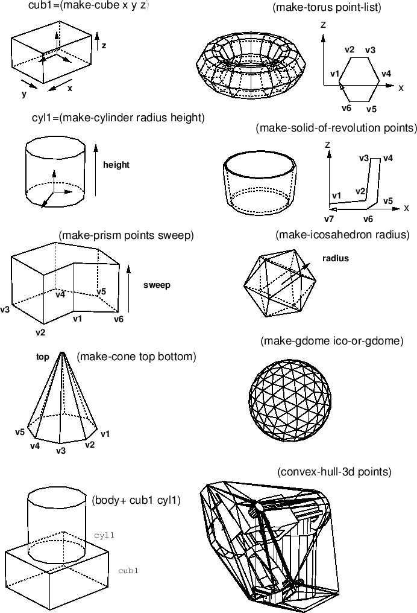
direction. Bottom points must be ordered as they define the bottom face
of the body. For example, (make-prism '(\#f(1 1 0) \#f(1 -1 0) \#f(-1 -1
0) \#f(-1 1 0)) 2.0) makes a cube of height 2.0.

**make-cylinder** *radius height &key (segments 12) name
color*[function]

Makes a cylinder with specified *radius* and *height*. The bottom face
is defined on xy-plane and the coordinates origin is located at the
center of the bottom face.

**make-cone** *top bottom &key (segments 16) color name*[function]

makes a cone body whose summit is the *top* and bottom face is the
*bottom*. *Top* is a 3D float-vector. *Bottom* is either a list of
vertices of the bottom face or a radius (scalar). If it is the vertices
list, it is order sensitive. (make-cone \#f(0 0 10) (list \#f(10 0 0)
\#f(0 10 0) \#f(-10 0 0) \#f(0 -10 0))) makes a cone of a square bottom.

**make-solid-of-revolution** *points &key (segments 16) name
color*[function]

*Points* are revolted along z-axis in the clock wise direction. If two
end points in the *points* list do not lie on z axis, those points make
circular faces. Thus,
`(make-solid-of-revolution '(#f(0 0 1) #f(1 0 0)))` makes a cone, and
`(make-solid-of-revolution '(#f(1 0 1) #f(1 0 0)))` makes a cylinder.
The *points* are order-sensitive, and are expected to be arranged from
higher  coordinate to lower
.

**make-torus** *points &key (segments 16) name color*[function]

makes a torus, a donuts like object. *Points* is a list of vertices on a
cross-section.

**make-icosahedron** *&optional (radius 1.0)*[function]

Makes a regular body of twenty faces. Each face is a regular triangle.

**make-dodecahedron** *&optional (radius 1.0)*[function]

Makes a regular body of twelve faces. Each face is a regular pentagon.

**make-gdome** *abody*[function]

By subdividing triangle faces of abody into four subfacets, makes a
geodesic dome as a new body. Abody should be an icosahedron initially,
and then the result of make-gdome can be given to make-gdome
recursively. At each call, the number of faces of the Gdome increases by
the factor of four, i.e. 20, 80, 320, 1280, 5120, etc.

    (setq g0 (make-icosahedron 1.0))    ; 20 facets
    (setq g1 (make-gdome g0))       ; 80 facets
    (setq g2 (make-gdome g1))       ; 320 facets
    ...

**grahamhull** *vertices &optional (normal \#f(0 0 1))*[function]

Computes convex-hull for 2D points by Graham's algorithm. Slower than
quickhull.

**quickhull** *vertices &optional (normal \#f(0 0 1))*[function]

Computes convex-hull for 2D points by the binary search method.

**convex-hull-3d** *vertices*[function]

Computes convex-hull for 3D points by gift-wrapping method.

**make-body-from-vertices** *vertices-list*[function]

creates a body from lists of vertices each of which define a loop of a
face in the consistent order.

Body Composition
----------------

**face+** *face1 face2*[function]

**face\*** *face1 face2*[function]

*face1* and *face2* are coplanar faces in 3D space. **face+** composes
union of these faces and returns a face object. If there is no
intersection, original two faces are returned. **face\*** returns
intersection of these faces. If there is no intersection, NIL is
returned.

**cut-body** *body cutting-plane*[function]

Cuts a body by the *cutting-plane* and returns a list of faces made at
the cross-section.

**body+** *body1 body2 &rest more-bodies*[function]

**body-** *body1 body2*[function]

**body\*** *body1 body2*[function]

Computes join, difference or intersection of two or more bodies. Each
body is copied before each **body+, body-** and **body\*** operation,
and original bodies are unchanged. The new coordinates of the resulted
body is located and oriented at the same location and orientation as the
world coordinates. Even when two bodies are touching face by face, these
functions are expected to work correctly if threshold parameters
`*coplanar-threshold*, *contact-threshold*,` and `*parallel-threshold*`
are properly set. However, if a vertex of a body is in contact with an
edge or a face of the other body, any composition operation fails.

**body/** *body plane*[function]

Cut the body by a plane which is an instance of class plane (made by
**make-plane**). A newly created body is returned.

**body-interference** *&rest bodies*[function]

Checks interference between each one-to-one combination in *bodies*.
Returns a list of two bodies that are intersecting.

Coordinates-axes
----------------

Class coordinates-axes defines 3D coordinates-axes drawable on a screen.
Each axis and an arrow at the tip of z-axis are defined by line objects.
Since the coordinates-axes class inherits cascaded-coords, a
coordinates-axes object can be attached to another cascaded-coords
originated object such as a body. This object is used to see the
coordinates-axes of a body or a relative coordinates to another
coordinates.

\
 **coordinates-axes** [class]

      :super   cascaded-coords 
      :slots         (size model-points points lines) 

Defines drawable 3-D coordinates-axes.

Bodies in Contact
-----------------

The method and functions described in this subsection require
**contact/model2const.l, contact/inequalities.l, contact/drawconst.l**.

**body** [class]

      :super   object 
      :slots         () 

defines a three dimensional shape.

**:constraint** *b*[method]

returns self's constraint when self is in contact with *b*.

**constrained-motion** *c*[function]

returns the possible motions which satisfy the constraint *c*.

**constrained-force** *m*[function]

returns the force which is applicable from the constrained body to the
constraining body.

**draw-constraint** *c*[function]

draws the constraint *c*.

**draw-motion** *m a b*[function]

draws the possible motions of *a* in contact with *b*. Type the return
key for drawing.

Example

    ;;
    ;;      peg in a hole with 6 contact points
    ;;
    (in-package "GEOMETRY")
    (load "view")
    (load "../model2const.l" :package "GEOMETRY")
    (load "../inequalities.l" :package "GEOMETRY")
    (load "../drawconst.l" :package "GEOMETRY")

    (setq x (make-prism '(#f(50 50 0) #f(50 -50 0) #f(-50 -50 0) #f(-50 50 0))
                        #f(0 0 200)))
    (setq x1 (copy-object x))
    (send x1 :translate #f(0 0 -100))
    (send x1 :worldcoords)
    (setq a1 (make-prism '(#f(100 100 -150) #f(100 -100 -150)
                           #f(-100 -100 -150) #f(-100 100 -150))
                         #f(0 0 150)))
    (setq ana (body- a1 x1))
    (send x :translate #f(0 -18.30127 -18.30127))
    (send x :rotate -0.523599 :x)
    (send x :worldcoords)

    (setq c (list (send x :constraint ana)))
    (setq m (constrained-motion c))
    (setq f (constrained-force m))

    (hidd x ana)
    (draw-constraint c)
    (draw-motion m)

The following figures shows examples of constraints. The small arrows in
the figures designate the constraints for the pegs.

**Figure 11:** Constraints for a peg in a hole.

The following figures shows an example of the possible motions of a peg
in a hole. The example corresponds to the above program.

**Figure 12:** Possible motions of a peg in a hole

Voronoi Diagram of Polygons
---------------------------

*Author: Philippe PIGNON, ETL Guest Researcher*

The program is written in COMMON LISP. I used the method of Fortune, "A
sweepline algorithm for Voronoi diagrams", in Proceedings of the 2nd
Annual ACM symposium on computational geometry, 1986, 313-322. I adapted
it to the polygonal case. This is a sample file with short explanations
This program was written under Electrotechnical EUSLISP environment, so
graphic connections are provided for it. However, you can use it with
any COMMON-LISP; you'll then have to write your own display functions to
replace those given in utilities.l file (see below)

**PURPOSE:** Computation of the voronoi diagram of a set of polygons.
Please read the above quoted reference to understand the vocabulary and
method used. No explanations about the program itself will be given
here.

**INPUT:** A list of polygons coordinates plus an enclosing frame.

    DATA= (
           (x11 y11 x12 y12 x13 y13 ...) first polygon,
                                         counterclocwise enumeration of vertices
           (x21 y21 x22 y22 x23 y23 ...) second polygon
                   ... 
           (xn1 yn1 xn2 yn2 xn3 yn3 ...) nth polygon
             
           (xf1 yf1 xf2 yf2 xf3 yf3 xf4 yf4) enclosing frame
          )

Enclosing frame can occur anywhere in data, and should be clockwise
enumerated for outside-inside marking consistency (see below). Polygons
must be simple, non intersecting. Aligned or flat edges are not
accepted. Neither are isolated points or segments.

**OUTPUT:** \*diagram\*: a list of doubly connected edges list (cf
utilities.l file). Each edge is a symbol, with property list including
the following fields:

    (start <pointer to a vertex>)
           (end <pointer to a vertex>)
           (pred <pointer to an edge>)
           (succ <pointer to an edge>)
           (left <pointer to a site>)
           (right <pointer to a site>)
           (type <:endpoint or :point-point or :segment-segment or :point-segment>)
           (outflag <t or nil>)

A 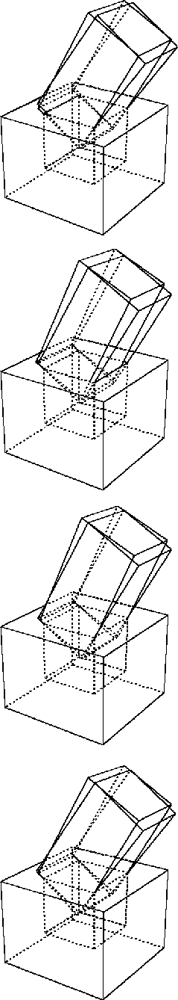 is a symbol whose property list contains
the field "pos". This field itself contains a cons , (real) planar coordinates of the vertex.
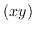 and 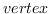 field give
counterclockwise predecessor and successor according to the dcel
formalism (see Shamos and Preparata, Computational Geometry: An
introduction, 1985, pp 15-17). A  is also a
symbol, whose property list also contains relevant information. Sites
describe original input data; they can be of type :point (a polygon
vertex) or segment (a polygon edge).

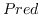 is the gender of the bisector, determined by
the type of the sites it separates. By convention, outside is the right
side of a start-end edge. The voronoi diagram computes ouside as well as
inside bisectors. Sort on outflag to keep the ones you want.

**pv** *data*[function]

Compute the Voronoi diagram of polygons from the
 with the above format.

**SAMPLE:** In order to run the program on a short sample, please
perform the following steps: 0- Copy the following files in your
environment:

  -------------------- ----------------------------------------------------------
  utilities.l          Geometric utility functions, plus EUSX graphic functions
  polygonalvoronoi.l   The program.
  testdata.l           Demonstration data, with the above format.
  -------------------- ----------------------------------------------------------

1- If you do not use EUS, edit the utilities.l file and modify the
"compatibility package" according to the instructions. 2- Compile and/or
load the following 3 files:

  -------------------- -------------------------------------------------------------
  utilities.l          
  polygonalvoronoi.l   
  testdata.l           This file contains demonstration data,with the above format
  -------------------- -------------------------------------------------------------

3- (pv demoworld) run the program on demonstration data. The global
variable \*diagram\* contains the bisectors of the voronoi diagram.

Under EUSX only (eus with XWindow interface), do the following to
display the resulting diagram:

           (make-display)          ;;Initializes the *display* window object
           (dps demoworld *thick*) ;; Shows original data in thick lines
           (dbs *diagram*)         ;; Shows the result

Viewing and Graphics
====================

Viewing
-------

A viewing object manages viewing coordinate system whose origin is
located at the position of a virtual camera, *-z* axis is oriented to
the objects observed, and xy-plane is the projection screen. Since
viewing inherits class cascaded-coords, it accepts coordinates
transformation message such as **:translate, :rotate** and
**:transform**. Also, it can be attached to another object derived from
cascaded-coords, allowing the simulation of the camera-on-mobile-object
system. The main purpose of viewing is to transform vectors represented
in the world to the camera coordinates system. The transformation is
taken in the opposite direction against usual coordinate transformation
where vectors in the local coordinates are transformed into the
representation in the world. Therefore, viewing holds the inversed
left-handed transformation in the viewcoords slot, which is usually
referred as the viewing coordinate system.

**Figure 13:** viewing coords and projection planes

**viewing** [class]

      :super   cascaded-coords 
      :slots         (viewcoords) 

defines the viewing transformation.

**:viewpoint** [method]

returns the position vector of the origin of this viewing.

**:view-direction** [method]

returns the vector from the origin of the viewing to the center of
screen. This is the z-axis direction of the viewing coordinates.

**:view-up** [method]

returns y-axis vector of this viewing represented in the world coords.
Y-axis is the upward direction in the viewport.

**:view-right** [method]

returns x-axis vector of this viewing represented in the world coords.
X-axis is in horizontal direction to the right in the viewport.

**:look** *from &optional (to \#f(0 0 0))*[method]

**:look** conveniently sets the viewing coords as the eye is located at
*from* and looking at *to* point.

Since viewing inherits cascaded-coords, all the *:init* parameters such
as *:pos*, *:rot*, *:Euler*, *:rpy*, etc. can be used to specify the
location and the orientation of the viewing coordinates. However,
viewing's *:init* provides easier way to determine the rotation. If only
*:target* is given, view-line (-z axis) is determined to pass the
viewpoint and *:target* point, and the *:view-right* vector is
determined so that the x-axis is parallel to the xy-plane of the world
coordinates. You may specify *:view-direction* instead of *:target* to
get the same effect. If you give *:view-up* or *:view-right* parameter
in addition to *:target* or *:view-direction*, you can determine all the
three rotation parameters by yourself.

Projection
----------

Class **parallel-projection and perspective-projection** process
projection transformation, which is represented with a 4X4 matrix, i.e.,
the transformation is taken in the three dimensional homogeneous
coordinates. Class **projection** is an abstract class for both of
these. Since these projection classes inherit the viewing class, two
coordinates transformation, world-to-viewing and projection can be
performed at the same time. By sending the `:project3` message with a 3D
vector to a projection object, a float-vector of four elements is
returned. **Homo2normal** function is used to convert this homogeneous
vector to the normal representation. The result is a vector represented
in so called normalized device coordinates (NDC), in which a visible
vector ranges within -1 to 1 in each of x,y, and z dimensions. For the
simulation of real cameras in a robot world, the perspective projection
is used more often than the parallel-projection. Perspective-projection
defines a few more parameters. `Screenx` and `screeny` are the sizes of
the window on the viewing plane on which observed objects are projected,
and with the larger screen, the wider space is projected. `Viewdistance`
which defines the distance between the viewpoint and the viewplane also
concerns with the viewing angle. The larger viewdistance maps the
smaller region to the window on the view plane. `Hither` and `yon`
parameters determine the distance to the front and back depth clipping
planes. Objects outside these two planes are clipped out. Actually, this
clipping procedure is performed by the viewport object.

**projection** [class]

      :super   viewing 
      :slots         (screenx screeny hither yon projection-matrix) 

defines projection transformation with a 4x4 matrix.

**:projection** *&optional pmat*[method]

if *pmat* is given, it is set to the *projection-matrix* slot.
**:projection** returns the current 4x4 projection matrix.

**:project** *vec*[method]

*Vec* is a three-dimensional homogeneous float-vector of four elements.
*Vec* is transformed by projection-matrix, and the resulted homogeneous
representation is returned.

**:project3** *vec*[method]

*Vec* is a normal 3D float-vector. *Vec* is homogenized and transformed
by projection-matrix, and the resulted homogeneous representation is
returned.

**:view** *vec*[method]

applies viewing transformation and projection transformation to *vec*
successively. The resulted homogeneous representation is returned.

**:screen** *xsize (&optional (ysize xsize))*[method]

changes the size of the viewing screen. The larger the size, the wider
view you get.

**:hither** *depth-to-front-clip-plane*[method]

determines the distance from the viewpoint to the front-clipping plane.
Objects before the front-clipping (hither) plane are clipped out.

**:yon** *depth-to-back-clip-plane*[method]

changes the distance between the viewpoint and the back-clipping plane.
Objects behind the back-clipping (yon) plane are clipped out.

**:aspect** *&optional ratio*[method]

Aspect ratio is the ratio between screen-y and screen-x. If *ratio* is
given, the aspect ratio is changed by setting screen-y to screen-x \*
*ratio*. **:aspect** returns the current aspect ratio.

initializes viewing and projection.

**parallel-viewing** [class]

      :super   projection 
      :slots         () 

defines parallel projection. **Hid** (the hidden-line elimination
function) cannot handle parallel projection.

**:make-projection** [method]

**perspective-viewing** [class]

      :super   projection 
      :slots         (viewdistance) 

defines a perspective projection transformation.

**:make-projection** [method]

**:ray** *u v*[method]

returns the normalized direction-vector pointing (u,v) on the normalized
screen from the viewpoint.

**:viewdistance** *&optional vd*[method]

Viewdistance is the distance between viewpoint and the screen. If *vd*
is given, it is set to viewdistance. The viewdistance corresponds to the
focal length of a camera. The greater the viewdistance, the more
zoomed-up view you get. **:viewdistance** returns the current
viewdistance.

**:view-angle** *&optional ang*[method]

set screen size so that the prospective angle of the diagonal of the
screen becomes *ang* radian. Note that angles somewhat between 20 degree
(approx. 0.4 rad.) and 50 degree (0.9 rad.) can generate a natural
perspective view. Wider angle generates a skewed view, and narrower a
flat view like orthogonal (parallel) viewing. **:view-angle** returns
current or new view angle in radian.

**:zoom** *&optional scale*[method]

If *scale* is given, the screen is changed relatively to the current
size by *scale* (the viewdistance is unchanged). If you give 0.5 for
*scale*, you get two times as wide view as before. **:zoom** returns new
view angle in radian.

**:lookaround** *alfa beta*[method]

translates and rotates the viewpoint. The center of rotation is taken at
the midst of the hither plane and the yon plane on the viewline. The
viewing coordinates is rotated *alfa* radian around world's z-axis and
*beta* radian around x-axis locally. **:lookaround** allows you to move
around the object in the center of viewing.

**:look-body** *bodies*[method]

changes view direction, screen sizes, and hither/yon so that all the
*bodies* fit in the viewport. Viewpoint does not change. View direction
is chosen so that the viewing line penetrate the center of the bounding
box of all bodies.

**:init** *&key (:viewdistance 100.0) &allow-other-keys*[method]

Viewport
--------

Class **viewport** performs three-dimensional viewport clipping in the
normalized device coordinates, and maps the result into the device
dependent coordinates. The viewport is the term representing the visible
rectangular area on a screen. The physical size (dots in x and y) of a
viewport should be given with **:init** message as the *:width* and
*:height* arguments. *:xcenter* and *:ycenter* arguments determine the
physical location of the viewport. These two parameters actually decide
the location where objects are drawn on the screen when you are using a
primitive display device like tektronics 4014 on which every dimension
must be given absolutely to the origin of the screen. If you are using
more sophisticated display device like Xwindows where locations can be
determined relatively to the parent window, you need not to change
viewport's parameters to move the viewport. These parameters are
independent of the actual display location.

Viewport class assumes the origin of the viewport at the lower-left
corner of the rectangular area and y-axis extends to the upper
direction. Unfortunately, in many window systems and display devices,
the origin is taken at the upper-left corner and y-axis extends to the
lower direction. To work around this problem, a negative value should be
given to the *:height* parameter.

**homo-viewport-clip** *v1 v2*[function]

*V1* and *v2*, which are two homogeneous vectors with four elements,
represent a line in 3-D space. The line is clipped at the boundary of
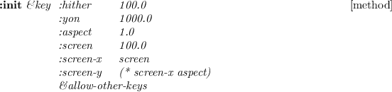, and a list of two
vectors are returned. If the line lies completely outside the viewport,
NIL is returned.

**viewport** [class]

      :super   coordinates 
      :slots         () 

viewport transformation maps the NDC (normalized device coordinates) to
device specific coordinates. Inheriting the **coordinates** class, the
`viewport` defines the size and the relative position of the projection
screen.

**:xcenter** *&optional xcenter*[method]

X coordinates of the center of this viewport.

**:ycenter** *&optional ycenter*[method]

Y coordinates of the center of this viewport.

**:size** *&optional size*[method]

List of sizes in x direction and y direction.

**:width** *&optional width*[method]

width of this viewport.

**:height** *&optional height*[method]

height of this viewport.

**:screen-point-to-ndc** *p*[method]

*p* is a float-vector representing the location in the physical screen.
*p* is transformed into the representation in the normalized-device
coordinates.

**:ndc-point-to-screen** *p*[method]

NDC representation in this viewport, *p*, is transformed into the
physical address on the screen.

**:ndc-line-to-screen** *p1 p2 &optional (do-clip t)*[method]

Two 3D float-vectors, *p1* and *p2*, define a line in NDC. These two end
points are transformed to the representation in the screen space. If
*do-clip* is non-nil, the line is clipped.

**:init** *&key (xcenter 100) (ycenter 100) (size 100) (width 100)
(height 100)*[method]

makes a new viewport object.

Viewer
------

To get a drawing on a screen, four objects are needed: (1) objects to be
drawn, (2) a viewing which defines the viewing coordinates and the
projection, (3) a viewport for clipping in NDC and the transformation
from NDC to physical screen coordinates, and (4) a viewsurface which
performs drawing functions on a physical display device. A **viewer**
object holds a viewing, a viewport and a viewsurface object, and
controls successive coordinates transformation. Functions **draw** and
**hid** described in section [17.5](#Drawings) use the instances of
viewer.

**viewer** [class]

      :super   object 
      :slots         (eye :type viewint) 
    (port :type viewport) 
    (surface :type viewsurface) 

defines the cascaded coordinates transformation from the viewing via the
viewport to the viewsurface.

**:viewing** *&rest msg*[method]

If *msg* is given, *msg* is sent to the viewing (eye) object, Otherwise,
the viewing (eye) object is returned.

**:viewport** *&rest msg*[method]

If *msg* is given, *msg* is sent to the viewport (port) object,
Otherwise, the viewport (port) object is returned.

**:viewsurface** *&rest msg*[method]

If *msg* is given, *msg* is sent to the viewsurface (surface) object,
Otherwise, the viewsurface (surface) object is returned.

**:adjust-viewport** [method]

When the size of viewsurface has been changed, **:adjust-viewport**
changes viewport transformation sending a proper message to port.

**:resize** *width height*[method]

changes the size of viewsurface by sending :resize message to the
viewsurface and :size message to viewport.

**:draw-line-ndc** *p1 p2 &optional (do-clip t)*[method]

draws a line whose two end points *p1, p2* are defined in NDC.

**:draw-polyline-ndc** *polylines*[method]

draws polylines whose end points are defined in NDC.

**:draw-star-ndc** *center &optional (size 0.01)*[method]

draws a cross mark in NDC.

**:draw-box-ndc** *low-left up-right*[method]

draws a rectangle in NDC.

**:draw-arc-ndc** *point width height angle1 angle2 [color]*[method]

draws an arc in NDC. The viewsurface object bound in this viewer must
accept **:arc** message.

**:draw-fill-arc-ndc** *point width height angle1 angle2
[color]*[method]

draws a filled-arc in NDC.

**:draw-string-ndc** *position string [color]*[method]

draws *string* at *position* defined in NDC.

**:draw-image-string-ndc** *position string [color]*[method]

**:draw-rectangle-ndc** *position width height [color]*[method]

**:draw-fill-rectangle-ndc** *point width height [color]*[method]

**:draw-line** *p1 p2 &optional (do-clip t)*[method]

draws a line whose two end points *p1, p2* are defined in the world
coordinates.

**:draw-star** *position &optional (size 0.01)*[method]

draws a cross at *position* located in the world.

**:draw-box** *center &optional (size 0.01)*[method]

draws a rectangular at *center*in the world.

**:draw-arrow** *p1 p2*[method]

draws an arrow from *p1* to *p2*.

**:draw-edge** *edge*[method]

**:draw-edge-image** *edge-image*[method]

**:draw-faces** *face-list &optional (normal-clip nil)*[method]

**:draw-body** *body &optional (normal-clip nil)*[method]

**:draw-axis** *coordinates &optional size*[method]

draws coordinates axes whose length is *size*.

**:draw** *&rest things*[method]

draws 3D geometric objects. If the object is a 3D float-vector, a small
cross is drawn at the position. If it is a list of 3D float-vectors, it
is taken as a polyline. If *thing* accepts `:draw` message, the method
is invoked with this viewer as its argument. If the object defines
`:drawners` method, the **:draw** message is sent to the result of
`:drawners`. `Line, edge, polygon, face`, and `body` objects are drawn
by corresponding *:draw-xxx* methods defined in viewer.

**:erase** *&rest things*[method]

draws *things* with background color.

**:init** *&key :viewing :viewport :viewsurface*[method]

sets *viewing, viewport* and *viewsurface* to `eye, port`, and `surface`
slots of this viewer.

creates a new viewer and pushes it in \*viewers\* list.

Drawings
--------

**draw** *[viewer] &rest thing*[function]

draws *thing*s in *viewer*. *Thing* can be any of coordinates, body,
face, edge, float-vector, list of two float-vectors. If you are running
`eusx`, `(progn (view) (draw (make-cube 10 20 30)))` draws a cube in a
xwindow.

**draw-axis** *[viewer] [size] &rest thing*[function]

draws coordinate-axes of *thing*s in *viewer* with *size* as the length
of each coordinates-axis. *Thing* can be any object derived from
coordinates.

**draw-arrow** *p1 p2*[function]

draws an arrow pointing from p1 to p2 in `*viewer*`.

**hid** *[viewer] &rest thing*[function]

draws hidden-line eliminated image in *viewer*. *Thing* can be of face
or body.

**hidd** *[viewer] &rest thing*[function]

is same as **hid**, except that **hidd** draws hidden lines with
dashed-lines.

**hid2** *body-list viewing*[function]

Generate hidden-line eliminated image represented by edge-image objects.
The result is bound to **\*hid\***.

**render** *&key bodies faces (viewer \*viewer\*) (lights
\*light-sources\*) (colormap \*render-colormap\*) (y 1.0)*[function]

does ray-tracing for *bodies* and *faces* and generates hidden-surface
removed images. viewing, viewport, and viewsurface are taken from
*viewer*. *lights* is a list of `light-source` objects. *colormap* is
xwindow's colormap object. Each of bodies and faces must have color
attribute assigned. This can be done by sending `:color` message with
the name of color LUT defined in the *colormap*. Currently this function
works only in Xlib environment. See examples in `demo/renderdemo.l`.

**make-light-source** *pos &optional (intensity 1.0)*[function]

make a light-source object located at *pos*. *intensity* is magnifying
ratio which multiplies default light intensity. In order to determine
the intensity more precisely, use `:intensity` method of a light-source.

**tektro** *file &rest forms*[macro]

opens file for `*tektro-port*` stream, and evaluates forms. This is used
in order to redirect the output of tektro drawings to a file.

**kdraw** *file &rest forms*[macro]

**Kdraw** is a macro to produce a [ik]draw-readable postscript file.
**Kdraw** opens *file* in `:output` mode, makes a kdraw-viewsurface and
a viewport with which `*viewer*` is replaced, and evaluates *forms*.
Each of *forms* is a call to any of drawing functions like `draw` or
`hid`. Drawing messages from these forms are redirected to a
`kdraw-viewsurface`, which transforms the messages into postscript
representations that `idraw` or `kdraw` can recognize, and stores them
in *file*. When `idraw` or `kdraw` is invoked and *file* is opened, you
see the identical figure you drew in a EusViewer window. The figure can
be modified by `idraw`'s facilities, and the final drawing can be
incorporated into a L^A^TEXdocument using the `epsfile` environment.

**pictdraw** *file &rest forms*[macro]

**Pictdraw** is a macro to produce picture files in the Macintosh PICT
format.

**pictdraw** *file &rest forms*[macro]

**Pictdraw** is a macro to produce picture files for Macintosh in PICT
format. **Pictdraw** opens *file* in `:output` mode makes a
pictdraw-viewsurface and a viewport with which `*viewer*` is replaced,
and evaluates *forms*. Each of *forms* is a call to any of drawing
functions like `draw` or `hid`. Drawing messages from these forms are
redirected to a `kdraw-viewsurface`, which transforms the messages into
PICT format that `macdraw` or `teachtext` of Macintosh can recognize,
and stores them in *file*.

**hls2rgb** *hue lightness saturation &optional (range 255)*[function]

Color representation in HLS (Hue, Lightness, and Saturation) is
converted to RGB representation. HLS is often referred to as HSL. *Hue*
represents a color around a rainbow circle (from 0 to 360). 0 for red,
45 for yellow, 120 for green, 240 for blue, 270 for magenta, and 360
again for red, etc. *Lightness* is a value between 0.0 and 1.0,
representing from black to white. The color of lightness value of 0 is
always black regardless to the hue and saturation, and the lightness
value 1.0 is always white. *Saturation* is a value between 0.0 and 1.0,
and represents the strength of the color. The greater the saturation
value, the divider the color, and small saturation values generate weak,
dull tone colors. *Range* limits the RGB values. If you are using a
color display which can assign 8bit value to each of red, green and
blue, *range* should be 255. If you use Xwindow, which virtually assigns
16bits integers to RGB, you should specify *range* to 65535. Note the
difference between HSV and HLS. In HLS, vivid (rainbow) colors are
defined with lightness=0.5.

**rgb2hls** *red green blue &optional (range 255)*[function]

RGB representation of a color is converted into the corresponding
representation in HLS.

Animation
---------

EusLisp's animation facility provides the pseudo real-time graphics on
stock workstations without graphics accelerators. The basic idea is the
quick playback of a series of images which have been generated after
long computation. Images are retained in two ways: one is to keep a
number of xwindow pixmaps each of which holds a complete pixel image,
and the other is to keep line segment data obtained by hidden-line
elimination. The former is faster and the only way for rendered images,
but not suitable for a long animation since it requires much memory in
the X server. The latter is more memory efficient and suitable for
storing data in disks, but the performance is degraded when the number
of line segments increases.

In either way, the user provide a function which gives new
configurations to the objects to be drawn and generates drawing on
`*viewer*`. **pixmap-animation** calls this function as many times as
specified by the *count* argument. After each call, the content of
`*viewsurface*`, which is assumed to be an xwindow, is copied to a newly
created Xwindow pixmap. These pixmaps are played back by
**playback-pixmaps**. Similarly, **hid-lines-animation** extracts
visible line segments from the result of **hid**, and accumulates them
in a list. The list is then played back by **playback-hid-lines**.

Following functions are defined in `llib/animation.l`, and
`demo/animdemo.l` contains a sample animation program using
**hid-lines-animation** on the ETA3 manipulator model.

**pixmap-animation** *count &rest forms*[macro]

*forms* are evaluated *count* times. After each evaluation, the content
of `*viewsurface*` is copied in a new pixmap. A list of *count* pixmaps
is returned.

**playback-pixmaps** *pixmaps &optional (surf
\*viewsurface\*)*[function]

Each pixmap in the *pixmaps* list is copied to *surf* successively.

**hid-lines-animation** *count &rest forms*[macro]

*forms*, which are assumed to include call(s) to **hid**, are evaluated
*count* times. After each evaluation, the result of **hid** held in
**\*hid\*** is scanned and visible segments are collected in a list of
point pairs. A list of length *count* is returned.

**playback-hid-lines** *lines &optional (view \*viewer\*)*[function]

*lines* is a list of lists of point pairs. draws lines successively on
*view*. Double buffering technique allocating another pixmap is used to
generate flicker-free animation.

**list-visible-segments** *hid-result*[function]

collects visible segments from the list of edge-images *hid-result*.

Image Processing
================

Image processing facilities are defined in `"vision/piximage"`. For the
representations of image data, two classes, **pixel-image** and
**color-pixel-image**, are defined. Pixel by pixel translations through
look-up tables, edge-finder, and image data transfer in pbm formats are
realized.

Look-Up Tables (LUT)
--------------------

An LUT is a vector for the translation of pixel data.

**make-equilevel-lut** *levels &optional (size 256)*[function]

returns a one-dimensional integer-vector that linearly maps values
between 0 and *size* into values between 0 and *levels*. For example,
`(make-equilevel-lut 3 12)` returns `#i(0 0 0 0 1 1 1 1 2 2 2 2)`.

**look-up** *src dest lut*[function]

translates values stored in *src* vector into *dest* vector using *lut*.
If *dest* is nil, a vector of the same class and size as *src* is
created. For example, `(look-up #i(1 2 3) nil #(10 20 30 40 50))`
returns `#i(20 30 40)`.

**look-up2** *src dest lut1 lut2*[function]

*Src* and *dest* are integer-vector or byte-vector (string) of the same
size. `:Look-up2` translates *src* into *dest* looking-up *lut1* and
*lut2* successively.

**look-up\*** *src dest luts*[function]

*luts* is a list of look-up tables. *src* is translated into *dest*
successively looking up look-up tables given in *luts*.

**concatenate-lut** *lut1 lut2 &optional (size 256)*[function]

concatenates two look-up tables *lut1* and *lut2*, and returns a new
look-up table which performs the same translation as *lut1* and *lut2*
are looked-up successively.

**\*x-gray32-lut\*** [variable]

LUT to translate 32-level gray-scale into the pixel values in the
default color map `x:*colormap*`. `(aref *x-gray32-lut* n)` returns the
pixel value for nth gray-level out of 32 levels.

**\*x-gray16-lut\*** [variable]

LUT to translate 16-level gray-scale pixel into the index of x's default
color map `x:*colormap*`.

**\*x-color-lut\*** [variable]

LUT for several vivid colors defined in `x:*color-map*`. Registered
colors are "black", "red", "green", "lightblue", "yellow", "orange",
"blue", "magenta", "white".

**\*256to8\*** [variable]

256-entry LUT to translate integers in range of 0..255 into 0..7. The
levels are linearly mapped.

**\*256to16\*** [variable]

256-entry LUT to translate integers in range of 0..255 into 0..15. The
levels are linearly mapped.

**\*256to32\*** [variable]

256-entry LUT to translate integers in range of 0..255 into 0..31. The
levels are linearly mapped.

**\*gray32\*** [variable]

256-entry LUT to translate the raw gray-scale pixels into X's color map
indices. This is made by concatenating two LUTs, `*256to32*` and
`*x-gray32-lut*`. An Xwindow display-able pixel-image with 32
gray-levels can be obtained by translating the 256-level raw image by
**\*gray32\***.

**\*rainbow32\*** [variable]

256-entry LUT to translate 256-level hue values into into X's rainbow
color map indices. This is made by concatenating two LUTs, `*256to32*`
and `*x-rainbow32-lut*`.

Pixel-Image
-----------

A single plane of image data is represented by **pixel-image** object.
**pixel-image** is a two-dimensional array of bytes. The interpretation
of each byte is application dependent. Although it is most commonly used
to represent brightness of a pixel, it may be used to represent edge
intensity, gradient direction, color component intensity, bar graph, or
whatever.

\
 **pixel-image** [class]

      :super   array 
      :slots         xpicture display-lut histogram
    brightness-distribution0
    brightness-distribution1
    brightness-covariance 

`Pixel-image` is the two dimensional array with displaying facility in
xwindows. The pixel conversion is performed by *display-lut* and the
resulted image is stored in *xpicture*. Major axis is taken vertically.
The pixel of `img` at `(x, y)` should be accessed by `(aref img y x)`.

**:width** [method]

returns the horizontal size of a pixel-image, which is the second
dimension.

**:height** [method]

returns the vertical size of a pixel-image.

**:size** [method]

is equivalent to array-total-size.

**:transpose** *&optional (result (instance (class self) :init dim0
dim1))*[method]

exchanges x and y coordinates.

**:map-picture** *lut &optional (result (send self :duplicate))*[method]

This pixel-image is translated by the *lut* and stored in *result*.

**:map** *fn &optional (result (send self :duplicate))*[method]

applies function *fn* to all the pixels in the image, and put the result
in the *result* pixel-image.

**:brightest-pixel** [method]

finds the brightest pixel value in this image.

**:darkest-pixel** [method]

finds the darkest pixel value in this image.

**:average-pixel** [method]

calculates the average intensity of all the pixels in this image.

**:halve** *&optional simage*[method]

returns pixel-image that is shrunk into half-size image.

**:subimage** *x y subwidth subheight*[method]

cuts out a *subwidth* x *subheight* rectangular region with its top-left
corner at *(x,y)* of this image. The origin of the image is taken at the
top-left corner. `:Subimage` returns a new pixel-image object.

**:xpicture** *&optional lut*[method]

translates this image using the look-up table *lut* and sets translated
pixel-image object to *xpicture*.

**:display-lut** *&optional newlut*[method]

sets look-up table *newlut* as display-lut.Then translates this image
using this look-up table and sets translated pixel-image object as
xpicture.

**:display** *(xwin geometry:\*viewsurface\*)*[method]

displays this pixel-image in the *xwin* xwindow by using `:putimage`.
Each pixel value is referred as a index in x's color map. To get a
desired appearance, this pixel-image must have been translated by proper
LUTs.

**:duplicate** [method]

makes an instance of the same class as this image object with the same
width and height. The pixel data are not copied.

**:copy-from** *src*[method]

copies pixel data from another image object specified by *src*. *src*
must be of the same dimension as this image.

**:hex** *&optional (x 0) (y 0) (w 16) (h 16) (strm t)*[method]

prints pixel data in the specified rectangular region in the hexadecimal
format.

**:hex1** *&optional (x 0) (y 0) (w 64) (h 16) (strm t)*[method]

prints pixel data in the specified rectangular region in the hexadecimal
format.

**:grin1** *strm &rest msg*[method]

prints this image-pixel object with its name and dimensions.

**:init** *w h &optional imgvec*[method]

initializes a pixel-image object to have *w* width and *h* height.

**:amplify** *rate &optional (result (send self :duplicate)*[method]

multiplies *rate* to each pixel value.

**:compress-gray-scale** *levels &optional result &aux pict2*[method]

translates this image into range of 0..*levels* and returns translated
pixel-image object.

**:lut** *lut1 &optional (result (send self :duplicate))*[method]

translates this image using the look-up table *lut1* and returns
translated pixel-image object.

**:lut2** *lut1 lut2 &optional (result (send self :duplicate))*[method]

translates this image using a look-up table that concatenated *lut1* and
*lut1*. And returns translated pixel-image object.

**:histogram** [method]

counts the occurrence of each pixel value in this image and returns an
integer-vector representing the histogram.

**:brightness-distribution** [method]

returns brightness-distribution.

**:optimum-threshold** [method]

returns levels that is maximum of this image's brightness-distribution.

**:project-x** [method]

adds all pixel values of the same x coordinate and returns a vector of
these values.

**:project-y** [method]

adds all pixel values of the same y coordinate and returns a vector of
these values.

**:digitize** *threshold &optional (val0 0) (val1 255) result*[method]

translates this image into 2 levels image *val0* and *val1* using
*threshold*.

**:and** *img2*[method]

bit-and operates between this image and *img2*, and returns operated
pixel-image.

**:plot** *min max &optional color viewsurface*[method]

plots pixels having values between *min* and *max* inclusively with
*color* (gc) on *viewsurface*.

![\\begin{emtabbing} {\\bf :edge1} \\it\\&optional \\=(method 1) \\\\lq
[method]\\\\ \\\>(th1 ... ...e-length-threshold\*) (win
geometry:\*viewsurface\*) (edgeimg1) \\rm
\\end{emtabbing}](manual-img84.png)

detects edge of this image. And displays this edge on this image.

Color-Pixel-Image
-----------------

Color images are represented by **color-pixel-image** objects which have
three **pixel-image** objects to represent red, green, and blue
components in RGB representation, or hue, lightness, and saturation
components in the HLS model. Conversion between RGB and HLS is
supported.

\
 **color-pixel-image** [class]

      :super   propertied-object 
      :slots         width height component1 component2 component3 

represents color images with three `pixel-image` objects.

**:width** [method]

returns the width of this image.

**:height** [method]

returns the height of this image.

**:size** [method]

returns 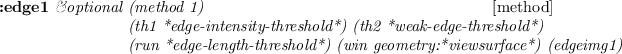 of this image.

**:red** [method]

returns component1.

**:green** [method]

returns component2.

**:blue** [method]

returns component3.

**:hue** [method]

returns component1. A hue value between 0 and 360 is represented by a
byte value between 0 and 255.

**:lightness** [method]

returns component2. The normalized brightness values (0..1) are mapped
into integers between 0 and 255.

**:saturation** [method]

returns component3. The normalized saturation values (0..1) are mapped
into integers between 0 and 255.

**:pixel** *x y*[method]

returns a list of three integers each of which is taken from component1,
component2 and component3 at (*x*,*y*). This triplet can be interpreted
either as RGB values or HLS values.

**:monochromize** *&optional (NTSC nil)*[method]

computes brightness from RGB components and returns a new `pixel-image`.
If *NTSC* is nil, 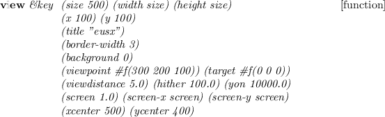 is computed. If T,
 is computed.

**:HLS** [method]

assuming this image is representing an RGB image, converts the image
into HLS representation. **RGB2HLS** is called for the conversion of
each pixel.

**:RGB** [method]

assuming this image is representing an HLS image, converts the image
into RGB representation. **HLS2RGB** is called for the conversion of
each pixel.

**:halve** [method]

returns color-pixel-image that is shrunk into half-size image.

**:display** *&optional (win \*color-viewer\*)*[method]

displays this color-pixel-image in a xwindow designated by *win* by
using `:putimage`. Each pixel value is referred as a index in x's color
map. To get a desired appearance, this pixel-image must have been
translated by proper LUTs.

**:display-lut** *&optional (newlut1) (newlut2 newlut1) (newlut3
newlut2)*[method]

sets look-up tables *newlut1*, *newlut1* and *newlut1* as display-lut,
respectively. Then translates this image using this look-up table and
sets translated pixel-image object as xpicture.

![\\begin{emtabbing} {\\bf :edge1} \\it\\&optional \\=(method 1) \\\\lq
[method]\\\\ \\\>(th1 ... ...ld\*)\\\\ \\\>(run
\*edge-length-threshold\*) (win \*color-viewer\*) \\rm
\\end{emtabbing}](manual-img88.png)

detects edge of this image. And displays this edge on this image.

**:hex** *&optional (x 0) (y 0) (w 16) (h 16) (strm t)*[method]

prints pixel data in the specified rectangular region in the hexadecimal
format.

**:hex1** *&optional (x 0) (y 0) (w 64) (h 16) (strm t)*[method]

prints pixel data in the specified rectangular region in the hexadecimal
format.

**:prin1** *strm &rest msg*[method]

prints this image-pixel object with its name and dimensions.

**:init** *width height &optional r g b*[method]

defines the size of a color image and allocates `pixel-image`s for each
color component.

Provided a ppm file, you can extract color (hue) values out of the image
and display it in an xwindow by the following program.

    (setq ppmimg (read-pnm "xxx.ppm"))
    (send ppmimg :hls)   ; RGB to HLS conversion
    (make-ximage (send ppmimg :hue) *rainbow32*)

Edge Finder
-----------

Edge Finding facilities are provided by `"vision/edge/edge"`.

![\\begin{emtabbing} {\\bf edge1} \\it img \\=\\&optional \\=(method 1)
\\\\lq [function]\\\\ ... ...\>\\&aux (width (send img :width)) (height
(send img :height)) \\rm \\end{emtabbing}](manual-img89.png)

finds edge pixels in this image. **edge1** first applies a gradient
operator to every pixel. There are three kinds of gradient operators
provided: **grad3** which takes difference between horizontally and
vertically neighboring pixels, **prewitt** and **sobel**. *method*=0,1
selects **grad3**, 2 selects **prewitt** and 3 selects **sobel**. Pixels
that have edge intensity greater than *th1* are identified as strong
edge pixels. After thinning edges referring to edge intensities and
directions of gradient, isolated edge pixels are marked. Starting from
end points of these strong edges, weak edge pixels that are consistent
with the strong edge's direction are searched for and linked to compose
elongated lines. Weak edge pixels that have greater edge intensity than
*th2* are unconditionally linked. Even very weak edge pixels that have
less edge intensity than *th2* can be linked as long as they connect to
another weak or strong edge within *run* length. **edge1** returns a
pixel-image object each pixel of which represents either a strong edge
pixel (=1), a weak and elongated edge pixel (=2), or an isolated pixel
(=255).

**overlay-edge** *ximg edgeimg*[function]

displays *edgeimg* obtained by **edge1** on top of x-display-able pixel
image *ximg*. Strong edge pixels are colored in red, weak pixels in
green, and isolated pixels in blue.

tries to fit straight lines and elliptic curves to the result obtained
by **edge1**. A list of three elements, which represents regions,
boundaries, and line segments is returned.

Three elements represented by **edge2** are defined as follow.

\
 **region** [class]

      :super   propertied-object 
      :slots         contour area intensity std-deviation 

represents region.

**boundary** [class]

      :super   propertied-object 
      :slots         parent-region  hole  segments  intensity  top-left  bottom-right  length 

represents boundary.

**edge-segment** [class]

      :super   propertied-object 
      :slots         prev next   wing ; the other half-edge  intensity std-deviation   start end 

represents edge-segment.

**line-edge-segment** [class]

      :super   edge-segment 
      :slots         la lb 

represents line-edge-segment.

**curved-edge-segment** [class]

      :super   edge-segment 
      :slots         rotation total-rot side   a b c d e 

represents curved-edge-segment.

![\\begin{emtabbing} {\\bf draw-ellipse-segment} \\it elp gc \\&optional
\\=(vs \*views... ...\*) (height (send vs :height)) \\\\lq
[function]\\\\ \\\>(x 0) (y 0) \\rm \\end{emtabbing}](manual-img91.png)

draws **curved-edge-segment** object *elp* on xwindow *vs*.

**draw-line-segment** *s &optional gc (vs \*viewsurface\*) (height (send
vs :height)) (x 0) (y 0)*[function]

draws **line-edge-segment** object *s* on xwindow *vs*.

draws *s*, a list of **edge-segment** objects on xwindow *vs*.

**draw-boundary** *b &optional gc*[function]

draws segments of **boundary** object *b* on xwindow *vs*.

**draw-boundaries** *bs &optional gc (step nil)*[function]

draws segments of **boundary** objects *bs* on xwindow *vs*.

**\*red-gc\*** [variable]

GC whose foreground color is \#ff0000

**\*blue-gc\*** [variable]

GC whose foreground color is \#0000ff

**\*green-gc\*** [variable]

GC whose foreground color is \#00ff00

**\*yellow-gc\*** [variable]

GC whose foreground color is \#ffff00

**\*cyan-gc\*** [variable]

GC whose foreground color is \#00ffff

**Figure 14:** Edge Finder and Overlaid Edges

Tracking
--------

`"vision/correlation"` defines functions to find correlation between
window-image and tracking-image.

\
 **tracking-window** [class]

      :super   pixel-image 
      :slots         x-pos y-pos x-vel y-vel
    pattern-size window-size
    x-win y-win window window-margin
    update threshold half-pattern correlation 

This class defines tracking window.

**:correlation** [method]

returns correlation between window-image and this image.

**:grab** *&optional (x x-pos) (y y-pos) (sampling 2)*[method]

grabs video image and returns grabbed pixel-image.

**:window-rectangle** *val*[method]

draws rectangle on xwindow.

**:rectangle** *val*[method]

draws rectangle on xwindow.

**:move** *newpos &aux (newx (aref newpos 0)) (newy (aref newpos
1))*[method]

moves tracking-window to *newpos* and grabs video image.

**:track** *display-window &optional th*[method]

tracks this image from window image.

**:search** *display-window &optional th*[method]

searches this image from window image.

**:track-and-search** *flag &optional th*[method]

tracks this image. If mistake tracking, searches this image from window
image.

**:pos** [method]

returns up-left position of window.

**:vel** [method]

returns tracking velocity.

**:insidep** *pos &aux (x (aref pos 0)) (y (aref pos 1))*[method]

checks *pos* that is contained with tracking window.

**:update** *&optional (flag :get)*[method]

sets *flag* as update. if flag doesn't exist, returns update.

**:prin1** *strm &rest mesg*[method]

prints this tracking-window object with its name and dimensions.

**:init** *x y size win-size*[method]

creates tracking-window object and sets slots.

Image File I/O
--------------

`"vision/pbmfile"` defines functions to transfer image data between
EusLisp and disk files. EusLisp can read and write pgm (portable
gray-scale map) and ppm (portable pixmap) format files.

**read-pnm** *f &optional buf0 buf1 buf2*[function]

reads a pgm or ppm file specified by file-stream *f* and returns a
pixel-image or color-pixel-image object. The image file can be either in
ascii (P2 and P3) or in binary (P5 and P6) format.

**read-pnm-file** *file &optional buf0 buf1 buf2*[function]

reads a pgm or ppm file specified by filename *file*.

**write-pgm** *f image &optional (depth 255)*[function]

writes a pixel-image specified by *image* into *f* file-stream in the
binary ppm format.

**write-ppm** *f image &optional (depth 255)*[function]

writes a pixel-image specified by *image* into *f* file-stream in the
binary pgm format.

**write-pnm** *f img*[function]

writes a pixel-image specified by *img* into *f* file-stream. If *img*
is **pixel-image**, it is written in the binary pgm format. If *img* is
**color-pixel-image**, written in the binary ppm format.

**write-pnm-file** *file img*[function]

writes the pixel-image specified by *img* into *file*.

**image::read-raw-image** *file &optional (x 256) (y x)*[function]

reads a raw-image file and returns a one-dimensional byte-vector
(string). The dimensions of the raw-image must match with give *x* and
*y*.

**image::write-raw-image** *file imgvec*[function]

writes pixel-values stored in a byte vector (string), *imgvec*, in
*file*.

JPEG compression/decompression
------------------------------

EusLisp can link libjpeg.so in order to handle JPEG images. Loading
"eusjpeg.l" will define JPEG-compression and -decompression functions.

Manipulators
============

*documented by Hiromu Onda*

Instances of **rotational-joint** class and **manipulator** class
constitute a Manipulator Model. **rotational-joint** is a subclass of
the **body**. **manipulator** is a subclass of the **cascaded-coords**.
**rotational-joint** class defines models of manipulator joints.
**manipulator** class has methods for solving a forward kinematic
solution and inverse kinematic solution.

The way of the definition of a manipulator is that i) Make all the
joints of the manipulator, ii) Integrate these joints into
**manipulator**.

Rotational Joint
----------------

**rotational-joint** describes a model of a joint. **rotational-joint**
has **body** as super-class. This class manages a model of shape,
coordinates, rotation axis of a joint, angles of rotation, limits of
joint angles, etc. **defjoint** macro below creates an instance of
**rotational-joint**. This instance is bound to *joint-name*. Assign a
ancestor joint to **parent**. It is not necessary to assign rotational
axes to base nor fingers.

     (defjoint joint-name   
                    :shape       body-object 
    :color       color-id   ;0-15 for MMD 
    :parent          parent-joint 
    :axis        rotational-axis           ; :x, :y or :z 
    :offset          trans-from-parent-joint 
    :low-limit       joint-angle-limit-low 
    :high-limit          joint-angle-limit-hight 
    ) 

Multi-Joint Manipulators
------------------------

A model of a manipulator is described by **manipulator**.
**defmanipulator** macro below creates an instance of **manipulator**.

     (defmanipulator manipulator-name 
      :class   manipulator-class 
    :base        base-joint 
    :joints           list-of-all-joints 
    :hand        handjoint 
    :left-finger         left-finger
    :right-finger        right-finger
    :handcoords          trans-from-hand-to-armsolcoords
    :toolcoords          trans-from-armsolcoords-to-toolcoords 
    :open-direction          finger-open-direction
    :right-handed        righty-or-lefty 
    ) 

\
 **rotational-joint** [class]

      :super   body 
      :slots         (axis offset high-limit low-limit) 

describes each rotational joint of a 6 D.O.Fs manipulator.

**manipulator** [class]

      :super   cascaded-coords 
      :slots         (base baseinverse joint
    angles right-handed hand handcoords right-finger left-finger
    openvec max-span toolcoords toolinverse armsolcoords
    toolinverse armsocoords approach grasp affix) 

manages kinematics of a manipulator from base to hand.

**:newcoords** *newrot &optional newpos*[method]

updates the coords with newrot and newpos if new joint angles are within
the limit.

**:armsolcoords** [method]

computes and makes transformation (an instance coords) between the
coords of the base and those of the hand.

**:tool** *&rest msg*[method]

modifies or gets toolcoords.

**:set-tool** *newtool &optional offset copy*[method]

sets new toolcoords.

**:reset-tool** [method]

forces this coords to be default-toolcoords.

**:worldcoords** [method]

computes the position vector, the rotation matrix, and the coordinates
of the toolcoords represented in the world coordinates.

**:set-coords** [method]

forces setting coords according to the forward kinematic solution.

**:config** *&optional (a newangles)*[method]

sets joint angles of the manipulator.

**:park** [method]

forces all the joint angles to be zero.

**:hand** *&optional (h nil)*[method]

sets or returns the object of its hand.

**:handcoords** [method]

computes the position vector, the rotation matrix, and the coordinates
of the handcoords represented in the world coordinates.

**:span** [method]

returns the current distance between fingers.

**:open-fingers** *s &optional abs &aux (current (send self
:span))*[method]

moves fingers relatively or absolutely.

**:close-fingers** [method]

closes fingers completely.

**:angles** *&optional flag*[method]

returns the list of current joint angles.

**:get-approach** [method]

returns the object to which the hand is approaching.

**:set-approach** *a*[method]

sets *a* as the object to which the hand will approach.

**:get-grasp** [method]

(:get-grasp () grasp-config)

**:set-grasp** *g*[method]

sets *g* as the object which the hand will grasp.

**:get-affix** [method]

returns the object which the hand grasps.

**:affix** *&optional (grasp)*[method]

sets **affixed-object** **grasp**. **grasp** is associated to the
handcoords as a descendant.

**:unfix** *&optional (margin 10.0)*[method]

sets **affixed-object** nil. **grasp** is dissociated (removed) from the
descendants list of the handcoords.

![\\begin{emtabbing} {\\bf :create} \\it\\=\\&rest args \\\\lq
[method]\\\\ \\\>\\&key \\=((:na... ...) ((:lefty lft) t) ((:act a)
nil)\\\\ \\\>\\&allow-other-keys \\rm
\\end{emtabbing}](manual-img94.png)

creates and initializes a new manipulator object.

**manipulator** manages the linkage of the coords of **base,
joints(J1...J6), handcoords, toolcoords**. **manipulator** has
**cascaded-coords** as super-class. **manipulator** is connected with
**base** which is **cascaded-coords** (or subclasses of **body**).
**manipulator** manages the transformation from the base frame to the
toolcoords. Messages sent to **manipulator** (i.e. **:translate,
:locate, :rotate, :orient, :transform** etc.) effect the end effector of
the manipulator. If WRT parameter is set one of keywords (i.e. :local,
:parent, :world or an instance of coordinates) in this message, the
end-effector moves with respect to the WRT parameter. In the next
program **eta3** is a instance of **manipulator**.

    　(send eta3 :translate #f(0 0 -100))        ;put back the end-effector by 10cm
    　(send eta3 :translate #f(0 0 -100) :world) ;move down the end-effector by 10cm
    　(send eta3 :translate #f(0 0 -100)
                 (manipulator-base eta3))  ;move down the end-effector with respect 
                                           ;to the coords of the base by 10cm

When **manipulator** receives these messages, it calculates the arm
solution and 6 joint angles are determined. Generally, more solutions
than one exist. In that case, one appropriate solution is chosen of them
according to the criteria (i.e. the distinction between **right-handed**
and **left-handed**, and the consistency with current joint angles). If
there is no solution for a given configuration or the calculated joint
angles exceed its limits, **manipulator** does not move and it gives a
warning.

Arm-solution method **:armsol** must be defined for respective
manipulator classes which correspond to real manipulators. This method
calculates the transformation between the base-coords and the
hand-coords. Thus this allow us to put a manipulator wherever with
respect to the world-coords. The arm solution is independent of the
**base, toolcoords**.

Fig. [15](#JointCoords) shows the relation between coordinate systems
(**base, J1, J2,..., handcoords** and **toolcoords**).
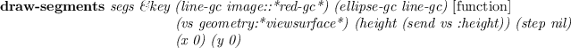 and other transformations are calculated as
follows.

where  is the transformation between the
world-coords and the toolcoords.

**Figure 15:** relation between coordinate systems in a manipulator

Each joint has a geometric model represented by Breps (Boundary
Representation). The coordinates of the vertices and the equations of
the planes are not always current ones. Messages sent to **manipulator**
for translation or rotation only update the coordinate systems, these do
not update the coordinates of the vertices. This is why we can reduce
the calculation time when translation or rotation occurs successively.
If **:worldcoords** message is sent to **manipulator**, it updates the
data such as the coordinates of the vertices.

Mainly toolcoords are used for specify the motion of a manipulator in
this **manipulator**. There is a method (**:config**) for specifying the
configuration of the manipulator by joint angles. The arguments are a
float-vector whose elements are 6.

      (send eta3 :config (float-vector pi/2 pi/2 0 1 0 1))

**:config** rotates joints of the manipulator if the joint angles are in
the limit. As a result, the coordinates which **manipulator** manages
and the current toolcoords which given joint angles determines become
inconsistent. **:set-coords** message must be sent if you need
consistency. **:set-coords** calculates a forward kinematic solution and
calculates the arm solution using the forward kinematic solution.

Example: create the manipulator model (ETA3) and draw this on a Xwindow
system.

    ;EusLisp 7.27 with Xlib created on Thu Sep 17 14:33:30 1992
    (load "view.l")                                ;open a window
    (load "/usr/local/eus/robot/eta3/eta3build.l") ;create the model of ETA3
    (send *viewing* :look #f(2000 2000 2000))      ;change the viewpoint
    (send-all (eta3arm-components eta3) :color 1)  ;change the color of lines
    (send eta3 :config (float-vector 0 (/ -Pi 4.0) Pi/2 0 (/ -Pi 4.0) 0 ))
                               ;set joint angles of ETA3
    (send eta3 :set-coords)                        ;refer to the above explanation
    (draw eta3)                                    ;draw ETA3

Xwindow Interface
=================

The Xwindow interface on EusLisp becomes available when EusLisp is
invoked by the name of `'eusx'`.
[^3^](manual-footnode.html#foot41870)The "DISPLAY" environment variable
should be properly set to your Xserver, since eusx tries to connect to
Xserver referencing the "DISPLAY" environment variable when it starts
up.

EusLisp defines three levels of xwindow interface: (1) Xlib functions,
(2) Xlib classes, and (3) XToolKit classes. All the xwindow functions
described in this section and the following XToolKit section are
contained in the "X" package. The function names of the original Xlib
are changed so that all constituent letters are converted to upcase and
the first 'X' prefix is removed. For example, `XdefaultGC` is named
`X:DEFAULTGC`, not `X:XDEFAULTGC`.

The Xlib functions are defined as foreign functions as the lowest level
interface to Xwindow system. These Xlib functions should be used
carefully, since parameter type check or parameter number check is not
performed. For an instance, all the Xlib call requests `x:*display*`
argument to identify the connection to Xserver, and if you forget it,
Xlib reports an error and the process dies. The second level interface,
Xlib classes are provided to avoid this inconvenience and to make the
interface object-oriented. This section focuses on this second level
interface. Even higher level xwindow library called XToolKit is
explained in the next section.

Classes described in this section have the following inheritance
hierarchy.

    propertied-object
       viewsurface
          x:xobject
             x:gcontext
             x:xdrawable
                 x:xpixmap
                 x:xwindow
       colormap

Xlib global variables and misc functions
----------------------------------------

**x:\*display\*** [variable]

X's display ID (integer).

**x:\*root\*** [variable]

default root window object.

**x:\*screen\*** [variable]

default screen ID (integer).

**x:\*visual\*** [variable]

default visual ID (integer).

**x:\*blackpixel\*** [variable]

black pixel = 1

**x:\*whitepixel\*** [variable]

white pixel = 0

**x:\*fg-pixel\*** [variable]

default foreground pixel referenced at window creation, normally
`*blackpixel*`.

**x:\*bg-pixel\*** [variable]

background pixel referenced at window creation, normally `*whitepixel*`

**x:\*color-map\*** [variable]

the system's default color-map

**x:\*defaultGC\*** [variable]

the default gcontext referenced at pixmap creation.

**x:\*whitegc\*** [variable]

GC whose foreground color is white.

**x:\*blackgc\*** [variable]

GC whose foreground color is black.

**\*gray-pixmap\*** [variable]

the result of `(make-gray-pixmap 0.5)`

**\*gray25-pixmap\*** [variable]

16x16 pixmap, a quarter of pixels are `*fg-pixel*` and three quarters
`*bg-pixel*`.

**\*gray50-pixmap\*** [variable]

16x16 pixmap, a half of pixels are `*fg-pixel*`.

**\*gray75-pixmap\*** [variable]

16x16 pixmap, three quarters of pixels are black.

**\*gray25-gc\*** [variable]

25% gray GC made from `*gray25-pixmap*`.

**\*gray50-gc\*** [variable]

50% gray GC made from `*gray50-pixmap*`.

**\*gray75-gc\*** [variable]

75% gray GC made from `*gray75-pixmap*`.

**\*gray\*** [variable]

`"#b0b0b0"`

**\*bisque1\*** [variable]

`"#ffe4c4"`

**\*bisque2\*** [variable]

`"#eed5b7"`

**\*bisque3\*** [variable]

`"#cdb79e"`

**\*lightblue2\*** [variable]

`"#b2dfee"`

**\*lightpink1\*** [variable]

`"#ffaeb9"`

**\*maroon\*** [variable]

`"#b03060"`

**\*max-intensity\*** [variable]

65535

**font-cour8** [variable]

`(font-id "*-courier-medium-r-*-8-*")`

**font-cour10** [variable]

`(font-id "*-courier-medium-r-*-10-*")`

**font-cour12** [variable]

`(font-id "*-courier-medium-r-*-12-*")`

**font-cour14** [variable]

`(font-id "*-courier-medium-r-*-14-*")`

**font-cour18** [variable]

`(font-id "*-courier-medium-r-*-18-*")`

**font-courb12** [variable]

`(font-id "*-courier-bold-r-*-12-*")`

**font-courb14** [variable]

`(font-id "*-courier-bold-r-*-14-*")`

**font-courb18** [variable]

`(font-id "*-courier-bold-r-*-18-*")`

**font-helvetica-12** [variable]

`(font-id "*-Helvetica-Medium-R-Normal-*-12-*")`

**font-lucidasans-bold-12** [variable]

`(font-id "lucidasans-bold-12")`

**font-lucidasans-bold-14** [variable]

`(font-id "lucidasans-bold-14")`

**font-helvetica-bold-12** [variable]

`(font-id "*-Helvetica-Bold-R-Normal-*-12-*")`

**font-a14** [variable]

`(font-id "*-fixed-medium-r-normal-*-14-*")`

**x:\*xwindows\*** [variable]

a list of all windows including subwindows created and maintained by
EusLisp.

**x:\*xwindow-hash-tab\*** [variable]

a hash table to look up the xwindow object by its drawable ID. In the
event structure obtained by `x:nextevent` is a window ID, and
`x:window-main-loop` calls `x:event-window` to know the corresponding
xwindow object using this table.

**xflush** [function]

sends all commands retained in the Xlib command buffer to Xserver. Since
Xlib buffers output to Xserver, commands you issued commands to Xserver
are not executed immediately. This is necessary to decrease network
traffic and the frequency of process switching. To flush the command
buffer to see the effects of the commands, use **xflush** or send
**:flush** message to xwindow objects.

**find-xwindow** *subname*[function]

Each xwindow may have name specified at the creation time. Find-xwindow
looks in the \*xwindows\* list and returns a list of windows that have
'subname' as a substring of its name.

Xwindow
-------

**Xobject** [class]

      :super   geometry:viewsurface 
      :slots         

The common super class for all the Xwindow related classes. Currently,
no slots variables and methods are defined.

**Xdrawable** [class]

      :super   Xobject 
      :slots         (drawable    ; drawable  ID 
    gcon          ; this drawable's default graphic context object
    bg-color         ; background color 
    width height         ; horizontal and vertical dimensions in dots 

**Xdrawable** defines rectangular regions where graphics objects such as
lines and strings can be drawn. **Xdrawable** is an abstract class to
define common methods for xwindow and xpixmap, and instantiation of this
class has no effect.

**:init** *id*[method]

*Id* is set to the *drawable* slot as the ID of this drawable. A new GC
(graphic context) is created and set to *gcon* as the default GC of this
drawable object.

**:drawable** [method]

returns drawable id.

**:flush** [method]

flushes commands retained in the Xlib's buffer.

**:geometry** [method]

returns the list of seven geometric attributes, *root-window-id,
x-position, y-position, width, height, border-width* and *visual's
depth*.

**:height** [method]

returns the height (dots in y direction) of this drawable.

**:width** [method]

returns width (dots in x direction) of this drawable.

**:gc** *&rest newgc*[method]

If no *newgc* is given, the current gc object is returned. If *newgc* is
an instance of gcontext, it is set to the gc of this drawable.
Otherwise, *newgc* is regarded as a message and sent to the current gc.

**:pos** [method]

returns an integer vector representing the position of this drawable.
The position is always defined relative to the parent window, and
windows created as direct subwindows of the root window under the
intervention of the window manager return the constant coordinates in
their surrounding title window regardless to their true position in the
root.

**:x** [method]

returns the *x* coordinate of this drawable relatively to the parent
window.

**:y** [method]

returns the *y* coordinate of this drawable relatively to the parent
window.

**:copy-from** *drw*[method]

*Drw* is another drawable object (xwindow or pixmap). The contents of
*drw* is copied to this drawable.

**Figure 16:** drawing primitives

**:point** *x y &optional (gc gccon)*[method]

draws a point at 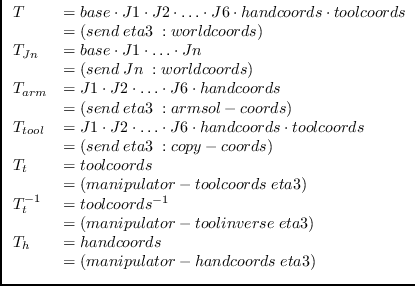 with optional *gc*.

**:line** *x1 y1 x2 y2 &optional (gc gcon)*[method]

draw a line from *(x1, y1)* to *(x2, y2)* with optional *gc*. *x1, y1,
x2,* and*y2* must be integers.

**:rectangle** *x y width height &optional (gc gcon)*[method]

draws a rectangle whose center is located at *(x, y)* and size is
specified by *width* and *height*.

**:arc** *x y width height angle1 angle2 &optional (gc gcon)*[method]

draws an elliptic arc whose center is *(x, y)* and starting angle at
*angle1* and ending angle at *angle2*. Angles should be given by radian.

**:fill-rectangle** *x y width height &optional (gc gcon)*[method]

fills in a rectangular region.

**:fill-arc** *x y width height angle1 angle2 &optional (gc
gcon)*[method]

fills in an arc.

**:string** *x y str &optional (gc gcon)*[method]

displays the string *str* starting at *(x, y)*. The background is not
filled.

**:image-string** *x y str &optional (gc gcon)*[method]

displays an imagestring of *str*. Imagestring fills background.

**:getimage** *&key x y width height (mask \#ffffffff) (format
2)*[method]

gets ximage from the server and returns the pixel data in a string. The
pixel data sent from the server is once stored in Xlib's ximage
structure, then copied to the string row by row. The ximage structure is
automatically destroyed. The image string obtained by `:getimage` can be
used to make a `pixel-image`, which can be written to a file in the pbm
formats as described in section [18.6](#PBMfile).

**:putimage** *image &key src-x src-y dst-x dst-y width height ((:gc g)
gc)*[method]

puts *image* to the specified location in this drawable. *image* is a
string or a address pointing to an ximage structure.

**:draw-line** *from to*[method]

is same as **:line** method, and provided for the compatibility with
other viewsurface classes.

**:line-width** *&optional dots*[method]

sets line-width of this drawable's default GC. Use of the
`:gc :line-width` message is recommended.

**:line-style** *&optional dash*[method]

sets line-style of this drawable's default GC. Use of the
`:gc :line-style` is preferable.

**:color** *&optional c*[method]

sets color of this drawable.

**:clear** [method]

clears full screen. this method calls `:clear-area`

**:clear-area** *&key :x :y :width :height :gc*[method]

clears a rectangle using the `:fill-rectangle` method.

**Xpixmap** [class]

      :super   Xdrawable 
      :slots         

Pixmap is a drawable that is often used as a picture buffer or a
background pattern. Unlike xwindow, pixmap itself is not visible until
it is copied to xwindow or pixmap does not generate any event.

**:init** *id*[method]

initializes this pixmap.

**:create** *&key (width 500) (height 500) (depth 1) (gc
\*defaultgc\*)*[method]

creates a *width* x *height* pixmap with *gc* as its default GC.

**:create-from-bitmap-file** *fname*[method]

creates a pixmap from a bitmap file.

**:write-to-bitmap-file** *fname*[method]

writes the contents of this pixmap into a bitmap file, which can be read
back to create a pixmap by **:create-from-bitmap-file** method.

**:destroy** [method]

destroys this pixmap and frees X resources.

**Xwindow** [class]

      :super   Xdrawable 
      :slots         (parent subwindows backing-pixmap event-forward) 

**Xwindow** defines visible rectangular regions of the screen. It is
inherited not only by **t**ext-window and **canvas** where any graphics
objects can be drawn, but also by many **panel-items** and
**scroll-bars**, which look like graphics objects rather than windows.

![\\begin{emtabbing} {\\bf :create} \\it\\&key ( \\= (:parent \*root\*)
\\\\lq [method] \\\\ ... ... \\\> event-mask (:key :button :enterLeave
:configure :motion) \\rm \\end{emtabbing}](manual-img100.png)

creates and initializes a xwindow. When *parent* is given, this window
is created as a subwindow of *parent*, and is registered in the
*subwindows* list of the *parent*. *X, y, size, width, height* and
*border-width* determine the location and the dimensions of this window.
*Save-under* and *backing-store* control the Xserver's behaviors taken
upon when the window is re-mapped. *Save-under* is either T or NIL,
while *backing-store* is either `:notUseful, :WhenMapped`, or *:Always*.
When *backing-pixmap* is T, a pixmap of the same size as this window is
created by EusLisp, and maintained as a backing-store in case the
Xserver does not have the capability of backing-store. *Border* and
*background* specify the *border\_pixel* and *background\_pixel*
attributes, respectively. *Map* should be set NIL, if this window should
not appear immediately after its creation, as is the case many small
windows are created as panel-buttons in a **panel**. *Title* is the
window title which appears in the title bar of the window. *Name* is the
name of the window stored in the property-list of this xwindow object
and printed by the printer. X's events reported to this window are
determined by *Event-mask*, that is, either an integer representing a
bit-coded event-mask or a list of the following symbols:
`:key, :button, :enterLeave, :motion` and `:configure`. If more precise
control is needed, the following symbols for each event can be
specified: *:keyPress, :keyRelease, :ButtonPress, :ButtonRelease,
:EnterWindow, :LeaveWindow, :PointerMotion, :PointerMotionHint,
:ButtonMotion, :KeyMapState, :Exposure, :VisibilityChange,
:StructureNotify, :ResezeRedirect, :SubstructureNotify,
:SubstructureRedirect, :FocusChange, :PropertyChange, :ColormapChange*
and `:OwnerGrabButton`. `:Key` enables both `:keyPress` and
`:KeyRelease`, and `:button` enables both `:ButtonPress` and
`:ButtonRelease`. When an event is sent from the server,
**w**indow-main-loop analyzes the event structure and send the
`:KeyPress, :KeyRelease, :buttonPress, :ButtonRelease, :EnterNotify, :LeaveNotify, :MotionNotify, :ConfigureNotify`
message to the window where the event occurred.

**:map** [method]

makes this xwindow and all the subwindows visible.

**:unmap** [method]

makes this xwindow and all the subwindows invisible.

**:selectinput** *event-mask*[method]

*Event-mask* is either an integer or a list of eventmask symbols. Each
event corresponding to the bit turned-on or enumerated in the
*event-mask* list becomes to be reported to this window.

**:destroy** [method]

destroys this xwindow and frees X resource. The corresponding entries in
`*xwindows*` and `*xwindow-hash-tab*` are also deleted so that this
window object could be garbage-collected. All subwindows are also
deleted by sending `:destroy`. This window is dissociated from the
subwindow list of the parent window. The *drawable* ID is set to NIL.

**:parent** [method]

returns the parent window object.

**:subwindows** [method]

returns the list of all the subwindows. The subwindow most recently
created comes first in the list. Only the direct subwindows of this
window are listed and subwindows of the subwindows are not.

**:associate** *child*[method]

register the *child* window as a subwindow of this window.

**:dissociate** *child*[method]

removes the *child* window of the *subwindows* list.

**:title** *title*[method]

changes the title of this window. Though the title is in the Xserver, it
is maintained and displayed by the window manager.

**:attributes** [method]

returns an integer-vector representing the attributes of this window.

**:visual** [method]

returns the visual resource id for this window.

**:screen** [method]

returns the screen resource id for this window.

**:root** [method]

returns the root window id.

**:location** [method]

returns a two dimensional integer-vector describing the x and y
coordinates of this window.

**:depth** [method]

returns the depth (number of color planes) of this window.

**:size** [method]

returns the size (width and height) of this window.

**:colormap** [method]

returns colormap resource id for this window.

**:move** *newx newy*[method]

changes the location of this window to *(newx, newy)*. The coordinates
are given relative to the parent window.

**:resize** *width height*[method]

changes the size of this window. Probably because the size parameters
are cached in the Xlib on the client side, `:geometry` message
immediately after `:resize` may return wrong (old) result.

**:raise** [method]

brings this window upfront.

**:lower** [method]

pushes this window to the back.

**:background** *pixel*[method]

changes the background pixel value (the index in the color map) to
*pixel*. The *pixel* value is also stored in the *bg-color* slot.
`:Clear` operation is performed to fill the current background with the
specified *pixel*.

**:background-pixmap** *pixmap*[method]

changes the background with given pixmap.

**:border** *pixel*[method]

sets the color of the border to *pixel*.

**:set-colormap** *cmap*[method]

sets colormap.

**:clear** [method]

clears the entire xwindow.

**:clear-area** *&key :x :y :width :height*[method]

clears the specified rectangular area of this xwindow.

**make-xwindow** *&rest args*[function]

makes x-window.

**init-xwindow** *&optional (display (getenv "DISPLAY"))*[function]

is the first function to call when eusx start up. `Init-xwindow`
connects to the Xserver specified by *display*, and initializes default
variables described in the section [20.1](#xvariables). `Init-xwindow`
also loads default fonts and sets them to global variables, such as
font-courb12, lucidasans-bold-12, etc. This font loading causes the
delay at the start-up time. Reduction of the number of fonts loaded or
specifying the exact font-names without using the wild-card character
"\*" will shorten the delay.

Graphic Context
---------------

**gcontext** [class]

      :super   Xobject 
      :slots         (gcid GCValues) 

defines the graphic context. In EusLisp, every xwindow has its default
GC.

creates a gc with given attributes. *Drawable* is used by the Xserver to
know the screen and depth of the screen. The resulted GC can be used in
any drawables as long as they are created on the same screen.

**:gc** [method]

returns X's GC id.

**:free** [method]

frees this GC.

**:copy** [method]

makes a copy of this GC.

**:foreground** *&optional color*[method]

if *color* is given, it is set to the foreground color. *Color* is a
pixel value.

**:background** *&optional color*[method]

if *color* is given, it is set to the background color. *Color* is a
pixel value.

**:foreback** *fore back*[method]

sets foreground and background colors at once.

**:planemask** *&optional plane-mask*[method]

sets plane-mask.

**:function** *x*[method]

sets drawing function. *X* should either be one of the following numbers
or keywords:
`0=Clear, 1=And, 2=AndReverse, 3=Copy, 4=AndInverted, 5=NoOp, 6=Xor, 7=Or, 8=Nor, 9=Equiv,  10=Invert, 11=XorReverse, 12=CopyInverted, 13=OrInverted, 14=Nand, 15=Set, :clear, :and, :andReverse, :copy, :andInverted, :NoOp, :Xor, :Or, :Nor, :Equiv, :Invert,  :XorReverse, :CopyInverted, :OrInverted, :Nand, :Set`.

**:font** *x*[method]

sets the font attribute of this GC. *X* is either a font-name or a
font-ID. If *x* is a font name (string), `:font` calls `x:LoadQueryFont`
to decide the font-id. If not found, `"no such font ..."` is warned. If
*x* is NIL (not given), the current font-ID of this GC is returned.

**:line-width** *x*[method]

sets the line width in pixel.

**:line-style** *x*[method]

sets the line-style (solid, dashed, etc.).

**:dash** *&rest x*[method]

Each component of *X* is an integer. `:Dash` sets the dash pattern of
the line-style.

**:tile** *pixmap*[method]

sets the tile of this GC to *pixmap*.

**:stipple** *pixmap*[method]

sets the stipple of this GC to *pixmap*.

**:get-attribute** *attr*[method]

gets attribute. *Attr* is one of
`:function, :plane-mask, :foreground, :background, :line-width, :line-style, :cap-style, :join-style, :fill-style, :fill-rule, :font`.
An integer value representing the attribute is returned.

![\\begin{emtabbing} {\\bf :change-attributes} \\it\\&key \\= function
plane-mask fore... ...d]\\\\ \\\>line-width line-style cap-style
join-style font dash \\rm \\end{emtabbing}](manual-img102.png)

change attributes. More than one attributes are changed at the same
time.

**font-id** *fontname*[function]

If *fontname* is integer, it is returned regarding it as font-id. If
*fontname* is string, font-structure is inquired by using
`x:LoadQueryFont`, and its font-id is returned. *Fontname* can be a
shorthand of exact name, such as `"*-courier-24-*"` for any 24-point
courier font. If the font could not be found, `can't load font` warning
is printed.

**textdots** *str font-id*[function]

returns a list of three integers representing (ascent descent width) of
the *str* (string) in dots.

Colors and Colormaps
--------------------

\
 **colormap** [class]

      :super   object 
      :slots         (cmapid planes pixels LUT-list) 

defines an xwindow colormap and application oriented color look-up
tables. A color is represented by RGB values from 0 through 65535. Color
cells in a color map are addressed by their indices, which are between 0
and 255 on 8-bit pseudo color display.

Here we assume your display device has 8bit pseudo color capability
which allows you to choose 256 colors at the same time. Basically there
are two ways in the use of color maps: to share the system's default
color map or to create private color maps. If you use the system's
default color map, you have to be careful not to use up all the color
cells in the map, since the map is shared among many processes. If you
use private color maps, you can allocate all 256 color entries in the
map without worrying about other processes, but the map has to be
explicitly attached to your private windows. The color map is activated
by the window manager when the mouse pointer is moved somewhere in the
window.

The system's default color map is set up in `x:*color-map*` which is an
instance of the `x:colormap` class when eusx begins execution. If you
use private color maps, you create instances of `x:colormap`. These
instances correspond to the colormap object defined in the x server and
are identified by the `cmapid` stored in each instance.

When you use the system's default color map, you can define *read-only*
colors which are shared with other processes or define *read-write*
colors which are private to your EusLisp. *Read-only* means that you can
define arbitrary color when you allocate the color cell, but you cannot
change it after the allocation. On the other hand, *read-write* colors
can be altered even after you defined them. Shared colors are
*read-only* since other processes expect the colors to be unchanged.
This *read-only* or *read-write* attribute is attached to each color
entry (often referred to as color cell).

A colormap object defines translation from a color id to a physical
representation that is a triplet of red, green and blue components.
However, these logical color ids cannot be chosen arbitrarily,
especially when you use the the system's default color map. The color id
(often referred to as 'pixel') is an index of a particular color in a
color map and Xlib chooses one of free indices for a shared color when
allocation is requested. Therefore, there is no way, for example, to
guarantee many levels of gray colors to be allocated contiguously or to
begin from the first (zeroth) index.

From the viewpoint of applications, more logical color naming is needed.
For example, a number of gray levels should be referred to with their
brightness as indices. A ray trace program may wish to assign contiguous
indices to a group of colors of different brightness defined in HLS
model.

To cope with this problem, EusLisp's colormap provides another
translation table called LUT (look-up table). For a logical group of
colors, you can define a LUT and attach a symbolic name to it. More than
one LUTs can be defined in a colormap. LUT is an integer vector for the
translation of application specific logical color indices into physical
pixel values that the Xserver can recognize.

**:id** [method]

returns the cmap id.

**:query** *pix*[method]

gets RGB values for the specific pixel number.

**:alloc** *r g b*[method]

this method is the same as `:store nil r g b`. A new color cell is
allocated in this colormap and is assigned with the specified RGB
values.

**:store** *pix r g b*[method]

sets RGB values to the *pix*th color cell.

**:store** *pix color-name*[method]

**:Store** is the lowest level method to set a color in a color map. In
the first form, you specify the color with the red, green and blue
components between 0 and 65535 inclusively. In the second form, you
specify the color by name like "red" or "navy-blue". If no such
color-name is found, nil is returned. Pixel is either an integer which
is the index in a color map or nil. If it is integer, the color cell
must be read-write-able. If it is nil, a shared read-only color cell is
allocated. `:Store` returns the index of the color cell in the color
map.

**:store-hls** *pix hue lightness saturation*[method]

stores the color specified in HLS (Hue, Lightness and Saturation) model
in the *pix*th entry of this colormap. If *pix* is NIL, a shared
read-only color cell is allocated. `:Store-hls` returns the index to the
allocated color cell.

**:destroy** [method]

destroys this colormap and frees resource.

**:pixel** *LUT-name id*[method]

looks up in the LUT for the id'th entry and returns its pixel value.
*LUT-name* is the name of the look-up-table you defined by
`:define-LUT`.

**:allocate-private-colors** *num*[method]

allocates *num* color cells in the private color map.

**:allocate-colors** *rgb-list [private]*[method]

Each element of *rgb-list* is a list of red, green and blue components.
Color cells are allocated for each rgb value and an integer-vector whose
elements are pixel values is returned.

**:define-LUT** *LUT-name rgb-list [private]*[method]

Colors described in *rgb-list* are allocated, and an LUT is registered
by the symbolic name of *LUT-name*. In order to define private color
cells, set *private* to T.

**:define-gray-scale-LUT** *LUT-name levels [private]*[method]

allocates *levels* of color cells that represent linear gray scale
colors and returns LUT. For example,
`(send x:*color-map* :define-gray-scale-LUT 'gray8 8)` allocates eight
gray colors in the system's default color map, and returns an integer
vector such as `#i(29 30 31 48 49 50 51 0)`. Physical pixel values can
be inquired by sending the `:pixel` message, for example,
`(send x:*color-map* :pixel 'gray8 2)` returns 31.

**:define-rgb-LUT** *LUT-name red green blue [private]*[method]

defines an LUT for shrunk RGB representation. For example, if
red=green=blue=2, totally 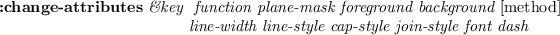
color cells are allocated.

**:define-hls-LUT** *LUT-name count hue low-brightness high-brightness
saturation [private]*[method]

allocates *count* colors using the HLS model. Colors of the given *hue*
(0..360), *saturation* (0..1), and different levels of brightness
between *low-brightness* and *high-brightness* are stored in the color
map. A LUT named LUT-name is also created.

**:define-rainbow-LUT** *LUT-name count (hue-start 0) (hue-end 360)
(brightness 0.5) (saturation 1.0) (private nil)*[method]

allocates *count* colors using the HLS model. Colors of the given
*brightness* (0..1), *saturation* (0..1), and different hues between
*hue-start* and *hue-end* are stored in the color map. A LUT named
*LUT-name* is also created.

**:LUT-list** [method]

returns all LUT list defined in this colormap. Each entry in the list is
a pair of the LUT-name and an integer vector.

**:LUT-names** [method]

returns the name list of all LUT in this colormap.

**:LUT** *name*[method]

returns the integer-vector (LUT) identified by *name*.

**:size** *LUT-name*[method]

returns the length of *LUT*

**:planes** [method]

returns planes of this colormap.

**:set-window** *xwin*[method]

associates this colormap to the *xwin* window. This colormap is
activated when the cursor enters in *xwin*.

**:free** *pixel | LUT*[method]

frees a specific color cell addressed by pixel, or all the entries in
LUT.

**:init** *[cmapid]*[method]

initializes this color map with cmap id. All the LUTs registered are
discarded.

**:create** *&key (planes 0) (colors 1) (visual \*visual\*) (contiguous
nil)*[method]

creates a new color map object.

**XColor** [class]

      :super   cstruct 
      :slots         ((pixel        :integer) 
    (red          :short) 
    (green        :short) 
    (blue         :short) 
    (flags        :byte) 
    (pad          :byte)) 

defines a color in the RGB model. Use **setf** to assign value to each
slots. The RGB values are sign extended and the greatest value is
represented as 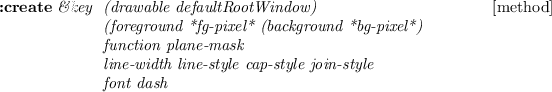.

**:red** [method]

returns the red value of this XColor.

**:blue** [method]

returns the blue value of this XColor.

**:green** [method]

returns the green value of this XColor.

**:rgb** [method]

returns the list of red, green and blue values of this XColor.

**:init** *pix R G B &optional (f 7)*[method]

initializes XColor.

**find-visual** *type depth &optional (screen 0)*[function]

finds the visual-ID of the specified *type* and *depth*. *Type* should
be either
`:StaticGray, :GrayScale, :StaticColor, :pseudoColor, :TrueColor` or
`:DirectColor`. Usually the *depth* should be either 1, 8 or 24.

XToolKit
========

XToolKit is the highest level X window interface to facilitate composing
GUI (Graphical User Interface) by using GUI components such as buttons,
pulldown menus, textWindows, etc., as building blocks. The major
differences from the Xlib classes are, the XToolKit invokes
user-supplied interaction routines corresponding to the Xevents sent
from the Xserver, and provides consistent appearance of those
interaction-oriented window parts. Classes consisting the XToolKit has
the following inheritance structure.

              xwindow
                   panel
                        menubar-panel
                        menu-panel
                        filepanel
                        textviewpanel
                        confirmpanel
                   panel-item
                        button-item
                             menu-button-item
                             bitmap-button-item
                        text-item
                        slider-item
                        choice-item
                        joystick-item
                   canvas
                   textwindow
                        buffertextwindow
                             scrolltextwindow
                        textedit
                   scroll-bar
                        horizontal-scroll-bar

Just below the xwindow class are the five basic XToolKit classes:
`panel`, `panel-item`, `canvas`, `textWindow` and `scroll-bar`.
`Menubar-panel` and `menu-panel` are defined under the `panel`. A basic
strategy to build a new application window and to make it run upon
events is the following:

1.  **define an application class** An application window class should
    be defined as a subclass of **panel** that has the capability to lay
    out XToolKit components.
2.  **define event handlers** In the application class, event handlers
    that are called upon when buttons are pressed or menu items are
    selected are defined. An event handler ought to be defined as a
    method with panel-item specific arguments.
3.  **define subpanels** If you use a `menubar-panel`, it is placed at
    the top of the application window, therefore it should be created
    first by `:create-menubar`. Similarly `menu-panel`s needs to be
    defined before the `menu-button-item`s to which `menu-panel`s are
    associated.
4.  **create panel-items** Panel-items such as `button-item`,
    `text-item`, `slider-item`, etc., can be created by
    `(send-super :create-item class label object method)`. Event
    handlers defined above are connected to each panel-item. These
    initialization procedures should be defined in the `:create` method
    of the application window class. Do not forget to define `quit`
    button to make the event dispatcher terminate whenever needed. Any
    `textWindow` and `canvas` can also be placed in the application
    window via the `:locate-item` method.
5.  **create the entire window** Sending the `:create` message to the
    application class creates the application window with its XToolKit
    components properly placed in the window.
6.  **run the event dispatcher** In order to receive events from the
    Xserver and delivers them to the corresponding xwindow, run
    `window-main-loop`. On Solaris2, `window-main-thread`, which
    delivers events in a different thread, is available.
    `Window-main-thread` keeps the toplevel interaction alive. Do not
    run more than one `window-main-thread`.

X Event
-------

In the current implementation, an event structure is received in a fixed
event buffer (an integer-vector of 25 elements) and the same buffer is
reused on all events. The event structure has to be copied when more
than one events need to be referenced at the same time.

`Window-main-loop` is the function which captures all events sent from
the X server and delivers them to each window where the event happened.

**event** [variable]

a 25-element integer-vector holding the most recent event structure.

**next-event** [function]

stores the event structure in `event` and returns it if there is at
least one pending event, NIL if there is no pending event.

**event-type** *event*[function]

returns the keyword symbol representing the event-type in the *event*
structure. The event-type keywords are: `:KeyPress` (2), `:KeyRelease`
(3), `:ButtonPress` (4), `:ButtonRelease` (5), `:MotionNotify` (6),
`:EnterNotify` (7), `:LeaveNotify` (8), `:FocusIn` (9), `:FocusOut` (0),
`:KeymapNotify` (1), `:Expose` (12), `:GraphicsExpose` (13), `:NoExpose`
(14), `:VisibilityNotify` (15), `:CreateNotify` (16), `:DestroyNotify`
(17), `:UnmapNotify` (18), `:MapNotify` (19), `:MapRequest` (20),
`:ConfigureNotify` (22), `:ConfigureRequest` (23), `:GravityNotify`
(24), `:ResizeRequest` (25), `:CirculateNotify` (26),
`:CirculateRequest` (27), `:PropertyNotify` (28), `:SelectionClear`
(29), `:SelectionRequest` (30), `:SelectionNotify` (31),
`:ColormapNotify` (32), `:ClientMessage` (33), `:MappingNotify` (34),
`:LASTEvent` (35).

**event-window** *event*[function]

returns the window object where the *event* occurred.

**event-x** *event*[function]

extracts the *x* coordinate, (i.e., the horizontal position of the mouse
pointer relatively in the window) out of the *event*.

**event-y** *event*[function]

extracts the *x* coordinate, (i.e., the vertical position of the mouse
pointer relatively in the window) out of the *event*.

**event-width** *event*[function]

returns the eighth element of the *event* structure which represents the
width parameter at the `:configureNotify` event.

**event-height** *event*[function]

returns the ninth element of the *event* structure which represents the
height parameter at the `:configureNotify` event.

**event-state** *event*[function]

returns a list of keywords representing the mouse button and modifier
key state. Keywords are: `:shift, :control, :meta, :left, :middle` and
`:right`. For example, if left mouse button is pressed while shift key
is down, `(:shift :left)` is returned.

**display-events** [function]

displays all xwindow events captured by `x:nextevent`. Control-C is the
only way to terminate this function.

**window-main-loop** *&rest forms*[macro]

receives Xevents and delivers them to window objects where the event
occurred. According to the event-type, methods in the window's class
named
`:KeyPress, :KeyRelease, :ButtonPress, :ButtonRelease, :MotionNotify, :EnterNotify, :LeaveNotify`
and `:ConfigureNotify` are invoked with *event* as the argument. If
*forms* is given, evaluates them each time event arrival is checked.

**window-main-thread** [function]

Do the same thing as `window-main-loop` in a different thread.
`Window-main-thread` is only available on Solaris2. `Window-main-thread`
installs an error handler which does not enter a read-eval-print loop.
After printing the error information, the event processing continues.

Panel
-----

\
 **panel** [class]

      :super   xwindow 
      :slots         (pos items fontid
    rows columns ;total number of rows and columns
    next-x next-y
    item-width item-height) 

Panel is a xwindow with the capability to lay out panel-items or any
xwindows including other panel objects. A panel object supplies the
default font for every panel-item created in the panel. Application
windows should be defined as subclasses of the `Panel`.

creates and initializes a panel. Since superclass's `:create` is
invoked, all creation parameters for **xwindow**, such as *width,
height, border-width*, etc., are allowed. *Item-height* and item-width
give the minimum height and width for each panel-item.

**:items** [method]

returns the list of all items associated.

**:locate-item** *item &optional x y*[method]

*Item* is any xwindow object, normally a panel-item. If *x* and *y* are
given, the item is located there. Otherwise, *item* is located adjacent
to the most recently located item. Items are located from top to bottom,
from left to right, as shown in **Fig.** [17](#panellayout).
`:Locate-item` also adds *item* in the *items* and *subwindows* list,
and makes it visible by sending `:map`.

**Figure 17:** Item lay-out in panel

![\\begin{emtabbing} {\\bf :create-item} \\it klass label receiver
method \\= \\&rest ... ...method]\\\\ \\\> \\&key ((font fontid)\\\\
\\\> \\&allow-other-keys) \\rm \\end{emtabbing}](manual-img107.png)

creates an instance of the panel-item class specified by *klass* (i.e.,
`button-item,  menu-button-item, slider-item, joystick-item`, etc.), and
place the item in the panel using `:locate-item`. *Args* are passed to
`klass`'s `:create` method. *Label* is the identification string drawn
in the panel item. *Receiver* and *method* specify the event handler
called upon the corresponding event.

**:delete-items** [method]

delete all panel-items.

![\\begin{emtabbing} {\\bf :create-menubar} \\it\\= \\&rest args \\\\lq
[method]\\\\ \\\> \\&key (font fontid)\\\\ \\\> \\&allow-other-keys \\rm
\\end{emtabbing}](manual-img108.png)

creates a *menubar-panel* and locates it at the top of the panel.

The following methods are provided to avoid "subclass's responsibility"
warning message when events are sent to panels without event handlers.
User applications should override these methods.

**:quit** *&rest a*[method]

throws `:window-main-loop` and terminates event processing.

**:KeyPress** *event*[method]

returns NIL.

**:KeyRelease** *event*[method]

returns NIL.

**:ButtonPress** *event*[method]

returns NIL.

**:ButtonRelease** *event*[method]

returns NIL.

**:MotionNotify** *event*[method]

returns NIL.

**:EnterNotify** *event*[method]

returns NIL.

**:LeaveNotify** *event*[method]

returns NIL.

### Subpanels (menu-panel and menubar-panel)

\
 **menu-panel** [class]

      :super   panel 
      :slots          (items item-dots item-height
    charwidth charheight
    height-offset
    highlight-item
    color-pixels
    active-color) 

`Menu-panel` is a kind of panel that can locate only `button-item`s
and/or `bitmap-button-item`s. Unlike `panel`, however, `menu-panel` is
normally invisible and is exposed when the `button-item` to which the
`menu-panel` is associated is pressed. If a `menu-panel` is made always
visible, it becomes a pinned menu. The response of each button-item to
mouse events is slightly different from button-items in other panels, as
the mouse button has been pressed somewhere outside the button-item.
Creation of a `menu-panel` should follow the order described below:

1.  create a menu-panel by `(instance menu-panel :create)`.
2.  create button-items or/and bitmap-button-items and locate them in
    the menu-panel by
    `(send aMenuPanel :create-item button-item "BTN" obj meth)`.
3.  create a menu-button-item in another panel and associate the
    menu-panel with the menu-button-item by
    `(instance menu-button-item :create "Option" obj meth :menu-window aMenuPanel)`.

create a menu-panel window. The size of the window is expanded each time
new menu-item is added.

**:create-item** *class label receiver method &rest mesg*[method]

adds a menu item in this menu-panel window and attatches the
corresponding action. The *receiver* objects receives *mesg* when the
mouse button is released on the item.

**menubar-panel** [class]

      :super   panel 
      :slots         

`Menubar-panel` is a subpanel always located at the top of the parent
panel. A menubar-panel resembles with the Macintosh desktop's menubar
which lets out several pull-down menus. Panel-items placed in the
menubar should be `menu-button-item`s. A menubar-panel is created by the
panel's `:create-menubar` method.

### File Panel

The FilePanel is an application window for the interactive manipulation
of files and directories. Using `cd` and `go-up` buttons, any directory
can be visited and files contained in the directory are displayed in the
`ScrollTextWindow` below. Text files can be displayed in different
windows (textViewPanel). Files can also be printed, removed, and
compiled by simply cliking buttons. When a file is printed,
`a2ps file | lpr` commands are executed in a forked process.

**Figure 18:** FilePanel window

### Text View Panel

TextViewPanel is an application window class to display text files (Fig.
[19](#textviewpanel)). The program text is shown to demonstrate how one
of the simplest application windows is described. In the `:create`
method, the quit button and find button, and a text-item to feed the
string to be searched for in the file are created. The view-window is a
ScrollTextWindow that displays the file with the vertical and horizontal
scroll-bars. The TextViewPanel captures `:ConfigureNotify` event to
resize the view-window when the outermost title window is resized by the
window manager.

**Figure 19:** TextViewPanel window

    (defclass TextViewPanel :super panel
            :slots (quit-button find-button find-text view-window))

    (defmethod TextViewPanel
     (:create (file &rest args &key (width 400) &allow-other-keys)
        (send-super* :create :width width args)
        (setq quit-button
              (send self :create-item panel-button "quit" self :quit))
        (setq find-button
              (send self :create-item panel-button "find" self :find))
        (setq find-text
              (send self :create-item text-item "find: " self :find))
        (setq view-window
                (send self :locate-item
                    (instance ScrollTextWindow :create
                       :width (setq width (- (send self :width) 10))
                       :height (- (setq height (send self :height)) 38)
                       :scroll-bar t :horizontal-scroll-bar t
                       :map nil      :parent self)))
        (send view-window :read-file file))
     (:quit (event)  (send self :destroy))
     (:find (event)
        (let ((findstr (send find-text :value)) (found)
              (nlines (send view-window :nlines)))
            (do ((i 0 (1+ i)))
                ((or (>= i nlines) found))
               (if (substringp findstr (send view-window :line i)) (setq found i)))
            (when found
               (send view-window :display-selection found)
               (send view-window :locate found))))
     (:resize (w h)
        (setq width w height h)
        (send view-window :resize (- w 10) (- h 38)))
     (:configureNotify (event)
       (let ((newwidth (send self :width))
             (newheight (send self :height)))
            (when (or (/= newwidth width) (/= newheight height))
              (send self :resize newwidth newheight)))  ) )

Panel Items
-----------

\
 **panel-item** [class]

      :super   xwindow 
      :slots         (pos notify-object notify-method
    fontid label labeldots) 

**Panel-item** is an abstract class for all kinds of panel-item windows
to invoke *notify-object*'s *notify-method* when item-specific event
occurs.

**:notify** *&rest args*[method]

invokes *notify-object*'s *notify-method*. Responsive events and
arguments passed to *notify-method* are item specific:

**button-item**
  ~ The button is pressed and released in the same button-item; the
    argument is the button-item object.
**menu-button-item**
  ~ A menu item is selected; the argument is the menu-button-item
    object.
**choice-item**
  ~ A new choice button is selected; the arguments are the choice-item
    object and the index number of the choice.
**text-item**
  ~ A newline or return is entered; the arguments are the text-item
    object and the entire line (string).
**slider-item**
  ~ The slider nob is grabbed and moved; the arguments are the
    slider-item object and the new value.
**joystick-item**
  ~ The joystick is grabbed and moved; the arguments are the slider-item
    object, the new x and y values.

creates a panel-item. As panel-item is an abstract class, this method
should only be called by the subclasses via `send-super`.

**button-item** [class]

      :super   panel-item 
      :slots         

**button-item** is the simplest panel-item. Button-item has a
rectangular box and a label string in it. When clicked, button-item
invokes *notify-object*'s *notify-method* with the panel-item object as
the only argument.

**:draw-label** *&optional (state :top) (color bg-color) (border 2)
(offset)*[method]

draws button-item's label.

creates a button-item. If button's width and height are not given, the
sizes are automatically set to accomodate the label string drawn with
the given font. Though the border-width is defaulted to 0, pseudo 3D
representation embosses the button. The background color and font are
defaulted to the ones defined for the parent window, i.e. a panel.

**:ButtonPress** *event*[method]

changes the background color to gray, as if the button.

**:ButtonRelease** *event*[method]

changes *event*'s background color to normal.

**menu-button-item** [class]

      :super   button-item 
      :slots         (items item-dots item-labels
    charwidth charheight 
    menu-window window-pos high-light) 

defines a pulldown menu. Though a `menu-button-item` looks like a
`button-item`, the `menu-button-item` activates associated `menu-panel`
below the button when it is pressed, instead of sending an immediate
message to the *notify-object*. The actual message is sent when the
mouse button is released on one of the menu items.

![\\begin{emtabbing} {\\bf :create} \\it\\= label reciever method \\\\lq
[method]\\\\ \\\>\\&... ...key (menu nil) (items) (state :flat)\\\\
\\\>\\&allow-other-keys \\rm \\end{emtabbing}](manual-img114.png)

creates a pulldown menu button. *Receiver* and *method* arguments has no
effect.

**:ButtonPress** *event*[method]

reverses the appearance of the pulldown-menu and exposes the associated
menu-panel below the button.

**:ButtonRelease** *event*[method]

unmaps the `menu-panel` below this button and reverts the appearance of
the button.

**bitmap-button-item** [class]

      :super   button-item 
      :slots         (pixmap-id bitmap-width bitmap-height) 

Though `bitmap-button-item`'s function is similar to the `button-item`,
its appearance is different. Instead of drawing a simple label string on
the button, as is the case for `button-item`, `bitmap-button-item` is
drawn by a pixmap which is loaded from a bitmap-file when the button is
created.

**:draw-label** *&optional (state :flat) (color bg-color) (border
2)*[method]

draws a bitmap/pixmap on the button.

![\\begin{emtabbing} {\\bf :create} \\it bitmap-file reciever method \\=
\\&rest args \\\\lq [method]\\\\ \\\>\\&key width height\\\\
\\\>\\&allow-other-keys)\\rm \\end{emtabbing}](manual-img115.png)

creates bitmap-button-item. The first argument, *bitmap-file* replaces
the *label* argument of `button-item`.

**:draw-label** *&optional (state :flat) (color bg-color) (border
2)*[method]

draw a bitmap/pixmap on the button.

**:create-bitmap-from-file** *fname*[method]

creates pixmap from the bitmap file named *fname*, and stores its id in
*pixmap-id*.

**choice-item** [class]

      :super   button-item 
      :slots          (choice-list active-choice transient-choice 
    choice-dots choice-pos button-size) 

`choice-item` is a set of round choice buttons. One choice is always
active, and only one choice can become active at the same time.
`choice-item` provides the similar function as radio-buttons.

create a choice-item-button. Each choice button is a circle of radius
*button-size*. When a new choice is selected, *notify-object*'s
*notify-method* is invoked with the choice-item object and the index of
the choice selected.

**:value** *&optional (new-choice) (invocation)*[method]

If *new-choice* is given, it is set as the current active choice, and
the corresponding circle is filled black. If *invocation* is also
specified, *notify-object*'s *notify-method* is invoked. `:Value`
returns the current (or new) choice index.

**:draw-active-button** *&optional (old-choice active-choice)
(new-choice active-choice)*[method]

draw active button.

**:buttonPress** *event*[method]

If the mouse button is pressed on any of the choice buttons, its index
is recorded in *transient-choice*. No further action is taken until the
mouse button is released.

**:buttonRelease** *event*[method]

If the mouse button is released on the same button which is already
pressed, the *active-choice* is updated and *notify-object*'s
*notify-method* is invoked.

**slider-item** [class]

      :super   panel-item 
      :slots         (min-value max-value value
    minlabel maxlabel valueformat
    bar-x bar-y bar-width bar-height valuedots label-base
    nob-x nob-moving
    charwidth)  

While `choice-item` is used to select a discrete value, `slider-item` is
used for the continuous value in the range between *min-value* and
*max-value*. Each moment the value is changed, *notify-object*'s
*notify-method* is invoked with the slider-item object and the new value
as the arguments.

creates slider-item. The sliding knob is displayed as a small black
rectangle on a bar. The left end represents the *min* value and the
right end *max* value. The length of the bar stretches for the *span*
dots. The current value is displayed to the right of the slider-item
label in the *value-format*.

**:value** *&optional newval invocation*[method]

If *newval* is given, it is set as the current value, and the knob is
slided to the corresponding location. If *invocation* is also specified
non nil, *notify-object*'s *notify-method* is invoked. `:Value` returns
the current (or new) value.

**joystick-item** [class]

      :super   panel-item 
      :slots          (stick-size min-x min-y max-x max-y
    center-x center-y stick-x stick-y
    value-x value-y
    stick-return stick-grabbed
    fraction-x fraction-y) 

`joystick-item` can be regarded as the two-dimensional slider-item. Two
continuous values can be specified by the moving black circle on the
coaxial chart that looks like a web (Fig. [20](#panelitem)).

*Stick-size* is the radius of the stick's black circle. The sizes of the
circles in the coaxial chart are determined according to the width and
height of the joystick-item window. If *return* is non-NIL, the joystick
returns to the origin when the mouse button is released. Otherwise, the
joystick remains at the released position.

**:value** *&optional (newx) (newy) (invocation)*[method]

If both *newx* and *newy* are given, they are set as the current values,
and the joystick moves to the corresponding location on the coaxial
chart. If *invocation* is also specified non nil, *notify-object*'s
*notify-method* is invoked with the joystick-item object and x and y
values as the arguments. `:Value` returns the list of current (or new)
values.

The following short program shows how to use panel-items described
above, and Fig. [20](#panelitem) depicts how they appear in a panel.

    (in-package "X")
    (defclass testPanel :super panel
            :slots (quit joy choi sli))
    (defmethod testPanel
     (:create (&rest args)
        (send-super* :create :width 210 :height 180 
                     :font font-courb12 args)
        (send-super :create-item button-item "quit" self :quit :font font-courb14)
        (send-super :create-item choice-item "choice" self :choice
                    :choices '(" A " " B " " C ")
                    :font font-courb12)
        (send-super :create-item slider-item "slider" self :slider
                    :span 90)
        (send-super :create-item joystick-item "joy" self :joy)
        self)
     (:choice (obj c) (format t "choice: ~S ~d~%" obj c))
     (:slider (obj val) (format t "slider: ~S ~s~%" obj val))
     (:joy (obj x y) (format t "joy: ~S ~s ~s~%" obj x y)) )
    (instance testPanel :create)
    (window-main-thread)

**Figure 20:** Panel items created in a panel

\
 **text-item** [class]

      :super   panel-item 
      :slots         (textwin) 

`Text-item` is used to display or to input one short line of text, such
as a file name. A `text-item` has a label string followed by a small
textwindow on the right. When the pointer is put in the textwindow, key
input is enabled and the characters typed are buffered. Line editing is
available in the textwindow: `control-F` and `control-B` to move
forward/backward by one character, `del` to delete the character on the
left of the cursor, `control-D` to delete the character on the cursor,
and any graphical character to insert it at the cursor position.
Clicking a mouse button moves the cursor to the clicked character.
Hitting an enter (newline) key causes the buffered text to be sent to
the *notify-object*'s *notify-method*.

creates text-item. Though the linebuffer of the textwindow may have
unlimited length, visible portion is restricted to the *columns*
characters.

**:getstring** [method]

returns the string in the key buffer.

Canvas
------

\
 **canvas** [class]

      :super   xwindow 
      :slots         (topleft bottomright) 

Canvas is a xwindow to interact with figures or images. Currently, only
the region selection capability has been implemented. At the buttonPress
event, the canvas begins to draw a rectangle with the topleft corner at
the pressed position and bottomright corner at the current pointer.
ButtonRelease causes the `notify-method` to be sent to the
`notify-object`. Use Xdrawable's methods to draw figures or images in
the canvas.

Text Window
-----------

There are three textwindow classes, `TextWindow`, `BufferTextWindow` and
`ScrollTextWindow`.

\
 **textWindow** [class]

      :super   xwindow 
      :slots         (fontid 
    charwidth charheight charascent dots 
    win-row-max win-col-max 
    win-row win-col   ;physical current position in window 
    x y
    charbuf         ; for charcode conversion 
    keybuf keycount          ;for key input
    echo 
    show-cursor cursor-on        ;boolean
    kill delete          ;control character 
    notify-object notify-method 
    ) 

realizes virtual terminals usable for displaying messages. The displayed
contents are not buffered and there is no way to retrieve a line or a
character already displayed in the TextWindow. Basically, `TextWindow`
has similar capabilities to the dumb terminals, that are, moving the
cursor, erasing lines, erasing areas, scrolling displayed texts,
inserting strings, etc. Also, the text cursor can be moved to the
position designated by the mouse pointer.

**:init** *id*[method]

initializes *id*th text-window.

![\\begin{emtabbing} {\\bf :create} \\it\\=\\&rest args \\\\lq
[method]\\\\ \\\>\\&key \\=width... ...tify-object nil) (notify-method
nil)\\\\ \\\>\\&allow-other-keys \\rm
\\end{emtabbing}](manual-img121.png)

creates text-window. The sizes of the window may be specified either by
*width* and *height* or by *rows* and *columns*. *Notify-object*'s
*notify-method* is invoked when a newline character is typed in.

**:cursor** *flag*[method]

The *flag* can either be `:on, :off` or `:toggle`. The text cursor is
addressed by the *win-row* and *win-col*. The text cursor is displayed
if *flag* is `:on`, is erased if *flag* is `:off`, or is reversed if
*flag* is `:toggle`. This method must be invoked frequently whenever the
character at the cursor is updated.

**:clear** [method]

clears text-window.

**:clear-eol** *&optional (r win-row) (c win-col) (csr :on)*[method]

clears the rest of the line after the character addressed by r and *c*,
including the character at the cursor.

**:clear-lines** *lines &optional (r win-row)*[method]

clears multiple lines after *r*-th row.

**:clear-eos** *&optional (r win-row) (c win-col)*[method]

clears the region after the character addressed by *r* and *c* till the
end-of-the-screen.

**:win-row-max** [method]

returns the maximum number of lines displayable in this window.

**:win-col-max** [method]

returns the maximum number of columns displayable in this window.

**:xy** *&optional (r win-row) (c win-col)*[method]

calculates the pixel coordinates of the character addressed by *r* and
*c*.

**:goto** *r c &optional (cursor :on)*[method]

moves the cursor to *r*-th row and *c*-th column.

**:goback** *&optional (csr :on)*[method]

moves the cursor backward by one.

**:advance** *&optional (n 1)*[method]

moves the cursor forward by *n* characters.

**:scroll** *&optional (n 1)*[method]

scroll textwindow vertically by *n* lines.

**:horizontal-scroll** *&optional (n 1)*[method]

horizontally scrolls the text by *n* columns.

**:newline** [method]

moves cursor to the beginning of the next line.

**:putch** *ch*[method]

inserts the character *ch* at the cursor position. The rest of the line
is moved forward by one.

**:putstring** *str &optional (e (length str))*[method]

places *str* at the cursor position.

**:event-row** *event*[method]

**:event-col** *event*[method]

returns the text cursor position designated by  in the *event*.

**:KeyPress** *event*[method]

inserts the character entered at the cursor position. If the character
is newline, notification is sent to the *notify-object*.

**textWindowStream** [class]

      :super   stream 
      :slots         (textwin) 

`TextWindowStream` is an output stream connected to a TextWindow.
Characters or strings output to this stream by using
`print, format, write-byte`, etc., are displayed in the textwindow. As
usual file streams, the output data are buffered.

**:flush** [method]

flushes buffered text string and send them to the textwindow.
`Finish-output` or writing a newline character to this stream
automatically calls this method.

**make-text-window-stream** *xwin*[function]

makes text-window-stream and returns the stream object.

**BufferTextWindow** [class]

      :super   TextWindow 
      :slots         (linebuf expbuf max-line-length row col) 

maintains the line buffer representing the contents of the textwindow.
Linebuf is the vector of lines. Expbuf holds tab-expanded text. Only
lines displayable in the window are maintained. BufferTextWindows can be
used as simple text editors which have several, often only one, lines of
text. `Text-item` employs a BufferTextWindow as a displayable line
buffer.

**:line** *n*[method]

returns the contents of the *n*-th line as a string.

**:nlines** [method]

returns number of lines in the linebuf.

**:all-lines** [method]

returns the linebuf, which is a vector of strings.

**:refresh-line** *&optional (r win-row) (c win-col)*[method]

redraws the *r*-th line after the *c*-th column.

**:refresh** *&optional (start 0)*[method]

redraws the lines after the *start*-th line inclusively.

**:insert-string** *string*[method]

inserts *string* at the cursor position.

**:insert** *ch*[method]

inserts the character at the cursor.

**:delete** *n*[method]

deletes *n* characters after the cursor.

**expand-tab** *src &optional (offset 0)*[function]

*Src* is a string possibly containing tabs. These tabs are replaced by
spaces assuming the tab stops at every 8th position.

**ScrollTextWindow** [class]

      :super   BufferTextWindow 
      :slots         (top-row top-col   ;display-starting position 
    scroll-bar-window 
    horizontal-scroll-bar-window 
    selected-line) 

`ScrollTextWindow` defines buffertextwindow with unlimited number of
lines, and vertical and horizontal scroll-bars can be attached.
ScrollTextWindow can handle `:configureNotify` event to resize itself
and accompanying scroll-bar windows, and to redisplay texts. By
clicking, a line can be selected.

**:create** *&rest args &key (scroll-bar nil) (horizontal-scroll-bar
nil) &allow-other-keys*[method]

When scroll-bars are needed, specify T to each keyword argument.

**:locate** *n*[method]

displays the buffered text by placing the *n*-th line at the top of the
window.

**:display-selection** *selection*[method]

*Selection* represents the location of the selected line. The entire
seleced line is displayed highlighted.

**:selection** [method]

returns the selected line (string).

**:read-file** *fname*[method]

reads the textfile specified by *fname* into the *linebuf*, expands
tabs, and display in the window. The cursor is put at the beginning of
the screen.

**:display-string** *strings*[method]

*Strings* is a sequence of lines (strings). The *strings* are copied in
the linebuf and displayed in the window.

**:scroll** *n*[method]

vertically scrolls *n* lines.

**:horizontal-scroll** *n*[method]

horizontally scrolls *n* columns.

**:buttonRelease** *event*[method]

The line where the mouse pointer is located is selected. If notification
is specified when the window is created, *notify-object*'s
*notify-method* is invoked.

**:resize** *w h*[method]

changes the size of the window and redisplays the contents according to
the new size. The same message is sent to scroll-bars if attached.

PostgreSQL Database
===================

PostgreSQL
----------

PostgreSQL is a free implementation of the relational database system,
which is available from ` http://www.postgresql.org`. Once PostgreSQL is
installed on your computer, EusLisp provides links to the databases via
the `libpq.so` library.

  ~ Connecting to the Postgres database Instantiate pq:pgsql with proper
    arguments. In most cases, you just want to specify the database name
    and the user name. If you don't know, just trust the defaults,
    namely (instance pq:pgsql :init) is usually ok to make a connection.
  ~ Synchronous data transfer There are the synchronous and asynchronous
    interface in libpq.so. Synchronous transfer is easier. You send SQL
    commands by :exec method of the pgsql object, and get the result.
    (send db :exec "select typname,oid from pg\_type order by oid") will
    give you a list of all data types defined in your database.
  ~ Asynchronous database access For asynchronous processing, you have
    to define a function or method to receive a query result as the
    first argument. Let's assume the receiver function is 'print'. Then
    a query should be issued by the :sendQuery method with the receiver
    function name as the second argument. (send db :sendQuery "select
    oid from pg\_type" 'print)
  ~ Type conversion Postgres database stores data in a variety of forms
    internally, but every data item transferred between the database and
    the client is always converted to the string format. Thus, integer
    1234 is "1234", and a symbol 'SYMBOL is "symbol". But, of course,
    since we want to access a database to store lisp data, they should
    be handled as lisp integers and lisp symbols. I found the datatype
    information is stored in the pg\_type table. When we get data from a
    table, we can also retrieve the oid (object id) attributed to each
    field. By looking up pg\_type table with the oid, we can know the
    datatype name, such as integer, character, date, etc. However, there
    is no symbol! We can use the 'name' type instead, but still there is
    incoherency to use as lisp symbol type, since there is no escapes
    (vertical bar and backslash) and lower-case to upcase conversion. I
    mean if we use the 'intern' function to change the 'name' object to
    symbol, it becomes a symbol with the lower case print-name. Do we
    call string-upcase before interning? Usually it works, but not
    always, because escapes are ignored. So I defined input and output
    function for Postgres in 'symbol\_io.c'. There is also a Makefile
    for it. Make symbol\_io.so and copy it to /usr/local/pgsql/lib.
    Invoke psql, and type "isymbol\_io.sql", which will make postgres to
    load the lisp\_symbol\_io functions, and and define the symbol type.
    Call make-type-hashtab function once before any other database
    retrieval for the faster type look-up. Then, every data transfered
    from the database is converted properly. Currently, symbol, int,
    float, char (string), date, time, datetime are coerced to
    corresponding lisp objects. Other unknown type data are represented
    by strings.

The following codes put in another file will load this database module,
creates the \*type-hashtab\*, and reads the type list.

    (load "pgsql")
    (in-package "USER")
    (unless (boundp 'db)
       (setq db (instance pq:pgsql :init) ))
    (send db :exec "select * from family")
    (pq:make-type-hashtab db)
    (setq types (send db :exec "select typname,oid from pg\_type order by oid"))

**pgsql** [class]

      :super   propertied-object 
      :slots         ... 

**:init** *key host port dbname user password*[method]

connects to a database designated by host, port and dbname. Host is
defaulted to the localhost. The default port number is 5432. Default
values to dbname and user are obtained from the USER environment
variable.

**:type-conversion** *flag*[method]

Basically, every result delivered by a database query consists of a
string. If type-conversion is set to NIL, no type conversion is
performed, and query result is returned as a list of strings. If
type-conversion is set to T, number is coerced to number, and symbol is
interned in the current package.

**:exec** *sql*[method]

sends the SQL command to the database. EusLisp waits for the completion
of the database processing and retrieves the results in a synchronous
manner.

**pq:table-fields** *db table*[function]

returns the list of all fields in the table managed in the *db*
database. Each list element is again a list, describing the field number
starting from one, the symbolic field name, and the field type, such as
text, int4, symbol, etc.

**pq:table-attributes** *db table*[function]

returns a list that describes attributes of the given table in db. The
attributes are, name, owner, read-write grants, number of fields, etc.

**pq:query** *db handler &rest sql*[function]

sends an SQL command composed by the sql arguments to db. If handler is
specified, the data retrieval is processed in asynchronous manner. The
handler function is invoked when the database processing result arrives.
The SQL command is composed by combining *sql* arguments by the *format*
function.

**pq:tables** *db*[function]

returns a list of all tables created in db.

**pq:delimit-list** *xlist delimiter*[function]

returns a string combining *xlist* with the constant delimter string.
For example, (delimit-list '(a b c) 'or) returns "a or b or c". This
function is useful to compose SQL commands.

**pq:select** *db fields table &key where limit limit-offset
order-by*[function]

sends an SQL command composed by the argument, and retrieves the result
in the synchronous manner. The following example gives a list of id,
name and email selected from the address\_book table where the email
ends with ".go.jp". Number of output lists are limited to 10, and the
result is sorted by 'id'.

    (select db '(id name email) 'address_book
         :where "email like '\*.go.jp'"
         :limit 10
         :order-by 'id)

**pq:record-count** *db table*[function]

returns the number of records in the table. db is a pgsql object.

HTTP
====

HTTP Client
-----------

**URL-pathname** [class]

      :super   pathname 
      :slots         server port protocol 

extends pathname to allow URL notation.

**url-pathname** *name*[function]

instantiates url-pathname class object from url string or url-pathname
class object.

**escape-url** *url &optional (ss \*standard-output\*) (queryp
t)*[function]

writes percent-escaped `url` to stream `ss` (default:
`*standard-output*`). If `queryp` is T, then `Space` in `url` is encoded
to `+`, otherwise escaped as `Space`. This option is convenient for
sending url query to server with separation.

**escaped-url-string-from-namestring** *url-string &optional (queryp
t)*[function]

returns result of `escape-url` as string.

**unescape-url** *url &optional (ss \*standard-output\*) (queryp
t)*[function]

unescapes percent-escaped `url` and writes unescaped url to stream `ss`.

**unescaped-url-string-from-namestring** *url-string &optional (queryp
t)*[function]

returns result of `unescape-url` as string.

**read-http** *url &key (timeout 10) (retry 5)*[function]

makes a socket connection to the designated url, and read the html
document. The result is a list of tags and plain strings. HTML tags are
converted as lists consisting of the tag-name and argument lists. For
example, the following html document, results in the following list.
Note that tags are represented as lists, in which the directive is
represented as a symbol followed by symbols or strings. Whether an
argument is represented as symbol or string reflects how the original
argument is described.

    <body bgcolor=#ffa080>
    <h1> EusLisp Title</h1>
    <li> item1 </li>
    <a href="http://www.etl.go.jp/~matsui/eus/euslisp.html"> euslisp</a>
    </body>

    ("HTTP/1.1 200 OK"
     "Date: Sun, 21 May 2000 11:47:00 GMT"
     "Server: Apache/1.3.9 (Unix)"
     "Last-Modified: Sun, 21 May 2000 11:19:35 GMT"
     "ETag: \"4f014-c7-3927c647\""
     "Accept-Ranges: bytes"
     "Content-Length: 199"
     "Content-Type: text/html"
     (head) (title) " Toshihiro Matsui on t570" (/title) (/head)
     (body bgcolor |#FFA080|)
     (h1) " Title Line" (/h1)
     (li) " item1 " (/li)
     (a href "http://www.etl.go.jp/~matsui/eus/euslisp.html")
     " euslisp"
     (/a)
     (/body))

**extract-html** *tag html-list*[function]

returns a list of strings (and tags) sandwitched by tag and /tag.

**remove-html-tags** *html-list*[function]

removes tags from the html-list leaving only texts (strings).

HTTP CGI Programming
--------------------

EusLisp can be used for CGI programming. The following is a typical cgi
entry to a EusLisp program. This code piece should be placed under
.../cgi-bin/ or under any directories where ExecCGI is allowed. The code
piece must have execute permission by the \`nobody' user. Note that CGI
programs are executed by httpd whose owner is nobody. You also have to
set up some environment variables in the code piece, for nobody does not
know anything particular for EusLisp.

    #! /bin/csh
    setenv EUSDIR /usr/local/eus/
    setenv LD_LIBRARY_PATH /usr/local/eus/Linux/lib
    /usr/local/bin/eus /usr/local/eus/lib/demo/mycgi.l

mycgi.l is a lisp source program, which should load
"$EUSDIR/lib/llib/httpcgi.l" at the beginning. The CGI program is
responsible for obtaining CGI arguments, generating an html header, and
producing html contents. The arguments are obtained by the
`get-cgi-query` function, and split to a list by the `parse-cgi-query`
function. The parsed list contains pairs of argument-name and
argument-value. For example, if the CGI is invoked by href to
"/cgi-bin/eus.cgi?user=matsui&age=43", the parsed list gives ((user
matsui) (age 43)).

All normal CGI output should go to \*cgi-out\*. Before any html
document, a header should be generated by the `html-header` function. If
there is any error message written to \*error-output\*, it appears in
the httpd's error-log. When the work is done and html document finishes
by '</html\> tag, the process may close the connection (\*cgi-out\*) and
may exit. Normal exit of the CGI process usually signals the httpd to
send the data to http clients.

\*cgi-out\* is the output stream to which the generated html document
should be sent.

**gen** *string*[function]

Outputs the string to \*cgi-out\* stream, which is then forwarded to to
the client (browser).

**html** *args ...*[function]

generates args as one string.

**html-table** *lst &key heading (table-option "")*[function]

generates an html table.

**get-cgi-query** [function]

gets the argument to this CGI program. First, the REQUEST\_METHOD
environment variable is looked up, and the POST/GET method is
determined. The query string is obtained from the QUERY\_STRING
environment variable or from the standard input. Anyways, the result is
returned in one string.

**parse-http-query** *query-string*[function]

**html-header** [function]

generates the html header, usually a simple string of two lines,
"Content-type: text/html\~%\~%".

**qval** *arg query*[function]

arg (symbol) is searched in the query list, and the value is returned if
found. The result is converted to euc encoding from sjis encoding.

Fast-CGI
--------

Whereas CGI is a convenient method to produce dynamic document on the
server side, it is not the very best choice due to a performance reason:
the cgi process must be spawned everytime a request arrives, and the
process invocation time is not always negligible. In my measurement, the
simplest CGI written in EusLisp needs 0.3 sec to respond. In this sense,
EusLisp or any other programming system with rich runtime modules is not
a very good choice for CGI writing.

Since this invocation load is a common problem for all CGI programs,
there is a clever work around called Fast-CGI. The basic idea of the
Fast-CGI is to allow CGI processes to keep alive even one CGI request is
fulfilled. The httpd process communicates with a fast-cgi process via a
TCP connection.

\
 **fcgi-connection** [class]

      :super   propertied-object 
      :slots         cookie host 

**fcgi-loop** *&rest forms*[macro]

repeats evaluation of *forms* each time http connection request is
accepted.

Index
-----

**\***

[Generic Number Functions](manual.html#6163) |
[Packages](manual.html#8073) | [Top-level
Interaction](manual.html#18896)

**\*\***

[Top-level Interaction](manual.html#18906)

**\*\*\***

[Top-level Interaction](manual.html#18916)

**\*256to16\***

[Look-Up Tables (LUT)](manual.html#38483)

**\*256to32\***

[Look-Up Tables (LUT)](manual.html#38493)

**\*256to8\***

[Look-Up Tables (LUT)](manual.html#38473)

**\*bisque1\***

[Xlib global variables and](manual.html#42784)

**\*bisque2\***

[Xlib global variables and](manual.html#42795)

**\*bisque3\***

[Xlib global variables and](manual.html#42806)

**\*blue-gc\***

[Edge Finder](manual.html#39371)

**\*cyan-gc\***

[Edge Finder](manual.html#39401)

**\*gray\***

[Xlib global variables and](manual.html#42773)

**\*gray-pixmap\***

[Xlib global variables and](manual.html#42696)

**\*gray25-gc\***

[Xlib global variables and](manual.html#42740)

**\*gray25-pixmap\***

[Xlib global variables and](manual.html#42707)

**\*gray32\***

[Look-Up Tables (LUT)](manual.html#38503)

**\*gray50-gc\***

[Xlib global variables and](manual.html#42751)

**\*gray50-pixmap\***

[Xlib global variables and](manual.html#42719)

**\*gray75-gc\***

[Xlib global variables and](manual.html#42762)

**\*gray75-pixmap\***

[Xlib global variables and](manual.html#42730)

**\*green-gc\***

[Edge Finder](manual.html#39381)

**\*keyword-package\***

[Packages](manual.html#8115)

**\*lightblue2\***

[Xlib global variables and](manual.html#42817)

**\*lightpink1\***

[Xlib global variables and](manual.html#42828)

**\*lisp-package\***

[Packages](manual.html#8075)

**\*maroon\***

[Xlib global variables and](manual.html#42839)

**\*max-intensity\***

[Xlib global variables and](manual.html#42850)

**\*modules\***

[Program Loading](manual.html#19191)

**\*optimize\***

[Compilation](manual.html#19114)

**\*program-name\***

[Top-level Interaction](manual.html#18937)

**\*prompt-string\***

[Top-level Interaction](manual.html#18926)

**\*rainbow32\***

[Look-Up Tables (LUT)](manual.html#38516)

**\*red-gc\***

[Edge Finder](manual.html#39361)

**\*safety\***

[Compilation](manual.html#19134)

**\*system-package\***

[Packages](manual.html#8105)

**\*top-selector\***

[Top-level Interaction](manual.html#19010)

**\*unix-package\***

[Packages](manual.html#8095)

**\*user-package\***

[Packages](manual.html#8085)

**\*verbose\***

[Compilation](manual.html#19124)

**\*x-color-lut\***

[Look-Up Tables (LUT)](manual.html#38462)

**\*x-gray16-lut\***

[Look-Up Tables (LUT)](manual.html#38451)

**\*x-gray32-lut\***

[Look-Up Tables (LUT)](manual.html#38439)

**\*xy-plane\***

[Primitive Body Creation](manual.html#32179)

**\*yellow-gc\***

[Edge Finder](manual.html#39391)

**\*yz-plane\***

[Primitive Body Creation](manual.html#32190)

**\*zx-plane\***

[Primitive Body Creation](manual.html#32201)

**+**

[Generic Number Functions](manual.html#6139) | [Top-level
Interaction](manual.html#18866)

**++**

[Top-level Interaction](manual.html#18876)

**+++**

[Top-level Interaction](manual.html#18886)

**-**

[Generic Number Functions](manual.html#6150) | [Top-level
Interaction](manual.html#18856)

**-2pi**

[Arithmetic Constants](manual.html#5753)

**-pi**

[Arithmetic Constants](manual.html#5743)

**-pi/2**

[Arithmetic Constants](manual.html#5763)

**/**

[Generic Number Functions](manual.html#6174)

**/=**

[Arithmetic Predicates](manual.html#5861)

**1+**

[Integer and Bit-Wise Operations](manual.html#5985)

**1-**

[Integer and Bit-Wise Operations](manual.html#5975)

**2pi**

[Arithmetic Constants](manual.html#5723)

**:**

[Type Specifier](manual.html#1237) | [Type Specifier](manual.html#1241)
| [Type Specifier](manual.html#1245) | [Type
Specifier](manual.html#1247) | [Type Specifier](manual.html#1255) |
[Type Specifier](manual.html#1259) | [Type Specifier](manual.html#1269)
| [Type Specifier](manual.html#1273) | [Type
Specifier](manual.html#1277) | [Evaluators](manual.html#18799) |
[Evaluators](manual.html#18803)

**:4x4**

[Coordinates](manual.html#27803)

**:add**

[Date and Time](manual.html#14850) |
[Synchronization](manual.html#25897)

**:adjust-viewport**

[Viewer](manual.html#36076)

**:advance**

[Text Window](manual.html#48141)

**:affix**

[Multi-Joint Manipulators](manual.html#41411)

**:all-edges**

[Plane and Face](manual.html#31639)

**:all-lines**

[Text Window](manual.html#48319)

**:all-method-names**

[Basic Classes](manual.html#4428)

**:all-methods**

[Basic Classes](manual.html#4418)

**:all-vertices**

[Plane and Face](manual.html#31650)

**:alloc**

[Colors and Colormaps](manual.html#44124)

**:allocate-colors**

[Colors and Colormaps](manual.html#44204)

**:allocate-private-colors**

[Colors and Colormaps](manual.html#44193)

**:amplify**

[Pixel-Image](manual.html#38769)

**:and**

[Pixel-Image](manual.html#38877)

**:angle**

[Line and Edge](manual.html#31226)

**:angles**

[Multi-Joint Manipulators](manual.html#41349)

**:approximated-p**

[Line and Edge](manual.html#31281)

**:arc**

[Xwindow](manual.html#43248)

**:area**

[Plane and Face](manual.html#31597) | [Plane and
Face](manual.html#31672)

**:armsolcoords**

[Multi-Joint Manipulators](manual.html#41219)

**:aspect**

[Projection](manual.html#35727)

**:assoc**

[CascadedCoords](manual.html#27882)

**:associate**

[Xwindow](manual.html#43604)

**:attributes**

[Xwindow](manual.html#43637)

**:average-pixel**

[Pixel-Image](manual.html#38636)

**:background**

[Xwindow](manual.html#43760) | [Graphic Context](manual.html#43922)

**:background-pixmap**

[Xwindow](manual.html#43775)

**:below**

[Miscellaneous Geometric Functions](manual.html#30810)

**:binormal**

[Line and Edge](manual.html#31215)

**:blue**

[Color-Pixel-Image](manual.html#38982) | [Colors and
Colormaps](manual.html#44408)

**:body**

[Miscellaneous Geometric Functions](manual.html#30823) | [Line and
Edge](manual.html#31181)

**:body-type**

[Plane and Face](manual.html#31749) | [Body](manual.html#32107)

**:border**

[Xwindow](manual.html#43785)

**:box**

[Miscellaneous Geometric Functions](manual.html#30711) | [Line and
Edge](manual.html#30965) | [Plane and Face](manual.html#31445) |
[Body](manual.html#31924)

**:boxtest**

[Line and Edge](manual.html#30976) | [Plane and Face](manual.html#31455)

**:brightest-pixel**

[Pixel-Image](manual.html#38616)

**:brightness-distribution**

[Pixel-Image](manual.html#38824)

**:ButtonPress**

[Panel](manual.html#47357) | [Panel Items](manual.html#47573) | [Panel
Items](manual.html#47630) | [Panel Items](manual.html#47778)

**:ButtonRelease**

[Panel](manual.html#47367) | [Panel Items](manual.html#47583) | [Panel
Items](manual.html#47640) | [Panel Items](manual.html#47789) | [Text
Window](manual.html#48504)

**:centroid**

[Plane and Face](manual.html#31682) | [Body](manual.html#31964)

**:change-attributes**

[Graphic Context](manual.html#44048)

**:changed**

[CascadedCoords](manual.html#27904)

**:cid**

[Basic Classes](manual.html#4460)

**:clear**

[Xwindow](manual.html#43372) | [Xwindow](manual.html#43806) | [Text
Window](manual.html#48042)

**:clear-area**

[Xwindow](manual.html#43383) | [Xwindow](manual.html#43816)

**:clear-eol**

[Text Window](manual.html#48052)

**:clear-eos**

[Text Window](manual.html#48075)

**:clear-lines**

[Text Window](manual.html#48064)

**:close-fingers**

[Multi-Joint Manipulators](manual.html#41339)

**:collinear-line**

[Line and Edge](manual.html#31071)

**:collinear-point**

[Line and Edge](manual.html#31043)

**:color**

[Xwindow](manual.html#43362)

**:colormap**

[Xwindow](manual.html#43707)

**:common-box**

[Body](manual.html#31985)

**:common-perpendicular**

[Line and Edge](manual.html#31020)

**:compress-gray-scale**

[Pixel-Image](manual.html#38780)

**:config**

[Multi-Joint Manipulators](manual.html#41279)

**:constraint**

[Bodies in Contact](manual.html#34773)

**:contourp**

[Line and Edge](manual.html#31270)

**:coords**

[Coordinates](manual.html#27557)

**:coplanar**

[Line and Edge](manual.html#31083)

**:coplanar-line**

[Plane and Face](manual.html#31365)

**:coplanar-point**

[Plane and Face](manual.html#31354)

**:copy**

[Graphic Context](manual.html#43900)

**:copy-coords**

[Coordinates](manual.html#27568)

**:copy-from**

[Pixel-Image](manual.html#38715) | [Xwindow](manual.html#43197)

**:copy-worldcoords**

[Coordinates](manual.html#27620)

**:corners**

[Miscellaneous Geometric Functions](manual.html#30800)

**:correlation**

[Tracking](manual.html#39429)

**:create**

[Multi-Joint Manipulators](manual.html#41436) |
[Xwindow](manual.html#43422) | [Xwindow](manual.html#43491) | [Graphic
Context](manual.html#43868) | [Colors and Colormaps](manual.html#44369)
| [Panel](manual.html#47237) | [Subpanels (menu-panel and
menubar-panel)](manual.html#47439) | [Panel Items](manual.html#47519) |
[Panel Items](manual.html#47562) | [Panel Items](manual.html#47617) |
[Panel Items](manual.html#47683) | [Panel Items](manual.html#47739) |
[Panel Items](manual.html#47826) | [Panel Items](manual.html#47876) |
[Panel Items](manual.html#47931) | [Text Window](manual.html#48004) |
[Text Window](manual.html#48416)

**:create-bitmap-from-file**

[Panel Items](manual.html#47707)

**:create-from-bitmap-file**

[Xwindow](manual.html#43435)

**:create-item**

[Panel](manual.html#47284) | [Subpanels (menu-panel and
menubar-panel)](manual.html#47450)

**:create-menubar**

[Panel](manual.html#47314)

**:creation-form**

[Body](manual.html#32097)

**:csg**

[Body](manual.html#32066)

**:cursor**

[Text Window](manual.html#48021)

**:darkest-pixel**

[Pixel-Image](manual.html#38626)

**:dash**

[Graphic Context](manual.html#44002)

**:day**

[Date and Time](manual.html#14770)

**:define-gray-scale-LUT**

[Colors and Colormaps](manual.html#44228)

**:define-hls-LUT**

[Colors and Colormaps](manual.html#44254)

**:define-LUT**

[Colors and Colormaps](manual.html#44215)

**:define-rainbow-LUT**

[Colors and Colormaps](manual.html#44269)

**:define-rgb-LUT**

[Colors and Colormaps](manual.html#44243)

**:delete**

[Text Window](manual.html#48373)

**:delete-items**

[Panel](manual.html#47304)

**:depth**

[Xwindow](manual.html#43687)

**:dequeue**

[Queue](manual.html#11837)

**:destroy**

[Xwindow](manual.html#43456) | [Xwindow](manual.html#43570) | [Colors
and Colormaps](manual.html#44171)

**:difference**

[Date and Time](manual.html#14840)

**:digitize**

[Pixel-Image](manual.html#38864)

**:direction**

[Line and Edge](manual.html#30935)

**:display**

[Pixel-Image](manual.html#38693) |
[Color-Pixel-Image](manual.html#39078)

**:display-lut**

[Pixel-Image](manual.html#38682) |
[Color-Pixel-Image](manual.html#39090)

**:display-selection**

[Text Window](manual.html#48437)

**:display-string**

[Text Window](manual.html#48470)

**:dissoc**

[CascadedCoords](manual.html#27893)

**:dissociate**

[Xwindow](manual.html#43615)

**:distance**

[Line and Edge](manual.html#30997) | [Plane and Face](manual.html#31343)
| [Body](manual.html#32053)

**:draw**

[Viewer](manual.html#36304)

**:draw-active-button**

[Panel Items](manual.html#47768)

**:draw-arc-ndc**

[Viewer](manual.html#36138)

**:draw-arrow**

[Viewer](manual.html#36237)

**:draw-axis**

[Viewer](manual.html#36293)

**:draw-body**

[Viewer](manual.html#36282)

**:draw-box**

[Viewer](manual.html#36226)

**:draw-box-ndc**

[Viewer](manual.html#36128)

**:draw-edge**

[Viewer](manual.html#36249)

**:draw-edge-image**

[Viewer](manual.html#36260)

**:draw-faces**

[Viewer](manual.html#36271)

**:draw-fill-arc-ndc**

[Viewer](manual.html#36149)

**:draw-fill-rectangle-ndc**

[Viewer](manual.html#36193)

**:draw-image-string-ndc**

[Viewer](manual.html#36171)

**:draw-label**

[Panel Items](manual.html#47552) | [Panel Items](manual.html#47673) |
[Panel Items](manual.html#47697)

**:draw-line**

[Viewer](manual.html#36204) | [Xwindow](manual.html#43329)

**:draw-line-ndc**

[Viewer](manual.html#36097)

**:draw-polyline-ndc**

[Viewer](manual.html#36108)

**:draw-rectangle-ndc**

[Viewer](manual.html#36182)

**:draw-star**

[Viewer](manual.html#36215)

**:draw-star-ndc**

[Viewer](manual.html#36118)

**:draw-string-ndc**

[Viewer](manual.html#36159)

**:drawable**

[Xwindow](manual.html#43100)

**:duplicate**

[Pixel-Image](manual.html#38705)

**:edge**

[Plane and Face](manual.html#31476)

**:edge1**

[Pixel-Image](manual.html#38902) |
[Color-Pixel-Image](manual.html#39103)

**:edges**

[Plane and Face](manual.html#31466) | [Body](manual.html#31904)

**:empty?**

[Queue](manual.html#11847)

**:end-point**

[Line and Edge](manual.html#30947)

**:enqueue**

[Queue](manual.html#11827)

**:enter-face**

[Plane and Face](manual.html#31799)

**:enter-hole**

[Plane and Face](manual.html#31704)

**:EnterNotify**

[Panel](manual.html#47387)

**:erase**

[Viewer](manual.html#36322)

**:Euler**

[Coordinates](manual.html#27777) | [Body](manual.html#31934)

**:event-col**

[Text Window](manual.html#48216)

**:event-row**

[Text Window](manual.html#48206)

**:evert**

[Body](manual.html#32031)

**:exec**

[PostgreSQL](manual.html#50299)

**:extreme-point**

[Miscellaneous Geometric Functions](manual.html#30789)

**:face**

[Plane and Face](manual.html#31789)

**:face-id**

[Plane and Face](manual.html#31736)

**:faces**

[Body](manual.html#31914)

**:faces-intersect-with-point-vector**

[Body](manual.html#32041)

**:fill-arc**

[Xwindow](manual.html#43271)

**:fill-rectangle**

[Xwindow](manual.html#43261)

**:flush**

[Xwindow](manual.html#43110) | [Text Window](manual.html#48258)

**:font**

[Graphic Context](manual.html#43966)

**:foot**

[Line and Edge](manual.html#31009) | [Plane and Face](manual.html#31399)

**:foreback**

[Graphic Context](manual.html#43934)

**:foreground**

[Graphic Context](manual.html#43910)

**:free**

[Graphic Context](manual.html#43890) | [Colors and
Colormaps](manual.html#44349)

**:function**

[Graphic Context](manual.html#43954)

**:gc**

[Xwindow](manual.html#43152) | [Graphic Context](manual.html#43880)

**:geometry**

[Xwindow](manual.html#43120)

**:get**

[Basic Classes](manual.html#4248)

**:get-affix**

[Multi-Joint Manipulators](manual.html#41401)

**:get-approach**

[Multi-Joint Manipulators](manual.html#41359)

**:get-attribute**

[Graphic Context](manual.html#44036)

**:get-face**

[Body](manual.html#32127)

**:get-grasp**

[Multi-Joint Manipulators](manual.html#41380)

**:get-val**

[Basic Classes](manual.html#4325)

**:getimage**

[Xwindow](manual.html#43304)

**:getstring**

[Panel Items](manual.html#47943)

**:goback**

[Text Window](manual.html#48131)

**:goto**

[Text Window](manual.html#48119)

**:grab**

[Tracking](manual.html#39439)

**:green**

[Color-Pixel-Image](manual.html#38972) | [Colors and
Colormaps](manual.html#44418)

**:grin1**

[Pixel-Image](manual.html#38747)

**:grow**

[Miscellaneous Geometric Functions](manual.html#30731)

**:halve**

[Pixel-Image](manual.html#38646) |
[Color-Pixel-Image](manual.html#39068)

**:hand**

[Multi-Joint Manipulators](manual.html#41299)

**:handcoords**

[Multi-Joint Manipulators](manual.html#41309)

**:hash-function**

[Hash Tables](manual.html#11785)

**:height**

[Viewport](manual.html#35966) | [Pixel-Image](manual.html#38562) |
[Color-Pixel-Image](manual.html#38942) | [Xwindow](manual.html#43132)

**:hex**

[Pixel-Image](manual.html#38727) |
[Color-Pixel-Image](manual.html#39114)

**:hex1**

[Pixel-Image](manual.html#38737) |
[Color-Pixel-Image](manual.html#39124)

**:hierarchy**

[Basic Classes](manual.html#4480)

**:histogram**

[Pixel-Image](manual.html#38814)

**:hither**

[Projection](manual.html#35707)

**:HLS**

[Color-Pixel-Image](manual.html#39046)

**:horizontal-scroll**

[Text Window](manual.html#48163) | [Text Window](manual.html#48493)

**:hour**

[Date and Time](manual.html#14790)

**:hue**

[Color-Pixel-Image](manual.html#38992)

**:id**

[Plane and Face](manual.html#31724) | [Colors and
Colormaps](manual.html#44104)

**:image-string**

[Xwindow](manual.html#43293)

**:inheritance**

[CascadedCoords](manual.html#27867)

**:init**

[Queue](manual.html#11817) | [Date and Time](manual.html#14729) |
[Synchronization](manual.html#25887) |
[Synchronization](manual.html#25972) | [Coordinates](manual.html#27815)
| [Miscellaneous Geometric Functions](manual.html#30833) | [Line and
Edge](manual.html#31304) | [Plane and Face](manual.html#31410) | [Plane
and Face](manual.html#31607) | [Plane and Face](manual.html#31759) |
[Plane and Face](manual.html#31810) | [Body](manual.html#32151) |
[Viewing](manual.html#35604) | [Projection](manual.html#35740) |
[Projection](manual.html#35883) | [Viewport](manual.html#36012) |
[Viewer](manual.html#36333) | [Pixel-Image](manual.html#38757) |
[Color-Pixel-Image](manual.html#39144) | [Tracking](manual.html#39562) |
[Xwindow](manual.html#43087) | [Xwindow](manual.html#43412) | [Colors
and Colormaps](manual.html#44359) | [Colors and
Colormaps](manual.html#44438) | [Text Window](manual.html#47993) |
[PostgreSQL](manual.html#50279)

**:inner**

[Miscellaneous Geometric Functions](manual.html#30743)

**:insert**

[Text Window](manual.html#48363)

**:insert-string**

[Text Window](manual.html#48352)

**:insidep**

[Plane and Face](manual.html#31508) | [Plane and
Face](manual.html#31662) | [Body](manual.html#31995) |
[Tracking](manual.html#39530)

**:intersect-edge**

[Plane and Face](manual.html#31543)

**:intersect-face**

[Plane and Face](manual.html#31554) | [Body](manual.html#32010)

**:intersect-line**

[Line and Edge](manual.html#31108) | [Plane and Face](manual.html#31531)

**:intersect-point-vector**

[Plane and Face](manual.html#31519)

**:intersection**

[Miscellaneous Geometric Functions](manual.html#30754) | [Line and
Edge](manual.html#31096) | [Plane and Face](manual.html#31376)

**:intersection-edge**

[Plane and Face](manual.html#31389)

**:intersectionp**

[Miscellaneous Geometric Functions](manual.html#30777)

**:intersectp**

[Body](manual.html#32021)

**:inverse-transform-vector**

[Coordinates](manual.html#27650) | [CascadedCoords](manual.html#27966)

**:inverse-transformation**

[Coordinates](manual.html#27753) | [CascadedCoords](manual.html#27977)

**:invert**

[Line and Edge](manual.html#31246) | [Plane and Face](manual.html#31586)
| [Plane and Face](manual.html#31694)

**:items**

[Panel](manual.html#47253)

**:KeyPress**

[Panel](manual.html#47337) | [Text Window](manual.html#48227)

**:KeyRelease**

[Panel](manual.html#47347)

**:LeaveNotify**

[Panel](manual.html#47397)

**:length**

[Queue](manual.html#11857) | [Line and Edge](manual.html#30987)

**:lightness**

[Color-Pixel-Image](manual.html#39002)

**:line**

[Xwindow](manual.html#43220) | [Text Window](manual.html#48298)

**:line-style**

[Xwindow](manual.html#43351) | [Graphic Context](manual.html#43992)

**:line-width**

[Xwindow](manual.html#43340) | [Graphic Context](manual.html#43982)

**:locate**

[Coordinates](manual.html#27694) | [CascadedCoords](manual.html#28009) |
[Text Window](manual.html#48426)

**:locate-item**

[Panel](manual.html#47263)

**:location**

[Xwindow](manual.html#43677)

**:look**

[Viewing](manual.html#35591)

**:look-body**

[Projection](manual.html#35872)

**:lookaround**

[Projection](manual.html#35859)

**:lower**

[Xwindow](manual.html#43750)

**:lut**

[Pixel-Image](manual.html#38791) | [Colors and
Colormaps](manual.html#44305)

**:LUT-list**

[Colors and Colormaps](manual.html#44285)

**:LUT-names**

[Colors and Colormaps](manual.html#44295)

**:lut2**

[Pixel-Image](manual.html#38802)

**:magnify**

[Body](manual.html#31839)

**:make**

[Date and Time](manual.html#14740)

**:make-projection**

[Projection](manual.html#35771) | [Projection](manual.html#35800)

**:map**

[Pixel-Image](manual.html#38604) | [Xwindow](manual.html#43538)

**:map-picture**

[Pixel-Image](manual.html#38592)

**:method**

[Basic Classes](manual.html#4396)

**:method-names**

[Basic Classes](manual.html#4407)

**:methods**

[Basic Classes](manual.html#4315) | [Basic Classes](manual.html#4386)

**:minute**

[Date and Time](manual.html#14800)

**:monochromize**

[Color-Pixel-Image](manual.html#39034)

**:month**

[Date and Time](manual.html#14760)

**:MotionNotify**

[Panel](manual.html#47377)

**:move**

[Tracking](manual.html#39469) | [Xwindow](manual.html#43717)

**:move-to**

[Coordinates](manual.html#27674)

**:name**

[Basic Classes](manual.html#4283) | [Basic Classes](manual.html#4450)

**:ndc-line-to-screen**

[Viewport](manual.html#35999)

**:ndc-point-to-screen**

[Viewport](manual.html#35988)

**:new**

[Basic Classes](manual.html#4366)

**:newcoords**

[Coordinates](manual.html#27537) | [Body](manual.html#31884) |
[Multi-Joint Manipulators](manual.html#41209)

**:newline**

[Text Window](manual.html#48174)

**:nface**

[Line and Edge](manual.html#31203)

**:nlines**

[Text Window](manual.html#48309)

**:normal**

[Plane and Face](manual.html#31333)

**:notify**

[Panel Items](manual.html#47504)

**:now**

[Date and Time](manual.html#14719)

**:nvertex**

[Line and Edge](manual.html#31170)

**:on-line-point**

[Line and Edge](manual.html#31057)

**:open-fingers**

[Multi-Joint Manipulators](manual.html#41329)

**:optimum-threshold**

[Pixel-Image](manual.html#38834)

**:orient**

[Coordinates](manual.html#27742) | [CascadedCoords](manual.html#28031)

**:parameter**

[Line and Edge](manual.html#30923)

**:parent**

[Xwindow](manual.html#43584)

**:park**

[Multi-Joint Manipulators](manual.html#41289)

**:perimeter**

[Body](manual.html#31944)

**:pface**

[Line and Edge](manual.html#31191)

**:pixel**

[Color-Pixel-Image](manual.html#39022) | [Colors and
Colormaps](manual.html#44181)

**:planemask**

[Graphic Context](manual.html#43944)

**:planes**

[Colors and Colormaps](manual.html#44327)

**:plist**

[Basic Classes](manual.html#4235)

**:plot**

[Pixel-Image](manual.html#38888)

**:point**

[Line and Edge](manual.html#30912) | [Xwindow](manual.html#43209)

**:pos**

[Coordinates](manual.html#27527) | [Tracking](manual.html#39510) |
[Xwindow](manual.html#43165)

**:possibly-interfering-faces**

[Body](manual.html#31974)

**:primitive-body**

[Plane and Face](manual.html#31714) | [Body](manual.html#32076)

**:primitive-body-p**

[Body](manual.html#32086)

**:primitive-groups**

[Body](manual.html#32117)

**:prin1**

[Basic Classes](manual.html#4191) | [Basic Classes](manual.html#4294) |
[Color-Pixel-Image](manual.html#39134) | [Tracking](manual.html#39552)

**:project**

[Line and Edge](manual.html#31031) | [Projection](manual.html#35662)

**:project-x**

[Pixel-Image](manual.html#38844)

**:project-y**

[Pixel-Image](manual.html#38854)

**:project3**

[Projection](manual.html#35674)

**:projection**

[Projection](manual.html#35649)

**:put**

[Basic Classes](manual.html#4259)

**:putch**

[Text Window](manual.html#48184)

**:putimage**

[Xwindow](manual.html#43317)

**:putstring**

[Text Window](manual.html#48195)

**:pvertex**

[Line and Edge](manual.html#31159)

**:query**

[Colors and Colormaps](manual.html#44114)

**:quit**

[Panel](manual.html#47326)

**:raise**

[Xwindow](manual.html#43740)

**:ray**

[Projection](manual.html#35811)

**:read**

[Synchronization](manual.html#25951)

**:read-file**

[Text Window](manual.html#48458)

**:rectangle**

[Tracking](manual.html#39459) | [Xwindow](manual.html#43235)

**:red**

[Color-Pixel-Image](manual.html#38962) | [Colors and
Colormaps](manual.html#44398)

**:refresh**

[Text Window](manual.html#48341)

**:refresh-line**

[Text Window](manual.html#48329)

**:remove**

[Synchronization](manual.html#25909)

**:remprop**

[Basic Classes](manual.html#4271)

**:replace-coords**

[Coordinates](manual.html#27547)

**:reset-coords**

[Coordinates](manual.html#27578)

**:reset-model-vertices**

[Body](manual.html#31873)

**:reset-normal**

[Plane and Face](manual.html#31575)

**:reset-tool**

[Multi-Joint Manipulators](manual.html#41249)

**:resize**

[Viewer](manual.html#36087) | [Xwindow](manual.html#43728) | [Text
Window](manual.html#48516)

**:RGB**

[Color-Pixel-Image](manual.html#39057) | [Colors and
Colormaps](manual.html#44428)

**:roll-pitch-yaw**

[Coordinates](manual.html#27790)

**:root**

[Xwindow](manual.html#43667)

**:rot**

[Coordinates](manual.html#27517)

**:rotate**

[Coordinates](manual.html#27708) | [CascadedCoords](manual.html#28020)

**:rotate-vector**

[Coordinates](manual.html#27630)

**:rotate-vertices**

[Body](manual.html#31861)

**:saturation**

[Color-Pixel-Image](manual.html#39012)

**:screen**

[Projection](manual.html#35697) | [Xwindow](manual.html#43657)

**:screen-point-to-ndc**

[Viewport](manual.html#35976)

**:scroll**

[Text Window](manual.html#48152) | [Text Window](manual.html#48482)

**:search**

[Tracking](manual.html#39490)

**:second**

[Date and Time](manual.html#14810)

**:seconds**

[Date and Time](manual.html#14820)

**:selectinput**

[Xwindow](manual.html#43558)

**:selection**

[Text Window](manual.html#48448)

**:set-angle**

[Line and Edge](manual.html#31236)

**:set-approach**

[Multi-Joint Manipulators](manual.html#41369)

**:set-approximated-flag**

[Line and Edge](manual.html#31291)

**:set-colormap**

[Xwindow](manual.html#43796)

**:set-coords**

[Multi-Joint Manipulators](manual.html#41269)

**:set-face**

[Line and Edge](manual.html#31257)

**:set-grasp**

[Multi-Joint Manipulators](manual.html#41390)

**:set-tool**

[Multi-Joint Manipulators](manual.html#41239)

**:set-val**

[Basic Classes](manual.html#4336)

**:set-window**

[Colors and Colormaps](manual.html#44337)

**:size**

[Viewport](manual.html#35946) | [Pixel-Image](manual.html#38572) |
[Color-Pixel-Image](manual.html#38952) | [Xwindow](manual.html#43697) |
[Colors and Colormaps](manual.html#44316)

**:slots**

[Basic Classes](manual.html#4206) | [Basic Classes](manual.html#4305) |
[Basic Classes](manual.html#4440)

**:span**

[Multi-Joint Manipulators](manual.html#41319)

**:stipple**

[Graphic Context](manual.html#44025)

**:store**

[Colors and Colormaps](manual.html#44135) | [Colors and
Colormaps](manual.html#44146)

**:store-hls**

[Colors and Colormaps](manual.html#44158)

**:string**

[Xwindow](manual.html#43281)

**:subclasses**

[Basic Classes](manual.html#4470)

**:subimage**

[Pixel-Image](manual.html#38656)

**:subwindows**

[Xwindow](manual.html#43594)

**:super**

[Basic Classes](manual.html#4376)

**:tile**

[Graphic Context](manual.html#44014)

**:title**

[Xwindow](manual.html#43627)

**:tool**

[Multi-Joint Manipulators](manual.html#41229)

**:track**

[Tracking](manual.html#39480)

**:track-and-search**

[Tracking](manual.html#39500)

**:transform**

[Coordinates](manual.html#27660) | [CascadedCoords](manual.html#27987)

**:transform-normal**

[Plane and Face](manual.html#31564)

**:transform-vector**

[Coordinates](manual.html#27640) | [CascadedCoords](manual.html#27955)

**:transformation**

[Coordinates](manual.html#27763)

**:translate**

[Coordinates](manual.html#27684) | [CascadedCoords](manual.html#27998)

**:translate-vertices**

[Body](manual.html#31850)

**:transpose**

[Pixel-Image](manual.html#38582)

**:type-conversion**

[PostgreSQL](manual.html#50289)

**:unfix**

[Multi-Joint Manipulators](manual.html#41424)

**:union**

[Miscellaneous Geometric Functions](manual.html#30766)

**:unmap**

[Xwindow](manual.html#43548)

**:update**

[CascadedCoords](manual.html#27914) | [Tracking](manual.html#39541)

**:value**

[Panel Items](manual.html#47753) | [Panel Items](manual.html#47841) |
[Panel Items](manual.html#47889)

**:vel**

[Tracking](manual.html#39520)

**:vertex**

[Plane and Face](manual.html#31497)

**:vertices**

[Line and Edge](manual.html#30900) | [Plane and Face](manual.html#31487)
| [Body](manual.html#31894)

**:view**

[Projection](manual.html#35686)

**:view-angle**

[Projection](manual.html#35833)

**:view-direction**

[Viewing](manual.html#35561)

**:view-right**

[Viewing](manual.html#35581)

**:view-up**

[Viewing](manual.html#35571)

**:viewdistance**

[Projection](manual.html#35821)

**:viewing**

[Viewer](manual.html#36040)

**:viewpoint**

[Viewing](manual.html#35551)

**:viewport**

[Viewer](manual.html#36052)

**:viewsurface**

[Viewer](manual.html#36064)

**:visual**

[Xwindow](manual.html#43647)

**:volume**

[Miscellaneous Geometric Functions](manual.html#30721) |
[Body](manual.html#31954)

**:wait**

[Synchronization](manual.html#25921)

**:weekday**

[Date and Time](manual.html#14780)

**:width**

[Viewport](manual.html#35956) | [Pixel-Image](manual.html#38552) |
[Color-Pixel-Image](manual.html#38932) | [Xwindow](manual.html#43142)

**:win-col-max**

[Text Window](manual.html#48097)

**:win-row-max**

[Text Window](manual.html#48087)

**:window-rectangle**

[Tracking](manual.html#39449)

**:worldcoords**

[Coordinates](manual.html#27610) | [CascadedCoords](manual.html#27925)

**:worldcoords**

[Multi-Joint Manipulators](manual.html#41259)

**:worldpos**

[Coordinates](manual.html#27588) | [CascadedCoords](manual.html#27935)

**:worldrot**

[Coordinates](manual.html#27599) | [CascadedCoords](manual.html#27945)

**:write**

[Synchronization](manual.html#25961)

**:write-to-bitmap-file**

[Xwindow](manual.html#43445)

**:x**

[Xwindow](manual.html#43175)

**:xcenter**

[Viewport](manual.html#35926)

**:xpicture**

[Pixel-Image](manual.html#38670)

**:xy**

[Text Window](manual.html#48107)

**:y**

[Xwindow](manual.html#43186)

**:ycenter**

[Viewport](manual.html#35936)

**:year**

[Date and Time](manual.html#14750)

**:year-day**

[Date and Time](manual.html#14830)

**:yon**

[Projection](manual.html#35717)

**:zoom**

[Projection](manual.html#35845)

****

[Arithmetic Predicates](manual.html#5890)

****

[Arithmetic Predicates](manual.html#5908)

****

[Arithmetic Predicates](manual.html#5926)

****

[Arithmetic Predicates](manual.html#5944)

**=**

[Arithmetic Predicates](manual.html#5874)

**abs**

[Generic Number Functions](manual.html#6187)

**acons**

[Lists](manual.html#10864)

**acos**

[Trigonometric and Related Functions](manual.html#6436)

**acosh**

[Trigonometric and Related Functions](manual.html#6468)

**adjoin**

[Lists](manual.html#10967)

**alpha-char-p**

[Characters and Strings](manual.html#11388)

**alphanumeric-p**

[Characters and Strings](manual.html#11421)

**and**

[Conditionals](manual.html#2190)

**animation**

[Demonstrations](manual.html#598) | [Animation](manual.html#35432)

**append**

[Lists](manual.html#10877)

**apply**

[Evaluators](manual.html#18642)

**apropos**

[Debugging Aid](manual.html#19331)

**apropos-list**

[Debugging Aid](manual.html#19343)

**aref**

[Vectors and Arrays](manual.html#11178)

**array-dimension**

[Vectors and Arrays](manual.html#11272)

**array-dimension-limit**

[Vectors and Arrays](manual.html#11121)

**array-dimensions**

[Vectors and Arrays](manual.html#11262)

**array-entity**

[Foreign Language Interface](manual.html#23372)

**array-rank**

[Vectors and Arrays](manual.html#11251)

**array-rank-limit**

[Vectors and Arrays](manual.html#11111)

**array-total-size**

[Vectors and Arrays](manual.html#11229)

**arrayp**

[Vectors and Arrays](manual.html#11218)

**ash**

[Integer and Bit-Wise Operations](manual.html#6095)

**asin**

[Trigonometric and Related Functions](manual.html#6425)

**asinh**

[Trigonometric and Related Functions](manual.html#6458)

**assoc**

[Lists](manual.html#10822)

**assq**

[Lists](manual.html#10811)

**atan**

[Trigonometric and Related Functions](manual.html#6447)

**atanh**

[Trigonometric and Related Functions](manual.html#6478)

**atom**

[Predicates](manual.html#2700)

**b**

[Type Specifier](manual.html#1261) | [Type Specifier](manual.html#1275)
| [Geometric Modeling](manual.html#30355)

**base64decode**

[Base64 encoding](manual.html#14343)

**base64encode**

[Base64 encoding](manual.html#14332)

**become**

[Instance Management](manual.html#4101)

**bit**

[Vectors and Arrays](manual.html#11285)

**bit-and**

[Vectors and Arrays](manual.html#11299)

**bit-eqv**

[Vectors and Arrays](manual.html#11332)

**bit-ior**

[Vectors and Arrays](manual.html#11310)

**bit-nand**

[Vectors and Arrays](manual.html#11343)

**bit-nor**

[Vectors and Arrays](manual.html#11354)

**bit-not**

[Vectors and Arrays](manual.html#11365)

**bit-xor**

[Vectors and Arrays](manual.html#11321)

**bitmap-button-item**

[Panel Items](manual.html#47652)

**block**

[Blocks and Exits](manual.html#2385)

**body**

[Body](manual.html#31822) | [Bodies in Contact](manual.html#34756)

**body\***

[Body Composition](manual.html#32417)

**body+**

[Body Composition](manual.html#32395)

**body-**

[Body Composition](manual.html#32406)

**body-interference**

[Body Composition](manual.html#32442)

**body/**

[Body Composition](manual.html#32431)

**boundary**

[Edge Finder](manual.html#39223)

**bounding-box**

[Miscellaneous Geometric Functions](manual.html#30693)

**bounding-box-intersection**

[Miscellaneous Geometric Functions](manual.html#30868)

**bounding-box-union**

[Miscellaneous Geometric Functions](manual.html#30856)

**boundp**

[Symbols](manual.html#7841)

**break**

[Debugging Aid](manual.html#19306)

**btrace**

[Debugging Aid](manual.html#19387)

**BufferTextWindow**

[Text Window](manual.html#48280)

**butlast**

[Lists](manual.html#10689)

**button-item**

[Panel Items](manual.html#47532)

**c**

[Type Specifier](manual.html#1257) | [Type Specifier](manual.html#1271)
| [CascadedCoords](manual.html#27865)

**caaar**

[Lists](manual.html#10560)

**caadr**

[Lists](manual.html#10549)

**caar**

[Lists](manual.html#10527)

**caddr**

[Lists](manual.html#10538)

**cadr**

[Lists](manual.html#10494)

**canvas**

[Canvas](manual.html#47954)

**car**

[Lists](manual.html#10468)

**cascaded-coords**

[CascadedCoords](manual.html#27846)

**cascoords**

[CascadedCoords](manual.html#28075)

**case**

[Conditionals](manual.html#2277)

**catch**

[Blocks and Exits](manual.html#2423)

**cd**

[Unix Processes](manual.html#23221)

**cdaar**

[Lists](manual.html#10593)

**cdadr**

[Lists](manual.html#10571) | [Lists](manual.html#10582)

**cdar**

[Lists](manual.html#10516)

**cddar**

[Lists](manual.html#10626)

**cdddr**

[Lists](manual.html#10604) | [Lists](manual.html#10615)

**cddr**

[Lists](manual.html#10505)

**cdr**

[Lists](manual.html#10481)

**ceiling**

[Generic Number Functions](manual.html#6219)

**char**

[Characters and Strings](manual.html#11454)

**char-downcase**

[Characters and Strings](manual.html#11443)

**char-upcase**

[Characters and Strings](manual.html#11432)

**choice-item**

[Panel Items](manual.html#47720)

**class**

[Instance Management](manual.html#4123)

**class-hierarchy**

[Classes and Methods](manual.html#3927)

**classp**

[Classes and Methods](manual.html#3881)

**close**

[Streams](manual.html#15699)

**coerce**

[General Sequences](manual.html#10062)

**collinear-p**

[Miscellaneous Geometric Functions](manual.html#30523)

**color-pixel-image**

[Color-Pixel-Image](manual.html#38914)

**colormap**

[Colors and Colormaps](manual.html#44087)

**compcrypt**

[DES cryptography](manual.html#14394)

**compile**

[Compilation](manual.html#19090)

**compile-file**

[Compilation](manual.html#19069)

**compile-file-if-src-newer**

[Compilation](manual.html#19103)

**compiled-function-p**

[Predicates](manual.html#2759)

**concatenate**

[General Sequences](manual.html#10047)

**concatenate-lut**

[Look-Up Tables (LUT)](manual.html#38425)

**cond**

[Conditionals](manual.html#2259)

**connect-server**

[Sockets](manual.html#16241)

**cons**

[Lists](manual.html#10700)

**consp**

[Lists](manual.html#10458)

**constantp**

[Symbols](manual.html#8021)

**constants**

[Debugging Aid](manual.html#19354)

**constrained-force**

[Bodies in Contact](manual.html#34795)

**constrained-motion**

[Bodies in Contact](manual.html#34784)

**convex-hull-3d**

[Primitive Body Creation](manual.html#32339)

**coordinates**

[Coordinates](manual.html#27490)

**coordinates-axes**

[Coordinates-axes](manual.html#32454)

**coordinates-p**

[Coordinates](manual.html#27507)

**coords**

[CascadedCoords](manual.html#28064)

**copy-matrix**

[Matrix and Transformation](manual.html#27304)

**copy-object**

[Instance Management](manual.html#4085)

**copy-readtable**

[Reader](manual.html#15872)

**copy-seq**

[General Sequences](manual.html#10007)

**copy-tree**

[Lists](manual.html#11054)

**cos**

[Trigonometric and Related Functions](manual.html#6359)

**cosh**

[Trigonometric and Related Functions](manual.html#6395)

**count**

[General Sequences](manual.html#10248)

**count-if**

[General Sequences](manual.html#10262)

**count-if-not**

[General Sequences](manual.html#10274)

**crypt**

[DES cryptography](manual.html#14354)

**curved-edge-segment**

[Edge Finder](manual.html#39277)

**cut-body**

[Body Composition](manual.html#32384)

**d**

[Type Specifier](manual.html#1235) | [Type Specifier](manual.html#1263)

**dated-file-name**

[File-name generation](manual.html#16447)

**dbm-fetch**

[Keyed Indexed Files](manual.html#23209)

**dbm-open**

[Keyed Indexed Files](manual.html#23175)

**dbm-store**

[Keyed Indexed Files](manual.html#23194)

**decf**

[Generic Number Functions](manual.html#6301)

**declare**

[Evaluators](manual.html#18764)

**def-async**

[Asynchronous Input/Output](manual.html#16268)

**defclass**

[Classes and Methods](manual.html#3847)

**defclassmethod**

[Classes and Methods](manual.html#3870)

**defconstant**

[Symbols](manual.html#7992)

**defforeign**

[Foreign Language Interface](manual.html#23306)

**defmacro**

[Symbols](manual.html#7954)

**defmethod**

[Classes and Methods](manual.html#3858)

**defparameter**

[Symbols](manual.html#7978)

**defun**

[Symbols](manual.html#7940)

**defun-c-callable**

[Foreign Language Interface](manual.html#23334)

**defvar**

[Symbols](manual.html#7964)

**deg2rad**

[Generic Number Functions](manual.html#6338)

**delete**

[General Sequences](manual.html#10335)

**delete-if**

[General Sequences](manual.html#10350)

**delete-if-not**

[General Sequences](manual.html#10361)

**delete-method**

[Classes and Methods](manual.html#3917)

**derivedp**

[Instance Management](manual.html#4134)

**describe**

[Debugging Aid](manual.html#19259)

**describe-list**

[Debugging Aid](manual.html#19270)

**digit-char-p**

[Characters and Strings](manual.html#11377)

**digits-string**

[File-name generation](manual.html#16416)

**dir**

[File System Interface](manual.html#16549)

**directory**

[File System Interface](manual.html#16538)

**directory-p**

[File System Interface](manual.html#16479)

**display-events**

[X Event](manual.html#47180)

**distance**

[Float-vectors](manual.html#27111)

**distance2**

[Float-vectors](manual.html#27121)

**do**

[Iteration](manual.html#2532)

**do\***

[Iteration](manual.html#2552)

**do-all-symbols**

[Packages](manual.html#8371)

**do-external-symbols**

[Packages](manual.html#8359)

**do-symbols**

[Packages](manual.html#8347)

**documentation**

[Symbols](manual.html#8031)

**dolist**

[Iteration](manual.html#2582)

**dotimes**

[Iteration](manual.html#2567)

**double2float**

[Foreign Language Interface](manual.html#23392)

**dpb**

[Integer and Bit-Wise Operations](manual.html#6125)

**draw**

[Drawings](manual.html#36358)

**draw-arrow**

[Drawings](manual.html#36387)

**draw-axis**

[Drawings](manual.html#36373)

**draw-boundaries**

[Edge Finder](manual.html#39348)

**draw-boundary**

[Edge Finder](manual.html#39335)

**draw-constraint**

[Bodies in Contact](manual.html#34805)

**draw-ellipse-segment**

[Edge Finder](manual.html#39294)

**draw-line-segment**

[Edge Finder](manual.html#39308)

**draw-motion**

[Bodies in Contact](manual.html#34816)

**draw-segments**

[Edge Finder](manual.html#39321)

**dump-loadable-structure**

[Dump Objects](manual.html#19530)

**dump-object**

[Dump Objects](manual.html#19508)

**dump-structure**

[Dump Objects](manual.html#19519)

**e**

[Type Specifier](manual.html#1251)

**edge**

[Line and Edge](manual.html#31122)

**edge-segment**

[Edge Finder](manual.html#39241)

**edge1**

[Edge Finder](manual.html#39155)

**edge2**

[Edge Finder](manual.html#39192)

**elt**

[General Sequences](manual.html#9956)

**eps**

[Miscellaneous Geometric Functions](manual.html#30652)

**eps**

[Miscellaneous Geometric Functions](manual.html#30662)

**eps**

[Miscellaneous Geometric Functions](manual.html#30672)

**eps**

[Miscellaneous Geometric Functions](manual.html#30682)

**eps=**

[Miscellaneous Geometric Functions](manual.html#30639)

**eq**

[Predicates](manual.html#2623)

**eql**

[Predicates](manual.html#2639)

**equal**

[Predicates](manual.html#2651)

**error**

[Evaluators](manual.html#18831)

**escape-url**

[HTTP Client](manual.html#50651)

**escaped-url-string-from-namestring**

[HTTP Client](manual.html#50669)

**euc2sjis**

[Japanese Text](manual.html#14248)

**Euler-angle**

[Matrix and Transformation](manual.html#27413)

**Euler-matrix**

[Matrix and Transformation](manual.html#27400)

**euscomp**

[Compilation](manual.html#19059)

**euserror**

[Top-level Interaction](manual.html#18978)

**eussig**

[Top-level Interaction](manual.html#18957)

**eustop**

[Top-level Interaction](manual.html#18947)

**eval**

[Evaluators](manual.html#18630)

**eval-dynamic**

[Evaluators](manual.html#18707)

**eval-when**

[Evaluators](manual.html#18730)

**evalhook**

[Evaluators](manual.html#18694)

**evenp**

[Arithmetic Predicates](manual.html#5850)

**event**

[X Event](manual.html#47043)

**event-height**

[X Event](manual.html#47155)

**event-state**

[X Event](manual.html#47167)

**event-type**

[X Event](manual.html#47064)

**event-width**

[X Event](manual.html#47143)

**event-window**

[X Event](manual.html#47108)

**event-x**

[X Event](manual.html#47119)

**event-y**

[X Event](manual.html#47131)

**every**

[Predicates](manual.html#2712)

**exit**

[Top-level Interaction](manual.html#18999)

**exp**

[Trigonometric and Related Functions](manual.html#6510)

**expand-tab**

[Text Window](manual.html#48384)

**export**

[Packages](manual.html#8301)

**expt**

[Trigonometric and Related Functions](manual.html#6521)

**extract-html**

[HTTP Client](manual.html#50713)

**ez**

[Unix Processes](manual.html#23231)

**f**

[Type Specifier](manual.html#1243) | [Type Specifier](manual.html#1249)
| [Shared Memory](manual.html#16165) | [Evaluators](manual.html#18801) |
[Evaluators](manual.html#18805) | [Foreign Language
Interface](manual.html#23358)

**face**

[Plane and Face](manual.html#31619)

**face\***

[Body Composition](manual.html#32370)

**face+**

[Body Composition](manual.html#32359)

**face-normal-vector**

[Miscellaneous Geometric Functions](manual.html#30433)

**farthest**

[Miscellaneous Geometric Functions](manual.html#30443)

**farthest-pair**

[Miscellaneous Geometric Functions](manual.html#30455)

**fboundp**

[Symbols](manual.html#7853)

**fcgi-connection**

[Fast-CGI](manual.html#50804)

**fcgi-loop**

[Fast-CGI](manual.html#50821)

**file-newer**

[File System Interface](manual.html#16516)

**file-size**

[File System Interface](manual.html#16468)

**file-write-date**

[File System Interface](manual.html#16503)

**fill**

[General Sequences](manual.html#10094)

**fill-pointer**

[Vectors and Arrays](manual.html#11240)

**find**

[General Sequences](manual.html#10207)

**find-connecting-edge**

[Miscellaneous Geometric Functions](manual.html#30551)

**find-coplanar-vertices**

[Miscellaneous Geometric Functions](manual.html#30538)

**find-executable**

[File System Interface](manual.html#16491)

**find-if**

[General Sequences](manual.html#10224)

**find-if-not**

[General Sequences](manual.html#10237)

**find-method**

[Basic Classes](manual.html#4491)

**find-package**

[Packages](manual.html#8171)

**find-symbol**

[Packages](manual.html#8125)

**find-visual**

[Colors and Colormaps](manual.html#44448)

**find-xwindow**

[Xlib global variables and](manual.html#43038)

**finish-output**

[Printer](manual.html#15996)

**first**

[Lists](manual.html#10637)

**flatten**

[Lists](manual.html#10914)

**flet**

[Local Functions](manual.html#2361)

**float**

[Generic Number Functions](manual.html#6241)

**float-vector**

[Float-vectors](manual.html#26937)

**float-vector-p**

[Float-vectors](manual.html#26950)

**float2double**

[Foreign Language Interface](manual.html#23382)

**floatp**

[Arithmetic Predicates](manual.html#5797)

**floor**

[Generic Number Functions](manual.html#6208)

**font-a14**

[Xlib global variables and](manual.html#42992)

**font-cour10**

[Xlib global variables and](manual.html#42871)

**font-cour12**

[Xlib global variables and](manual.html#42882)

**font-cour14**

[Xlib global variables and](manual.html#42893)

**font-cour18**

[Xlib global variables and](manual.html#42904)

**font-cour8**

[Xlib global variables and](manual.html#42860)

**font-courb12**

[Xlib global variables and](manual.html#42915)

**font-courb14**

[Xlib global variables and](manual.html#42926)

**font-courb18**

[Xlib global variables and](manual.html#42937)

**font-helvetica-12**

[Xlib global variables and](manual.html#42948)

**font-helvetica-bold-12**

[Xlib global variables and](manual.html#42981)

**font-id**

[Graphic Context](manual.html#44059)

**font-lucidasans-bold-12**

[Xlib global variables and](manual.html#42959)

**font-lucidasans-bold-14**

[Xlib global variables and](manual.html#42970)

**format**

[Printer](manual.html#16027)

**funcall**

[Evaluators](manual.html#18658)

**function**

[Evaluators](manual.html#18683)

**functionp**

[Predicates](manual.html#2742)

**functions**

[Debugging Aid](manual.html#19376)

**gcontext**

[Graphic Context](manual.html#43851)

**gen**

[HTTP CGI Programming](manual.html#50733)

**gensym**

[Symbols](manual.html#8042)

**gentemp**

[Symbols](manual.html#8054)

**get**

[Symbols](manual.html#7876)

**get-cgi-query**

[HTTP CGI Programming](manual.html#50763)

**get-dispatch-macro-character**

[Reader](manual.html#15935)

**get-macro-character**

[Reader](manual.html#15911)

**get-output-stream-string**

[Streams](manual.html#15732)

**gethash**

[Hash Tables](manual.html#11705)

**go**

[Iteration](manual.html#2498)

**grahamhull**

[Primitive Body Creation](manual.html#32319)

**h**

[Top-level Interaction](manual.html#19020)

**hash-table**

[Hash Tables](manual.html#11755)

**hash-table-p**

[Hash Tables](manual.html#11743)

**help**

[Debugging Aid](manual.html#19316)

**hid**

[Drawings](manual.html#36398)

**hid-lines-animation**

[Animation](manual.html#36590)

**hid2**

[Drawings](manual.html#36422)

**hidd**

[Drawings](manual.html#36410)

**hira2kata**

[Japanese Text](manual.html#14288)

**hls2rgb**

[Drawings](manual.html#36538)

**hole**

[Plane and Face](manual.html#31771)

**homo-viewport-clip**

[Viewport](manual.html#35894)

**homo2normal**

[Float-vectors](manual.html#27131)

**homogenize**

[Float-vectors](manual.html#27142)

**html**

[HTTP CGI Programming](manual.html#50743)

**html-header**

[HTTP CGI Programming](manual.html#50783)

**html-table**

[HTTP CGI Programming](manual.html#50753)

**i**

[Type Specifier](manual.html#1239) | [Packages](manual.html#8067) |
[Streams](manual.html#15613) | [Evaluators](manual.html#18797)

**iconv-open**

[ICONV - Character Code](manual.html#14308)

**identity**

[Evaluators](manual.html#18610)

**if**

[Conditionals](manual.html#2212)

**image::read-raw-image**

[Image File I/O](manual.html#39646)

**image::write-raw-image**

[Image File I/O](manual.html#39658)

**import**

[Packages](manual.html#8333)

**in-package**

[Packages](manual.html#8194)

**incf**

[Generic Number Functions](manual.html#6287)

**init-xwindow**

[Xwindow](manual.html#43836)

**input-stream-p**

[Streams](manual.html#15615)

**inspect**

[Debugging Aid](manual.html#19282)

**install-error-handler**

[Evaluators](manual.html#18845)

**instance**

[Instance Management](manual.html#4061)

**instantiate**

[Instance Management](manual.html#4050)

**integerp**

[Arithmetic Predicates](manual.html#5784)

**intern**

[Packages](manual.html#8148)

**intersection**

[Lists](manual.html#11001)

**inverse-matrix**

[LU decomposition](manual.html#27468)

**io-stream-p**

[Streams](manual.html#15637)

**jis2euc**

[Japanese Text](manual.html#14258)

**joystick-item**

[Panel Items](manual.html#47857)

**kana-date**

[Japanese Text](manual.html#14268) | [Japanese Text](manual.html#14278)

**kata2hira**

[Japanese Text](manual.html#14298)

**kdraw**

[Drawings](manual.html#36476)

**keywordp**

[Symbols](manual.html#8009)

**l**

[General Sequences](manual.html#9990)

**labels**

[Local Functions](manual.html#2371)

**last**

[Lists](manual.html#10679)

**ldb**

[Integer and Bit-Wise Operations](manual.html#6109)

**left-most-point**

[Miscellaneous Geometric Functions](manual.html#30607)

**left-points**

[Miscellaneous Geometric Functions](manual.html#30575)

**length**

[General Sequences](manual.html#9972)

**let**

[Sequencing and Lets](manual.html#2335)

**let\***

[Sequencing and Lets](manual.html#2348)

**line**

[Line and Edge](manual.html#30881)

**line-edge-segment**

[Edge Finder](manual.html#39259)

**line-intersection**

[Miscellaneous Geometric Functions](manual.html#30506)

**lisp-implementation-type**

[Miscelaneous Functions](manual.html#19557)

**lisp-implementation-version**

[Miscelaneous Functions](manual.html#19568)

**list**

[Lists](manual.html#10712)

**list\***

[Lists](manual.html#10723)

**list-all-packages**

[Packages](manual.html#8161)

**list-insert**

[Lists](manual.html#11037)

**list-length**

[Lists](manual.html#10735)

**list-visible-segments**

[Animation](manual.html#36618)

**listp**

[Lists](manual.html#10448)

**load**

[Program Loading](manual.html#19144)

**load-files**

[Program Loading](manual.html#19179)

**load-foreign**

[Foreign Language Interface](manual.html#23271)

**log**

[Trigonometric and Related Functions](manual.html#6499)

**logand**

[Integer and Bit-Wise Operations](manual.html#5995)

**logbitp**

[Integer and Bit-Wise Operations](manual.html#6083)

**logeqv**

[Integer and Bit-Wise Operations](manual.html#6028)

**logior**

[Integer and Bit-Wise Operations](manual.html#6006)

**lognand**

[Integer and Bit-Wise Operations](manual.html#6039)

**lognor**

[Integer and Bit-Wise Operations](manual.html#6050)

**lognot**

[Integer and Bit-Wise Operations](manual.html#6061)

**logtest**

[Integer and Bit-Wise Operations](manual.html#6072)

**logxor**

[Integer and Bit-Wise Operations](manual.html#6017)

**long-float-epsilon**

[Arithmetic Constants](manual.html#5701)

**look-up**

[Look-Up Tables (LUT)](manual.html#38377)

**look-up\***

[Look-Up Tables (LUT)](manual.html#38411)

**look-up2**

[Look-Up Tables (LUT)](manual.html#38394)

**loop**

[Iteration](manual.html#2609)

**lower-case-p**

[Characters and Strings](manual.html#11410)

**lu-decompose**

[LU decomposition](manual.html#27423)

**lu-determinant**

[LU decomposition](manual.html#27446)

**lu-solve**

[LU decomposition](manual.html#27434)

**m**

[Type Specifier](manual.html#1253) | [Reader](manual.html#15809)

**m\***

[Matrix and Transformation](manual.html#27245)

**macroexpand**

[Evaluators](manual.html#18718)

**make-array**

[Vectors and Arrays](manual.html#11152)

**make-body-from-vertices**

[Primitive Body Creation](manual.html#32349)

**make-bounding-box**

[Miscellaneous Geometric Functions](manual.html#30844)

**make-broadcast-stream**

[Streams](manual.html#15743)

**make-cascoords**

[CascadedCoords](manual.html#28053)

**make-client-socket-stream**

[Sockets](manual.html#16219)

**make-cone**

[Primitive Body Creation](manual.html#32249)

**make-coords**

[CascadedCoords](manual.html#28042)

**make-cube**

[Primitive Body Creation](manual.html#32212)

**make-cylinder**

[Primitive Body Creation](manual.html#32237)

**make-dodecahedron**

[Primitive Body Creation](manual.html#32299)

**make-equilevel-lut**

[Look-Up Tables (LUT)](manual.html#38363)

**make-foreign-string**

[Foreign Strings](manual.html#11669)

**make-gdome**

[Primitive Body Creation](manual.html#32309)

**make-hash-table**

[Hash Tables](manual.html#11695)

**make-icosahedron**

[Primitive Body Creation](manual.html#32289)

**make-instance**

[Instance Management](manual.html#4071)

**make-light-source**

[Drawings](manual.html#36452)

**make-line**

[Line and Edge](manual.html#31146)

**make-list**

[Lists](manual.html#10747)

**make-matrix**

[Matrix and Transformation](manual.html#27197)

**make-msgq-input-stream**

[Message Queues and FIFOs](manual.html#16167)

**make-msgq-output-stream**

[Message Queues and FIFOs](manual.html#16178)

**make-package**

[Packages](manual.html#8182)

**make-pathname**

[Pathnames](manual.html#16346)

**make-plane**

[Primitive Body Creation](manual.html#32165)

**make-prism**

[Primitive Body Creation](manual.html#32224)

**make-server-socket-stream**

[Sockets](manual.html#16209)

**make-socket-address**

[Sockets](manual.html#16189)

**make-socket-port**

[Sockets](manual.html#16199)

**make-solid-of-revolution**

[Primitive Body Creation](manual.html#32263)

**make-string-input-stream**

[Streams](manual.html#15710)

**make-string-output-stream**

[Streams](manual.html#15720)

**make-symbol**

[Packages](manual.html#8137)

**make-text-window-stream**

[Text Window](manual.html#48269)

**make-torus**

[Primitive Body Creation](manual.html#32278)

**make-vertex-edge-htab**

[Miscellaneous Geometric Functions](manual.html#30563)

**make-xwindow**

[Xwindow](manual.html#43826)

**makunbound**

[Symbols](manual.html#7864)

**manipulator**

[Multi-Joint Manipulators](manual.html#41192)

**map**

[General Sequences](manual.html#10080)

**map-file**

[Shared Memory](manual.html#16148)

**mapc**

[Lists](manual.html#11068)

**mapcan**

[Lists](manual.html#11096)

**mapcar**

[Lists](manual.html#11082)

**maphash**

[Hash Tables](manual.html#11731)

**matrix**

[Matrix and Transformation](manual.html#27185)

**matrix-column**

[Matrix and Transformation](manual.html#27232)

**matrix-row**

[Matrix and Transformation](manual.html#27219)

**matrixp**

[Matrix and Transformation](manual.html#27207)

**max**

[Generic Number Functions](manual.html#6252)

**maxindex**

[Miscellaneous Geometric Functions](manual.html#30466)

**member**

[Lists](manual.html#10797)

**memq**

[Lists](manual.html#10785)

**menu-button-item**

[Panel Items](manual.html#47595)

**menu-panel**

[Subpanels (menu-panel and menubar-panel)](manual.html#47408)

**menubar-panel**

[Subpanels (menu-panel and menubar-panel)](manual.html#47463)

**merge**

[General Sequences](manual.html#10141)

**merge-list**

[General Sequences](manual.html#10155)

**merge-pathnames**

[Pathnames](manual.html#16359)

**metaclass**

[Basic Classes](manual.html#4348)

**midpoint**

[Float-vectors](manual.html#27153)

**min**

[Generic Number Functions](manual.html#6263)

**minimal-box**

[Float-vectors](manual.html#27055)

**minusp**

[Arithmetic Predicates](manual.html#5829)

**mod**

[Integer and Bit-Wise Operations](manual.html#5962)

**more**

[Debugging Aid](manual.html#19294)

**most-negative-fixnum**

[Arithmetic Constants](manual.html#5667)

**most-positive-fixnum**

[Arithmetic Constants](manual.html#5657)

**namestring**

[Pathnames](manual.html#16370)

**nconc**

[Lists](manual.html#10889)

**new-history**

[Top-level Interaction](manual.html#19045)

**next-event**

[X Event](manual.html#47053)

**norm**

[Float-vectors](manual.html#27079)

**norm2**

[Float-vectors](manual.html#27089)

**normalize-vector**

[Float-vectors](manual.html#27100)

**not**

[Predicates](manual.html#2688)

**nreverse**

[General Sequences](manual.html#10033)

**nstring-downcase**

[Characters and Strings](manual.html#11523)

**nstring-upcase**

[Characters and Strings](manual.html#11512)

**nsubstitute**

[General Sequences](manual.html#10411)

**nsubstitute-if**

[General Sequences](manual.html#10426)

**nsubstitute-if-not**

[General Sequences](manual.html#10437)

**nth**

[Lists](manual.html#10651)

**nthcdr**

[Lists](manual.html#10666)

**null**

[Predicates](manual.html#2676)

**numberp**

[Arithmetic Predicates](manual.html#5773)

**object**

[Basic Classes](manual.html#4173)

**object-file-p**

[File System Interface](manual.html#16527)

**oddp**

[Arithmetic Predicates](manual.html#5839)

**open**

[Streams](manual.html#15648)

**open-server**

[Sockets](manual.html#16229)

**or**

[Conditionals](manual.html#2201)

**output-stream-p**

[Streams](manual.html#15626)

**overlay-edge**

[Edge Finder](manual.html#39179)

**package-name**

[Packages](manual.html#8206)

**package-nicknames**

[Packages](manual.html#8217)

**package-use-list**

[Packages](manual.html#8241)

**packagep**

[Packages](manual.html#8252)

**pairlis**

[Lists](manual.html#10849)

**panel**

[Panel](manual.html#47219)

**panel-item**

[Panel Items](manual.html#47484)

**parallel-viewing**

[Projection](manual.html#35753)

**parse-http-query**

[HTTP CGI Programming](manual.html#50773)

**parse-namestring**

[Pathnames](manual.html#16381)

**pathname**

[Pathnames](manual.html#16297)

**pathname-directory**

[Pathnames](manual.html#16310)

**pathname-name**

[Pathnames](manual.html#16322)

**pathname-type**

[Pathnames](manual.html#16334)

**pathnamep**

[Pathnames](manual.html#16286)

**peek-char**

[Reader](manual.html#15823)

**perspective-viewing**

[Projection](manual.html#35783)

**pf**

[Printer](manual.html#16105)

**pgsql**

[PostgreSQL](manual.html#50262)

**pi**

[Arithmetic Constants](manual.html#5713)

**pi/2**

[Arithmetic Constants](manual.html#5733)

**pictdraw**

[Drawings](manual.html#36504) | [Drawings](manual.html#36515)

**piped-fork**

[Unix Processes](manual.html#23241)

**pixel-image**

[Pixel-Image](manual.html#38529)

**pixmap-animation**

[Animation](manual.html#36564)

**plane**

[Plane and Face](manual.html#31316)

**playback-hid-lines**

[Animation](manual.html#36606)

**playback-pixmaps**

[Animation](manual.html#36578)

**plusp**

[Arithmetic Predicates](manual.html#5819)

**pod-address**

[Foreign Language Interface](manual.html#23360)

**polygon**

[Plane and Face](manual.html#31424)

**pop**

[Lists](manual.html#10938)

**position**

[General Sequences](manual.html#10168)

**position-if**

[General Sequences](manual.html#10185)

**position-if-not**

[General Sequences](manual.html#10196)

**pp-method**

[Printer](manual.html#16115)

**pprint**

[Printer](manual.html#16038)

**pq:delimit-list**

[PostgreSQL](manual.html#50352)

**pq:query**

[PostgreSQL](manual.html#50330)

**pq:record-count**

[PostgreSQL](manual.html#50373)

**pq:select**

[PostgreSQL](manual.html#50363)

**pq:table-attributes**

[PostgreSQL](manual.html#50320)

**pq:table-fields**

[PostgreSQL](manual.html#50309)

**pq:tables**

[PostgreSQL](manual.html#50342)

**prin1**

[Printer](manual.html#15959)

**prin1-to-string**

[Printer](manual.html#16017)

**princ**

[Printer](manual.html#15970)

**princ-to-string**

[Printer](manual.html#16006)

**print**

[Printer](manual.html#15947)

**print-functions**

[Printer](manual.html#16049)

**print-size**

[Printer](manual.html#16138)

**probe-file**

[File System Interface](manual.html#16457)

**proclaim**

[Evaluators](manual.html#18807)

**prog**

[Iteration](manual.html#2512)

**prog1**

[Sequencing and Lets](manual.html#2295)

**progn**

[Sequencing and Lets](manual.html#2309)

**projection**

[Projection](manual.html#35632)

**propertied-object**

[Basic Classes](manual.html#4218)

**provide**

[Program Loading](manual.html#19201)

**pseudo-inverse**

[LU decomposition](manual.html#27479)

**push**

[Lists](manual.html#10927)

**pushnew**

[Lists](manual.html#10950)

**putprop**

[Symbols](manual.html#7891)

**pv**

[Voronoi Diagram of Polygons](manual.html#34974)

**queue**

[Queue](manual.html#11800)

**quickhull**

[Primitive Body Creation](manual.html#32329)

**quote**

[Evaluators](manual.html#18672)

**qval**

[HTTP CGI Programming](manual.html#50793)

**rad2deg**

[Generic Number Functions](manual.html#6328)

**random**

[Generic Number Functions](manual.html#6274)

**random-normalized-vector**

[Miscellaneous Geometric Functions](manual.html#30486)

**random-string**

[DES cryptography](manual.html#14381)

**random-vector**

[Miscellaneous Geometric Functions](manual.html#30476)

**random-vectors**

[Miscellaneous Geometric Functions](manual.html#30496)

**rassoc**

[Lists](manual.html#10837)

**ray-tracing**

[Demonstrations](manual.html#600)

**rcrypt**

[DES cryptography](manual.html#14369)

**read**

[Reader](manual.html#15754)

**read-char**

[Reader](manual.html#15787)

**read-delimited-list**

[Reader](manual.html#15764)

**read-from-string**

[Reader](manual.html#15797)

**read-http**

[HTTP Client](manual.html#50703)

**read-line**

[Reader](manual.html#15776)

**read-pnm**

[Image File I/O](manual.html#39572)

**read-pnm-file**

[Image File I/O](manual.html#39583)

**readtable-p**

[Reader](manual.html#15861)

**reduce**

[Generic Number Functions](manual.html#6315)

**region**

[Edge Finder](manual.html#39205)

**regmatch**

[Regular Expression](manual.html#14320)

**remhash**

[Hash Tables](manual.html#11719)

**remove**

[General Sequences](manual.html#10285)

**remove-duplicates**

[General Sequences](manual.html#10324)

**remove-html-tags**

[HTTP Client](manual.html#50723)

**remove-if**

[General Sequences](manual.html#10302)

**remove-if-not**

[General Sequences](manual.html#10313)

**remprop**

[Symbols](manual.html#7903)

**rename-package**

[Packages](manual.html#8228)

**render**

[Drawings](manual.html#36433)

**replace**

[General Sequences](manual.html#10108)

**replace-matrix**

[Matrix and Transformation](manual.html#27282)

**replace-object**

[Instance Management](manual.html#4113)

**require**

[Program Loading](manual.html#19215)

**reset**

[Top-level Interaction](manual.html#18989)

**return**

[Blocks and Exits](manual.html#2409)

**return-from**

[Blocks and Exits](manual.html#2397)

**reverse**

[General Sequences](manual.html#10021)

**rgb2hls**

[Drawings](manual.html#36554)

**right-most-point**

[Miscellaneous Geometric Functions](manual.html#30623)

**right-points**

[Miscellaneous Geometric Functions](manual.html#30591)

**romanji**

[Japanese Text](manual.html#14228)

**romkan**

[Japanese Text](manual.html#14218)

**rotate-matrix**

[Matrix and Transformation](manual.html#27339)

**rotate-vector**

[Float-vectors](manual.html#27167)

**rotation-angle**

[Matrix and Transformation](manual.html#27366)

**rotation-matrix**

[Matrix and Transformation](manual.html#27355)

**rotational-joint**

[Multi-Joint Manipulators](manual.html#41174)

**round**

[Generic Number Functions](manual.html#6197)

**rplaca**

[Lists](manual.html#10759)

**rplacd**

[Lists](manual.html#10772)

**rpy-angle**

[Matrix and Transformation](manual.html#27389)

**rpy-matrix**

[Matrix and Transformation](manual.html#27379)

**rusage**

[Unix Processes](manual.html#23261)

**s**

[Type Specifier](manual.html#1265) | [Type Specifier](manual.html#1267)
| [Type Specifier](manual.html#1279) | [Packages](manual.html#8071) |
[Lists](manual.html#10649) | [Streams](manual.html#15611)

**save**

[Process Image Saving](manual.html#19541) | [Customization of
Toplevel](manual.html#18525)

**scale**

[Float-vectors](manual.html#27068)

**scale-matrix**

[Matrix and Transformation](manual.html#27292)

**schar**

[Characters and Strings](manual.html#11466)

**ScrollTextWindow**

[Text Window](manual.html#48396)

**select-stream**

[Asynchronous Input/Output](manual.html#16253)

**send**

[Message Sending](manual.html#3973)

**send\***

[Message Sending](manual.html#3999)

**send-all**

[Message Sending](manual.html#4017)

**send-message**

[Message Sending](manual.html#3988)

**send-super**

[Message Sending](manual.html#4027)

**send-super\***

[Message Sending](manual.html#4039)

**sequential-file-name**

[File-name generation](manual.html#16427)

**set**

[Symbols](manual.html#7927)

**set-difference**

[Lists](manual.html#11013)

**set-dispatch-macro-character**

[Reader](manual.html#15922)

**set-exclusive-or**

[Lists](manual.html#11025)

**set-macro-character**

[Reader](manual.html#15899)

**set-syntax-from-char**

[Reader](manual.html#15885)

**setf**

[Sequencing and Lets](manual.html#2323)

**setq**

[Symbols](manual.html#7914)

**setslot**

[Instance Management](manual.html#4159)

**shadow**

[Packages](manual.html#8289)

**short-float-epsilon**

[Arithmetic Constants](manual.html#5677)

**sigint-handler**

[Top-level Interaction](manual.html#18968)

**simultaneous-equation**

[LU decomposition](manual.html#27456)

**sin**

[Trigonometric and Related Functions](manual.html#6348)

**single-float-epsilon**

[Arithmetic Constants](manual.html#5689)

**sinh**

[Trigonometric and Related Functions](manual.html#6381)

**sjis2euc**

[Japanese Text](manual.html#14238)

**slider-item**

[Panel Items](manual.html#47803)

**slot**

[Instance Management](manual.html#4149)

**some**

[Predicates](manual.html#2727)

**sort**

[General Sequences](manual.html#10128)

**spaces**

[Printer](manual.html#16094)

**sqrt**

[Trigonometric and Related Functions](manual.html#6488)

**step**

[Debugging Aid](manual.html#19409)

**step-hook**

[Debugging Aid](manual.html#19398)

**streamp**

[Streams](manual.html#15599)

**string**

[Characters and Strings](manual.html#11560)

**string-downcase**

[Characters and Strings](manual.html#11501)

**string-equal**

[Characters and Strings](manual.html#11547)

**string-left-trim**

[Characters and Strings](manual.html#11619)

**string-right-trim**

[Characters and Strings](manual.html#11630)

**string-trim**

[Characters and Strings](manual.html#11644)

**string-upcase**

[Characters and Strings](manual.html#11490)

**string**

[Characters and Strings](manual.html#11575)

**string**

[Characters and Strings](manual.html#11586)

**string**

[Characters and Strings](manual.html#11597)

**string**

[Characters and Strings](manual.html#11608)

**string=**

[Characters and Strings](manual.html#11534)

**stringp**

[Characters and Strings](manual.html#11479)

**subclassp**

[Classes and Methods](manual.html#3893)

**subseq**

[General Sequences](manual.html#9992)

**subsetp**

[Lists](manual.html#10987)

**subst**

[Lists](manual.html#10901)

**substitute**

[General Sequences](manual.html#10374)

**substitute-if**

[General Sequences](manual.html#10389)

**substitute-if-not**

[General Sequences](manual.html#10400)

**substringp**

[Characters and Strings](manual.html#11657)

**superequal**

[Predicates](manual.html#2664)

**svref**

[Vectors and Arrays](manual.html#11165)

**sxhash**

[Hash Tables](manual.html#11682)

**symbol-function**

[Symbols](manual.html#7789)

**symbol-name**

[Symbols](manual.html#7811)

**symbol-package**

[Symbols](manual.html#7800)

**symbol-plist**

[Symbols](manual.html#7825)

**symbol-value**

[Symbols](manual.html#7778)

**symbolp**

[Symbols](manual.html#7767)

**sys:\*exit-hook\***

[Process](manual.html#22113)

**sys:\*gc-hook\***

[Memory Management](manual.html#21733)

**sys:\*gc-margin\***

[Memory Management](manual.html#21786)

**sys:\*gc-merge\***

[Memory Management](manual.html#21775)

**sys:\*threads\***

[Thread creation](manual.html#25663)

**sys::free-threads**

[Thread creation](manual.html#25674)

**sys:address**

[Memory Management](manual.html#21851)

**sys:alloc**

[Memory Management](manual.html#21753)

**sys:barrier-synch**

[Synchronization](manual.html#25858)

**sys:btrace**

[Memory Management](manual.html#21819)

**sys:cond-signal**

[Synchronization](manual.html#25814)

**sys:cond-wait**

[Synchronization](manual.html#25800)

**sys:gc**

[Memory Management](manual.html#21723)

**sys:gctime**

[Memory Management](manual.html#21743)

**sys:list-all-bindings**

[Debugging Aid](manual.html#19488)

**sys:list-all-catchers**

[Debugging Aid](manual.html#19464)

**sys:list-all-chunks**

[Memory Management](manual.html#21897)

**sys:list-all-instances**

[Debugging Aid](manual.html#19475)

**sys:list-all-special-bindings**

[Debugging Aid](manual.html#19498)

**sys:make-cond**

[Synchronization](manual.html#25790)

**sys:make-mutex-lock**

[Synchronization](manual.html#25741)

**sys:make-semaphore**

[Synchronization](manual.html#25825)

**sys:make-thread**

[Thread creation](manual.html#25648)

**sys:memory-report**

[Memory Management](manual.html#21830)

**sys:mutex**

[Synchronization](manual.html#25775)

**sys:mutex-lock**

[Synchronization](manual.html#25751)

**sys:mutex-unlock**

[Synchronization](manual.html#25764)

**sys:newstack**

[Memory Management](manual.html#21764)

**sys:object-size**

[Memory Management](manual.html#21907)

**sys:peek**

[Memory Management](manual.html#21862)

**sys:plist**

[Thread creation](manual.html#25728)

**sys:poke**

[Memory Management](manual.html#21885)

**sys:reclaim**

[Memory Management](manual.html#21797)

**sys:reclaim-tree**

[Memory Management](manual.html#21808)

**sys:room**

[Memory Management](manual.html#21841)

**sys:sema-post**

[Synchronization](manual.html#25835)

**sys:sema-wait**

[Synchronization](manual.html#25846)

**sys:synch-memory-port**

[Synchronization](manual.html#25934)

**sys:thread**

[Thread creation](manual.html#25685)

**sys:thread-no-wait**

[Thread creation](manual.html#25703)

**sys:wait-thread**

[Thread creation](manual.html#25714)

**system:binload**

[Program Loading](manual.html#19237)

**system:find-method**

[Classes and Methods](manual.html#3948)

**system:list-all-classes**

[Classes and Methods](manual.html#3938)

**system:method-cache**

[Classes and Methods](manual.html#3962)

**system:txtload**

[Program Loading](manual.html#19248)

**t**

[Xwindow](manual.html#43489)

**tagbody**

[Iteration](manual.html#2484)

**tan**

[Trigonometric and Related Functions](manual.html#6370)

**tanh**

[Trigonometric and Related Functions](manual.html#6409)

**tektro**

[Drawings](manual.html#36465)

**terpri**

[Printer](manual.html#15985)

**text-item**

[Panel Items](manual.html#47906)

**textdots**

[Graphic Context](manual.html#44075)

**textWindow**

[Text Window](manual.html#47974)

**textWindowStream**

[Text Window](manual.html#48239)

**the**

[Evaluators](manual.html#18751)

**throw**

[Blocks and Exits](manual.html#2436)

**time**

[Date and Time](manual.html#14702) | [Debugging Aid](manual.html#19453)

**timed-file-name**

[File-name generation](manual.html#16437)

**timing**

[Debugging Aid](manual.html#19442)

**tprint**

[Printer](manual.html#16127)

**trace**

[Debugging Aid](manual.html#19421)

**tracking-window**

[Tracking](manual.html#39412)

**transform**

[Matrix and Transformation](manual.html#27315) | [Matrix and
Transformation](manual.html#27327)

**transform-coords**

[CascadedCoords](manual.html#28086)

**transform-coords\***

[CascadedCoords](manual.html#28096)

**transpose**

[Matrix and Transformation](manual.html#27257)

**triangle**

[Miscellaneous Geometric Functions](manual.html#30381)

**triangle-normal**

[Miscellaneous Geometric Functions](manual.html#30405)

**truename**

[Pathnames](manual.html#16392)

**truncate**

[Generic Number Functions](manual.html#6230)

**u**

[Packages](manual.html#8069)

**unescape-url**

[HTTP Client](manual.html#50680)

**unescaped-url-string-from-namestring**

[HTTP Client](manual.html#50692)

**unexport**

[Packages](manual.html#8321)

**union**

[Lists](manual.html#10977)

**unit-matrix**

[Matrix and Transformation](manual.html#27270)

**unix:accept**

[File Systems and I/O](manual.html#22569)

**unix:access**

[File Systems and I/O](manual.html#22410)

**unix:alarm**

[Signals](manual.html#22677)

**unix:asctime**

[Times](manual.html#21949)

**unix:bind**

[File Systems and I/O](manual.html#22532)

**unix:chdir**

[File Systems and I/O](manual.html#22432)

**unix:chmod**

[File Systems and I/O](manual.html#22453)

**unix:chown**

[File Systems and I/O](manual.html#22464)

**unix:close**

[File Systems and I/O](manual.html#22322)

**unix:connect**

[File Systems and I/O](manual.html#22545)

**unix:dup**

[File Systems and I/O](manual.html#22333)

**unix:exec**

[Process](manual.html#22082)

**unix:exit**

[Process](manual.html#22102)

**unix:fcntl**

[File Systems and I/O](manual.html#22256)

**unix:fionread**

[IOCTL](manual.html#22992)

**unix:fork**

[Process](manual.html#22060)

**unix:free**

[Low-Level Memory Management](manual.html#22854)

**unix:getegid**

[Process](manual.html#22030)

**unix:getenv**

[Process](manual.html#22174)

**unix:geteuid**

[Process](manual.html#22010)

**unix:getgid**

[Process](manual.html#22020)

**unix:gethostbyname**

[File Systems and I/O](manual.html#22621)

**unix:getitimer**

[Signals](manual.html#22703)

**unix:getpgrp**

[Process](manual.html#21980)

**unix:getpid**

[Process](manual.html#21960)

**unix:getppid**

[Process](manual.html#21970)

**unix:getpriority**

[Process](manual.html#22123)

**unix:getrusage**

[Process](manual.html#22150)

**unix:getservbyname**

[File Systems and I/O](manual.html#22609)

**unix:getuid**

[Process](manual.html#22000)

**unix:getwd**

[File Systems and I/O](manual.html#22443)

**unix:ioctl**

[File Systems and I/O](manual.html#22267)

**unix:ioctl\_**

[File Systems and I/O](manual.html#22278)

**unix:ioctl\_R**

[File Systems and I/O](manual.html#22289)

**unix:ioctl\_W**

[File Systems and I/O](manual.html#22300)

**unix:ioctl\_WR**

[File Systems and I/O](manual.html#22311)

**unix:isatty**

[File Systems and I/O](manual.html#22475)

**unix:kill**

[Signals](manual.html#22656)

**unix:link**

[File Systems and I/O](manual.html#22367)

**unix:listen**

[File Systems and I/O](manual.html#22557)

**unix:localtime**

[Times](manual.html#21939)

**unix:lseek**

[File Systems and I/O](manual.html#22354)

**unix:malloc**

[Low-Level Memory Management](manual.html#22844)

**unix:mkdir**

[File Systems and I/O](manual.html#22399)

**unix:mknod**

[File Systems and I/O](manual.html#22388)

**unix:mmap**

[Low-Level Memory Management](manual.html#22876)

**unix:msgget**

[File Systems and I/O](manual.html#22486)

**unix:msgrcv**

[File Systems and I/O](manual.html#22508)

**unix:msgsnd**

[File Systems and I/O](manual.html#22497)

**unix:munmap**

[Low-Level Memory Management](manual.html#22887)

**unix:pause**

[Signals](manual.html#22667)

**unix:pipe**

[File Systems and I/O](manual.html#22344)

**unix:ptimes**

[Times](manual.html#21918)

**unix:putenv**

[Process](manual.html#22185)

**unix:recvfrom**

[File Systems and I/O](manual.html#22580)

**unix:runtime**

[Times](manual.html#21929)

**unix:select**

[Signals](manual.html#22738)

**unix:select-read-fd**

[Signals](manual.html#22760)

**unix:sendto**

[File Systems and I/O](manual.html#22595)

**unix:setgid**

[Process](manual.html#22050)

**unix:setitimer**

[Signals](manual.html#22717)

**unix:setpgrp**

[Process](manual.html#21990)

**unix:setpriority**

[Process](manual.html#22134)

**unix:setuid**

[Process](manual.html#22040)

**unix:signal**

[Signals](manual.html#22643)

**unix:sleep**

[Process](manual.html#22198)

**unix:socket**

[File Systems and I/O](manual.html#22519)

**unix:stat**

[File Systems and I/O](manual.html#22421)

**unix:syserrlist**

[File Systems and I/O](manual.html#22632)

**unix:system**

[Process](manual.html#22162)

**unix:tcgeta**

[IOCTL](manual.html#23131)

**unix:tcgetattr**

[IOCTL](manual.html#23153)

**unix:tcgets**

[IOCTL](manual.html#23142)

**unix:tcseta**

[IOCTL](manual.html#23058)

**unix:tcsetaf**

[IOCTL](manual.html#23109)

**unix:tcsetattr**

[IOCTL](manual.html#23164)

**unix:tcsetaw**

[IOCTL](manual.html#23120)

**unix:tcsets**

[IOCTL](manual.html#23068)

**unix:tcsetsf**

[IOCTL](manual.html#23088)

**unix:tcsetsw**

[IOCTL](manual.html#23078)

**unix:thr-create**

[Multithread](manual.html#22830)

**unix:thr-getconcurrency**

[Multithread](manual.html#22808)

**unix:thr-getprio**

[Multithread](manual.html#22783)

**unix:thr-self**

[Multithread](manual.html#22773)

**unix:thr-setconcurrency**

[Multithread](manual.html#22818)

**unix:thr-setprio**

[Multithread](manual.html#22794)

**unix:tiocflush**

[IOCTL](manual.html#22951)

**unix:tiocgetd**

[IOCTL](manual.html#22940)

**unix:tiocgetp**

[IOCTL](manual.html#22909)

**unix:tiocgpgrp**

[IOCTL](manual.html#22961)

**unix:tioclbic**

[IOCTL](manual.html#23025)

**unix:tioclbis**

[IOCTL](manual.html#23014)

**unix:tioclget**

[IOCTL](manual.html#23047)

**unix:tioclset**

[IOCTL](manual.html#23036)

**unix:tiocoutq**

[IOCTL](manual.html#22981)

**unix:tiocsetc**

[IOCTL](manual.html#23003) | [IOCTL](manual.html#23098)

**unix:tiocsetn**

[IOCTL](manual.html#22929)

**unix:tiocsetp**

[IOCTL](manual.html#22919)

**unix:tiocspgrp**

[IOCTL](manual.html#22971)

**unix:ualarm**

[Signals](manual.html#22690)

**unix:unlink**

[File Systems and I/O](manual.html#22377)

**unix:uread**

[File Systems and I/O](manual.html#22222)

**unix:usleep**

[Process](manual.html#22209)

**unix:vadvise**

[Low-Level Memory Management](manual.html#22898)

**unix:valloc**

[Low-Level Memory Management](manual.html#22865)

**unix:vfork**

[Process](manual.html#22072)

**unix:wait**

[Process](manual.html#22092)

**unix:write**

[File Systems and I/O](manual.html#22241)

**unless**

[Conditionals](manual.html#2246)

**unread-char**

[Reader](manual.html#15811)

**until**

[Iteration](manual.html#2598)

**untrace**

[Debugging Aid](manual.html#19432)

**unuse-package**

[Packages](manual.html#8277)

**unwind-protect**

[Blocks and Exits](manual.html#2449)

**upper-case-p**

[Characters and Strings](manual.html#11399)

**url-pathname**

[URL-Pathnames](manual.html#16403) | [HTTP Client](manual.html#50624) |
[HTTP Client](manual.html#50641)

**use-package**

[Packages](manual.html#8263)

**v\***

[Float-vectors](manual.html#26991)

**v+**

[Float-vectors](manual.html#26961)

**v-**

[Float-vectors](manual.html#26971)

**v.**

[Float-vectors](manual.html#26981)

**v.\***

[Float-vectors](manual.html#27001)

**v**

[Float-vectors](manual.html#27011)

**v**

[Float-vectors](manual.html#27021)

**variables**

[Debugging Aid](manual.html#19365)

**vector**

[Vectors and Arrays](manual.html#11141)

**vector-angle**

[Miscellaneous Geometric Functions](manual.html#30417)

**vector-class-p**

[Classes and Methods](manual.html#3905)

**vector-mean**

[Miscellaneous Geometric Functions](manual.html#30370)

**vector-push**

[Vectors and Arrays](manual.html#11191)

**vector-push-extend**

[Vectors and Arrays](manual.html#11206)

**vectorp**

[Vectors and Arrays](manual.html#11131)

**view**

[Viewer](manual.html#36347)

**viewer**

[Viewer](manual.html#36023)

**viewing**

[Viewing](manual.html#35534)

**viewport**

[Viewport](manual.html#35907)

**vmax**

[Float-vectors](manual.html#27044)

**vmin**

[Float-vectors](manual.html#27031)

**vplus**

[Miscellaneous Geometric Functions](manual.html#30357)

**w**

[Xwindow](manual.html#43536)

**warn**

[Evaluators](manual.html#18819)

**when**

[Conditionals](manual.html#2228)

**while**

[Iteration](manual.html#2469)

**window-main-loop**

[X Event](manual.html#47191)

**window-main-thread**

[X Event](manual.html#47205)

**with-open-file**

[Streams](manual.html#15679)

**write-byte**

[Printer](manual.html#16061)

**write-long**

[Printer](manual.html#16083)

**write-pgm**

[Image File I/O](manual.html#39594)

**write-pnm**

[Image File I/O](manual.html#39618)

**write-pnm-file**

[Image File I/O](manual.html#39634)

**write-ppm**

[Image File I/O](manual.html#39606)

**write-word**

[Printer](manual.html#16072)

**wrt**

[CascadedCoords](manual.html#28107)

**x:\*bg-pixel\***

[Xlib global variables and](manual.html#42645)

**x:\*blackgc\***

[Xlib global variables and](manual.html#42686)

**x:\*blackpixel\***

[Xlib global variables and](manual.html#42614)

**x:\*color-map\***

[Xlib global variables and](manual.html#42656)

**x:\*defaultGC\***

[Xlib global variables and](manual.html#42666)

**x:\*display\***

[Xlib global variables and](manual.html#42574)

**x:\*fg-pixel\***

[Xlib global variables and](manual.html#42634)

**x:\*root\***

[Xlib global variables and](manual.html#42584)

**x:\*screen\***

[Xlib global variables and](manual.html#42594)

**x:\*visual\***

[Xlib global variables and](manual.html#42604)

**x:\*whitegc\***

[Xlib global variables and](manual.html#42676)

**x:\*whitepixel\***

[Xlib global variables and](manual.html#42624)

**x:\*xwindow-hash-tab\***

[Xlib global variables and](manual.html#43013)

**x:\*xwindows\***

[Xlib global variables and](manual.html#43003)

**XColor**

[Colors and Colormaps](manual.html#44380)

**Xdrawable**

[Xwindow](manual.html#43067)

**xflush**

[Xlib global variables and](manual.html#43026)

**xfork**

[Unix Processes](manual.html#23251)

**Xobject**

[Xwindow](manual.html#43049)

**Xpixmap**

[Xwindow](manual.html#43395)

**Xwindow**

[Xwindow](manual.html#43467)

**y-or-n-p**

[Reader](manual.html#15837)

**yes-or-no-p**

[Reader](manual.html#15849)

**zerop**

[Arithmetic Predicates](manual.html#5809)

About this document ...
=======================

****EusLisp** **version 9.15** **Reference Manual** Featuring
Multithread and XToolKit \
 ETL-TR-95-2 January, 1995**

This document was generated using the
[**LaTeX**2`HTML`](http://www.latex2html.org/) translator Version 2008
(1.71)

Copyright © 1993, 1994, 1995, 1996, Nikos Drakos, Computer Based
Learning Unit, University of Leeds. Copyright © 1997, 1998, 1999, [Ross
Moore](http://www.maths.mq.edu.au/~ross/), Mathematics Department,
Macquarie University, Sydney.

The command line arguments were: **latex2html**
`-dir /tmp/html/ -local_icons -auto_prefix -iso_language JP manual -split 1 -no_navigation`

The translation was initiated by on 2015-08-18

* * * * *

2015-08-18
