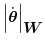
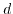
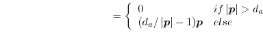

% EusLisp EusLisp version 9.00/ irteus version 1.00 リファレンスマニュアル
  -ロボットモデリングの拡張- ETL-TR-95-19 + JSK-TR-10-03 August 18, 2015
% 
% 

**EusLisp** **EusLisp version 9.00/ irteus version 1.00** **リファレンスマニュアル** -ロボットモデリングの拡張- ETL-TR-95-19 + JSK-TR-10-03 August 18, 2015
===========================================================================================================================================================

**irteus 1.00** *東京大学大学院* 情報理工学系研究科 知能機械情報学専攻

* * * * *

irteus 拡張
===========

ロボットモデリング
==================

ロボットのデータ構造とモデリング
--------------------------------

### ロボットのデータ構造と順運動学

ロボットの構造はリンクと関節から構成されていると考えることが出来るが，
ロボットを関節とリンクに分割する方法として

-   (a)切り離されるリンクの側に関節を含める
-   (b)胴体，あるいは胴体に近いほうに関節を含める

が考えられる．コンピュータのデータ構造を考慮し，
(a)が利用されている．その理由は胴体以外のすべてのリンクにおいて，
必ず関節を一つ含んだ構造となり，すべてのリンクを同一のアルゴリズムで扱う
ことが出きるためである．

この様に分割されたリンクを計算機上で表現するためにはツリー構造を利用する
ことが出来る．一般的にはツリー構造を作るときに二分木にすることでデータ構
造を簡略化することが多い．

ロボットのリンクにおける同次変換行列の求め方としては，関節回転座標系上に
原点をもつを設定し，親リンク座標系からみた回転軸ベクトルが , の原点がであり，回転の関節角度をとする．

このときの親リンク相対の同次変換行列は

![$\\displaystyle {}\^iT\_j = \\left[ \\begin{array}{cc}
e\^{\\hat{a}\_jq\_j} & b\_j \\\\ 0\~0\~0 & 1 \\end{array} \\right]
$](jmanual-img6.png)

と書くことが出来る．

ここで， は，一定速度の角速度ベクトルによって生ずる回
転行列を与える以下のRodriguesの式を用いている．これを回転軸周りに ![$
wt[rad]$](jmanual-img9.png)だけ回転する回転行列を与えるものとして利用している．

親リンクの位置姿勢が既知だとすると，の同次変換行列を

![$\\displaystyle T\_i = \\left[ \\begin{array}{cc} R\_i & p\_i \\\\
0\~0\~0 & 1 \\end{array} \\right] $](jmanual-img13.png)

と作ることができ，ここから

として計算できる．これをロボットのルートリンクから初めてすべてのリンクに
順次適用することでロボットの全身の関節角度情報から姿勢情報を算出すること
ができ，これを順運動学と呼ぶ．

### EusLispによる幾何情報のモデリング

Euslispの幾何モデリングでは，基本モデル(body)の生成，bodyの合成関数，複
合モデル(bodyset)の生成と3つの段階がある．

これまでに以下のような基本モデルの生成，合成が可能な事を見てきている．

    (setq c1 (make-cube 100 100 100))
    (send c1 :locate #f(0 0 50))
    (send c1 :rotate (deg2rad 30) :x)
    (send c1 :set-color :yellow)
    (objects (list c1))

    (setq c2 (make-cylinder 50 100))
    (send c2 :move-to
          (make-coords
           :pos #f(20 30 40)
           :rpy (float-vector 0 0 (deg2rad 90)))
          :world)
    (send c2 :set-color :green)
    (objects (list c1 c2))

    (setq c3 (body+ c1 c2))
    (setq c4 (body- c1 c2))
    (setq c5 (body* c1 c2))

bodysetはirteusで導入された複合モデルであり，bodyで扱えない複数の物体や
複数の色を扱うためのものである．

    (setq c1 (make-cube 100 100 100))
    (send c1 :set-color :red)
    (setq c2 (make-cylinder 30 100))
    (send c2 :set-color :green)
    (send c1 :assoc c2)           ;;; これを忘れいように
    (setq b1 (instance bodyset :init
                       (make-cascoords)
                       :bodies (list c1 c2)))
    (objects (list b1))

### 幾何情報の親子関係を利用したサンプルプログラム

    (setq c1 (make-cube 100 100 100))
    (setq c2 (make-cube 50 50 50))
    (send c1 :set-color :red)
    (send c2 :set-color :blue)
    (send c2 :locate #f(300 0 0))
    (send c1 :assoc c2)
    (objects (list c1 c2))
    (do-until-key
     (send c1 :rotate (deg2rad 5) :z)
     (send *irtviewer* :draw-objects)
     (x::window-main-one) ;; process window event
     )

### bodyset-linkとjointを用いたロボット（多リンク系）のモデリング

irteusではロボットリンクを記述するクラスとしてbodyset-link(irtmodel.l)
というクラスが用意されている．これは機構情報と幾何情報をもち，一般的な木
構造でロボットの構造が表現されている．また，jointクラスを用いて関節情報
を扱っている．

    (defclass bodyset-link
      :super bodyset
      :slots (joint parent-link child-links analysis-level default-coords
                    weight acentroid inertia-tensor
                    angular-velocity angular-acceleration
                    spacial-velocity spacial-acceleration
                    momentum-velocity angular-momentum-velocity
                    momentum angular-momentum
                    force moment ext-force ext-moment))

ジョイント（関節）のモデリングはjointクラス(irtmodel.l)を用いる．jointクラスは基底ク
ラスであり，実際にはrotational-joint, linear-joint等を利用する．
jointの子クラスで作られた関節は，:joint-angleメソッドで関節角度を指定す
ることが出来る．

    (defclass joint
      :super propertied-object
      :slots (parent-link child-link joint-angle min-angle max-angle
        default-coords))
    (defmethod joint
      (:init (&key name
                   ((:child-link clink)) ((:parent-link plink))
                   (min -90) (max 90) &allow-other-keys)
             (send self :name name)
             (setq parent-link plink child-link clink
                   min-angle min max-angle max)
             self))

    (defclass rotational-joint
      :super joint
      :slots (axis))
    (defmethod rotational-joint
      (:init (&rest args &key ((:axis ax) :z) &allow-other-keys)
             (setq axis ax joint-angle 0.0)
             (send-super* :init args)
             self)
      (:joint-angle
       (&optional v)
       (when v
            (setq relang (- v joint-angle) joint-angle v)
            (send child-link :rotate (deg2rad relang) axis)))
         joint-angle))

ここでは，joint, parent-link, child-links, defualt-coordsを利用する．

簡単な１関節ロボットの例としてサーボモジュールを作ってみると

    (defun make-servo nil
      (let (b1 b2)
        (setq b1 (make-cube 35 20 46))
        (send b1 :locate #f(9.5 0 0))
        (setq b2 (make-cylinder 3 60))
        (send b2 :locate #f(0 0 -30))
        (setq b1 (body+ b1 b2))
        (send b1 :set-color :gray20)
        b1))

    (defun make-hinji nil
      (let ((b2 (make-cube 22 16 58))
            (b1 (make-cube 26 20 54)))
        (send b2 :locate #f(-4 0 0))
        (setq b2 (body- b2 b1))
        (send b1 :set-color :gray80)
        b2))

    (setq h1 (instance bodyset-link :init (make-cascoords) :bodies (list (make-hinji))))
    (setq s1 (instance bodyset-link :init (make-cascoords) :bodies (list (make-servo))))
    (setq j1 (instance rotational-joint :init :parent-link h1 :child-link s1 :axis :z))
    ;; instance cascaded coords
    (setq r (instance cascaded-link :init))
    (send r :assoc h1)
    (send h1 :assoc s1)
    (setq (r . links) (list h1 s1))
    (setq (r . joint-list) (list j1))
    (send r :init-ending)

となる．

ここでは，`h1`，`s1`という`bodyset-link`と，
`j1`という`rotational-joint`を作成し，ここから
`cascaded-link`という，連結リンクからなるモデルを生成している．
`cascaded-link`は`cascaded-coords`の子クラスであるため，
`r (cascaded-link)`，`h1`，`s1`の座標系の親子関係を
`:assoc`を利用して設定している．

`(r . links)`という記法は`r`というオブジェクトのスロット変数
（メンバ変数）である`links`にアクセスしている．ここでは，
`links`および`joint-list`に適切な値をセットし，
`(send r :init-ending)`として必要な初期設定を行っている．

これで`r`という2つのリンクと１つの関節情報
を含んだ1つのオブジェクトを生成できる．これで例えば
`(objects (list h1 s1))`ではなく，
`(objects (list r))`としてロボットをビューワに表示できる．
また，`(send r :locate #f(100 0 0))`などの利用も可能になっている．

`cascaded-link`クラスのメソッドの利用例としては以下ある．
`:joint-list`，`:links`といった関節リストやリンクリストへの
アクセサに加え，関節角度ベクトルへのアクセスを提供する
`:angle-vector`メソッドが重要である．これを引数なしで呼び出せば現
在の関節角度が得られ，これに関節角度ベクトルを引数に与えて呼び出せば，その引
数が示す関節角度ベクトルをロボットモデルに反映させることができる．

    $ (objects (list r))
    (#<servo-model #X628abb0  0.0 0.0 0.0 / 0.0 0.0 0.0>)
    ;; useful cascaded-link methods
    $ (send r :joint-list)
    (#<rotational-joint #X6062990 :joint101067152>)
    $ (send r :links)
    (#<bodyset-link #X62ccb10 :bodyset103598864  0.0 0.0 0.0 / 0.0 0.0 0.0>
     #<bodyset-link #X6305830 :bodyset103831600  0.0 0.0 0.0 / 0.524 0.0 0.0>)
    $ (send r :angle-vector)
    #f(0.0)
    $ (send r :angle-vector (float-vector 30))
    #f(30.0)

### cascaded-linkを用いたロボット（多リンク系）のモデリング

一方で多リンク系のモデリング用のクラスとしてcascaded-linkというクラス
がある． これには，links,
joint-listというスロット変数があり，ここにbodyset-link,
ならびにjointのインスタンスのリストをバインドして利用する． 以下は，
`cascaded-link`の子クラスを定義しここでロボットモデリングに
関する初期化処理を行うという書き方の例である．

    (defclass cascaded-link
      :super cascaded-coords
      :slots (links joint-list bodies collision-avoidance-links))

    (defmethod cascaded-link
      (:init (&rest args &key name &allow-other-keys)
             (send-super-lexpr :init args)
             self)
      (:init-ending
       ()
       (setq bodies (flatten (send-all links :bodies)))
       (dolist (j joint-list)
         (send (send j :child-link) :add-joint j)
         (send (send j :child-link) :add-parent-link (send j :parent-link))
         (send (send j :parent-link) :add-child-links (send j :child-link)))
       (send self :update-descendants))
    )

    (defclass servo-model
      :super cascaded-link
      :slots (h1 s1 j1))
    (defmethod servo-model
      (:init ()
       (let ()
         (send-super :init)
         (setq h1 (instance bodyset-link :init (make-cascoords) :bodies (list (make-hinji))))
         (setq s1 (instance bodyset-link :init (make-cascoords) :bodies (list (make-servo))))

         (setq j1 (instance rotational-joint :init :parent-link h1 :child-link s1 :axis :z))

         ;; instance cascaded coords
         (setq links (list h1 s1))
         (setq joint-list (list j1))
         ;;
         (send self :assoc h1)
         (send h1 :assoc s1)
         ;;
         (send self :init-ending)
         self))
      ;;
      ;; (send r :j1 :joint-angle 30)
      (:j1 (&rest args) (forward-message-to j1 args))
      )

    (setq r (instance servo-model :init))

このようなクラスを定義して`(setq r (instance servo-model :init))`
としても同じようにロボットモデルのインスタンスを作成することができ，先
ほどのメソッドを利用できる．クラス定義するメリットは
`(:j1 (&rest args) (forward-message-to j1 args))`というメソッド定
義により，関節モデルのインスタンスへのアクセサを提供することができる．
これにより，特定の関節だけの値を知りたいとき，あるいは値をセットしたい
時には`(send r :j1 :joint-angle)`や `(send r :j1 :joint-angle 30)`
という指示が可能になっている． このロボットを動かす場合は前例と同じように

    (objects (list r))
    (dotimes (i 300)
      (send r :angle-vector (float-vector (* 90 (sin (/ i 100.0)))))
      (send *irtviewer* :draw-objects))

などとするとよい．

    (setq i 0)
    (do-until-key
      (send r :angle-vector (float-vector (* 90 (sin (/ i 100.0)))))
      (send *irtviewer* :draw-objects)
      (incf i))

とすると，次にキーボードを押下するまでプログラムは動きつづける．

さらに，少し拡張して
これを用いて３リンク２ジョイントのロボットをモデリングした例が以下にな
る．:joint-angleというメソッドに\#f(0 0)というベクトルを引数に与えるこ
とで全ての関節角度列を指定することが出来る．

    (defclass hinji-servo-robot
      :super cascaded-link)
    (defmethod hinji-servo-robot
      (:init
       ()
       (let (h1 s1 h2 s2 l1 l2 l3)
         (send-super :init)
         (setq h1 (make-hinji))
         (setq s1 (make-servo))
         (setq h2 (make-hinji))
         (setq s2 (make-servo))
         (send h2 :locate #f(42 0 0))
         (send s1 :assoc h2)
         (setq l1 (instance bodyset-link :init (make-cascoords) :bodies (list h1)))
         (setq l2 (instance bodyset-link :init (make-cascoords) :bodies (list s1 h2)))
         (setq l3 (instance bodyset-link :init (make-cascoords) :bodies (list s2)))
         (send l3 :locate #f(42 0 0))

         (send self :assoc l1)
         (send l1 :assoc l2)
         (send l2 :assoc l3)

         (setq joint-list
               (list
                (instance rotational-joint
                          :init :parent-link l1 :child-link l2
                          :axis :z)
                (instance rotational-joint
                          :init :parent-link l2 :child-link l3
                          :axis :z)))
         (setq links (list l1 l2 l3))
         (send self :init-ending)
         )))
    (setq r (instance hinji-servo-robot :init))
    (objects (list r))

    (dotimes (i 10000)
      (send r :angle-vector (float-vector (* 90 (sin (/ i 500.0))) (* 90 (sin (/ i 1000.0)))))
      (send *irtviewer* :draw-objects))

ロボットの動作生成
------------------

### 逆運動学

逆運動学においては, エンドエフェクタの位置・姿勢 ****から
マニピュレータの関節角度ベクトル ******** を求める.

ここで, エンドエフェクタの位置・姿勢 ********
は関節角度ベクトルを用いて

  ------------------------------------------------------------------------------------------------------------------------------------------------------------------------------------------------------------------------------------------------------------------------------------------------------------------------------ -- -- -----
            (1)
  ------------------------------------------------------------------------------------------------------------------------------------------------------------------------------------------------------------------------------------------------------------------------------------------------------------------------------ -- -- -----

\
 とかける. Equation
[![[\*]](crossref.png)](#eq:forward-kinematics-functional) はEquation
[![[\*]](crossref.png)](#eq:inverse-kinematics-func)
のように記述し,関節角度ベクトルを求める.

  ------------------------------------------------------------------------------------------------------------------------------------------------------------------------------------------------------------------------------------------------------------------------------------------------------------------------------------ -- -- -----
            (2)
  ------------------------------------------------------------------------------------------------------------------------------------------------------------------------------------------------------------------------------------------------------------------------------------------------------------------------------------ -- -- -----

\

における****は一般に非線形な関数となる.
そこでを時刻tに関して微分することで, 線形な式

  ------------------------------------------------------------------------ ------------------------------------------ ----------------------------------------------------------------------------------------------------------------------------------------------------------------------------------------------------------------------------------------------------------- -----
                                                                   (3)
                                                                                 (4)
  ------------------------------------------------------------------------ ------------------------------------------ ----------------------------------------------------------------------------------------------------------------------------------------------------------------------------------------------------------------------------------------------------------- -----

\
 を得る. ここで, ************は ****のヤコビ行列である. ****はベクトル ********の次元, ****はベクトル ********の次元である. ********は速度・角速度ベクトルである.

ヤコビ行列が正則であるとき逆行列 ************を用いて
以下のようにしてこの線型方程式の解を得ることができる.

  ------------------------------------------------------------------------------------------------------------------------------------------------------------------------------ -- -- -----
           (5)
  ------------------------------------------------------------------------------------------------------------------------------------------------------------------------------ -- -- -----

\

しかし, 一般にヤコビ行列は正則でないので, ヤコビ行列の疑似逆行列 ************
が用いられる(Equation [![[\*]](crossref.png)](#eq:psuedo-inverse-matrix)
).

  ------------------------------------------------------------------------------------------------------------------------------------------------------------------------------------------------------------------------------------------------------------------------------ -- -- -----
           (6)
  ------------------------------------------------------------------------------------------------------------------------------------------------------------------------------------------------------------------------------------------------------------------------------ -- -- -----

\

Equation [![[\*]](crossref.png)](#eq:inverse-kinematics-base) は， ****のときはEquation
[![[\*]](crossref.png)](#eq:inverse-kinematics-error-func) を， ****のときはEquation
[![[\*]](crossref.png)](#eq:inverse-kinematics-min-func) を，
最小化する最小二乗解を求める問題と捉え,解を得る.

  ------------------------------------------------------------------------------------------------------------------------------------------------------------------------------------------------------------------ -- -- -----
           (7)
  ------------------------------------------------------------------------------------------------------------------------------------------------------------------------------------------------------------------ -- -- -----

\

  --------------------------------------------------------------------------------------- -- ------------------------------------------------------------------------------------------------------------------------------------------------------------------------ -----
                                                           (8)
                                                     
  --------------------------------------------------------------------------------------- -- ------------------------------------------------------------------------------------------------------------------------------------------------------------------------ -----

\

関節角速度は次のように求まる．

  --------------------------------------------------------------------------------------------------------------------------------------------------------------------------------------------------------------- -- -- -----
           (9)
  --------------------------------------------------------------------------------------------------------------------------------------------------------------------------------------------------------------- -- -- -----

\

しかしながら, Equation
[![[\*]](crossref.png)](#eq:inverse-kinematics-lagrangian-formula)
に従って解を 求めると, ヤコビ行列 ************がフルランクでなくなる特異点に近づく と, ****が大きくなり不安定な振舞いが生じる.
そこで, Nakamura et
al.のSR-Inverse[^1^](jmanual-footnode.html#foot866)を用いること で,
この特異点を回避する.

本研究では ヤコビ行列の疑似逆行列 ************の代わりに,
Equation [![[\*]](crossref.png)](#eq:SR-inverse-jacobian) に示す ************ を用いる.

  -------------------------------------------------------------------------------------------------------------------------------------------------------------------------------------------------------------------------------------------------------------------------------------------------------------------------------------------------------------------------------------------------------------------------------------------------------- -- -- ------
            (10)
  -------------------------------------------------------------------------------------------------------------------------------------------------------------------------------------------------------------------------------------------------------------------------------------------------------------------------------------------------------------------------------------------------------------------------------------------------------- -- -- ------

\

これは, Equation
[![[\*]](crossref.png)](#eq:inverse-kinematics-error-func) の代わりに,
Equation [![[\*]](crossref.png)](#eq:SR-inverse-error-func)
を最小化する最適化問題を 解くことにより得られたものである.

  ------------------------------------------------------------------------------------------------------------------------------------------------------------------------------------------------------------------- -- -- ------
           (11)
  ------------------------------------------------------------------------------------------------------------------------------------------------------------------------------------------------------------------- -- -- ------

\

ヤコビ行列 ************が特異点に近づいているかの指標には 可操作度
********[^2^](jmanual-footnode.html#foot904)が用いられる(Equation
[![[\*]](crossref.png)](#eq:manipulability) ).

  ----------------------------------------------------------------------------------------------------------------------------------------------------------------------------------------------------------------------------------------------------------------------------------------------- -- -- ------
           (12)
  ----------------------------------------------------------------------------------------------------------------------------------------------------------------------------------------------------------------------------------------------------------------------------------------------- -- -- ------

\

微分運動学方程式における
タスク空間次元の選択行列[^3^](jmanual-footnode.html#foot915)は見通しの良い定式化のために省略するが,
以降で導出する全ての式において
適用可能であることをあらかじめことわっておく.

### 基礎ヤコビ行列

一次元対偶を関節に持つマニピュレータのヤコビアンは
基礎ヤコビ行列[^4^](jmanual-footnode.html#foot917)により
計算することが可能である. 基礎ヤコビ行列の第****関節に対応するヤコビアンの列ベクトル ********は

  --------------------------------------------------------------------------------------------------------------------------------------------------------------------------------------------------------------------------------------------------------------------------- ------
  ![$\\displaystyle \_j= \\begin{cases}\\left[ \\begin{array}{ccc} \\mbox{\\boldmath {$a$}}... ...\\boldmath {$a$}}\_j \\end{array} \\right] & \\text{if rotational joint} \\end{cases}$](jmanual-img63.png)   (13)
  --------------------------------------------------------------------------------------------------------------------------------------------------------------------------------------------------------------------------------------------------------------------------- ------

\

と表される. ********・ ********はそれぞれ第****関節の関節軸単位ベクトル・位置ベクトルであり,
********はヤコビアンで運動を制御するエンドエフェクタの位置ベクトルである.
上記では1自由度対偶の 回転関節・直動関節について導出したが，
その他の関節でもこれらの列ベクトルを
連結した行列としてヤコビアンを定義可能である．
非全方位台車の運動を表す2自由度関節は 前後退の直動関節と
旋回のための回転関節から構成できる． 全方位台車の運動を表す3自由度関節は
並進2自由度の直動関節と 旋回のための回転関節から構成できる．
球関節は姿勢を姿勢行列で， 姿勢変化を等価角軸変換によるものとすると，
3つの回転関節をつなぎ合わせたものとみなせる．

### 関節角度限界回避を含む逆運動学

ロボットマニピュレータの軌道生成において,
関節角度限界を考慮することはロボットによる実機実験の際に重要となる.
本節では,文献[^5^](jmanual-footnode.html#foot945)[^6^](jmanual-footnode.html#foot1562)の式および文章を引用しつつ,
関節角度限界の回避を 含む逆運動学について説明する.

重み付きノルムを以下のように定義する.

  -------------------------------------------------------------------------------------------------------------------------------------------------------------------------------------------------------------------- -- -- ------
           (14)
  -------------------------------------------------------------------------------------------------------------------------------------------------------------------------------------------------------------------- -- -- ------

\

ここで, ********は ****** ******であり, 対象で全ての要
素が正である重み係数行列である. この ********を用いて, ********を以下のよう に定義する.

  ------------------------------------------------------------------------------------------------------------------------------------------------------------------------------------------------------------------------------------------------------------------------------ -- -- ------
           (15)
  ------------------------------------------------------------------------------------------------------------------------------------------------------------------------------------------------------------------------------------------------------------------------------ -- -- ------

\

この ********を用いて, 以下の式を得 る.

  ------------------------------------------------------------------------------------------------------------------------------------ ------------------------------------------ ----------------------------------------------------------------------------------------------------------------------------------------------------------------------------------------------------- ------
                                                                       (16)
                          (17)
  ------------------------------------------------------------------------------------------------------------------------------------ ------------------------------------------ ----------------------------------------------------------------------------------------------------------------------------------------------------------------------------------------------------- ------

\

これによって線型方程式の解は@xdefthefnmark[![[\*]](crossref.png)](#LimitAvoidance:Fung:RA95)footnotemarkから
以下のように記述できる.

  --------------------------------------------------------------------------------------------------------------------------------------------------------------------------------------------------------------------------------------------------------------------------------------------- -- -- ------
           (18)
  --------------------------------------------------------------------------------------------------------------------------------------------------------------------------------------------------------------------------------------------------------------------------------------------- -- -- ------

\

また、現在の関節角度****が関節角度限界
****に対してどの程度余裕があるかを評価する
ための関数 ********は以下のようになる[^7^](jmanual-footnode.html#foot1012)).

  ------------------------------------------------------------------------------------------------------------------------------------------------------------------------------------------------------------------------------------------------------------------------------------------------------------------ -- -- ------
           (19)
  ------------------------------------------------------------------------------------------------------------------------------------------------------------------------------------------------------------------------------------------------------------------------------------------------------------------ -- -- ------

\

次にEquation [![[\*]](crossref.png)](#eq:joint-weight-matrix)
に示すような ****の重み係数行列
********を考える.

  ---------------------------------------------------------------------------------------------------------------------------------------------------------------------------------------------------------------------------------------------------------------------------- -- -- ------
  ![\\begin{displaymath}= \\left[ \\begin{array}{ccccc} w\_1 & 0 & 0 & \\cdots & 0 \\\\ 0 ... ...ts & \\cdots \\\\ 0 & 0 & 0 & \\cdots & w\_n \\\\ \\end{array}\\right]\\end{displaymath}](jmanual-img84.png)         (20)
  ---------------------------------------------------------------------------------------------------------------------------------------------------------------------------------------------------------------------------------------------------------------------------- -- -- ------

\
 ここで****は

  ----------------------------------------------------------------------------------------------------------------------------------------------------------------------------- -- -- ------
           (21)
  ----------------------------------------------------------------------------------------------------------------------------------------------------------------------------- -- -- ------

\
 である.

さらにEquation [![[\*]](crossref.png)](#eq:joint-performance-func)
から次の式を得る.

  ---------------------------------------------------------------------------------------------------------------------------------------------------------------------------------------------------------------------- -- -- ------
           (22)
  ---------------------------------------------------------------------------------------------------------------------------------------------------------------------------------------------------------------------- -- -- ------

\

関節角度限界から遠ざかる向きに関節角度が動いている場合には重み係数行列を
変化させる必要はないので,****を以下のように定義しなおす.

  ---------------------------------------------------------------------------------------------------------------------------------------------------------------------------------------------------------------- -- -- ------
           (23)
  ---------------------------------------------------------------------------------------------------------------------------------------------------------------------------------------------------------------- -- -- ------

\
 この****および ********を用いることで関節角度限界回避を含む逆運動学を解くこ
とができる.

### 衝突回避を含む逆運動学

ロボットの動作中での自己衝突や環境モデルとの衝突は
幾何形状モデルが存在すれば計算することが可能である. ここではSugiura et
al. により提案されている効率的な衝突回避計算
[^8^](jmanual-footnode.html#foot1065)[^9^](jmanual-footnode.html#foot1601)を応用した動作生成法を示す.
実際の実装はSugiura et al. の手法に加え,
タスク作業空間のNullSpaceの利用を係数により制御できるようにした点や
擬似逆行列ではなくSR-Inverseを用いて特異点に
ロバストにしている点などが追加されている.

### 衝突回避のための関節角速度計算法

逆運動学計算における目標タスクと衝突回避の統合は
リンク間最短距離を用いたblending係数により行われる.
これにより,衝突回避の必要のないときは目標タスクを厳密に満し
衝突回避の必要性があらわれたときに目標タスクを
あきらめて衝突回避の行われる関節角速度計算を行うことが可能になる.
最終的な関節角速度の関係式はEquation
[![[\*]](crossref.png)](#eq:collision-avoidance-all) で得られる.
以下では****の添字は衝突回避計算のための成分を表し, ****の部分は衝突回避計算以外のタスク目標を表すことにする.

  ------------------------------------------------------------------------------------------------------------------------------------------------------------------------------------------------------------------------------------------------------------------------------------------------------------------------------------------------------------------------------------------------------- ------
     (24)
  ------------------------------------------------------------------------------------------------------------------------------------------------------------------------------------------------------------------------------------------------------------------------------------------------------------------------------------------------------------------------------------------------------- ------

\

blending係数****は, リンク間距離****と閾値****・****の関数として計算される (Equation
[![[\*]](crossref.png)](#eq:collision-avoidance-blending-coefficient) ).

  -------------------------------------------------------------------------------------------------------------------------------------------------------------------------- -- -- ------
           (25)
  -------------------------------------------------------------------------------------------------------------------------------------------------------------------------- -- -- ------

\

****は衝突回避計算を行い始める値 (yellow
zone@xdefthefnmark[![[\*]](crossref.png)](#WholebodyCollisionAvoidance:Sugiura:IROS07)footnotemark)であり,
****は目標タスクを阻害しても衝突回避を行う閾値
(orange
zone@xdefthefnmark[![[\*]](crossref.png)](#WholebodyCollisionAvoidance:Sugiura:IROS07)footnotemark)である.

衝突計算をする2リンク間の最短距離・最近傍点が計算できた場合の
衝突を回避するための動作戦略は
2リンク間に作用する仮想的な反力ポテンシャルから導出される.

2リンク間の最近傍点同士をつなぐベクトル ********を用いた 2リンク間反力から導出される速度計算を
Equation [![[\*]](crossref.png)](#eq:collision-avoidance-distance-force)
に記す.

  -------------------------------------------------------------------------------------------------------------------------------------------------------------------------------------------------------------------------------------------------------------------------------------- -- -- ------
           (26)
  -------------------------------------------------------------------------------------------------------------------------------------------------------------------------------------------------------------------------------------------------------------------------------------- -- -- ------

\

これを用いた関節角速度計算はEquation
[![[\*]](crossref.png)](#eq:collision-avoidance-joint-speed) となる.

  ------------------------------------------------------------------------------------------------------------------------------------------------------------------------------------------------------------------ ------
     (27)
  ------------------------------------------------------------------------------------------------------------------------------------------------------------------------------------------------------------------ ------

\

****・****はそれぞれ反力ポテンシャルを
目標タスクのNullSpaceに分配するかそうでないかを制御する係数である.

### 衝突回避計算例

以下ではロボットモデル・環境モデルを用いた衝突回避例を示す. 本研究では,
ロボットのリンク同士,またはリンクと物体の衝突判定には,衝突判定ライブラリ
PQP(A Proximity Query Package)
[^10^](jmanual-footnode.html#foot1125)を用いた.

Fig.[![[\*]](crossref.png)](#fig:collision-avoidance-example) では **![$
d\_a = 200[mm]$](jmanual-img104.png)**, **![$ d\_b = 0.1 \* d\_a =
20[mm]$](jmanual-img105.png)**, ****と設定した.

この衝突判定計算では,衝突判定をリンクの設定を

1.  リンクのリスト****を登録
2.  登録されたリンクのリストから全リンクのペア ****を計算
3.  隣接するリンクのペア,常に交わりを持つリンクのペアなどを除外

のように行うという工夫を行っている.

Fig.[![[\*]](crossref.png)](#fig:collision-avoidance-example)
例では衝突判定をするリンクを
「前腕リンク」「上腕リンク」「体幹リンク」「ベースリンク」
の4つとして登録した. この場合, ****通りのリンクのペア数から
隣接するリンクが除外され,全リンクペアは 「前腕リンク-体幹リンク」
「前腕リンク-ベースリンク」 「上腕リンク-ベースリンク」 の3通りとなる.

Fig.[![[\*]](crossref.png)](#fig:collision-avoidance-example)
の3本の線(赤1本,緑2本)が 衝突形状モデル間での最近傍点同士をつないだ
最短距離ベクトルである.
全リンクペアのうち赤い線が最も距離が近いペアであり,
このリンクペアより衝突回避のための 逆運動学計算を行っている.

**Figure:** Example of Collision Avoidance

### 非ブロック対角ヤコビアンによる全身協調動作生成

ヒューマノイドは枝分かれのある複雑な構造を持ち,
複数のマニピュレータで協調して動作を行う必要がある
(Fig.[![[\*]](crossref.png)](#fig:duplicate-link) )．

**Figure:** Duplicate Link Sequence

 

複数マニピュレータの動作例として,

-   リンク間に重複がない場合 それぞれのマニピュレータについて Equation
    [![[\*]](crossref.png)](#eq:inverse-kinematics)
    式を用いて関節角速度を求める.
    もしくは,複数の式を連立した方程式(ヤコビアンはブロック対角行列となる)
    を用いて関節角速度を求めても良い.
-   リンク間に重複がある場合 リンク間に重複がある場合は,
    リンク間の重複を考慮したヤコビアンを考える必要がある.
    例えば,双腕動作を行う場合,左腕のマニピュレータのリンク系列と
    右腕のマニピュレータのリンク系列とで,体幹部リンク系列が重複し,
    その部位は左右で協調して関節角速度を求める必要がある.

次節ではリンク間に重複がある場合の 非ブロック対角なヤコビアンの計算法
および それを用いた関節角速度計算法を述べる
(前者の重複がない場合も以下の計算方法により後者の一部として計算可能で
ある).

### リンク間重複があるヤコビアン計算と関節角度計算

微分運動学方程式を求める際の条件を以下に示す.

-   マニピュレータの本数 ****本
-   全関節数 ****個
-   マニピュレータの先端速度・角速度ベクトル **********![$
    \_{L-1}\^T]\^T$](jmanual-img115.png)**
-   各関節角速度ベクトル ** **** ****![$
    \^T]\^T$](jmanual-img119.png)**
-   関節の添字和集合 ****
    ただし,マニピュレータ****の添字集合****を用いて****は ****と表せる.
-   ****に基づく関節速度ベクトル **![$
    [\\dot{\\theta}\_0, ...,
    \\dot{\\theta}\_{N-1}]\^T$](jmanual-img125.png)**

とする.

運動学関係式はEquation
[![[\*]](crossref.png)](#eq:multi-manipulator-jacobi-eq) のようになる.

  -------------------------------------------------------------------------------------------------------------------------------------------------------------------------------------------------------------------- -- -- ------
  ![\\begin{displaymath}\\left[ \\begin{array}{c} \\mbox{\\boldmath {$\\xi$}}\_0 \\\\ \\vdots... ...ot{\\theta}\_0\\\\ \\vdots\\\\ \\dot{\\theta}\_{N-1} \\end{array}\\right]\\end{displaymath}](jmanual-img126.png)         (28)
  -------------------------------------------------------------------------------------------------------------------------------------------------------------------------------------------------------------------- -- -- ------

\

小行列 ********は以下のように求まる.

 ここで， ********はEquation
[![[\*]](crossref.png)](#eq:basic-jacobian-column-vector) のもの．

Equation [![[\*]](crossref.png)](#eq:multi-manipulator-jacobi-eq)
を単一のマニピュレータの
逆運動学解法と同様にSR-Inverseを用いて関節角速度を 求めることができる.

ここでの非ブロック対角ヤコビアンの計算法は, アーム・多指ハンドの動作生成
[^11^](jmanual-footnode.html#foot1208)に
おいて登場する運動学関係式から求まるヤコビアンを
導出することが可能である.

### ベースリンク仮想ジョイントを用いた全身逆運動学法

一般に関節数が****であるのロボットの運動を表現するためには
ベースリンクの位置姿勢と関節角自由度を合わせた****個の変数が必要であ る．
ベースリンクとなる位置姿勢の変数を用いたロボットの運動の定式化は
宇宙ロボット[^12^](jmanual-footnode.html#foot1210)だけでなく,
環境に固定されないヒューマノイドロボット
[^13^](jmanual-footnode.html#foot1211)の場合にも重要である.

ここでは 腕・脚といったマニピュレータに
ベースリンクに3自由度の直動関節と
3自由度の回転関節が仮想的に付随したマニピュレータ構成を考える
(Fig.[![[\*]](crossref.png)](#fig:base-link-virtual-joint) ).
上記の仮想的な6自由度関節を
本研究ではベースリンク仮想ジョイントと名づける.
ベースリンク仮想ジョイントを用いることにより
ヒューマノイドの腰が動き全身関節が駆動され,
運動学,ひいては動力学的な解空間が拡充されることが期待できる.

**Figure:** Concept of the Virtual Joint of the Base Link (Left figure)
Overview of the Robot Model (Right figure) Skeleton Figure of Robot
Model with the Virtual Joint

 

### ベースリンク仮想ジョイントヤコビアン

ベースリンク仮想ジョイントのヤコビアンは 基礎ヤコビ行列の計算(Equation
[![[\*]](crossref.png)](#eq:basic-jacobian-column-vector) ) を利用し，
絶対座標系****，****，****軸の直動関節と
絶対座標系****，****，****軸回りの回転関節を それぞれ連結した****行列である．
ちなみに,並進・回転成分のルートリンク仮想ジョイントのヤコビアンは
以下のように書き下すこともできる.

  ----------------------------------------------------------------------------------------------------------------------------------------------------------------------------------------------------------------------------------------------------------------------------- -- -- ------
  ![\\begin{displaymath}\_{B,l} = \\left[ \\begin{array}{cc} \\mbox{\\boldmath {$E$}}\_3 & ... ...{\\boldmath {$0$}} & \\mbox{\\boldmath {$E$}}\_3 \\end{array}\\right]\\end{displaymath}](jmanual-img134.png)         (29)
  ----------------------------------------------------------------------------------------------------------------------------------------------------------------------------------------------------------------------------------------------------------------------------- -- -- ------

\
 ********はベースリンク位置から添字****で表現する位置までの 差分ベクトルである．

### マスプロパティ計算

複数の質量・重心・慣性行列を統合し 単一の質量・重心・慣性行列の組 ** **** ****![$
\_{new}]$](jmanual-img141.png)** を計算する演算関数を次のように定義する．

  --------------------------------------------------------------------------------------------------------------------------------------------------------------------------------------------------------------------------------------------------------------------------------------------------------------------------------------------------------------------------------------------------------------------------------------------------------------------------------------------------------------------------------------------------------------------------------------------------------------------------------------------------------------------------------------------------------------------------------------------------------------------------------------------------- ------
    ![$\\displaystyle \_{new}] = AddMassProperty( [m\_{1},$](jmanual-img146.png)  ![$\\displaystyle \_{1}] ,\\hdots, [m\_{K},$](jmanual-img148.png)  ![$\\displaystyle \_{K}] )$](jmanual-img150.png)   (30)
  --------------------------------------------------------------------------------------------------------------------------------------------------------------------------------------------------------------------------------------------------------------------------------------------------------------------------------------------------------------------------------------------------------------------------------------------------------------------------------------------------------------------------------------------------------------------------------------------------------------------------------------------------------------------------------------------------------------------------------------------------------------------------------------------------- ------

\

これは次のような演算である．

  ---------------------------------------------------------------------------- ------
     (31)
  ---------------------------------------------------------------------------- ------

\

  ------------------------------------------------------------------------------------------------------------------------------------------------------------------------------------------------------------------------------------------------------------------------- ------
      (32)
  ------------------------------------------------------------------------------------------------------------------------------------------------------------------------------------------------------------------------------------------------------------------------- ------

\

  ---------------------------------------------------------------------------------------------------------------------------------------------------------------------------------------------------------------------------------------------------------------------------------- ------
     (33)
  ---------------------------------------------------------------------------------------------------------------------------------------------------------------------------------------------------------------------------------------------------------------------------------- ------

\

ここで， ************とする．

### 運動量・角運動量ヤコビアン

シリアルリンクマニピュレータを対象とし，
運動量・角運動量ヤコビアンを導出する．
運動量・原点まわりの角運動量を各関節変数で表現し，
その偏微分でヤコビアンの行を計算する．

第****関節の運動変数を****とする．
まず，回転・並進の1自由度関節を考える．   ここで，
**![$ [\\tilde{m}\_j, \\tilde{\\mbox{\\boldmath {$c$}}}\_j,
\\tilde{\\mbox{\\boldmath {$I$}}}\_j]$](jmanual-img160.png)**は
AddMassProperty関数に第****関節の子リンクより
末端側のリンクのマスプロパティを与えたものであり，
実際には再帰計算により計算する[^14^](jmanual-footnode.html#foot1328)．
これらを ****で割ることにより
ヤコビアンの各列ベクトルを得る．  
これより慣性行列は次のように計算できる．

  --------------------------------------------------------------------------------------------------------------------------------------------------------------------------------------------------------------------------- ------
  ![$\\displaystyle \_{\\dot{\\mbox{\\boldmath {$\\theta$}}}} = [\\mbox{\\boldmath {$m$}}\_1, \\hdots, \\mbox{\\boldmath {$m$}}\_{N}]$](jmanual-img165.png)   (34)
  --------------------------------------------------------------------------------------------------------------------------------------------------------------------------------------------------------------------------- ------

\

  --------------------------------------------------------------------------------------------------------------------------------------------------------------------------------------------------------------------------------------------------------------------------------- ------
     (35)
  --------------------------------------------------------------------------------------------------------------------------------------------------------------------------------------------------------------------------------------------------------------------------------- ------

\

ここでは，全関節数を****とした．
また，ベースリンクは 直動関節****，****，****軸，
回転関節****，****，****軸を
もつと考え整理し，次のようになる．

  --------------------------------------------------------------------------------------------------------------------------------------------------------------------------------------------------------------- -- -- ------
  ![\\begin{displaymath}\\left[ \\begin{array}{c} \\mbox{\\boldmath {$M$}}\_{B}\\\\ \\mbox{\\... ...math {$0$}} & \\tilde{\\mbox{\\boldmath {$I$}}} \\end{array}\\right]\\end{displaymath}](jmanual-img168.png)         (36)
  --------------------------------------------------------------------------------------------------------------------------------------------------------------------------------------------------------------- -- -- ------

\
 これを用いて重心まわりの角運動量・運動量は次のようになる．

  ----------------------------------------------------------------------------------------------------------------------------------------------------------------------------------------------------------------- -- -- ------
  ![\\begin{displaymath}\\left[ \\begin{array}{c} \\mbox{\\boldmath {$P$}}\\\\ \\mbox{\\bold... ...$}}\_{B}\\\\ \\dot{\\mbox{\\boldmath {$\\theta$}}} \\end{array}\\right]\\end{displaymath}](jmanual-img169.png)         (37)
  ----------------------------------------------------------------------------------------------------------------------------------------------------------------------------------------------------------------- -- -- ------

\
 ここで ヒューマノイドの全質量****，
重心位置 ********， 慣性テンソル ****は次のように
全リンクのマスプロパティ演算より求める．

  ------------------------------------------------------------------------------------------------------------------------------------------------------------------------------------------------------------------------------------------------------------------------------------------------------------------------------- ------
   ![$\\displaystyle \_{G}, \\tilde{\\mbox{\\boldmath {$I$}}}] = AddMassProperty( [m\_{1}, ... ...{1}] ,\\hdots, [m\_{N}, \\mbox{\\boldmath {$c$}}\_{N}, \\mbox{\\boldmath {$I$}}\_{N}] )$](jmanual-img175.png)   (38)
  ------------------------------------------------------------------------------------------------------------------------------------------------------------------------------------------------------------------------------------------------------------------------------------------------------------------------------- ------

\

### 重心ヤコビアン

重心ヤコビアンは 重心速度と関節角速度の間のヤコビアンである．
本論文ではベースリンク仮想ジョイントを用いるため，
ベースリンクに6自由度関節がついたと考え
ベースリンク速度角速度・関節角速度の
重心速度に対するヤコビアンを重心ヤコビアンとして用いる． 具体的には，
ベースリンク成分 ********と 使用関節について抜き出した成分 ********
による運動量ヤコビアンを 全質量で割ることで重心ヤコビアンを計算する．

  -------------------------------------------------------------------------------------------------------------------------------------------------------------------------------------------------------------------------------------------------------------------------------- ------
  ![$\\displaystyle \_{G} = \\frac{1}{M\_{r}} \\left[ \\begin{array}{cc} \\mbox{\\boldmath {... ...oldmath {$M$}}\_{\\dot{\\mbox{\\boldmath {$\\theta$}}}}\^{\\prime} \\end{array} \\right]$](jmanual-img179.png)   (39)
  -------------------------------------------------------------------------------------------------------------------------------------------------------------------------------------------------------------------------------------------------------------------------------- ------

\

ロボットの動作生成プログラミング
--------------------------------

### 三軸関節ロボットを使ったヤコビアン，逆運動学の例

3軸関節をもつロボットを定義し， 逆運動学やヤコビアンの計算例を紹介する．

ロボットの定義は以下の用になる．

    (defclass 3dof-robot
      :super cascaded-link
      :slots (end-coords l1 l2 l3 l4 j1 j2 j3))
    (defmethod 3dof-robot
      (:init ()
       (let (b)
         (send-super :init)

         (setq b (make-cube 10 10 20))
         (send b :locate #f(0 0 10))
         (send b :set-color :red)
         (setq l4 (instance bodyset-link :init (make-cascoords) :bodies (list b) :name 'l4))
         (setq end-coords (make-cascoords :pos #f(0 0 20)))
         (send l4 :assoc end-coords)
         (send l4 :locate #f(0 0 100))
         ;;
         (setq b (make-cube 10 10 100))
         (send b :locate #f(0 0 50))
         (send b :set-color :green)
         (setq l3 (instance bodyset-link :init (make-cascoords) :bodies (list b) :name 'l3))
         (send l3 :assoc l4)
         (send l3 :locate #f(0 0 100))
         ;;
         (setq b (make-cube 10 10 100))
         (send b :locate #f(0 0 50))
         (send b :set-color :blue)
         (setq l2 (instance bodyset-link :init (make-cascoords) :bodies (list b) :name 'l2))
         (send l2 :assoc l3)
         (send l2 :locate #f(0 0 20))
         ;;
         (setq b (body+ (make-cube 10 10 20 :pos #f(0 0 10)) (make-cube 300 300 2)))
         (send b :set-color :white)
         (setq l1 (instance bodyset-link :init (make-cascoords) :bodies (list b) :name 'l2))
         (send l1 :assoc l2)
         ;;
         (setq j1 (instance rotational-joint :init :name 'j1
                     :parent-link l1 :child-link l2 :axis :y :min -100 :max 100)
               j2 (instance rotational-joint :init  :name 'j2
                     :parent-link l2 :child-link l3 :axis :y :min -100 :max 100)
               j3 (instance rotational-joint :init  :name 'j3
                     :parent-link l3 :child-link l4 :axis :y :min -100 :max 100))
         ;;
         (setq links (list l1 l2 l3 l4))
         (setq joint-list (list j1 j2 j3))
         ;;
         (send self :init-ending)
         self))
      (:end-coords (&rest args) (forward-message-to end-coords args))
      )

ここではロボットの手先の座標を`end-coords`というスロット変数に格
納し，さらにこれにアクセスするためのメソッドを用意してある．

これまでと同様，

    (setq r (instance 3dof-robot :init))
    (objects (list r))
    (send r :angle-vector #f(30 30 30))

としてロボットモデルの生成，表示，関節角度の指定が可能である． さらに，

    (send (send r :end-coords) :draw-on :flush t)

とすると，ロボットの`end-coords`(端点座標系）の表示が可能であるが，
マウスイベントが発生すると消えてしまう．恒久的に表示するためには

    (objects (list r (send r :end-coords)))

とするとよい．

次に，ヤコビアン，逆運動学の例を示す．まず基本になるのが，

    (send r :link-list (send r :end-coords :parent))

として得られるリンクのリストである．これはロボットのルート（胴体）から
引数となるリンクまでのたどれるリンクを返す．

`:calc-jacobian-from-link-list`メソッドはリンクのリストを引数にと
り，この各リンクに存在するジョイント（関節）に
対応するヤコビアンを計算することができる．
また，`:move-target`キーワード引数でエンドエフェクタの座標系を
指定してる．その他のキーワード引数については後述する．

    (dotimes (i 100)
      (setq j (send r :calc-jacobian-from-link-list
                    (send r :link-list (send r :end-coords :parent))
                    :move-target (send r :end-coords)
                    :rotation-axis t
                    :translation-axis t))
      (setq j# (sr-inverse j))
      (setq da (transform j# #f(1 0 0 0 0 0)))
      ;;(setq da (transform j# #f(0 0 0 0 -1 0)))
      (send r :angle-vector (v+ (send r :angle-vector) da))
      (send *irtviewer* :draw-objects)
      )

ここではリンクの長さ（ジョイントの数）は3個なので6行3列のヤコビアン(`j`)が
計算される．これの逆行列(`j#`)を作り，位置姿勢の6自由度の目標速度・角速度
(`#f(1 0 0 0 0 0)`)を与えると，それに対応する関節速度(`da`)
が計算でき，これを現在の関節角度に足している
(`(v+ (send r :angle-vector) da)`)．

次に，ロボットの端点作業の位置は合わせるが姿勢は拘束せず任意のままでよい，とい
う場合の例を示す．ここでは，`:calc-jacobian-from-link-list`のオプ
ショナル引数として`:rotation-axis`, `:translation-axis`
があり，それぞれ位置，姿勢での拘束条件を示す．
`t`は三軸拘束，`nil`は拘束なし，その他に`:x`, `:y`,
`:z`を指定することができる．

    (setq translation-axis t)
    (setq rotation-axis nil)
    (dotimes (i 2000)
      (setq j (send r :calc-jacobian-from-link-list
                    (send r :link-list (send r :end-coords :parent))
                    :move-target (send r :end-coords)
                    :rotation-axis rotation-axis
                    :translation-axis translation-axis))
      (setq j# (sr-inverse j))
      (setq c (make-cascoords :pos (float-vector (* 100 (sin (/ i 500.0))) 0 200)))
      (setq dif-pos (send (send r :end-coords) :difference-position c))
      (setq da (transform j# dif-pos))
      (send r :angle-vector (v+ (send r :angle-vector) da))
      (send *irtviewer* :draw-objects :flush nil)
      (send c :draw-on :flush t)
      )

ここでは位置の三軸のみを拘束した3行3列のヤコビアンを計算し，これの
逆行列からロボットの関節に速度を与えている．さらに，ここでは

      (send *irtviewer* :draw-objects :flush nil)

として`*irtviewer*`に画面を描画しているが，実際に
ディスプレイに表示するフラッシュ処理は行わず，その次の行の

      (send c :draw-on :flush t)

で目標座標は表示し，かつフラッシュ処理を行っている．

上記の計算をまとめた逆運動学メソッドが`:inverse-kinematics`である．
第一引数に目標座標系を指定し，ヤコビアン計算のときと同様にキーワード
引数で `:move-target`, `:translation-axis`, `:rotation-axis` を指定する．
また，`:debug-view`キーワード引数に`t`を与えると計算中の様
子をテキスト並びに視覚的に提示してくれる．

    (setq c (make-cascoords :pos #f(100 0 0) :rpy (float-vector 0 pi 0)))
    (send r :inverse-kinematics  c
          :link-list (send r :link-list (send r :end-coords :parent))
          :move-target (send r :end-coords)
          :translation-axis t
          :rotation-axis t
          :debug-view t)

逆運運動学が失敗する場合のサンプルとして以下のプログラムを見てみよう．

    (dotimes (i 400)
      (setq c (make-cascoords
                 :pos (float-vector (+ 100 (* 80 (sin (/ i 100.0)))) 0 0)
                 :rpy (float-vector 0 pi 0)))
      (send r :inverse-kinematics  c
            :link-list (send r :link-list (send r :end-coords :parent))
            :move-target (send r :end-coords) :translation-axis t  :rotation-axis t)
      (x::window-main-one)
      (send *irtviewer* :draw-objects :flush nil)
      (send c :draw-on :flush t)
      )

このプログラムを実行すると以下のようなエラーが出てくる．

    ;; inverse-kinematics failed.
    ;; dif-pos : #f(11.7826 0.0 0.008449)/(11.7826/1)
    ;; dif-rot : #f(0.0 2.686130e-05 0.0)/(2.686130e-05/0.017453)
    ;;  coords : #<coordinates #X4bcccb0  0.0 0.0 0.0 / 0.0 0.0 0.0>
    ;;  angles : (14.9993 150 15.0006)
    ;;    args : ((#<cascaded-coords #X4b668a0  39.982 0.0 0.0 / 3.142 1.225e-16 3.14
    2>) :link-list (#<bodyset-link #X4cf8e60 l2  0.0 0.0 20.0 / 0.0 0.262 0.0> #<body
    set-link #X4cc8008 l3  25.866 0.0 116.597 / 3.142 0.262 3.142> #<bodyset-link #X4
    c7a0d0 l4  51.764 0.0 20.009 / 3.142 2.686e-05 3.142>) :move-target;; #<cascaded-
    coords #X4c93640  51.764 0.0 0.009 / 3.142 2.686e-05 3.142> :translation-axis t :
    rotation-axis t)

これは，関節の駆動範囲の制限から目標位置に手先が届かない状況である．
このような場面では，例えば，手先の位置さえ目標位置に届けばよく姿勢を
無視してよい場合`:rotation-axis nil`と指定することができる．

また，`:thre`や`:rthre`を使うことで逆運動学計算の終了条件で
ある位置姿勢の誤差を指定することができる．正確な計算が求められていない
状況ではこの値をデフォルトの`1`, `(deg2rad 1)`より大きい値を
利用するのもよい．

また，逆運動学の計算に失敗した場合，デフォルトでは逆運動学計算を始める
前の姿勢まで戻るが，`:revert-if-fail`というキーワード引数をnilと指定
すると，指定されたの回数の計算を繰り替えしたあと，その姿勢のまま関数か
ら抜けてくる．指定の回数もまた，`:stop`というキーワード引数で指
定することができる．

    (setq c (make-cascoords :pos #f(300 0 0) :rpy (float-vector 0 pi 0)))
    (send r :inverse-kinematics  c
          :link-list (send r :link-list (send r :end-coords :parent))
          :move-target (send r :end-coords)
          :translation-axis t
          :rotation-axis nil
          :revert-if-fail nil)

### irteusのサンプルプログラムにおける例

cascaded-coordsクラスでは

-   (:link-list (to &optional form))
-   (:calc-jacobian-from-link-list (link-list &key move-target
    (rotation-axis nil)))

というメソッドが用意されている．

前者はリンクを引数として，ルートリンクからこのリンクまでの経路を計算し，
リンクのリストとして返す．後者はこのリンクのリストを引数とし，
move-target座標系をに対するヤコビアンを計算する．

concatenate result-type a bは a bを
連結しresult-type型に変換し返し，scale a b はベクトルbの全ての要素をス
カラーa倍し，matrix-logは行列対数関数を計算する．

    (if (not (boundp '*irtviewer*)) (make-irtviewer))

    (load "irteus/demo/sample-arm-model.l")
    (setq *sarm* (instance sarmclass :init))
    (send *sarm* :reset-pose)
    (setq *target* (make-coords :pos #f(350 200 400)))
    (objects (list *sarm* *target*))

    (do-until-key
      ;; step 3
      (setq c (send *sarm* :end-coords))
      (send c :draw-on :flush t)
      ;; step 4
      ;; step 4
      (setq dp (scale 0.001 (v- (send *target* :worldpos) (send c :worldpos))) ;; mm->m
            dw (matrix-log (m* (transpose (send c :worldrot)) (send *target* :worldrot))))
      (format t "dp = ~7,3f ~7,3f ~7,3f, dw = ~7,3f ~7,3f ~7,3f~%"
              (elt dp 0) (elt dp 1) (elt dp 2)
              (elt dw 0) (elt dw 1) (elt dw 2))
      ;; step 5
      (when (< (+ (norm dp) (norm dw)) 0.01) (return))
      ;; step 6
      (setq ll (send *sarm* :link-list (send *sarm* :end-coords :parent)))
      (setq j (send *sarm* :calc-jacobian-from-link-list
                    ll :move-target (send *sarm* :end-coords)
                    :trnaslation-axis t :rotation-axis t))
      (setq q (scale 1.0 (transform (pseudo-inverse j) (concatenate float-vector dp dw))))
      ;; step 7
      (dotimes (i (length ll))
        (send (send (elt ll i) :joint) :joint-angle (elt q i) :relative t))
      ;; draw
      (send *irtviewer* :draw-objects)
      (x::window-main-one))

実際のプログラミングでは:inverse-kinematicsというメソッドが用意されて
おり，ここでは特異点や関節リミットの回避，あるいは自己衝突回避等の機能
が追加されている．

### 実際のロボットモデル

実際のロボットや環境を利用した実践的なサンプルプログラムを見てみよう．

まず，最初はロボットや環境のモデルファイルを読み込む．これらのファイル
は$EUSDIR/modelsに，これらのファイルをロードしインスタンスを生成す
るプログラムは以下のように書くことができる．`(room73b2)`や
`(h7)`はこれらのファイル内で定義されている関数である．
ロボットのモデル(`robot-model`)は`irtrobot.l`ファイルで定義
されており，`cascaded-link`クラスの子クラスになっている．
ロボットとは`larm,rarm,lleg,rleg,head`のリンクのツリーからなる
ものとして定義されており，
`(send *robot* :larm)`や`(send *robot* :head)`として
ロボットのリム(limb)にアクセスでき，右手の逆運動学，左手の逆運動学等と
いう利用方法が可能になっている．

    (load "models/room73b2-scene.l")
    (load "models/h7-robot.l")
    (setq *room* (room73b2))
    (setq *robot* (h7))
    (objects (list *robot* *room*))

ロボットには`:reset-pose`というメソッドがありこれで初期姿勢をとる
ことができる．

    (send *robot* :reset-pose)

次に，ロボットを部屋の中で移動させたい．部屋内の代表的な座標は
`(send *room* :spots)`で取得できる．この中から目的の座標を得る
場合はその座標の名前を引数として`:spot`メソッドを呼び出す．
ちなみに，このメソッドの定義は`prog/jskeus/irteus/irtscene.l` にあり

    (defmethod scene-model
      (:spots
       (&optional name)
       (append
        (mapcan
         #'(lambda(x)(if (derivedp x scene-model) (send x :spots name) nil))
         objs)
        (mapcan #'(lambda (o)
            (if (and (eq (class o) cascaded-coords)
                 (or (null name) (string= name (send o :name))))
                (list o)))
            objs)))
      (:spot
       (name)
       (let ((r (send self :spots name)))
         (case (length r)
           (0 (warning-message 1 "could not found spot(~A)" name) nil)
           (1 (car r))
           (t (warning-message 1 "found multiple spot ~A for given name(~A)" r name) (car r)))))
      )

となっている．

ロボットもまた`coordinates`クラスの子クラスなので`:move-to`
メソッドを利用できる．また，このロボットの原点は腰にあるので足が地面に
つくように`:locate`メソッドを使って移動する．

    (send *robot* :move-to (send *room* :spot "cook-spot") :world)
    (send *robot* :locate #f(0 0 550))

現状では`*irtviewer*`の画面上でロボットが小さくなっているので，
以下のメソッド利用し，ロボットが画面いっぱいになるように調整する．

    (send *irtviewer* :look-all
          (geo::make-bounding-box
           (flatten (send-all (send *robot* :bodies) :vertices))))

次に環境中の物体を選択する．ここでは`:object`メソッドを利用する．
これは，`:spots, :spot`と同様の振る舞いをするため，
どのような物体があるかは，`(send-all (send *room* :objects) :name)`
として知ることができる． `room73b2-kettle`の他に
`room73b2-mug-cup`や`room73b2-knife`等を利用するとよい．

    (setq *kettle* (send *room* :object "room73b2-kettle"))

環境モデルの初期化直後は物体は部屋にassocされているため，以下の用に
親子関係を解消しておく．こうしないと物体を把持するなどの場合に問題が生
じる．

    (if (send *kettle* :parent) (send (send *kettle* :parent) :dissoc *kettle*))

ロボットの視線を対象物に向けるためのメソッドとして以下のようなものがあ
る．

    (send *robot* :head :look-at (send *kettle* :worldpos))

対象物体には，その物体を把持するための利用したらよい座標系が
`:handle`メソッドとして記述されている場合がある．このメソッドは
リストを返すため以下の様に`(car (send *kettle* :handle))`として
その座標系を知ることができる．この座標がどこにあるか確認するためには
`(send (car (send *kettle* :handle)) :draw-on :flush t)`とすると よい．

したがってこの物体手を伸ばすためには

    (send *robot* :larm :inverse-kinematics
          (car (send *kettle* :handle))
          :link-list (send *robot* :link-list (send *robot* :larm :end-coords :parent))
          :move-target (send *robot* :larm :end-coords)
          :rotation-axis :z
          :debug-view t)

となる．

ここで，ロボットの手先と対象物体の座標系を連結し，

    (send *robot* :larm :end-coords :assoc *kettle*)

以下の様にして世界座標系で100[mm]持ち上げることができる．

    (send *robot* :larm :move-end-pos #f(0 0 100) :world
            :debug-view t :look-at-target t)

`:look-at-target`は移動中に首の向きを常に対象を見つづけるようにす
るという指令である．

ロボットモデル
--------------

ロボットの身体はリンクとジョイントから構成されるが、それぞれ
`bodyset-link`と`joint`クラスを利用しモデル絵を作成する。ロ
ボットの身体はこれらの要素を含んだ`cascaded-link`という，連結リン
クとしてモデルを生成する．

実際には`joint`は抽象クラスであり `rotational-joint`,`linear-joint`,
`wheel-joint`,`omniwheel-joint`,
`sphere-joint`を選択肢、また四肢を持つロボットの場合は `cascaded-link`
ではなく`robot-model`クラスを利用する。

\
 **joint** [クラス]

      :super   propertied-object 
      :slots         parent-link child-link joint-angle min-angle max-angle default-coords joint-velocity joint-acceleration joint-torque max-joint-velocity max-joint-torque joint-min-max-table joint-min-max-target 

abstract class of joint, users need to use rotational-joint,
linear-joint, sphere-joint, 6dof-joint, wheel-joint or omniwheel-joint.
use :parent-link/:child-link for specifying links that this joint
connect to and :min/:min for range of joint angle in degree.

**:min-angle** *&optional v*[メソッド]

If v is set, it updates min-angle of this instance. :min-angle returns
minimal angle of this joint in degree.

**:max-angle** *&optional v*[メソッド]

If v is set, it updates max-angle of this instance. :max-angle returns
maximum angle of this joint in degree.

**:parent-link** *&rest args*[メソッド]

Returns parent link of this joint. if any arguments is set, it is passed
to the parent-link.

**:child-link** *&rest args*[メソッド]

Returns child link of this joint. if any arguments is set, it is passed
to the child-link.

**:calc-dav-gain** *dav i periodic-time*[メソッド]

**:joint-dof** [メソッド]

**:speed-to-angle** *&rest args*[メソッド]

**:angle-to-speed** *&rest args*[メソッド]

**:calc-jacobian** *&rest args*[メソッド]

**:joint-velocity** *&optional jv*[メソッド]

**:joint-acceleration** *&optional ja*[メソッド]

**:joint-torque** *&optional jt*[メソッド]

**:max-joint-velocity** *&optional mjv*[メソッド]

**:max-joint-torque** *&optional mjt*[メソッド]

**:joint-min-max-table** *&optional mm-table*[メソッド]

**:joint-min-max-target** *&optional mm-target*[メソッド]

**:joint-min-max-table-angle-interpolate** *target-angle
min-or-max*[メソッド]

**:joint-min-max-table-min-angle** *&optional (target-angle (send
joint-min-max-target :joint-angle))*[メソッド]

**:joint-min-max-table-max-angle** *&optional (target-angle (send
joint-min-max-target :joint-angle))*[メソッド]

**rotational-joint** [クラス]

      :super   joint 
      :slots         axis 

create instance of rotational-joint. :axis is either (:x, :y, :z) or
vector. :min-angle and :max-angle takes in radius, but velocity and
torque are given in SI units.

![\\begin{emtabbing} {\\bf :joint-angle} \\it\\&optional v \\&key \\=
relative \\\\lq [method]\\\\ \\\> \\&allow-other-keys \\rm
\\end{emtabbing}](jmanual-img182.png)

Return joint-angle if v is not set, if v is given, set joint angle. v is
rotational value in degree.

**:joint-dof** [メソッド]

Returns DOF of rotational joint, 1.

**:calc-angle-speed-gain** *dav i periodic-time*[メソッド]

**:speed-to-angle** *v*[メソッド]

**:angle-to-speed** *v*[メソッド]

**:calc-jacobian** *&rest args*[メソッド]

**linear-joint** [クラス]

      :super   joint 
      :slots         axis 

Create instance of linear-joint. :axis is either (:x, :y, :z) or vector.
:min-angle and :max-angle takes in [mm], but velocity and torque are
given in SI units.

![\\begin{emtabbing} {\\bf :joint-angle} \\it\\&optional v \\&key \\=
relative \\\\lq [method]\\\\ \\\> \\&allow-other-keys \\rm
\\end{emtabbing}](jmanual-img182.png)

return joint-angle if v is not set, if v is given, set joint angle. v is
linear value in [mm].

**:joint-dof** [メソッド]

Returns DOF of linear joint, 1.

**:calc-angle-speed-gain** *dav i periodic-time*[メソッド]

**:speed-to-angle** *v*[メソッド]

**:angle-to-speed** *v*[メソッド]

**:calc-jacobian** *&rest args*[メソッド]

**wheel-joint** [クラス]

      :super   joint 
      :slots         axis 

Create instance of wheel-joint.

![\\begin{emtabbing} {\\bf :joint-angle} \\it\\&optional v \\&key \\=
relative \\\\lq [method]\\\\ \\\> \\&allow-other-keys \\rm
\\end{emtabbing}](jmanual-img182.png)

return joint-angle if v is not set, if v is given, set joint angle. v is
joint-angle vector, which is (float-vector translation-x[mm]
rotation-z[deg])

**:joint-dof** [メソッド]

Returns DOF of linear joint, 2.

**:calc-angle-speed-gain** *dav i periodic-time*[メソッド]

**:speed-to-angle** *dv*[メソッド]

**:angle-to-speed** *dv*[メソッド]

**:calc-jacobian** *fik row column joint paxis child-link
world-default-coords child-reverse move-target transform-coords
rotation-axis translation-axis tmp-v0 tmp-v1 tmp-v2 tmp-v3 tmp-v3a
tmp-v3b tmp-m33*[メソッド]

**omniwheel-joint** [クラス]

      :super   joint 
      :slots         axis 

create instance of omniwheel-joint.

![\\begin{emtabbing} {\\bf :joint-angle} \\it\\&optional v \\&key \\=
relative \\\\lq [method]\\\\ \\\> \\&allow-other-keys \\rm
\\end{emtabbing}](jmanual-img182.png)

return joint-angle if v is not set, if v is given, set joint angle. v is
joint-angle vector, which is (float-vector translation-x[mm]
translation-y[mm] rotation-z[deg])

**:joint-dof** [メソッド]

Returns DOF of linear joint, 3.

**:calc-angle-speed-gain** *dav i periodic-time*[メソッド]

**:speed-to-angle** *dv*[メソッド]

**:angle-to-speed** *dv*[メソッド]

**:calc-jacobian** *fik row column joint paxis child-link
world-default-coords child-reverse move-target transform-coords
rotation-axis translation-axis tmp-v0 tmp-v1 tmp-v2 tmp-v3 tmp-v3a
tmp-v3b tmp-m33*[メソッド]

**sphere-joint** [クラス]

      :super   joint 
      :slots         axis 

Create instance of sphere-joint. min/max are defiend as a region of
angular velocity in degree.

![\\begin{emtabbing} {\\bf :joint-angle} \\it\\&optional v \\&key \\=
relative \\\\lq [method]\\\\ \\\> \\&allow-other-keys \\rm
\\end{emtabbing}](jmanual-img182.png)

return joint-angle if v is not set, if v is given, set joint angle. v is
joint-angle vector by axis-angle representation, i.e (scale
rotation-angle-from-default-coords[deg] axis-unit-vector)

**:joint-angle-rpy** *&optional v &key relative*[メソッド]

Return joint-angle if v is not set, if v is given, set joint-angle
vector by RPY representation, i.e. (float-vector yaw[deg] roll[deg]
pitch[deg])

**:joint-dof** [メソッド]

Returns DOF of linear joint, 3.

![\\begin{emtabbing} {\\bf :joint-euler-angle} \\it\\&key \\=
(axis-order '(:z :y :x)) \\\\lq [method]\\\\ \\\> ((:child-rot m) (send
child-link :rot)) \\rm \\end{emtabbing}](jmanual-img186.png)

Return joint-angle if v is not set, if v is given, set joint-angle
vector by euler representation.

**:calc-angle-speed-gain** *dav i periodic-time*[メソッド]

**:speed-to-angle** *dv*[メソッド]

**:angle-to-speed** *dv*[メソッド]

**:calc-jacobian** *fik row column joint paxis child-link
world-default-coords child-reverse move-target transform-coords
rotation-axis translation-axis tmp-v0 tmp-v1 tmp-v2 tmp-v3 tmp-v3a
tmp-v3b tmp-m33*[メソッド]

**6dof-joint** [クラス]

      :super   joint 
      :slots         axis 

Create instance of 6dof-joint.

![\\begin{emtabbing} {\\bf :joint-angle} \\it\\&optional v \\&key \\=
relative \\\\lq [method]\\\\ \\\> \\&allow-other-keys \\rm
\\end{emtabbing}](jmanual-img182.png)

Return joint-angle if v is not set, if v is given, set joint angle
vector, which is 6D vector of 3D translation[mm] and 3D rotation[deg],
i.e. (find-if \#'(lambda (x) (eq (send (car x) :name) 'sphere-joint))
(documentation :joint-angle))

**:joint-angle-rpy** *&optional v &key relative*[メソッド]

Return joint-angle if v is not set, if v is given, set joint angle. v is
joint-angle vector, which is 6D vector of 3D translation[mm] and 3D
rotation[deg], for rotation, please see (find-if \#'(lambda (x) (eq
(send (car x) :name) 'sphere-joint)) (documentation :joint-angle-rpy))

**:joint-dof** [メソッド]

Returns DOF of linear joint, 6.

**:calc-angle-speed-gain** *dav i periodic-time*[メソッド]

**:speed-to-angle** *dv*[メソッド]

**:angle-to-speed** *dv*[メソッド]

**:calc-jacobian** *fik row column joint paxis child-link
world-default-coords child-reverse move-target transform-coords
rotation-axis translation-axis tmp-v0 tmp-v1 tmp-v2 tmp-v3 tmp-v3a
tmp-v3b tmp-m33*[メソッド]

**bodyset-link** [クラス]

      :super   bodyset 
      :slots         joint parent-link child-links analysis-level default-coords weight acentroid inertia-tensor angular-velocity angular-acceleration spacial-velocity spacial-acceleration momentum-velocity angular-momentum-velocity momentum angular-momentum force moment ext-force ext-moment 

Create instance of bodyset-link.

**:worldcoords** *&optional (level analysis-level)*[メソッド]

Returns a coordinates object which represents this coord in the world by
concatenating all the cascoords from the root to this coords.

**:analysis-level** *&optional v*[メソッド]

Change analysis level :coords only changes kinematics level and :body
changes geometry too.

**:weight** *&optional w*[メソッド]

Returns a weight of the link. If w is given, set weight.

**:centroid** *&optional c*[メソッド]

Returns a centroid of the link. If c is given, set new centroid.

**:inertia-tensor** *&optional i*[メソッド]

Returns a inertia tensor of the link. If c is given, set new intertia
tensor.

**:joint** *&rest args*[メソッド]

Returns a joint associated with this link. If args is given, args are
forward to the joint.

**:add-joint** *j*[メソッド]

Set j as joint of this link

**:del-joint** [メソッド]

Remove current joint of this link

**:parent-link** [メソッド]

Returns parent link

**:child-links** [メソッド]

Returns child links

**:add-child-links** *l*[メソッド]

Add l to child links

**:add-parent-link** *l*[メソッド]

Set l as parent link

**:del-child-link** *l*[メソッド]

Delete l from child links

**:del-parent-link** [メソッド]

Delete parent link

**:default-coords** *&optional c*[メソッド]

**cascaded-link** [クラス]

      :super   cascaded-coords 
      :slots         links joint-list bodies collision-avoidance-links end-coords-list 

![\\begin{emtabbing} {\\bf :init} \\it\\&rest args \\&key \\= name
\\\\lq [method]\\\\ \\\> \\&allow-other-keys \\rm
\\end{emtabbing}](jmanual-img189.png)

Create cascaded-link.

**:init-ending** [メソッド]

This method is to called finalize the instantiation of the
cascaded-link. This update bodies and child-link and parent link from
joint-list

**:links** *&rest args*[メソッド]

Returns links, or args is passed to links

**:joint-list** *&rest args*[メソッド]

Returns joint list, or args is passed to joints

**:link** *name*[メソッド]

Return a link with given name.

**:joint** *name*[メソッド]

Return a joint with given name.

**:end-coords** *name*[メソッド]

Returns end-coords with given name

**:bodies** *&rest args*[メソッド]

Return bodies of this object. If args is given it passed to all bodies

**:faces** [メソッド]

Return faces of this object.

**:angle-vector** *&optional vec (angle-vector (instantiate float-vector
(calc-target-joint-dimension joint-list)))*[メソッド]

Returns angle-vector of this object, if vec is given, it updates angles
of all joint. If given angle-vector violate min/max range, the value is
modified.

**:link-list** *to &optional from*[メソッド]

Find link list from to link to from link.

**:plot-joint-min-max-table** *joint0 joint1*[メソッド]

Plot joint min max table on Euslisp window.

Calculate jacobian matrix from link-list and move-target. Unit system is
[m] or [rad], not [mm] or [deg].

:inverse-kinematics-loop is one loop calculation for
:inverse-kinematics. In this method, joint position difference
satisfying workspace difference (dif-pos, dif-rot) are calculated and
euslisp model joint angles are updated. Optional arguments:
:additional-check This argument is to add optional best-effort
convergence conditions. :additional-check should be function or lambda.
best-effort =\>In :inverse-kinematics-loop, 'success' is overwritten by
'(and success additional-check)' In :inverse-kinematics, 'success is not
overwritten. So, :inverse-kinematics-loop wait until ':additional-check'
becomes 't' as possible, but ':additional-check' is neglected in the
final :inverse-kinematics return. :min-loop Minimam loop count (nil by
default). If integer is specified, :inverse-kinematics-loop does returns
:ik-continues and continueing solving IK. If min-loop is nil, do not
consider loop counting for IK convergence.

Move move-target to target-coords. dump-command should be t, nil, or
:fail-only. t : dump log both in success and fail. :fail-only : dump log
only in fail. nil : do not dump log.

Solve inverse-kinematics for closed loop forward kinematics. Move
move-target to target-coords with link-list. link-list loop should be
close when move-target reachs target-coords. constrained-joint-list is
list of joints specified given joint angles in closed loop.
constrained-joint-angle-list is list of joint-angle for
constrained-joint-list.

**:calc-jacobian-for-interlocking-joints** *link-list &key
(interlocking-joint-pairs (send self
:interlocking-joint-pairs))*[メソッド]

Calculate jacobian to keep interlocking joint velocity same. dtheta\_0 =
dtheta\_1 =\>[... 0 1 0 ... 0 -1 0 .... ][...dtheta\_0...dtheta\_1...]

**:calc-vel-for-interlocking-joints** *link-list &key
(interlocking-joint-pairs (send self
:interlocking-joint-pairs))*[メソッド]

Calculate 0 velocity for keeping interlocking joint at the same joint
angle.

**:set-midpoint-for-interlocking-joints** *&key
(interlocking-joint-pairs (send self
:interlocking-joint-pairs))*[メソッド]

Set interlocking joints at mid point of each joint angle.

**:interlocking-joint-pairs** [メソッド]

Interlocking joint pairs. pairs are (list (cons joint0 joint1) ... ) If
users want to use interlocking joints, please overwrite this method.

Check if all interlocking joint pairs are same values.

**:update-descendants** *&rest args*[メソッド]

**:find-link-route** *to &optional from*[メソッド]

**:make-joint-min-max-table** *l0 l1 joint0 joint1 &key (fat 0) (fat2
nil) (debug nil) (margin 0.0) (overwrite-collision-model nil)*[メソッド]

**:make-min-max-table-using-collision-check** *l0 l1 joint0 joint1
joint-range0 joint-range1 min-joint0 min-joint1 fat fat2 debug
margin*[メソッド]

**:plot-joint-min-max-table-common** *joint0 joint1*[メソッド]

**:calc-target-axis-dimension** *rotation-axis
translation-axis*[メソッド]

**:calc-union-link-list** *link-list*[メソッド]

**:calc-target-joint-dimension** *link-list*[メソッド]

**:calc-inverse-jacobian** *jacobi &rest args &key
((:manipulability-limit ml) 0.1) ((:manipulability-gain mg) 0.001)
weight debug-view ret wmat tmat umat umat2 mat-tmp mat-tmp-rc tmp-mrr
tmp-mrr2 &allow-other-keys*[メソッド]

**:calc-gradh-from-link-list** *link-list &optional (res (instantiate
float-vector (length link-list)))*[メソッド]

**:calc-joint-angle-speed** *union-vel &rest args &key angle-speed
(angle-speed-blending 0.5) jacobi jacobi\# null-space i-j\#j debug-view
weight wmat tmp-len tmp-len2 fik-len &allow-other-keys*[メソッド]

**:calc-joint-angle-speed-gain** *union-link-list dav
periodic-time*[メソッド]

**:collision-avoidance-links** *&optional l*[メソッド]

**:collision-avoidance-link-pair-from-link-list** *link-lists &key
obstacles ((:collision-avoidance-links collision-links)
collision-avoidance-links) debug*[メソッド]

**:collision-avoidance-calc-distance** *&rest args &key union-link-list
(warnp t) ((:collision-avoidance-link-pair pair-list))
&allow-other-keys*[メソッド]

**:collision-avoidance-args** *pair link-list*[メソッド]

**:collision-avoidance** *&rest args &key avoid-collision-distance
avoid-collision-joint-gain avoid-collision-null-gain
((:collision-avoidance-link-pair pair-list)) (union-link-list)
(link-list) (weight) (fik-len (send self :calc-target-joint-dimension
union-link-list)) debug-view &allow-other-keys*[メソッド]

**:move-joints** *union-vel &rest args &key union-link-list
(periodic-time 0.05) (joint-args) (debug-view nil) (move-joints-hook)
&allow-other-keys*[メソッド]

**:find-joint-angle-limit-weight-old-from-union-link-list**
*union-link-list*[メソッド]

**:reset-joint-angle-limit-weight-old** *union-link-list*[メソッド]

**:calc-weight-from-joint-limit** *avoid-weight-gain fik-len link-list
union-link-list debug-view weight tmp-weight tmp-len*[メソッド]

**:calc-inverse-kinematics-weight-from-link-list** *link-list &key
(avoid-weight-gain 1.0) (union-link-list (send self
:calc-union-link-list link-list)) (fik-len (send self
:calc-target-joint-dimension union-link-list)) (weight (fill
(instantiate float-vector fik-len) 1)) (additional-weight-list)
(debug-view) (tmp-weight (instantiate float-vector fik-len)) (tmp-len
(instantiate float-vector fik-len))*[メソッド]

**:calc-nspace-from-joint-limit** *avoid-nspace-gain union-link-list
weight debug-view tmp-nspace*[メソッド]

**:calc-inverse-kinematics-nspace-from-link-list** *link-list &key
(avoid-nspace-gain 0.01) (union-link-list (send self
:calc-union-link-list link-list)) (fik-len (send self
:calc-target-joint-dimension union-link-list)) (null-space) (debug-view)
(additional-nspace-list) (cog-gain 0.0) (target-centroid-pos)
(centroid-offset-func) (cog-translation-axis :z) (cog-null-space nil)
(weight (fill (instantiate float-vector fik-len) 1.0))
(update-mass-properties t) (tmp-nspace (instantiate float-vector
fik-len))*[メソッド]

**:move-joints-avoidance** *union-vel &rest args &key union-link-list
link-list (fik-len (send self :calc-target-joint-dimension
union-link-list)) (weight (fill (instantiate float-vector fik-len) 1))
(null-space) (avoid-nspace-gain 0.01) (avoid-weight-gain 1.0)
(avoid-collision-distance 200) (avoid-collision-null-gain 1.0)
(avoid-collision-joint-gain 1.0) ((:collision-avoidance-link-pair
pair-list) (send self :collision-avoidance-link-pair-from-link-list
link-list :obstacles (cadr (memq :obstacles args)) :debug (cadr (memq
:debug-view args)))) (cog-gain 0.0) (target-centroid-pos)
(centroid-offset-func) (cog-translation-axis :z) (cog-null-space nil)
(additional-weight-list) (additional-nspace-list) (tmp-len (instantiate
float-vector fik-len)) (tmp-len2 (instantiate float-vector fik-len))
(tmp-weight (instantiate float-vector fik-len)) (tmp-nspace (instantiate
float-vector fik-len)) (tmp-mcc (make-matrix fik-len fik-len)) (tmp-mcc2
(make-matrix fik-len fik-len)) (debug-view) (jacobi)
&allow-other-keys*[メソッド]

**:inverse-kinematics-args** *&rest args &key union-link-list
rotation-axis translation-axis additional-jacobi-dimension
&allow-other-keys*[メソッド]

**:draw-collision-debug-view** [メソッド]

**:ik-convergence-check** *success dif-pos dif-rot rotation-axis
translation-axis thre rthre centroid-thre target-centroid-pos
centroid-offset-func cog-translation-axis &key (update-mass-properties
t)*[メソッド]

**:calc-vel-from-pos** *dif-pos translation-axis &rest args &key
(p-limit 100.0) (tmp-v0 (instantiate float-vector 0)) (tmp-v1
(instantiate float-vector 1)) (tmp-v2 (instantiate float-vector 2))
(tmp-v3 (instantiate float-vector 3)) &allow-other-keys*[メソッド]

**:calc-vel-from-rot** *dif-rot rotation-axis &rest args &key (r-limit
0.5) (tmp-v0 (instantiate float-vector 0)) (tmp-v1 (instantiate
float-vector 1)) (tmp-v2 (instantiate float-vector 2)) (tmp-v3
(instantiate float-vector 3)) &allow-other-keys*[メソッド]

**:collision-check-pairs** *&key ((:links ls) (cons (car links)
(all-child-links (car links))))*[メソッド]

**:self-collision-check** *&key (mode :all) (pairs (send self
:collision-check-pairs)) (collision-func
'pqp-collision-check)*[メソッド]

**:calc-grasp-matrix** *contact-points &optional (ret (make-matrix 6 (6
(length contact-points))))*[メソッド]

**eusmodel-validity-check** *robot*[関数]

Check if the robot model is validate

**calc-jacobian-default-rotate-vector** *paxis world-default-coords
child-reverse transform-coords tmp-v3 tmp-m33*[関数]

**calc-jacobian-rotational** *fik row column joint paxis child-link
world-default-coords child-reverse move-target transform-coords
rotation-axis translation-axis tmp-v0 tmp-v1 tmp-v2 tmp-v3 tmp-v3a
tmp-v3b tmp-m33*[関数]

**calc-jacobian-linear** *fik row column joint paxis child-link
world-default-coords child-reverse move-target transform-coords
rotation-axis translation-axis tmp-v0 tmp-v1 tmp-v2 tmp-v3 tmp-v3a
tmp-v3b tmp-m33*[関数]

**calc-angle-speed-gain-scalar** *j dav i periodic-time*[関数]

**calc-angle-speed-gain-vector** *j dav i periodic-time*[関数]

**all-child-links** *s &optional (pred \#'identity)*[関数]

**calc-dif-with-axis** *dif axis &optional tmp-v0 tmp-v1 tmp-v2*[関数]

**calc-target-joint-dimension** *joint-list*[関数]

**calc-joint-angle-min-max-for-limit-calculation** *j kk jamm*[関数]

**joint-angle-limit-weight** *j-l &optional (res (instantiate
float-vector (calc-target-joint-dimension j-l)))*[関数]

**joint-angle-limit-nspace** *j-l &optional (res (instantiate
float-vector (calc-target-joint-dimension j-l)))*[関数]

**calc-jacobian-from-link-list-including-robot-and-obj-virtual-joint**
*link-list move-target obj-move-target robot &key (rotation-axis '(t t))
(translation-axis '(t t)) (fik (make-matrix (send robot
:calc-target-axis-dimension rotation-axis translation-axis) (send robot
:calc-target-joint-dimension link-list)))*[関数]

**append-obj-virtual-joint** *link-list target-coords &key (joint-class
6dof-joint) (joint-args) (vplink) (vplink-coords) (vclink-coords)*[関数]

**append-multiple-obj-virtual-joint** *link-list target-coords &key
(joint-class '(6dof-joint)) (joint-args '(nil)) (vplink) (vplink-coords)
(vclink-coords)*[関数]

**eusmodel-validity-check-one** *robot*[関数]

\
 **bodyset** [クラス]

      :super   cascaded-coords 
      :slots         (geometry::bodies :type cons) 

![\\begin{emtabbing} {\\bf :init} \\it coords \\&rest args \\&key \\=
(name (intern (fo... ...d]\\\\ \\\> ((:bodies geometry::bs)) \\\\ \\\>
\\&allow-other-keys \\rm \\end{emtabbing}](jmanual-img195.png)

Create bodyset object

**:bodies** *&rest args*[メソッド]

**:faces** [メソッド]

**:worldcoords** [メソッド]

**:draw-on** *&rest args*[メソッド]

**midcoords** *geometry::p geometry::c1 geometry::c2*[関数]

Returns mid (or p) coordinates of given two cooridnates c1 and c2

**orient-coords-to-axis** *geometry::target-coords geometry::v &optional
(geometry::axis :z)*[関数]

orient 'axis' in 'target-coords' to the direction specified by 'v'
destructively. 'v' must be non-zero vector.

**geometry::face-to-triangle-aux** *geometry::f*[関数]

triangulate the face.

**geometry::face-to-triangle** *geometry::f*[関数]

convert face to set of triangles.

**geometry::face-to-tessel-triangle** *geometry::f geometry::num*[関数]

return polygon if triangable, return nil if it is not.

**body-to-faces** *geometry::abody*[関数]

return triangled faces of given body

**make-sphere** *geometry::r &rest args*[関数]

make sphere of given r

**make-ring** *geometry::ring-radius geometry::pipe-radius &rest args
&key (geometry::segments 16)*[関数]

make ring of given ring and pipe radius

**x-of-cube** *geometry::cub*[関数]

return x of cube.

**y-of-cube** *geometry::cub*[関数]

return y of cube.

**z-of-cube** *geometry::cub*[関数]

return z of cube.

**height-of-cylinder** *geometry::cyl*[関数]

return height of cylinder.

**radius-of-cylinder** *geometry::cyl*[関数]

return radius of cylinder.

**radius-of-sphere** *geometry::sp*[関数]

return radius of shape.

**geometry::make-faceset-from-vertices** *geometry::vs*[関数]

create faceset from vertices.

**matrix-to-euler-angle** *geometry::m geometry::axis-order*[関数]

return euler angle from matrix.

**geometry::quaternion-from-two-vectors** *geometry::a
geometry::b*[関数]

Comupute quaternion which rotate vector a into b.

**transform-coords** *geometry::c1 geometry::c2 &optional (geometry::c3
(let ((geometry::dim (send geometry::c1 :dimension))) (instance
coordinates :newcoords (unit-matrix geometry::dim) (instantiate
float-vector geometry::dim))))*[関数]

**geometry::face-to-triangle-rest-polygon** *geometry::f geometry::num
geometry::edgs*[関数]

**geometry::face-to-triangle-make-simple** *geometry::f*[関数]

**body-to-triangles** *geometry::abody &optional (geometry::limit
50)*[関数]

**geometry::triangle-to-triangle** *geometry::aface &optional
(geometry::limit 50)*[関数]

\
 **robot-model** [クラス]

      :super   cascaded-link 
      :slots         larm-end-coords rarm-end-coords lleg-end-coords rleg-end-coords head-end-coords torso-end-coords larm-root-link rarm-root-link lleg-root-link rleg-root-link head-root-link torso-root-link larm-collision-avoidance-links rarm-collision-avoidance-links larm rarm lleg rleg torso head force-sensors imu-sensors cameras support-polygons 

**:camera** *sensor-name*[メソッド]

Returns camera with given name

**:force-sensor** *sensor-name*[メソッド]

Returns force sensor with given name

**:imu-sensor** *sensor-name*[メソッド]

Returns imu sensor of given name

**:force-sensors** [メソッド]

Returns force sensors.

**:imu-sensors** [メソッド]

Returns imu sensors.

**:cameras** [メソッド]

Returns camera sensors.

**:look-at-hand** *l/r*[メソッド]

look at hand position, l/r supports :rarm, :larm, :arms, and '(:rarm
:larm)

solve inverse kinematics, move move-target to target-coords
look-at-target suppots t, nil, float-vector, coords, list of
float-vector, list of coords link-list is set by default based on
move-target -\>root link link-list

move move-target using dif-pos and dif-rot, look-at-target suppots t,
nil, float-vector, coords, list of float-vector, list of coords
link-list is set by default based on move-target -\>root link link-list

**:look-at-target** *look-at-target &key (target-coords)*[メソッド]

move robot head to look at targets, look-at-target support t/nil
float-vector coordinates, center of list of float-vector or list of
coordinates

**:init-pose** [メソッド]

Set robot to initial posture.

![\\begin{emtabbing} {\\bf :torque-vector} \\it\\&key \\= (force-list)
\\\\lq [method]\\\\ ... ...lc-torque-buffer-args (send self
:calc-torque-buffer-args)) \\rm \\end{emtabbing}](jmanual-img198.png)

Returns torque vector

![\\begin{emtabbing} {\\bf :calc-force-from-joint-torque} \\it limb
all-torque \\&key... ...(send self limb :end-coords)) \\\\lq
[method]\\\\ \\\> (use-torso) \\rm \\end{emtabbing}](jmanual-img199.png)

Calculates end-effector force and moment from joint torques.

fullbody inverse kinematics for legged robot. necessary args :
target-coords, move-target, and link-list must include legs' (or leg's)
parameters ex. (send robot:fullbody-inverse-kinematics (list rarm-tc
rleg-tc lleg-tc) :move-target (list rarm-mt rleg-mt lleg-mt) :link-list
(list rarm-ll rleg-ll lleg-ll))

**:print-vector-for-robot-limb** *vec*[メソッド]

Print angle vector with limb alingment and limb indent. For example, if
robot is rarm, larm, and torso, print result is: \#f( rarm-j0 ...
rarm-jN larm-j0 ... larm-jN torso-j0 ... torso-jN )

Calculate zmp[mm] from sensor local forces and moments If force\_z is
large, zmp can be defined and returns 3D zmp. Otherwise, zmp cannot be
defined and returns nil.

**:foot-midcoords** *&optional (mid 0.5)*[メソッド]

Calculate midcoords of :rleg and :lleg end-coords. In the following
codes, leged robot is assumed.

![\\begin{emtabbing} {\\bf :fix-leg-to-coords} \\it fix-coords
\\&optional (l/r :both) \\&key \\= (mid 0.5) \\\\lq [method]\\\\ \\\>
\\&allow-other-keys \\rm \\end{emtabbing}](jmanual-img202.png)

Fix robot's legs to a coords In the following codes, leged robot is
assumed.

Move robot COG to change centroid-on-foot location, leg : legs for
target of robot's centroid, which should be :both, :rleg, and :lleg.
fix-limbs : limb names which are fixed in this IK.

Calculate walking pattern from foot step list and return pattern list as
a list of angle-vector, root-coords, time, and so on.

**:gen-footstep-parameter** *&key (ratio 1.0)*[メソッド]

Generate footstep parameter

Calculate foot step list from goal x position [mm], goal y position
[mm], and goal yaw orientation [deg].

**:support-polygons** [メソッド]

Return support polygons.

**:support-polygon** *name*[メソッド]

Return support polygon with given name.

**:make-default-linear-link-joint-between-attach-coords**
*attach-coords-0 attach-coords-1 end-coords-name
linear-joint-name*[メソッド]

Make default linear arctuator module such as muscle and cylinder and
append lins and joint-list. Module includes parent-link =\>(j0) =\>l0
=\>(j1) =\>l1 (linear actuator) =\>(j2) =\>l2 =\>end-coords.
attach-coords-0 is root side coords which linear actulator is attached
to. attach-coords-1 is end side coords which linear actulator is
attached to. end-coords-name is the name of end-coords.
linear-joint-name is the name of linear actuator.

**:init-ending** [メソッド]

**:limb** *limb method &rest args*[メソッド]

**:inverse-kinematics-loop-for-look-at** *limb &rest args*[メソッド]

**:gripper** *limb &rest args*[メソッド]

**:get-sensor-method** *sensor-type sensor-name*[メソッド]

**:get-sensors-method-by-limb** *sensors-type limb*[メソッド]

**:larm** *&rest args*[メソッド]

**:rarm** *&rest args*[メソッド]

**:lleg** *&rest args*[メソッド]

**:rleg** *&rest args*[メソッド]

**:head** *&rest args*[メソッド]

**:torso** *&rest args*[メソッド]

**:arms** *&rest args*[メソッド]

**:legs** *&rest args*[メソッド]

**:joint-angle-limit-nspace-for-6dof** *&key (avoid-nspace-gain 0.01)
(limbs '(:rleg :lleg))*[メソッド]

**:joint-order** *limb &optional jname-list*[メソッド]

**:draw-gg-debug-view** *end-coords-list contact-state rz cog pz czmp
dt*[メソッド]

**:footstep-parameter** [メソッド]

**:make-support-polygons** [メソッド]

**:make-sole-polygon** *name*[メソッド]

**make-default-robot-link** *len radius axis name &optional
extbody*[関数]

センサモデル
------------

\
 **sensor-model** [クラス]

      :super   body 
      :slots         data profile 

**:profile** *&optional p*[メソッド]

**:signal** *rawinfo*[メソッド]

**:simulate** *model*[メソッド]

**:read** [メソッド]

**:draw-sensor** *v*[メソッド]

**:init** *shape &key name &allow-other-keys*[メソッド]

**bumper-model** [クラス]

      :super   sensor-model 
      :slots         bumper-threshold 

![\\begin{emtabbing} {\\bf :init} \\it b \\&rest args \\&key \\=
((:bumper-threshold bt) 20) \\\\lq [method]\\\\ \\\> name \\rm
\\end{emtabbing}](jmanual-img206.png)

Create bumper model, b is the shape of an object and bt is the threshold
in distance[mm].

**:simulate** *objs*[メソッド]

Simulate bumper, with given objects, return 1 if the sensor detects an
object and 0 if not.

**:draw** *vwer*[メソッド]

**:draw-sensor** *vwer*[メソッド]

**camera-model** [クラス]

      :super   sensor-model 
      :slots         (vwing :forward (:projection :newprojection :view :viewpoint :view-direction :viewdistance :yon :hither)) pwidth pheight 

Create camera model. b is the shape of an object

**:width** [メソッド]

Returns width of the camera in pixel.

**:height** [メソッド]

Returns height of the camera in pixel.

**:fovy** [メソッド]

Returns field of view in degree

**:cx** [メソッド]

Returns center x.

**:cy** [メソッド]

Returns center y.

**:fx** [メソッド]

Returns focal length of x.

**:fy** [メソッド]

Returns focal length of y.

**:screen-point** *pos*[メソッド]

Returns point in screen corresponds to the given pos.

**:3d-point** *x y d*[メソッド]

Returns 3d position

**:ray** *x y*[メソッド]

Returns ray vector of given x and y.

**:viewing** *&rest args*[メソッド]

**:draw-on** *&rest args &key ((:viewer vwer) viewer)
&allow-other-keys*[メソッド]

**:draw-sensor** *vwer &key flush (width 1) (color (float-vector 1 1
1))*[メソッド]

**:draw-objects** *vwr objs*[メソッド]

**:get-image** *vwr &key (points) (colors)*[メソッド]

![\\begin{emtabbing} {\\bf make-camera-from-param} \\it\\&key \\= pwidth
\\\\lq [function]... ...\\ \\\> (tx 0) \\\\ \\\> (ty 0) \\\\ \\\>
parent-coords \\\\ \\\> name \\rm \\end{emtabbing}](jmanual-img208.png)

Create camera object from given parameters.

環境モデル
----------

\
 **scene-model** [クラス]

      :super   cascaded-coords 
      :slots         name objs 

![\\begin{emtabbing} {\\bf :init} \\it\\&rest args \\&key \\= ((:name n)
scene) \\\\lq [method]\\\\ \\\> ((:objects o)) \\rm
\\end{emtabbing}](jmanual-img209.png)

Create scene model

**:objects** [メソッド]

Returns objects in the scene.

**:find-object** *name*[メソッド]

Returns objects with given name.

**:spots** *&optional name*[メソッド]

Returns spots in the scene. If name is given returns spot of given name.

**:object** *name*[メソッド]

Returns object of given name.

**:spot** *name*[メソッド]

Returns scene of given name.

**:bodies** [メソッド]

動力学計算・歩行動作生成
------------------------

\
 **riccati-equation** [クラス]

      :super   propertied-object 
      :slots         a b c p q r k a-bkt r+btpb-1 

**:init** *aa bb cc qq rr*[メソッド]

**:solve** [メソッド]

**preview-controller** [クラス]

      :super   riccati-equation 
      :slots         xk uk delay f1-n y1-n dim queue-index initialize-queue-p additional-data-queue finishedp initialized-p 

![\\begin{emtabbing} {\\bf :init} \\it dt \\&key \\= (q) \\\\lq
[method]\\\\ \\\> (r) \\\\ \\\> ... ...(array-dimension \\\_a 0)) \\\\
\\\> ((:initialize-queue-p iqp)) \\rm
\\end{emtabbing}](jmanual-img210.png)

Initialize preview-controller. Q is weighting of output error and R is
weighting of input. dt is sampling time [s]. delay is preview time [s].
init-xk is initial state value. A, B, C are state eq matrices. If
initialize-queue-p is t, fill all queue by the first input at the
begenning, otherwise, do not fill queue at the first.

**:update-xk** *p &optional (add-data)*[メソッド]

Update xk by inputting reference output. Return value : nil
(initializing) =\>return values (middle) =\>nil (finished) If p is nil,
automatically the last value in queue is used as input and preview
controller starts finishing.

**:finishedp** [メソッド]

Finished or not.

**:last-reference-output-vector** [メソッド]

Last value of reference output queue vector (y\_k+N\_ref). Last value is
latest future value.

**:current-reference-output-vector** [メソッド]

First value of reference output queue vector (y\_k\_ref). First value is
oldest future value and it can be used as current reference value.

**:current-state-vector** [メソッド]

Current state value (xk).

**:current-output-vector** [メソッド]

Current output value (yk).

**:current-additional-data** [メソッド]

Current additional data value. First value of additional-data-queue.

**:pass-preview-controller** *reference-output-vector-list*[メソッド]

Get preview controller results from reference-output-vector-list and
returns list.

**:calc-f** [メソッド]

**:calc-u** [メソッド]

**:calc-xk** [メソッド]

**extended-preview-controller** [クラス]

      :super   preview-controller 
      :slots         orga orgb orgc xk

![\\begin{emtabbing} {\\bf :init} \\it dt \\&key \\= (q) \\\\lq
[method]\\\\ \\\> (r) \\\\ \\\> ... ...ray-dimension \\\_orga 0)) \\\\
\\\> ((:initialize-queue-p iqp)) \\rm
\\end{emtabbing}](jmanual-img211.png)

Initialize preview-controller in extended system (error system). Q is
weighting of output error and R is weighting of input. dt is sampling
time [s]. delay is preview time [s]. init-xk is initial state value. A,
B, C are state eq matrices for original system and slot variables A,B,C
are used for error system matrices. If initialize-queue-p is t, fill all
queue by the first input at the begenning, otherwise, do not fill queue
at the first.

**:current-output-vector** [メソッド]

Current additional data value. First value of additional-data-queue.

**:calc-f** [メソッド]

**:calc-u** [メソッド]

**:calc-xk** [メソッド]

**preview-control-cart-table-cog-trajectory-generator** [クラス]

      :super   propertied-object 
      :slots         pc cog-z zmp-z 

![\\begin{emtabbing} {\\bf :init} \\it dt \\\_zc \\&key \\= (q 1) \\\\lq
[method]\\\\ \\\> (r 1... ... \\\> (preview-controller-class
extended-preview-controller) \\rm \\end{emtabbing}](jmanual-img212.png)

COG (xy) trajectory generator using preview-control convert reference
ZMP from reference COG. dt -\>sampling time[s], \_zc is height of COG
[mm]. preview-controller-class is preview controller class
(extended-preview-controller by default). For other arguments, please
see preview-controller and extended-preview-controller :init
documentation.

**:refcog** [メソッド]

Reference COG [mm].

**:cart-zmp** [メソッド]

Cart-table system ZMP[mm] as an output variable.

**:last-refzmp** [メソッド]

Reference zmp at the last of queue.

**:current-refzmp** [メソッド]

Current reference zmp at the first of queue.

**:update-xk** *p &optional (add-data)*[メソッド]

Update xk and returns zmp and cog values. For arguments, please see
preview-controller and extended-preview-controller :update-xk.

**:finishedp** [メソッド]

Finished or not.

**:current-additional-data** [メソッド]

Current additional data value.

**:pass-preview-controller** *reference-output-vector-list*[メソッド]

Get preview controller results from reference-output-vector-list and
returns list.

**:cog-z** [メソッド]

COG Z [mm].

**:update-cog-z** *zc*[メソッド]

**gait-generator** [クラス]

      :super   propertied-object 
      :slots         robot dt footstep-node-list support-leg-list support-leg-coords-list swing-leg-dst-coords-list swing-leg-src-coords refzmp-cur-list refzmp-next refzmp-prev step-height-list one-step-len index-count default-step-height default-double-support-ratio default-zmp-offsets finalize-p apreview-controller all-limbs end-with-double-support ik-thre ik-rthre 

**:init** *rb \_dt*[メソッド]

**:get-footstep-limbs** *fs*[メソッド]

**:get-counter-footstep-limbs** *fs*[メソッド]

**:get-limbs-zmp-list** *limb-coords limb-names*[メソッド]

**:get-limbs-zmp** *limb-coords limb-names*[メソッド]

**:get-swing-limbs** *limbs*[メソッド]

**:initialize-gait-parameter** *fsl time cog &key ((:default-step-height
dsh) 50) ((:default-double-support-ratio ddsr) 0.2) (delay 1.6)
((:all-limbs al) '(:rleg :lleg)) ((:default-zmp-offsets dzo) (mapcan
\#'(lambda (x) (list x (float-vector 0 0 0))) al)) (q 1.0) (r
1.000000e-06) (thre 1) (rthre (deg2rad 1)) (start-with-double-support t)
((:end-with-double-support ewds) t)*[メソッド]

**:finalize-gait-parameter** [メソッド]

**:make-gait-parameter** [メソッド]

**:calc-current-swing-leg-coords** *ratio src dst &key (type :shuffling)
(step-height default-step-height)*[メソッド]

**:calc-ratio-from-double-support-ratio** [メソッド]

**:calc-current-refzmp** *prev cur next*[メソッド]

**:calc-one-tick-gait-parameter** *type*[メソッド]

**:proc-one-tick** *&key (type :shuffling) (solve-angle-vector
:solve-av-by-move-centroid-on-foot) (solve-angle-vector-args) (debug
nil)*[メソッド]

**:update-current-gait-parameter** [メソッド]

**:solve-angle-vector** *support-leg support-leg-coords swing-leg-coords
cog &key (solve-angle-vector :solve-av-by-move-centroid-on-foot)
(solve-angle-vector-args)*[メソッド]

**:solve-av-by-move-centroid-on-foot** *support-leg support-leg-coords
swing-leg-coords cog robot &rest args &key (cog-gain 3.5) (stop 100)
(additional-nspace-list) &allow-other-keys*[メソッド]

**:cycloid-midpoint** *ratio start goal height &key (top-ratio
0.5)*[メソッド]

**:cycloid-midcoords** *ratio start goal height &key (top-ratio
0.5)*[メソッド]

**calc-inertia-matrix-rotational** *mat row column paxis m-til c-til
i-til axis-for-angular child-link world-default-coords translation-axis
rotation-axis tmp-v0 tmp-v1 tmp-v2 tmp-va tmp-vb tmp-vc tmp-vd
tmp-m*[関数]

**calc-inertia-matrix-linear** *mat row column paxis m-til c-til i-til
axis-for-angular child-link world-default-coords translation-axis
rotation-axis tmp-v0 tmp-v1 tmp-v2 tmp-va tmp-vb tmp-vc tmp-vd
tmp-m*[関数]

ロボットビューワ
================

\
 **x::irtviewer** [クラス]

      :super   x:panel 
      :slots         x::viewer x::objects x::draw-things x::previous-cursor-pos x::left-right-angle x::up-down-angle x::viewpoint x::viewtarget x::drawmode x::draw-origin x::draw-floor 

**:create** *&rest args &key (x::title IRT viewer) (x::view-name (gensym
title)) (x::hither 200.0) (x::yon 50000.0) (x::width 500) (x::height
500) ((:draw-origin do) 150) ((:draw-floor x::df) nil)
&allow-other-keys*[メソッド]

**:viewer** *&rest args*[メソッド]

**:redraw** [メソッド]

**:expose** *x:event*[メソッド]

**:resize** *x::newwidth x::newheight*[メソッド]

**:configurenotify** *x:event*[メソッド]

**:viewtarget** *&optional x::p*[メソッド]

**:viewpoint** *&optional x::p*[メソッド]

**:look1** *&optional (x::vt x::viewtarget) (x::lra x::left-right-angle)
(x::uda x::up-down-angle)*[メソッド]

**:look-all** *&optional x::bbox*[メソッド]

**:move-viewing-around-viewtarget** *x:event x::x x::y x::dx x::dy
x::vwr*[メソッド]

**:set-cursor-pos-event** *x:event*[メソッド]

**:move-coords-event** *x:event*[メソッド]

**:draw-event** *x:event*[メソッド]

**:draw-objects** *&rest args*[メソッド]

**:objects** *&rest args*[メソッド]

**:select-drawmode** *x::mode*[メソッド]

**:flush** [メソッド]

**:change-background** *x::col*[メソッド]

**viewer-dummy** [クラス]

      :super   propertied-object 
      :slots         nil 

**:nomethod** *&rest args*[メソッド]

**irtviewer-dummy** [クラス]

      :super   propertied-object 
      :slots         objects draw-things 

**:objects** *&rest args*[メソッド]

**:nomethod** *&rest args*[メソッド]

**make-irtviewer** *&rest args*[関数]

Create irtviewer :view-name title :hither near cropping plane :yon far
cropping plane :width width of the window :height height of the window
:draw-origin size of origin arrow, use nil to disable it :draw-floor use
t to view floor

**x::make-lr-ud-coords** *x::lra x::uda*[関数]

**x::draw-things** *x::objs*[関数]

**objects** *&optional (objs t) vw*[関数]

**make-irtviewer-dummy** *&rest args*[関数]

干渉計算
========

干渉計算には２組の幾何モデルが交差するかを判定する物である．
irteusではノースカロライナ大学のLin氏らのグループにより開発されたPQPを
他言語インターフェースを介して利用できるようにしてある．
(他の干渉計算ソフトウェアパッケージについてはhttp://gamma.cs.unc.edu/research/collision/に詳しい．)
PQPは (1)２つのモデルが交差するかを判定する衝突検出，
(2)２つのモデル間の最初距離を算出する距離計算，
(3)２つのモデルがある距離以下であるかを判定する近接検証，
等の３つ機能を提供する．

PQPソフトウェアパッケージの使い方はirteus/PQP/README.txtに
書いてあり，irteus/PQP/src/PQP.hを読むことで理解できるようになって いる．

irteusからPQPの呼び出し
-----------------------

irteusでPQPを使うためのファイルは CPQP.C, euspqp.c, pqp.l からなる．
２つの幾何モデルが衝突してしるか否かを判定するためには，

    (defun pqp-collision-check (model1 model2
                           &optional (flag PQP_FIRST_CONTACT) &key (fat 0) (fat2 nil))
      (let ((m1 (get model1 :pqpmodel))  (m2 (get model2 :pqpmodel))
            (r1 (send model1 :worldrot)) (t1 (send model1 :worldpos))
            (r2 (send model2 :worldrot)) (t2 (send model2 :worldpos)))
        (if (null fat2) (setq fat2 fat))
        (if (null m1) (setq m1 (send model1 :make-pqpmodel :fat fat)))
        (if (null m2) (setq m2 (send model2 :make-pqpmodel :fat fat2)))
        (pqpcollide r1 t1 m1 r2 t2 m2 flag)))

を呼び出せば良い．
r1,r1,r2,t1はそれぞれの物体の並進ベクトル，回転行列となり， (get model1
:pqpmodel)でPQPの幾何モデルへのポインタを参照する．
このポインタは:make-pqpmodelメソッドの中で以下のよう計算される．

    (defmethod cascaded-coords
      (:make-pqpmodel
       (&key (fat 0))
       (let ((m (pqpmakemodel))
             vs v1 v2 v3 (id 0))
         (setf (get self :pqpmodel) m)
         (pqpbeginmodel m)
         (dolist (f (send self :faces))
           (dolist (poly (face-to-triangle-aux f))
             (setq vs (send poly :vertices)
                   v1 (send self :inverse-transform-vector (first vs))
                   v2 (send self :inverse-transform-vector (second vs))
                   v3 (send self :inverse-transform-vector (third vs)))
             (when (not (= fat 0))
               (setq v1 (v+ v1 (scale fat (normalize-vector v1)))
                     v2 (v+ v2 (scale fat (normalize-vector v2)))
                     v3 (v+ v3 (scale fat (normalize-vector v3)))))
             (pqpaddtri m v1 v2 v3 id)
             (incf id)))
         (pqpendmodel m)
         m)))

ここでは，まず(pqpmakemodel)が呼び出されている．
pqpmakemodelの中では，euqpqp.cで定義されている，

    pointer PQPMAKEMODEL(register context *ctx, int n, register pointer *argv)
    {
        int addr = PQP_MakeModel();
        return makeint(addr);
    }

が呼び出されており，これは，CPQP.Cの

    PQP\_Model *PQP_MakeModel()
    {
        return new PQP_Model();
    }

が呼ばれている．PQP\_Model()はPQP.hで定義されているものであり，
この様にしてeuslisp内の関数が実際のPQPライブラリの関数に渡されてい
る以降，(pqpbeginmodel m)でPQPの幾何モデルのインスタンスを作成し，
(pqpaddtri m v1 v2 v3 id)として面情報を登録している．

ロボット動作と干渉計算
----------------------

ハンドで物体をつかむ，という動作の静的なシミュレーションを行う場合に
手（指）のリンクと対象物体の干渉を調べ，これが起こるところで物体をつか
む動作を停止させるということが出来る．

    (objects (list *sarm* *target*))

    (send *sarm* :solve-ik *target* :debug-view t)
    (while (> a 0)
      (if (pqp-collision-check-objects
           (list (send *sarm* :joint-fr :child-link)
                 (send *sarm* :joint-fl :child-link))
           (list *target*))
          (return))
      (decf a 0.1)
      (send *irtviewer* :draw-objects)
      (send *sarm* :move-fingers a))
    (send *sarm* :end-coords :assoc *target*)

    (dotimes (i 100)
      (send *sarm* :joint0 :joint-angle 1 :relative t)
      (send *irtviewer* :draw-objects))
    (send *sarm* :end-coords :dissoc *target*)
    (dotimes (i 100)
      (send *sarm* :joint0 :joint-angle -1 :relative t)
      (send *irtviewer* :draw-objects))

同様の機能が，"irteus/demo/sample-arm-model.l"ファイルの:open-hand,
:close-handというメソッドで提供されている．

**pqp-collision-check-objects** *geometry::obj1 geometry::obj2 &key
(geometry::fat 0.2)*[関数]

return nil or t

**pqp-collision-check** *geometry::model1 geometry::model2 &optional
(geometry::flag geometry::pqp\_first\_contact) &key (geometry::fat 0)
(geometry::fat2 nil)*[関数]

**pqp-collision-distance** *geometry::model1 geometry::model2 &key
(geometry::fat 0) (geometry::fat2 nil) (geometry::qsize 2)*[関数]

BVHデータ
=========

\
 **bvh-link** [クラス]

      :super   bodyset-link 
      :slots         type offset channels neutral 

**:init** *name typ offst chs parent children*[メソッド]

create link for bvh model

**:type** [メソッド]

**:offset** [メソッド]

**:channels** [メソッド]

**bvh-sphere-joint** [クラス]

      :super   sphere-joint 
      :slots         axis-order bvh-offset-rotation 

create joint for bvh model

**:joint-angle-bvh** *&optional v*[メソッド]

**:joint-angle-bvh-offset** *&optional v*[メソッド]

**:joint-angle-bvh-impl** *v bvh-offset*[メソッド]

**:axis-order** [メソッド]

**:bvh-offset-rotation** [メソッド]

**bvh-6dof-joint** [クラス]

      :super   6dof-joint 
      :slots         scale axis-order bvh-offset-rotation 

**:init** *&rest args &key (order (list :x :y :z :z :x :y)) ((:scale
scl)) ((:bvh-offset-rotation bvh-rotation) (unit-matrix 3))
&allow-other-keys*[メソッド]

**:joint-angle-bvh** *&optional v*[メソッド]

**:joint-angle-bvh-offset** *&optional v*[メソッド]

**:joint-angle-bvh-impl** *v bvh-offset*[メソッド]

**:axis-order** [メソッド]

**:bvh-offset-rotation** [メソッド]

**bvh-robot-model** [クラス]

      :super   robot-model 
      :slots         nil 

![\\begin{emtabbing} {\\bf :init} \\it\\&rest args \\&key \\= tree
\\\\lq [method]\\\\ \\\> coords \\\\ \\\> ((:scale scl)) \\rm
\\end{emtabbing}](jmanual-img214.png)

create robot model for bvh model

**:make-bvh-link** *tree &key parent ((:scale scl))*[メソッド]

**:angle-vector** *&optional vec (angle-vector (instantiate float-vector
(calc-target-joint-dimension joint-list)))*[メソッド]

**:dump-joints** *links &key (depth 0) (strm standard-output)*[メソッド]

**:dump-hierarchy** *&optional (strm standard-output)*[メソッド]

**:dump-motion** *&optional (strm standard-output)*[メソッド]

**:copy-state-to** *robot*[メソッド]

**:fix-joint-angle** *i limb joint-name joint-order a*[メソッド]

**:fix-joint-order** *jo limb*[メソッド]

**:bvh-offset-rotate** *name*[メソッド]

**:init-end-coords** [メソッド]

**:init-root-link** [メソッド]

**motion-capture-data** [クラス]

      :super   propertied-object 
      :slots         frame model animation 

**:init** *fname &key (coords (make-coords)) ((:scale scl))*[メソッド]

**:model** *&rest args*[メソッド]

**:animation** *&rest args*[メソッド]

**:frame** *&optional f*[メソッド]

**:frame-length** [メソッド]

**:animate** *&rest args &key (start 0) (step 1) (end (send self
:frame-length)) (interval 20) &allow-other-keys*[メソッド]

**rikiya-bvh-robot-model** [クラス]

      :super   bvh-robot-model 
      :slots         nil 

**:init** *&rest args*[メソッド]

**tum-bvh-robot-model** [クラス]

      :super   bvh-robot-model 
      :slots         nil 

**:init** *&rest args*[メソッド]

**cmu-bvh-robot-model** [クラス]

      :super   bvh-robot-model 
      :slots         nil 

**:init** *&rest args*[メソッド]

**read-bvh** *fname &key scale*[関数]

read bvh file

**bvh2eus** *fname &rest args*[関数]

read bvh file and anmiate robot model in the viewer

![\\begin{emtabbing} {\\bf load-mcd} \\it fname \\&key \\= (scale)
\\\\lq [function]\\\\ \\\> (coords) \\\\ \\\> (bvh-robot-model-class
bvh-robot-model) \\rm \\end{emtabbing}](jmanual-img215.png)

load motion capture data

**parse-bvh-sexp** *src &key ((:scale scl))*[関数]

**make-bvh-robot-model** *bvh-data &rest args*[関数]

Colladaデータ
=============

**collada::eusmodel-description** *collada::model*[関数]

convert a \`model' to eusmodel-description

**collada::eusmodel-link-specs** *collada::links*[関数]

convert \`links' to <link-specs\>

**collada::eusmodel-joint-specs** *collada::joints*[関数]

convert \`joints' to <joint-specs\>

**collada::eusmodel-description-\>collada** *name collada::description
&key (scale 0.001)*[関数]

convert eusmodel-descrption to collada sxml

**collada::matrix-\>collada-rotate-vector** *collada::mat*[関数]

convert a rotation matrix to axis-angle.

**convert-irtmodel-to-collada** *collada::model-file &optional
(collada::output-full-dir (send (truename ./) :namestring))
(collada::model-name) (collada::exit-p t)*[関数]

convert irtmodel to collada model. (convert-irtmodel-to-collada
irtmodel-file-path &optional (output-full-dir (send (truename ''./'')
:namestring)) (model-name))

**collada::symbol-\>string** *collada::sym*[関数]

**collada::-\>string** *collada::val*[関数]

**collada::string-append** *&rest args*[関数]

**collada::make-attr** *collada::l collada::ac*[関数]

**collada::make-xml** *collada::x collada::bef collada::aft*[関数]

**collada::sxml-\>xml** *collada::sxml*[関数]

**collada::xml-output-to-string-stream** *collada::ss collada::l*[関数]

**collada::cat-normal** *collada::l collada::s*[関数]

**collada::cat-clark** *collada::l collada::s collada::i*[関数]

**collada::verificate-unique-strings** *names*[関数]

**collada::eusmodel-link-spec** *collada::link*[関数]

**collada::eusmodel-mesh-spec** *collada::link*[関数]

**collada::eusmodel-joint-spec** *collada::\_joint*[関数]

**collada::eusmodel-limit-spec** *collada::\_joint*[関数]

**collada::eusmodel-endcoords-specs** *collada::model*[関数]

**collada::eusmodel-link-description** *collada::description*[関数]

**collada::eusmodel-joint-description** *collada::description*[関数]

**collada::eusmodel-endcoords-description** *collada::description*[関数]

**collada::setup-collada-filesystem** *collada::obj-name
collada::base-dir*[関数]

**collada::range2** *collada::n*[関数]

**eus2collada** *collada::obj collada::full-root-dir &key (scale 0.001)
(collada::file-suffix .dae)*[関数]

**collada::collada-node-id** *collada::link-descrption*[関数]

**collada::collada-node-name** *collada::link-descrption*[関数]

**collada::links-description-\>collada-library-materials**
*collada::links-desc*[関数]

**collada::link-description-\>collada-materials**
*collada::link-desc*[関数]

**collada::mesh-description-\>collada-material** *collada::mat
collada::effect*[関数]

**collada::links-description-\>collada-library-effects**
*collada::links-desc*[関数]

**collada::link-description-\>collada-effects**
*collada::link-desc*[関数]

**collada::mesh-description-\>collada-effect** *collada::mesh id*[関数]

**collada::matrix-\>collada-string** *collada::mat*[関数]

**collada::find-parent-liks-from-link-description**
*collada::target-link collada::desc*[関数]

**collada::eusmodel-description-\>collada-node-transformations**
*collada::target-link collada::desc*[関数]

**collada::eusmodel-description-\>collada-node** *collada::target-link
collada::desc*[関数]

**collada::eusmodel-description-\>collada-library-visual-scenes** *name
collada::desc*[関数]

**collada::mesh-description-\>instance-material** *collada::s*[関数]

**collada::link-description-\>collada-bind-material**
*collada::link*[関数]

**collada::eusmodel-description-\>collada-library-kinematics-scenes**
*name collada::desc*[関数]

**collada::eusmodel-description-\>collada-library-kinematics-models**
*name collada::desc*[関数]

**collada::eusmodel-description-\>collada-kinematics-model** *name
collada::desc*[関数]

**collada::eusmodel-description-\>collada-library-physics-scenes** *name
collada::desc*[関数]

**collada::eusmodel-description-\>collada-library-physics-models** *name
collada::desc*[関数]

**collada::find-root-link-from-joints-description**
*collada::joints-description*[関数]

**collada::find-link-from-links-description** *name
collada::links-description*[関数]

**collada::eusmodel-description-\>collada-links**
*collada::description*[関数]

**collada::find-joint-from-link-description** *collada::target
collada::joints*[関数]

**collada::find-child-link-descriptions** *collada::parent
collada::links collada::joints*[関数]

**collada::eusmodel-description-\>collada-library-articulated-systems**
*collada::desc name*[関数]

**collada::eusmodel-endcoords-description-\>openrave-manipulator**
*collada::end-coords collada::description*[関数]

**collada::eusmodel-description-\>collada-links-tree** *collada::target
collada::links collada::joints*[関数]

**collada::joints-description-\>collada-instance-joints**
*collada::joints-desc*[関数]

**collada::joint-description-\>collada-instance-joint**
*collada::joint-desc*[関数]

**collada::eusmodel-description-\>collada-library-joints**
*collada::description*[関数]

**collada::joints-description-\>collada-joints**
*collada::joints-description*[関数]

**collada::collada-joint-id** *collada::joint-description*[関数]

**collada::joint-description-\>collada-joint**
*collada::joint-description*[関数]

**collada::linear-joint-description-\>collada-joint**
*collada::joint-description*[関数]

**collada::rotational-joint-description-\>collada-joint**
*collada::joint-description*[関数]

**collada::eusmodel-description-\>collada-scene**
*collada::description*[関数]

**collada::eusmodel-description-\>collada-library-geometries**
*collada::description*[関数]

**collada::collada-geometry-id-base** *collada::link-descrption*[関数]

**collada::collada-geometry-name-base** *collada::link-descrption*[関数]

**collada::links-description-\>collada-geometries**
*collada::links-description*[関数]

**collada::mesh-object-\>collada-mesh** *collada::mesh id*[関数]

**collada::link-description-\>collada-geometry**
*collada::link-description*[関数]

**collada::mesh-\>collada-indices** *collada::mesh*[関数]

**collada::mesh-vertices-\>collada-string** *collada::mesh*[関数]

**collada::mesh-normals-\>collada-string** *collada::mesh*[関数]

**collada::float-vector-\>collada-string** *collada::v*[関数]

**collada::enum-integer-list** *collada::n*[関数]

**collada::search-minimum-rotation-matrix** *collada::mat*[関数]

**collada::estimate-class-name** *collada::model-file*[関数]

**collada::remove-directory-name** *fname*[関数]

ポイントクラウドデータ
======================

\
 **pointcloud** [クラス]

      :super   cascaded-coords 
      :slots         parray carray narray curvature pcolor psize awidth asize box height width view-coords drawnormalmode transparent tcarray 

Create point cloud object

**:size-change** *&optional wd ht*[メソッド]

change width and height, this method does not change points data

**:points** *&optional pts wd ht*[メソッド]

replace points, pts should be list of points or n**** matrix

**:colors** *&optional cls*[メソッド]

replace colors, cls should be list of points or n**** matrix

**:normals** *&optional nmls*[メソッド]

replace normals by, nmls should be list of points or n****3 matrix

**:point-list** *&optional (remove-nan)*[メソッド]

return list of points

**:color-list** [メソッド]

return list of colors

**:normal-list** [メソッド]

return list of normals

**:centroid** [メソッド]

retrun centroid of this point cloud

**:append** *point-list &key (create t)*[メソッド]

append point cloud list to this point cloud. if :create is true, return
appended point cloud and original point cloud does not change.

![\\begin{emtabbing} {\\bf :filter} \\it\\&rest args \\&key \\= create
\\\\lq [method]\\\\ \\\> \\&allow-other-keys \\rm
\\end{emtabbing}](jmanual-img218.png)

this method can take the same keywords with :filter-with-indices method.
if :create is true, return filtered point cloud and original point cloud
does not change.

![\\begin{emtabbing} {\\bf :filter-with-indices} \\it idx-lst \\&key \\=
(create) \\\\lq [method]\\\\ \\\> (negative) \\rm
\\end{emtabbing}](jmanual-img219.png)

filter point cloud with list of index (points which are indicated by
indices will remain). if :create is true, return filtered point cloud
and original point cloud does not change. if :negative is true, points
which are indicated by indices will be removed.

![\\begin{emtabbing} {\\bf :filtered-indices} \\it\\&key \\= key \\\\lq
[method]\\\\ \\\> cke... ...key \\\\ \\\> pcnkey \\\\ \\\> negative \\\\
\\\> \\&allow-other-keys \\rm \\end{emtabbing}](jmanual-img220.png)

create list of index where filter function retrun true. key, ckey, nkey
are filter function for points, colors, normals. They are expected to
take one argument and return t or nil. pckey, pnkey are filter function
for points and colors, points and normals. They are expected to take two
arguments and return t or nil. pcnkey is filter function for points,
colors and normals. It is expected to take three arguments and return t
or nil.

![\\begin{emtabbing} {\\bf :step} \\it step \\&key \\= (fixsize) \\\\lq
[method]\\\\ \\\> (create) \\rm \\end{emtabbing}](jmanual-img221.png)

downsample points with step

**:copy-from** *pc*[メソッド]

update object by pc

**:transform-points** *coords &key (create)*[メソッド]

transform points and normals with coords. if :create is true, return
transformed point cloud and original point cloud does not change.

**:convert-to-world** *&key (create)*[メソッド]

transform points and normals with self coords. points data should be the
same as displayed

**:reset-box** [メソッド]

**:box** [メソッド]

**:vertices** [メソッド]

**:size** [メソッド]

**:width** [メソッド]

**:height** [メソッド]

**:view-coords** *&optional vc*[メソッド]

**:curvatures** *&optional curv*[メソッド]

**:curvature-list** [メソッド]

**:set-color** *col &optional (\_transparent)*[メソッド]

**:point-color** *&optional pc*[メソッド]

**:point-size** *&optional ps*[メソッド]

**:axis-length** *&optional al*[メソッド]

**:axis-width** *&optional aw*[メソッド]

**:clear-color** [メソッド]

**:clear-normal** [メソッド]

**:nfilter** *&rest args*[メソッド]

**:viewangle-inlier** *&key (min-z 0.0) (hangle 44.0) (vangle
35.0)*[メソッド]

**:image-position-inlier** *&key (ipkey) (height 144) (width 176) (cy (/
(float (- height 1)) 2)) (cx (/ (float (- width 1)) 2))
negative*[メソッド]

**:image-circle-filter** *dist &key (height 144) (width 176) (cy (/
(float (- height 1)) 2)) (cx (/ (float (- width 1)) 2)) create
negative*[メソッド]

**:step-inlier** *step offx offy*[メソッド]

**:generate-color-histogram-hs** *&key (h-step 9) (s-step 7) (hlimits
(cons 360.0 0.0)) (vlimits (cons 1.0 0.15)) (slimits (cons 1.0 0.25))
(rotate-hue) (color-scale 255.0) (sizelimits 1)*[メソッド]

**:set-offset** *cds &key (create)*[メソッド]

**:drawnormalmode** *&optional mode*[メソッド]

**:transparent** *&optional trs*[メソッド]

**:draw** *vwer*[メソッド]

**make-random-pointcloud** *&key (num 1000) (with-color) (with-normal)
(scale 100.0)*[関数]

グラフ表現
==========

\
 **node** [クラス]

      :super   propertied-object 
      :slots         arc-list 

**:init** *n*[メソッド]

**:arc-list** [メソッド]

**:successors** [メソッド]

**:add-arc** *a*[メソッド]

**:remove-arc** *a*[メソッド]

**:remove-all-arcs** [メソッド]

**:unlink** *n*[メソッド]

**:add-neighbor** *n &optional a*[メソッド]

**:neighbors** *&optional args*[メソッド]

**arc** [クラス]

      :super   propertied-object 
      :slots         from to 

**:init** *from\_ to\_*[メソッド]

**:from** [メソッド]

**:to** [メソッド]

**:prin1** *&optional (strm t) &rest msgs*[メソッド]

**directed-graph** [クラス]

      :super   propertied-object 
      :slots         nodes 

**:init** [メソッド]

**:successors** *node &rest args*[メソッド]

**:node** *name*[メソッド]

**:nodes** *&optional arg*[メソッド]

**:add-node** *n*[メソッド]

**:remove-node** *n*[メソッド]

**:clear-nodes** [メソッド]

**:add-arc-from-to** *from to*[メソッド]

**:remove-arc** *arc*[メソッド]

**:adjacency-matrix** [メソッド]

**:adjacency-list** [メソッド]

**:write-to-dot** *fname &optional result-path (title output)*[メソッド]

**:write-to-pdf** *fname &optional result-path (title (string-right-trim
.pdf fname))*[メソッド]

**costed-arc** [クラス]

      :super   arc 
      :slots         cost 

**:init** *from to c*[メソッド]

**:cost** [メソッド]

**costed-graph** [クラス]

      :super   directed-graph 
      :slots         nil 

**:add-arc** *from to cost &key (both nil)*[メソッド]

**:add-arc-from-to** *from to cost &key (both nil)*[メソッド]

**:path-cost** *from arc to*[メソッド]

**graph** [クラス]

      :super   costed-graph 
      :slots         start-state goal-state 

**:goal-test** *gs*[メソッド]

**:path-cost** *from arc to*[メソッド]

**:start-state** *&optional arg*[メソッド]

**:goal-state** *&optional arg*[メソッド]

**:add-arc** *from to &key (both nil)*[メソッド]

**:add-arc-from-to** *from to &key (both nil)*[メソッド]

**arced-node** [クラス]

      :super   node 
      :slots         nil 

**:init** *&key name*[メソッド]

**:find-action** *n*[メソッド]

**:neighbor-action-alist** [メソッド]

**solver-node** [クラス]

      :super   propertied-object 
      :slots         state cost parent action memorized-path 

**:init** *st &key ((:cost c) 0) ((:parent p) nil) ((:action a)
nil)*[メソッド]

**:path** *&optional (prev nil)*[メソッド]

**:expand** *prblm &rest args*[メソッド]

**:state** *&optional arg*[メソッド]

**:cost** *&optional arg*[メソッド]

**:parent** *&optional arg*[メソッド]

**:action** *&optional arg*[メソッド]

**solver** [クラス]

      :super   propertied-object 
      :slots         nil 

**:init** [メソッド]

**:solve** *prblm*[メソッド]

**:solve-by-name** *prblm s g &key (verbose nil)*[メソッド]

**graph-search-solver** [クラス]

      :super   solver 
      :slots         open-list close-list 

**:solve-init** *prblm*[メソッド]

**:find-node-in-close-list** *n*[メソッド]

**:solve** *prblm &key (verbose nil)*[メソッド]

**:add-to-open-list** *obj/list*[メソッド]

**:null-open-list?** [メソッド]

**:clear-open-list** [メソッド]

**:add-list-to-open-list** *lst*[メソッド]

**:add-object-to-open-list** *lst*[メソッド]

**:pop-from-open-list** *&key (debug)*[メソッド]

**:open-list** *&optional arg*[メソッド]

**:close-list** *&optional arg*[メソッド]

**breadth-first-graph-search-solver** [クラス]

      :super   graph-search-solver 
      :slots         nil 

**:init** [メソッド]

**:clear-open-list** [メソッド]

**:add-list-to-open-list** *lst*[メソッド]

**:add-object-to-open-list** *obj*[メソッド]

**:pop-from-open-list** *&key (debug)*[メソッド]

**depth-first-graph-search-solver** [クラス]

      :super   graph-search-solver 
      :slots         nil 

**:init** [メソッド]

**:clear-open-list** [メソッド]

**:add-list-to-open-list** *lst*[メソッド]

**:add-object-to-open-list** *obj*[メソッド]

**:pop-from-open-list** *&key (debug)*[メソッド]

**best-first-graph-search-solver** [クラス]

      :super   graph-search-solver 
      :slots         aproblem 

**:init** *p*[メソッド]

**:clear-open-list** [メソッド]

**:add-list-to-open-list** *lst*[メソッド]

**:add-object-to-open-list** *obj*[メソッド]

**:pop-from-open-list** *&key (debug nil)*[メソッド]

**:fn** *n p*[メソッド]

**a-graph-search-solver** [クラス]

      :super   best-first-graph-search-solver 
      :slots         nil 

**:init** *p*[メソッド]

**:fn** *n p &key (debug nil)*[メソッド]

**:gn** *n p*[メソッド]

**:hn** *n p*[メソッド]

irteus拡張
==========

GL/X表示
--------

\
 **gl::glvertices** [クラス]

      :super   cascaded-coords 
      :slots         gl::mesh-list gl::filename gl::bbox 

**:set-color** *gl::color &optional (gl::transparent)*[メソッド]

set color as float vector of 3 elements, and transparent as float, all
values are betwenn 0 to 1

**:actual-vertices** [メソッド]

return list of vertices(float-vector), it returns all vertices of this
object

**:calc-bounding-box** [メソッド]

calculate and set bounding box of this object

**:vertices** [メソッド]

return list of vertices(float-vector), it returns vertices of bounding
box of this object

**:reset-offset-from-parent** [メソッド]

move vertices in this object using self transformation, this method
change values of vertices. coordinates's method such as :transform just
change view of this object

**:expand-vertices** [メソッド]

expand vertices number as same number of indices, it enable to set
individual normal to every vertices

**:use-flat-shader** [メソッド]

use flat shader mode, use opengl function of glShadeModel(GL\_FLAT)

**:use-smooth-shader** [メソッド]

use smooth shader mode, use opengl function of glShadeModel(GL\_SMOOTH)
default

**:calc-normals** *&optional (gl::force nil) (gl::expand t) (gl::flat
t)*[メソッド]

normal calculation if force option is true, clear current normalset. if
exapnd option is ture, do :expand-vertices. if flat option is true,
use-flat-shader

![\\begin{emtabbing} {\\bf :mirror-axis} \\it\\&key \\= (gl::create t)
\\\\lq [method]\\\\ \\\> (gl::invert-faces t) \\\\ \\\> (gl::axis :y)
\\rm \\end{emtabbing}](jmanual-img222.png)

creating mirror vertices respect to :axis

![\\begin{emtabbing} {\\bf :convert-to-faces} \\it\\&rest args \\&key
\\= (gl::wrt :local) \\\\lq [method]\\\\ \\\> \\&allow-other-keys \\rm
\\end{emtabbing}](jmanual-img223.png)

create list of faces using vertices of this object

**:convert-to-faceset** *&rest args*[メソッド]

create faceset using vertices of this object

**:set-offset** *gl::cds &key (gl::create)*[メソッド]

move vertices in this object using given coordinates, this method change
values of vertices. coordinates's method such as :transform just change
view of this object

**:convert-to-world** *&key (gl::create)*[メソッド]

move vertices in this object using self's coordinates. vertices data
should be moved as the same as displayed

**:glvertices** *&optional (name) (gl::test \#'string=)*[メソッド]

create individual glvertices objects from mesh-list. if name is given,
search mesh has the same name

**:append-glvertices** *gl::glv-lst*[メソッド]

append list of glvertices to this object

**:init** *gl::mlst &rest args &key ((:filename gl::fn))
&allow-other-keys*[メソッド]

**:filename** *&optional gl::nm*[メソッド]

**:get-meshinfo** *gl::key &optional (pos -1)*[メソッド]

**:set-meshinfo** *gl::key gl::info &optional (pos -1)*[メソッド]

**:get-material** *&optional (pos -1)*[メソッド]

**:set-material** *gl::mat &optional (pos -1)*[メソッド]

**:expand-vertices-info** *gl::minfo*[メソッド]

**:faces** [メソッド]

**:draw-on** *&key ((:viewer gl::vwer) viewer)*[メソッド]

**:draw** *gl::vwr &rest args*[メソッド]

**:collision-check-objects** *&rest args*[メソッド]

**:box** [メソッド]

**gl::glbody** [クラス]

      :super   body 
      :slots         gl::aglvertices 

**:glvertices** *&rest args*[メソッド]

**:draw** *gl::vwr*[メソッド]

**:set-color** *&rest args*[メソッド]

**gl::find-color** *gl::color*[関数]

returns color vector of given color name, the name is defiend in
https://github.com/euslisp/jskeus/blob/master/irteus/irtglrgb.l

**gl::transparent** *gl::abody gl::param*[関数]

Set abody to transparent with param

**gl::make-glvertices-from-faceset** *gl::fs &key (gl::material)*[関数]

returns glvertices instance fs is geomatry::faceset

**gl::make-glvertices-from-faces** *gl::flst &key (gl::material)*[関数]

returns glvertices instance flst is list of geomatry::face

**gl::write-wrl-from-glvertices** *fname gl::glv &rest args*[関数]

write .wrl file from instance of glvertices

**gl::set-stereo-gl-attribute** [関数]

**gl::reset-gl-attribute** [関数]

**gl::delete-displaylist-id** *gl::dllst*[関数]

**gl::draw-globjects** *gl::vwr gl::draw-things &key (gl::clear t)
(gl::flush t) (gl::draw-origin 150) (gl::draw-floor nil)*[関数]

**gl::draw-glbody** *gl::vwr gl::abody*[関数]

**gl::\_dump-wrl-shape** *gl::strm gl::mesh &key ((:scale gl::scl) 1.0)
(gl::use\_ambient nil) (gl::use\_normal nil) (gl::use\_texture nil)
&allow-other-keys*[関数]

\
 **x::tabbed-panel** [クラス]

      :super   x:panel 
      :slots         x::tabbed-buttons x::tabbed-panels x::selected-tabbed-panel 

**:create** *&rest args*[メソッド]

**:add-tabbed-panel** *name*[メソッド]

**:change-tabbed-panel** *x::obj*[メソッド]

**:tabbed-button** *name &rest args*[メソッド]

**:tabbed-panel** *name &rest args*[メソッド]

**:resize** *x::w h*[メソッド]

**x::panel-tab-button-item** [クラス]

      :super   x:button-item 
      :slots         nil 

**:draw-label** *&optional (x::state :up) (x::offset 0)*[メソッド]

**x::window-main-one** *&optional fd*[関数]

**x::event-far** *x::e*[関数]

**x::event-near** *x::e*[関数]

ユーティリティ関数
------------------

\
 **mtimer** [クラス]

      :super   object 
      :slots         buf 

**:init** [メソッド]

Initialize timer object.

**:start** [メソッド]

Start timer.

**:stop** [メソッド]

Stop timer and returns elapsed time in seconds.

**permutation** *lst n*[関数]

Returns permutation of given list

**combination** *lst n*[関数]

Returns combination of given list

Returns the elements of datum which maximizes key function

**eus-server** *&optional (port 6666) &key (host
(unix:gethostname))*[関数]

Create euslisp interpreter server, data sent to socket is evaluated as
lisp expression

![\\begin{emtabbing} {\\bf connect-server-until-success} \\it host port
\\&key \\= (max-port (+ port 20)) \\\\lq [function]\\\\ \\\>
(return-with-port nil) \\rm \\end{emtabbing}](jmanual-img225.png)

Connect euslisp interpreter server until success

**format-array** *arr &optional (header ) (in 7) (fl 3) (strm
error-output) (use-line-break t)*[関数]

print formatted array

**his2rgb** *h &optional (i 1.0) (s 1.0) ret*[関数]

convert his to rgb (0 <= h <= 360, 0.0 <= i <= 1.0, 0.0 <= s <= 1.0)

**hvs2rgb** *h &optional (i 1.0) (s 1.0) ret*[関数]

convert hvs to rgb (0 <= h <= 360, 0.0 <= i <= 1.0, 0.0 <= s <= 1.0)

**rgb2his** *r &optional g b ret*[関数]

convert rgb to his (0 <= r,g,b <= 255)

**rgb2hvs** *r &optional g b ret*[関数]

convert rt to hvs (0 <= r,g,b <= 255)

**color-category10** *i*[関数]

Choose good color from 10 colors

**color-category20** *i*[関数]

Choose good color from 20 colors

**make-robot-model-from-name** *name &rest args*[関数]

make a robot model from string: (make-robot-model ''pr2'')

**forward-message-to** *to args*[関数]

**forward-message-to-all** *to args*[関数]

**mapjoin** *expr seq1 seq2*[関数]

**need-thread** *n &optional (lsize (512 1024)) (csize lsize)*[関数]

**piped-fork-returns-list** *cmd &optional args*[関数]

数学関数
--------

**inverse-matrix** *mat*[関数]

returns inverse matrix of mat

**diagonal** *v*[関数]

make diagonal matrix from given vecgtor, diagonal \#f(1 2) -\>\#2f((1
0)(0 2))

**minor-matrix** *m ic jc*[関数]

return a matrix removing ic row and jc col elements from m

**atan2** *y x*[関数]

returns atan2 of y and x (atan (/ y x))

**outer-product-matrix** *v &optional (ret (unit-matrix 3))*[関数]

returns outer product matrix of given v
`  matrix(a) v = a v    0 -w2 w1   w2 0 -w0     -w1 w0  0     `

**matrix2quaternion** *m*[関数]

returns quaternion of given matrix

**quaternion2matrix** *q*[関数]

returns matrix of given quaternion

**matrix-log** *m*[関数]

returns matrix log of given m, it returns [-pi, pi]

**matrix-exponent** *omega &optional (p 1.0)*[関数]

returns exponent of given omega

**midrot** *p r1 r2*[関数]

returns mid (or p) rotation matrix of given two matrix r1 and r1

**pseudo-inverse** *mat &optional weight-vector ret wmat mat-tmp*[関数]

returns pseudo inverse of given mat

**sr-inverse** *mat &optional (k 1.0) weight-vector ret wmat tmat umat
umat2 mat-tmp mat-tmp-rc mat-tmp-rr mat-tmp-rr2*[関数]

returns sr-inverse of given mat

**manipulability** *jacobi &optional tmp-mrr tmp-mcr*[関数]

return manipulability of given matrix

**random-gauss** *&optional (m 0) (s 1)*[関数]

make random gauss, m:mean s:standard-deviation

**gaussian-random** *dim &optional (m 0) (s 1)*[関数]

make random gauss vector, replacement for quasi-random defined in
matlib.c

**normalize-vector** *v &optional r (eps 1.000000e-20)*[関数]

calculate normalize-vector \#f(0 0 0)-\>\#f(0 0 0).

**pseudo-inverse-org** *m &optional ret winv mat-tmp-cr*[関数]

**sr-inverse-org** *mat &optional (k 1) me mat-tmp-cr mat-tmp-rr*[関数]

**eigen-decompose** *m*[関数]

**lms** *point-list*[関数]

**lms-estimate** *res point-*[関数]

**lms-error** *result point-list*[関数]

**lmeds** *point-list &key (num 5) (err-rate 0.3) (iteration)
(ransac-threshold) (lms-func \#'lms) (lmeds-error-func \#'lmeds-error)
(lms-estimate-func \#'lms-estimate)*[関数]

**lmeds-error** *result point-list &key (lms-estimate-func
\#'lms-estimate)*[関数]

**lmeds-error-mat** *result mat &key (lms-estimate-func
\#'lms-estimate)*[関数]

画像関数
--------

**read-image-file** *fname*[関数]

read image of given fname. It returns instance of **grayscale-image** or
**color-image24**.

**write-image-file** *fname image::img*[関数]

write img to given fname

**read-png-file** *fname*[関数]

**write-png-file** *fname image::img*[関数]

Index
-----

**6dof-joint**

[ロボットモデル](jmanual.html#5311)

**:3d-point**

[センサモデル](jmanual.html#9740)

**:action**

[グラフ表現](jmanual.html#17536)

**:actual-vertices**

[GL/X表示](jmanual.html#19023)

**:add-arc**

[グラフ表現](jmanual.html#16937) | [グラフ表現](jmanual.html#17284) |
[グラフ表現](jmanual.html#17379)

**:add-arc-from-to**

[グラフ表現](jmanual.html#17160) | [グラフ表現](jmanual.html#17295) |
[グラフ表現](jmanual.html#17390)

**:add-child-links**

[ロボットモデル](jmanual.html#5543)

**:add-joint**

[ロボットモデル](jmanual.html#5503)

**:add-list-to-open-list**

[グラフ表現](jmanual.html#17682) | [グラフ表現](jmanual.html#17777) |
[グラフ表現](jmanual.html#17850) | [グラフ表現](jmanual.html#17923)

**:add-neighbor**

[グラフ表現](jmanual.html#16981)

**:add-node**

[グラフ表現](jmanual.html#17127)

**:add-object-to-open-list**

[グラフ表現](jmanual.html#17693) | [グラフ表現](jmanual.html#17788) |
[グラフ表現](jmanual.html#17861) | [グラフ表現](jmanual.html#17934)

**:add-parent-link**

[ロボットモデル](jmanual.html#5553)

**:add-tabbed-panel**

[GL/X表示](jmanual.html#19925)

**:add-to-open-list**

[グラフ表現](jmanual.html#17649)

**:adjacency-list**

[グラフ表現](jmanual.html#17193)

**:adjacency-matrix**

[グラフ表現](jmanual.html#17182)

**:analysis-level**

[ロボットモデル](jmanual.html#5453)

**:angle-to-speed**

[ロボットモデル](jmanual.html#4687) |
[ロボットモデル](jmanual.html#4891) |
[ロボットモデル](jmanual.html#4985) |
[ロボットモデル](jmanual.html#5079) |
[ロボットモデル](jmanual.html#5173) |
[ロボットモデル](jmanual.html#5288) |
[ロボットモデル](jmanual.html#5392)

**:angle-vector**

[ロボットモデル](jmanual.html#5703) | [BVHデータ](jmanual.html#12849)

**:animate**

[BVHデータ](jmanual.html#13032)

**:animation**

[BVHデータ](jmanual.html#12999)

**:append**

[ポイントクラウドデータ](jmanual.html#15801)

**:append-glvertices**

[GL/X表示](jmanual.html#19166)

**:arc-list**

[グラフ表現](jmanual.html#16915)

**:arms**

[ロボットモデル](jmanual.html#8902)

**:axis-length**

[ポイントクラウドデータ](jmanual.html#16017)

**:axis-order**

[BVHデータ](jmanual.html#12703) | [BVHデータ](jmanual.html#12787)

**:axis-width**

[ポイントクラウドデータ](jmanual.html#16028)

**:bodies**

[ロボットモデル](jmanual.html#7836) |
[ロボットモデル](jmanual.html#5683) | [環境モデル](jmanual.html#10188)

**:box**

[ポイントクラウドデータ](jmanual.html#15896) |
[GL/X表示](jmanual.html#19297)

**:bvh-offset-rotate**

[BVHデータ](jmanual.html#12926)

**:bvh-offset-rotation**

[BVHデータ](jmanual.html#12714) | [BVHデータ](jmanual.html#12798)

**:calc-angle-speed-gain**

[ロボットモデル](jmanual.html#4869) |
[ロボットモデル](jmanual.html#4963) |
[ロボットモデル](jmanual.html#5057) |
[ロボットモデル](jmanual.html#5151) |
[ロボットモデル](jmanual.html#5266) |
[ロボットモデル](jmanual.html#5370)

**:calc-bounding-box**

[GL/X表示](jmanual.html#19033)

**:calc-current-refzmp**

[動力学計算・歩行動作生成](jmanual.html#10979)

**:calc-current-swing-leg-coords**

[動力学計算・歩行動作生成](jmanual.html#10957)

**:calc-dav-gain**

[ロボットモデル](jmanual.html#4654)

**:calc-f**

[動力学計算・歩行動作生成](jmanual.html#10605) |
[動力学計算・歩行動作生成](jmanual.html#10677)

**:calc-force-from-joint-torque**

[ロボットモデル](jmanual.html#8633)

**:calc-gradh-from-link-list**

[ロボットモデル](jmanual.html#5927)

**:calc-grasp-matrix**

[ロボットモデル](jmanual.html#6180)

**:calc-inverse-jacobian**

[ロボットモデル](jmanual.html#5916)

**:calc-inverse-kinematics-nspace-from-link-list**

[ロボットモデル](jmanual.html#6081)

**:calc-inverse-kinematics-weight-from-link-list**

[ロボットモデル](jmanual.html#6059)

**:calc-jacobian**

[ロボットモデル](jmanual.html#4698) |
[ロボットモデル](jmanual.html#4902) |
[ロボットモデル](jmanual.html#4996) |
[ロボットモデル](jmanual.html#5090) |
[ロボットモデル](jmanual.html#5184) |
[ロボットモデル](jmanual.html#5299) |
[ロボットモデル](jmanual.html#5403)

**:calc-jacobian-for-interlocking-joints**

[ロボットモデル](jmanual.html#5777)

**:calc-jacobian-from-link-list**

[ロボットモデル](jmanual.html#5733)

**:calc-joint-angle-speed**

[ロボットモデル](jmanual.html#5938)

**:calc-joint-angle-speed-gain**

[ロボットモデル](jmanual.html#5949)

**:calc-normals**

[GL/X表示](jmanual.html#19094)

**:calc-nspace-from-joint-limit**

[ロボットモデル](jmanual.html#6070)

**:calc-one-tick-gait-parameter**

[動力学計算・歩行動作生成](jmanual.html#10990)

**:calc-ratio-from-double-support-ratio**

[動力学計算・歩行動作生成](jmanual.html#10968)

**:calc-target-axis-dimension**

[ロボットモデル](jmanual.html#5883)

**:calc-target-joint-dimension**

[ロボットモデル](jmanual.html#5905)

**:calc-u**

[動力学計算・歩行動作生成](jmanual.html#10616) |
[動力学計算・歩行動作生成](jmanual.html#10688)

**:calc-union-link-list**

[ロボットモデル](jmanual.html#5894)

**:calc-vel-for-interlocking-joints**

[ロボットモデル](jmanual.html#5787)

**:calc-vel-from-pos**

[ロボットモデル](jmanual.html#6136)

**:calc-vel-from-rot**

[ロボットモデル](jmanual.html#6147)

**:calc-walk-pattern-from-footstep-list**

[ロボットモデル](jmanual.html#8708)

**:calc-weight-from-joint-limit**

[ロボットモデル](jmanual.html#6048)

**:calc-xk**

[動力学計算・歩行動作生成](jmanual.html#10627) |
[動力学計算・歩行動作生成](jmanual.html#10699)

**:calc-zmp-from-forces-moments**

[ロボットモデル](jmanual.html#8665)

**:camera**

[ロボットモデル](jmanual.html#8510)

**:cameras**

[ロボットモデル](jmanual.html#8560)

**:cart-zmp**

[動力学計算・歩行動作生成](jmanual.html#10749)

**:centroid**

[ロボットモデル](jmanual.html#5473) |
[ポイントクラウドデータ](jmanual.html#15791)

**:change-background**

[ロボットビューワ](jmanual.html#11885)

**:change-tabbed-panel**

[GL/X表示](jmanual.html#19936)

**:channels**

[BVHデータ](jmanual.html#12630)

**:check-interlocking-joint-angle-validity**

[ロボットモデル](jmanual.html#5817)

**:child-link**

[ロボットモデル](jmanual.html#4644)

**:child-links**

[ロボットモデル](jmanual.html#5533)

**:clear-color**

[ポイントクラウドデータ](jmanual.html#16039)

**:clear-nodes**

[グラフ表現](jmanual.html#17149)

**:clear-normal**

[ポイントクラウドデータ](jmanual.html#16050)

**:clear-open-list**

[グラフ表現](jmanual.html#17671) | [グラフ表現](jmanual.html#17766) |
[グラフ表現](jmanual.html#17839) | [グラフ表現](jmanual.html#17912)

**:close-list**

[グラフ表現](jmanual.html#17726)

**:cog-z**

[動力学計算・歩行動作生成](jmanual.html#10819)

**:collision-avoidance**

[ロボットモデル](jmanual.html#6004)

**:collision-avoidance-args**

[ロボットモデル](jmanual.html#5993)

**:collision-avoidance-calc-distance**

[ロボットモデル](jmanual.html#5982)

**:collision-avoidance-link-pair-from-link-list**

[ロボットモデル](jmanual.html#5971)

**:collision-avoidance-links**

[ロボットモデル](jmanual.html#5960)

**:collision-check-objects**

[GL/X表示](jmanual.html#19286)

**:collision-check-pairs**

[ロボットモデル](jmanual.html#6158)

**:color-list**

[ポイントクラウドデータ](jmanual.html#15771)

**:colors**

[ポイントクラウドデータ](jmanual.html#15741)

**:configurenotify**

[ロボットビューワ](jmanual.html#11742)

**:convert-to-faces**

[GL/X表示](jmanual.html#19115)

**:convert-to-faceset**

[GL/X表示](jmanual.html#19126)

**:convert-to-world**

[ポイントクラウドデータ](jmanual.html#15875) |
[GL/X表示](jmanual.html#19146)

**:copy-from**

[ポイントクラウドデータ](jmanual.html#15855)

**:copy-state-to**

[BVHデータ](jmanual.html#12893)

**:cost**

[グラフ表現](jmanual.html#17255) | [グラフ表現](jmanual.html#17514)

**:create**

[ロボットビューワ](jmanual.html#11687) | [GL/X表示](jmanual.html#19914)

**:current-additional-data**

[動力学計算・歩行動作生成](jmanual.html#10585) |
[動力学計算・歩行動作生成](jmanual.html#10799)

**:current-output-vector**

[動力学計算・歩行動作生成](jmanual.html#10575) |
[動力学計算・歩行動作生成](jmanual.html#10667)

**:current-reference-output-vector**

[動力学計算・歩行動作生成](jmanual.html#10555)

**:current-refzmp**

[動力学計算・歩行動作生成](jmanual.html#10769)

**:current-state-vector**

[動力学計算・歩行動作生成](jmanual.html#10565)

**:curvature-list**

[ポイントクラウドデータ](jmanual.html#15973)

**:curvatures**

[ポイントクラウドデータ](jmanual.html#15962)

**:cx**

[センサモデル](jmanual.html#9690)

**:cy**

[センサモデル](jmanual.html#9700)

**:cycloid-midcoords**

[動力学計算・歩行動作生成](jmanual.html#11056)

**:cycloid-midpoint**

[動力学計算・歩行動作生成](jmanual.html#11045)

**:default-coords**

[ロボットモデル](jmanual.html#5583)

**:del-child-link**

[ロボットモデル](jmanual.html#5563)

**:del-joint**

[ロボットモデル](jmanual.html#5513)

**:del-parent-link**

[ロボットモデル](jmanual.html#5573)

**:draw**

[センサモデル](jmanual.html#9609) |
[ポイントクラウドデータ](jmanual.html#16160) |
[GL/X表示](jmanual.html#19275) | [GL/X表示](jmanual.html#19337)

**:draw-collision-debug-view**

[ロボットモデル](jmanual.html#6114)

**:draw-event**

[ロボットビューワ](jmanual.html#11830)

**:draw-gg-debug-view**

[ロボットモデル](jmanual.html#8946)

**:draw-label**

[GL/X表示](jmanual.html#19998)

**:draw-objects**

[センサモデル](jmanual.html#9793) |
[ロボットビューワ](jmanual.html#11841)

**:draw-on**

[ロボットモデル](jmanual.html#7869) | [センサモデル](jmanual.html#9771)
| [GL/X表示](jmanual.html#19264)

**:draw-sensor**

[センサモデル](jmanual.html#9548) | [センサモデル](jmanual.html#9620) |
[センサモデル](jmanual.html#9782)

**:drawnormalmode**

[ポイントクラウドデータ](jmanual.html#16138)

**:dump-hierarchy**

[BVHデータ](jmanual.html#12871)

**:dump-joints**

[BVHデータ](jmanual.html#12860)

**:dump-motion**

[BVHデータ](jmanual.html#12882)

**:end-coords**

[ロボットモデル](jmanual.html#5673)

**:expand**

[グラフ表現](jmanual.html#17492)

**:expand-vertices**

[GL/X表示](jmanual.html#19063)

**:expand-vertices-info**

[GL/X表示](jmanual.html#19242)

**:expose**

[ロボットビューワ](jmanual.html#11720)

**:faces**

[ロボットモデル](jmanual.html#7847) |
[ロボットモデル](jmanual.html#5693) | [GL/X表示](jmanual.html#19253)

**:filename**

[GL/X表示](jmanual.html#19187)

**:filter**

[ポイントクラウドデータ](jmanual.html#15811)

**:filter-with-indices**

[ポイントクラウドデータ](jmanual.html#15822)

**:filtered-indices**

[ポイントクラウドデータ](jmanual.html#15833)

**:finalize-gait-parameter**

[動力学計算・歩行動作生成](jmanual.html#10935)

**:find-action**

[グラフ表現](jmanual.html#17430)

**:find-joint-angle-limit-weight-old-from-union-link-list**

[ロボットモデル](jmanual.html#6026)

**:find-link-route**

[ロボットモデル](jmanual.html#5839)

**:find-node-in-close-list**

[グラフ表現](jmanual.html#17627)

**:find-object**

[環境モデル](jmanual.html#10148)

**:finishedp**

[動力学計算・歩行動作生成](jmanual.html#10535) |
[動力学計算・歩行動作生成](jmanual.html#10789)

**:fix-joint-angle**

[BVHデータ](jmanual.html#12904)

**:fix-joint-order**

[BVHデータ](jmanual.html#12915)

**:fix-leg-to-coords**

[ロボットモデル](jmanual.html#8686)

**:flush**

[ロボットビューワ](jmanual.html#11874)

**:fn**

[グラフ表現](jmanual.html#17956) | [グラフ表現](jmanual.html#17996)

**:foot-midcoords**

[ロボットモデル](jmanual.html#8676)

**:footstep-parameter**

[ロボットモデル](jmanual.html#8957)

**:force-sensor**

[ロボットモデル](jmanual.html#8520)

**:force-sensors**

[ロボットモデル](jmanual.html#8540)

**:fovy**

[センサモデル](jmanual.html#9680)

**:frame**

[BVHデータ](jmanual.html#13010)

**:frame-length**

[BVHデータ](jmanual.html#13021)

**:from**

[グラフ表現](jmanual.html#17032)

**:fullbody-inverse-kinematics**

[ロボットモデル](jmanual.html#8644)

**:fx**

[センサモデル](jmanual.html#9710)

**:fy**

[センサモデル](jmanual.html#9720)

**:gen-footstep-parameter**

[ロボットモデル](jmanual.html#8719)

**:generate-color-histogram-hs**

[ポイントクラウドデータ](jmanual.html#16116)

**:get-counter-footstep-limbs**

[動力学計算・歩行動作生成](jmanual.html#10880)

**:get-footstep-limbs**

[動力学計算・歩行動作生成](jmanual.html#10869)

**:get-image**

[センサモデル](jmanual.html#9804)

**:get-limbs-zmp**

[動力学計算・歩行動作生成](jmanual.html#10902)

**:get-limbs-zmp-list**

[動力学計算・歩行動作生成](jmanual.html#10891)

**:get-material**

[GL/X表示](jmanual.html#19220)

**:get-meshinfo**

[GL/X表示](jmanual.html#19198)

**:get-sensor-method**

[ロボットモデル](jmanual.html#8814)

**:get-sensors-method-by-limb**

[ロボットモデル](jmanual.html#8825)

**:get-swing-limbs**

[動力学計算・歩行動作生成](jmanual.html#10913)

**:glvertices**

[GL/X表示](jmanual.html#19326) | [GL/X表示](jmanual.html#19156)

**:gn**

[グラフ表現](jmanual.html#18007)

**:go-pos-params-\>footstep-list**

[ロボットモデル](jmanual.html#8729)

**:goal-state**

[グラフ表現](jmanual.html#17368)

**:goal-test**

[グラフ表現](jmanual.html#17335)

**:gripper**

[ロボットモデル](jmanual.html#8803)

**:head**

[ロボットモデル](jmanual.html#8880)

**:height**

[センサモデル](jmanual.html#9670) |
[ポイントクラウドデータ](jmanual.html#15940)

**:hn**

[グラフ表現](jmanual.html#18018)

**:ik-convergence-check**

[ロボットモデル](jmanual.html#6125)

**:image-circle-filter**

[ポイントクラウドデータ](jmanual.html#16094)

**:image-position-inlier**

[ポイントクラウドデータ](jmanual.html#16083)

**:imu-sensor**

[ロボットモデル](jmanual.html#8530)

**:imu-sensors**

[ロボットモデル](jmanual.html#8550)

**:inertia-tensor**

[ロボットモデル](jmanual.html#5483)

**:init**

[ロボットモデル](jmanual.html#4603) |
[ロボットモデル](jmanual.html#4837) |
[ロボットモデル](jmanual.html#4931) |
[ロボットモデル](jmanual.html#5025) |
[ロボットモデル](jmanual.html#5119) |
[ロボットモデル](jmanual.html#5213) |
[ロボットモデル](jmanual.html#5328) |
[ロボットモデル](jmanual.html#5432) |
[ロボットモデル](jmanual.html#5612) |
[ロボットモデル](jmanual.html#7825) | [センサモデル](jmanual.html#9559)
| [センサモデル](jmanual.html#9588) | [センサモデル](jmanual.html#9649)
| [環境モデル](jmanual.html#10127) |
[動力学計算・歩行動作生成](jmanual.html#10474) |
[動力学計算・歩行動作生成](jmanual.html#10858) |
[動力学計算・歩行動作生成](jmanual.html#10514) |
[動力学計算・歩行動作生成](jmanual.html#10656) |
[動力学計算・歩行動作生成](jmanual.html#10728) |
[BVHデータ](jmanual.html#12743) | [BVHデータ](jmanual.html#12977) |
[BVHデータ](jmanual.html#13061) | [BVHデータ](jmanual.html#13090) |
[BVHデータ](jmanual.html#13119) | [BVHデータ](jmanual.html#12598) |
[BVHデータ](jmanual.html#12659) | [BVHデータ](jmanual.html#12827) |
[ポイントクラウドデータ](jmanual.html#15710) |
[グラフ表現](jmanual.html#16904) | [グラフ表現](jmanual.html#17021) |
[グラフ表現](jmanual.html#17083) | [グラフ表現](jmanual.html#17244) |
[グラフ表現](jmanual.html#17419) | [グラフ表現](jmanual.html#17470) |
[グラフ表現](jmanual.html#17565) | [グラフ表現](jmanual.html#17755) |
[グラフ表現](jmanual.html#17828) | [グラフ表現](jmanual.html#17901) |
[グラフ表現](jmanual.html#17985) | [GL/X表示](jmanual.html#19176) |
[ユーティリティ関数](jmanual.html#20248)

**:init-end-coords**

[BVHデータ](jmanual.html#12937)

**:init-ending**

[ロボットモデル](jmanual.html#8770) |
[ロボットモデル](jmanual.html#5623)

**:init-pose**

[ロボットモデル](jmanual.html#8612)

**:init-root-link**

[BVHデータ](jmanual.html#12948)

**:initialize-gait-parameter**

[動力学計算・歩行動作生成](jmanual.html#10924)

**:interlocking-joint-pairs**

[ロボットモデル](jmanual.html#5807)

**:inverse-kinematics**

[ロボットモデル](jmanual.html#5755) |
[ロボットモデル](jmanual.html#8580)

**:inverse-kinematics-args**

[ロボットモデル](jmanual.html#6103)

**:inverse-kinematics-for-closed-loop-forward-kinematics**

[ロボットモデル](jmanual.html#5766)

**:inverse-kinematics-loop**

[ロボットモデル](jmanual.html#5744) |
[ロボットモデル](jmanual.html#8591)

**:inverse-kinematics-loop-for-look-at**

[ロボットモデル](jmanual.html#8792)

**:joint**

[ロボットモデル](jmanual.html#5493) |
[ロボットモデル](jmanual.html#5663)

**:joint-acceleration**

[ロボットモデル](jmanual.html#4720)

**:joint-angle**

[ロボットモデル](jmanual.html#4848) |
[ロボットモデル](jmanual.html#4942) |
[ロボットモデル](jmanual.html#5036) |
[ロボットモデル](jmanual.html#5130) |
[ロボットモデル](jmanual.html#5224) |
[ロボットモデル](jmanual.html#5339)

**:joint-angle-bvh**

[BVHデータ](jmanual.html#12670) | [BVHデータ](jmanual.html#12754)

**:joint-angle-bvh-impl**

[BVHデータ](jmanual.html#12692) | [BVHデータ](jmanual.html#12776)

**:joint-angle-bvh-offset**

[BVHデータ](jmanual.html#12681) | [BVHデータ](jmanual.html#12765)

**:joint-angle-limit-nspace-for-6dof**

[ロボットモデル](jmanual.html#8924)

**:joint-angle-rpy**

[ロボットモデル](jmanual.html#5235) |
[ロボットモデル](jmanual.html#5350)

**:joint-dof**

[ロボットモデル](jmanual.html#4665) |
[ロボットモデル](jmanual.html#4859) |
[ロボットモデル](jmanual.html#4953) |
[ロボットモデル](jmanual.html#5047) |
[ロボットモデル](jmanual.html#5141) |
[ロボットモデル](jmanual.html#5245) |
[ロボットモデル](jmanual.html#5360)

**:joint-euler-angle**

[ロボットモデル](jmanual.html#5255)

**:joint-list**

[ロボットモデル](jmanual.html#5643)

**:joint-min-max-table**

[ロボットモデル](jmanual.html#4764)

**:joint-min-max-table-angle-interpolate**

[ロボットモデル](jmanual.html#4786)

**:joint-min-max-table-max-angle**

[ロボットモデル](jmanual.html#4808)

**:joint-min-max-table-min-angle**

[ロボットモデル](jmanual.html#4797)

**:joint-min-max-target**

[ロボットモデル](jmanual.html#4775)

**:joint-order**

[ロボットモデル](jmanual.html#8935)

**:joint-torque**

[ロボットモデル](jmanual.html#4731)

**:joint-velocity**

[ロボットモデル](jmanual.html#4709)

**:larm**

[ロボットモデル](jmanual.html#8836)

**:last-reference-output-vector**

[動力学計算・歩行動作生成](jmanual.html#10545)

**:last-refzmp**

[動力学計算・歩行動作生成](jmanual.html#10759)

**:legs**

[ロボットモデル](jmanual.html#8913)

**:limb**

[ロボットモデル](jmanual.html#8781)

**:link**

[ロボットモデル](jmanual.html#5653)

**:link-list**

[ロボットモデル](jmanual.html#5713)

**:links**

[ロボットモデル](jmanual.html#5633)

**:lleg**

[ロボットモデル](jmanual.html#8858)

**:look-all**

[ロボットビューワ](jmanual.html#11786)

**:look-at-hand**

[ロボットモデル](jmanual.html#8570)

**:look-at-target**

[ロボットモデル](jmanual.html#8602)

**:look1**

[ロボットビューワ](jmanual.html#11775)

**:make-bvh-link**

[BVHデータ](jmanual.html#12838)

**:make-default-linear-link-joint-between-attach-coords**

[ロボットモデル](jmanual.html#8760)

**:make-gait-parameter**

[動力学計算・歩行動作生成](jmanual.html#10946)

**:make-joint-min-max-table**

[ロボットモデル](jmanual.html#5850)

**:make-min-max-table-using-collision-check**

[ロボットモデル](jmanual.html#5861)

**:make-sole-polygon**

[ロボットモデル](jmanual.html#8979)

**:make-support-polygons**

[ロボットモデル](jmanual.html#8968)

**:max-angle**

[ロボットモデル](jmanual.html#4624)

**:max-joint-torque**

[ロボットモデル](jmanual.html#4753)

**:max-joint-velocity**

[ロボットモデル](jmanual.html#4742)

**:min-angle**

[ロボットモデル](jmanual.html#4614)

**:mirror-axis**

[GL/X表示](jmanual.html#19104)

**:model**

[BVHデータ](jmanual.html#12988)

**:move-centroid-on-foot**

[ロボットモデル](jmanual.html#8697)

**:move-coords-event**

[ロボットビューワ](jmanual.html#11819)

**:move-joints**

[ロボットモデル](jmanual.html#6015)

**:move-joints-avoidance**

[ロボットモデル](jmanual.html#6092)

**:move-viewing-around-viewtarget**

[ロボットビューワ](jmanual.html#11797)

**:neighbor-action-alist**

[グラフ表現](jmanual.html#17441)

**:neighbors**

[グラフ表現](jmanual.html#16992)

**:nfilter**

[ポイントクラウドデータ](jmanual.html#16061)

**:node**

[グラフ表現](jmanual.html#17105)

**:nodes**

[グラフ表現](jmanual.html#17116)

**:nomethod**

[ロボットビューワ](jmanual.html#11914) |
[ロボットビューワ](jmanual.html#11954)

**:normal-list**

[ポイントクラウドデータ](jmanual.html#15781)

**:normals**

[ポイントクラウドデータ](jmanual.html#15751)

**:null-open-list?**

[グラフ表現](jmanual.html#17660)

**:object**

[環境モデル](jmanual.html#10168)

**:objects**

[環境モデル](jmanual.html#10138) |
[ロボットビューワ](jmanual.html#11852) |
[ロボットビューワ](jmanual.html#11943)

**:offset**

[BVHデータ](jmanual.html#12619)

**:open-list**

[グラフ表現](jmanual.html#17715)

**:parent**

[グラフ表現](jmanual.html#17525)

**:parent-link**

[ロボットモデル](jmanual.html#4634) |
[ロボットモデル](jmanual.html#5523)

**:pass-preview-controller**

[動力学計算・歩行動作生成](jmanual.html#10595) |
[動力学計算・歩行動作生成](jmanual.html#10809)

**:path**

[グラフ表現](jmanual.html#17481)

**:path-cost**

[グラフ表現](jmanual.html#17306) | [グラフ表現](jmanual.html#17346)

**:plot-joint-min-max-table**

[ロボットモデル](jmanual.html#5723)

**:plot-joint-min-max-table-common**

[ロボットモデル](jmanual.html#5872)

**:point-color**

[ポイントクラウドデータ](jmanual.html#15995)

**:point-list**

[ポイントクラウドデータ](jmanual.html#15761)

**:point-size**

[ポイントクラウドデータ](jmanual.html#16006)

**:points**

[ポイントクラウドデータ](jmanual.html#15731)

**:pop-from-open-list**

[グラフ表現](jmanual.html#17704) | [グラフ表現](jmanual.html#17799) |
[グラフ表現](jmanual.html#17872) | [グラフ表現](jmanual.html#17945)

**:prin1**

[グラフ表現](jmanual.html#17054)

**:print-vector-for-robot-limb**

[ロボットモデル](jmanual.html#8655)

**:proc-one-tick**

[動力学計算・歩行動作生成](jmanual.html#11001)

**:profile**

[センサモデル](jmanual.html#9504)

**:rarm**

[ロボットモデル](jmanual.html#8847)

**:ray**

[センサモデル](jmanual.html#9750)

**:read**

[センサモデル](jmanual.html#9537)

**:redraw**

[ロボットビューワ](jmanual.html#11709)

**:refcog**

[動力学計算・歩行動作生成](jmanual.html#10739)

**:remove-all-arcs**

[グラフ表現](jmanual.html#16959)

**:remove-arc**

[グラフ表現](jmanual.html#16948) | [グラフ表現](jmanual.html#17171)

**:remove-node**

[グラフ表現](jmanual.html#17138)

**:reset-box**

[ポイントクラウドデータ](jmanual.html#15885)

**:reset-joint-angle-limit-weight-old**

[ロボットモデル](jmanual.html#6037)

**:reset-offset-from-parent**

[GL/X表示](jmanual.html#19053)

**:resize**

[ロボットビューワ](jmanual.html#11731) | [GL/X表示](jmanual.html#19969)

**:rleg**

[ロボットモデル](jmanual.html#8869)

**:screen-point**

[センサモデル](jmanual.html#9730)

**:select-drawmode**

[ロボットビューワ](jmanual.html#11863)

**:self-collision-check**

[ロボットモデル](jmanual.html#6169)

**:set-color**

[ポイントクラウドデータ](jmanual.html#15984) |
[GL/X表示](jmanual.html#19348) | [GL/X表示](jmanual.html#19013)

**:set-cursor-pos-event**

[ロボットビューワ](jmanual.html#11808)

**:set-material**

[GL/X表示](jmanual.html#19231)

**:set-meshinfo**

[GL/X表示](jmanual.html#19209)

**:set-midpoint-for-interlocking-joints**

[ロボットモデル](jmanual.html#5797)

**:set-offset**

[ポイントクラウドデータ](jmanual.html#16127) |
[GL/X表示](jmanual.html#19136)

**:signal**

[センサモデル](jmanual.html#9515)

**:simulate**

[センサモデル](jmanual.html#9526) | [センサモデル](jmanual.html#9599)

**:size**

[ポイントクラウドデータ](jmanual.html#15918)

**:size-change**

[ポイントクラウドデータ](jmanual.html#15721)

**:solve**

[動力学計算・歩行動作生成](jmanual.html#10485) |
[グラフ表現](jmanual.html#17576) | [グラフ表現](jmanual.html#17638)

**:solve-angle-vector**

[動力学計算・歩行動作生成](jmanual.html#11023)

**:solve-av-by-move-centroid-on-foot**

[動力学計算・歩行動作生成](jmanual.html#11034)

**:solve-by-name**

[グラフ表現](jmanual.html#17587)

**:solve-init**

[グラフ表現](jmanual.html#17616)

**:speed-to-angle**

[ロボットモデル](jmanual.html#4676) |
[ロボットモデル](jmanual.html#4880) |
[ロボットモデル](jmanual.html#4974) |
[ロボットモデル](jmanual.html#5068) |
[ロボットモデル](jmanual.html#5162) |
[ロボットモデル](jmanual.html#5277) |
[ロボットモデル](jmanual.html#5381)

**:spot**

[環境モデル](jmanual.html#10178)

**:spots**

[環境モデル](jmanual.html#10158)

**:start**

[ユーティリティ関数](jmanual.html#20258)

**:start-state**

[グラフ表現](jmanual.html#17357)

**:state**

[グラフ表現](jmanual.html#17503)

**:step**

[ポイントクラウドデータ](jmanual.html#15844)

**:step-inlier**

[ポイントクラウドデータ](jmanual.html#16105)

**:stop**

[ユーティリティ関数](jmanual.html#20268)

**:successors**

[グラフ表現](jmanual.html#16926) | [グラフ表現](jmanual.html#17094)

**:support-polygon**

[ロボットモデル](jmanual.html#8750)

**:support-polygons**

[ロボットモデル](jmanual.html#8740)

**:tabbed-button**

[GL/X表示](jmanual.html#19947)

**:tabbed-panel**

[GL/X表示](jmanual.html#19958)

**:to**

[グラフ表現](jmanual.html#17043)

**:torque-vector**

[ロボットモデル](jmanual.html#8622)

**:torso**

[ロボットモデル](jmanual.html#8891)

**:transform-points**

[ポイントクラウドデータ](jmanual.html#15865)

**:transparent**

[ポイントクラウドデータ](jmanual.html#16149)

**:type**

[BVHデータ](jmanual.html#12608)

**:unlink**

[グラフ表現](jmanual.html#16970)

**:update-cog-z**

[動力学計算・歩行動作生成](jmanual.html#10829)

**:update-current-gait-parameter**

[動力学計算・歩行動作生成](jmanual.html#11012)

**:update-descendants**

[ロボットモデル](jmanual.html#5828)

**:update-xk**

[動力学計算・歩行動作生成](jmanual.html#10525) |
[動力学計算・歩行動作生成](jmanual.html#10779)

**:use-flat-shader**

[GL/X表示](jmanual.html#19073)

**:use-smooth-shader**

[GL/X表示](jmanual.html#19083)

**:vertices**

[ポイントクラウドデータ](jmanual.html#15907) |
[GL/X表示](jmanual.html#19043)

**:view-coords**

[ポイントクラウドデータ](jmanual.html#15951)

**:viewangle-inlier**

[ポイントクラウドデータ](jmanual.html#16072)

**:viewer**

[ロボットビューワ](jmanual.html#11698)

**:viewing**

[センサモデル](jmanual.html#9760)

**:viewpoint**

[ロボットビューワ](jmanual.html#11764)

**:viewtarget**

[ロボットビューワ](jmanual.html#11753)

**:weight**

[ロボットモデル](jmanual.html#5463)

**:width**

[センサモデル](jmanual.html#9660) |
[ポイントクラウドデータ](jmanual.html#15929)

**:worldcoords**

[ロボットモデル](jmanual.html#7858) |
[ロボットモデル](jmanual.html#5443)

**:write-to-dot**

[グラフ表現](jmanual.html#17204)

**:write-to-pdf**

[グラフ表現](jmanual.html#17215)

**a-graph-search-solver**

[グラフ表現](jmanual.html#17968)

**all-child-links**

[ロボットモデル](jmanual.html#6256)

**append-multiple-obj-virtual-joint**

[ロボットモデル](jmanual.html#6344)

**append-obj-virtual-joint**

[ロボットモデル](jmanual.html#6333)

**arc**

[グラフ表現](jmanual.html#17004)

**arced-node**

[グラフ表現](jmanual.html#17402)

**atan2**

[数学関数](jmanual.html#20774)

**best-first-graph-search-solver**

[グラフ表現](jmanual.html#17884)

**body-to-faces**

[ロボットモデル](jmanual.html#7930)

**body-to-triangles**

[ロボットモデル](jmanual.html#8083)

**bodyset**

[ロボットモデル](jmanual.html#7808)

**bodyset-link**

[ロボットモデル](jmanual.html#5415)

**breadth-first-graph-search-solver**

[グラフ表現](jmanual.html#17738)

**bumper-model**

[センサモデル](jmanual.html#9571)

**bvh-6dof-joint**

[BVHデータ](jmanual.html#12726)

**bvh-link**

[BVHデータ](jmanual.html#12581)

**bvh-robot-model**

[BVHデータ](jmanual.html#12810)

**bvh-sphere-joint**

[BVHデータ](jmanual.html#12642)

**bvh2eus**

[BVHデータ](jmanual.html#13140)

**calc-angle-speed-gain-scalar**

[ロボットモデル](jmanual.html#6234)

**calc-angle-speed-gain-vector**

[ロボットモデル](jmanual.html#6245)

**calc-dif-with-axis**

[ロボットモデル](jmanual.html#6267)

**calc-inertia-matrix-linear**

[動力学計算・歩行動作生成](jmanual.html#11078)

**calc-inertia-matrix-rotational**

[動力学計算・歩行動作生成](jmanual.html#11067)

**calc-jacobian-default-rotate-vector**

[ロボットモデル](jmanual.html#6201)

**calc-jacobian-from-link-list-including-robot-and-obj-virtual-joint**

[ロボットモデル](jmanual.html#6322)

**calc-jacobian-linear**

[ロボットモデル](jmanual.html#6223)

**calc-jacobian-rotational**

[ロボットモデル](jmanual.html#6212)

**calc-joint-angle-min-max-for-limit-calculation**

[ロボットモデル](jmanual.html#6289)

**calc-target-joint-dimension**

[ロボットモデル](jmanual.html#6278)

**camera-model**

[センサモデル](jmanual.html#9632)

**cascaded-link**

[ロボットモデル](jmanual.html#5595)

**cmu-bvh-robot-model**

[BVHデータ](jmanual.html#13102)

**collada::-\>string**

[Colladaデータ](jmanual.html#14000)

**collada::cat-clark**

[Colladaデータ](jmanual.html#14077)

**collada::cat-normal**

[Colladaデータ](jmanual.html#14066)

**collada::collada-geometry-id-base**

[Colladaデータ](jmanual.html#14638)

**collada::collada-geometry-name-base**

[Colladaデータ](jmanual.html#14649)

**collada::collada-joint-id**

[Colladaデータ](jmanual.html#14572)

**collada::collada-node-id**

[Colladaデータ](jmanual.html#14220)

**collada::collada-node-name**

[Colladaデータ](jmanual.html#14231)

**collada::enum-integer-list**

[Colladaデータ](jmanual.html#14737)

**collada::estimate-class-name**

[Colladaデータ](jmanual.html#14759)

**collada::eusmodel-description**

[Colladaデータ](jmanual.html#13929)

**collada::eusmodel-description-\>collada**

[Colladaデータ](jmanual.html#13959)

**collada::eusmodel-description-\>collada-kinematics-model**

[Colladaデータ](jmanual.html#14407)

**collada::eusmodel-description-\>collada-library-articulated-systems**

[Colladaデータ](jmanual.html#14495)

**collada::eusmodel-description-\>collada-library-geometries**

[Colladaデータ](jmanual.html#14627)

**collada::eusmodel-description-\>collada-library-joints**

[Colladaデータ](jmanual.html#14550)

**collada::eusmodel-description-\>collada-library-kinematics-models**

[Colladaデータ](jmanual.html#14396)

**collada::eusmodel-description-\>collada-library-kinematics-scenes**

[Colladaデータ](jmanual.html#14385)

**collada::eusmodel-description-\>collada-library-physics-models**

[Colladaデータ](jmanual.html#14429)

**collada::eusmodel-description-\>collada-library-physics-scenes**

[Colladaデータ](jmanual.html#14418)

**collada::eusmodel-description-\>collada-library-visual-scenes**

[Colladaデータ](jmanual.html#14352)

**collada::eusmodel-description-\>collada-links**

[Colladaデータ](jmanual.html#14462)

**collada::eusmodel-description-\>collada-links-tree**

[Colladaデータ](jmanual.html#14517)

**collada::eusmodel-description-\>collada-node**

[Colladaデータ](jmanual.html#14341)

**collada::eusmodel-description-\>collada-node-transformations**

[Colladaデータ](jmanual.html#14330)

**collada::eusmodel-description-\>collada-scene**

[Colladaデータ](jmanual.html#14616)

**collada::eusmodel-endcoords-description**

[Colladaデータ](jmanual.html#14176)

**collada::eusmodel-endcoords-description-\>openrave-manipulator**

[Colladaデータ](jmanual.html#14506)

**collada::eusmodel-endcoords-specs**

[Colladaデータ](jmanual.html#14143)

**collada::eusmodel-joint-description**

[Colladaデータ](jmanual.html#14165)

**collada::eusmodel-joint-spec**

[Colladaデータ](jmanual.html#14121)

**collada::eusmodel-joint-specs**

[Colladaデータ](jmanual.html#13949)

**collada::eusmodel-limit-spec**

[Colladaデータ](jmanual.html#14132)

**collada::eusmodel-link-description**

[Colladaデータ](jmanual.html#14154)

**collada::eusmodel-link-spec**

[Colladaデータ](jmanual.html#14099)

**collada::eusmodel-link-specs**

[Colladaデータ](jmanual.html#13939)

**collada::eusmodel-mesh-spec**

[Colladaデータ](jmanual.html#14110)

**collada::find-child-link-descriptions**

[Colladaデータ](jmanual.html#14484)

**collada::find-joint-from-link-description**

[Colladaデータ](jmanual.html#14473)

**collada::find-link-from-links-description**

[Colladaデータ](jmanual.html#14451)

**collada::find-parent-liks-from-link-description**

[Colladaデータ](jmanual.html#14319)

**collada::find-root-link-from-joints-description**

[Colladaデータ](jmanual.html#14440)

**collada::float-vector-\>collada-string**

[Colladaデータ](jmanual.html#14726)

**collada::joint-description-\>collada-instance-joint**

[Colladaデータ](jmanual.html#14539)

**collada::joint-description-\>collada-joint**

[Colladaデータ](jmanual.html#14583)

**collada::joints-description-\>collada-instance-joints**

[Colladaデータ](jmanual.html#14528)

**collada::joints-description-\>collada-joints**

[Colladaデータ](jmanual.html#14561)

**collada::linear-joint-description-\>collada-joint**

[Colladaデータ](jmanual.html#14594)

**collada::link-description-\>collada-bind-material**

[Colladaデータ](jmanual.html#14374)

**collada::link-description-\>collada-effects**

[Colladaデータ](jmanual.html#14286)

**collada::link-description-\>collada-geometry**

[Colladaデータ](jmanual.html#14682)

**collada::link-description-\>collada-materials**

[Colladaデータ](jmanual.html#14253)

**collada::links-description-\>collada-geometries**

[Colladaデータ](jmanual.html#14660)

**collada::links-description-\>collada-library-effects**

[Colladaデータ](jmanual.html#14275)

**collada::links-description-\>collada-library-materials**

[Colladaデータ](jmanual.html#14242)

**collada::make-attr**

[Colladaデータ](jmanual.html#14022)

**collada::make-xml**

[Colladaデータ](jmanual.html#14033)

**collada::matrix-\>collada-rotate-vector**

[Colladaデータ](jmanual.html#13969)

**collada::matrix-\>collada-string**

[Colladaデータ](jmanual.html#14308)

**collada::mesh-\>collada-indices**

[Colladaデータ](jmanual.html#14693)

**collada::mesh-description-\>collada-effect**

[Colladaデータ](jmanual.html#14297)

**collada::mesh-description-\>collada-material**

[Colladaデータ](jmanual.html#14264)

**collada::mesh-description-\>instance-material**

[Colladaデータ](jmanual.html#14363)

**collada::mesh-normals-\>collada-string**

[Colladaデータ](jmanual.html#14715)

**collada::mesh-object-\>collada-mesh**

[Colladaデータ](jmanual.html#14671)

**collada::mesh-vertices-\>collada-string**

[Colladaデータ](jmanual.html#14704)

**collada::range2**

[Colladaデータ](jmanual.html#14198)

**collada::remove-directory-name**

[Colladaデータ](jmanual.html#14770)

**collada::rotational-joint-description-\>collada-joint**

[Colladaデータ](jmanual.html#14605)

**collada::search-minimum-rotation-matrix**

[Colladaデータ](jmanual.html#14748)

**collada::setup-collada-filesystem**

[Colladaデータ](jmanual.html#14187)

**collada::string-append**

[Colladaデータ](jmanual.html#14011)

**collada::sxml-\>xml**

[Colladaデータ](jmanual.html#14044)

**collada::symbol-\>string**

[Colladaデータ](jmanual.html#13989)

**collada::verificate-unique-strings**

[Colladaデータ](jmanual.html#14088)

**collada::xml-output-to-string-stream**

[Colladaデータ](jmanual.html#14055)

**color-category10**

[ユーティリティ関数](jmanual.html#20380)

**color-category20**

[ユーティリティ関数](jmanual.html#20390)

**combination**

[ユーティリティ関数](jmanual.html#20288)

**connect-server-until-success**

[ユーティリティ関数](jmanual.html#20319)

**convert-irtmodel-to-collada**

[Colladaデータ](jmanual.html#13979)

**costed-arc**

[グラフ表現](jmanual.html#17227)

**costed-graph**

[グラフ表現](jmanual.html#17267)

**depth-first-graph-search-solver**

[グラフ表現](jmanual.html#17811)

**diagonal**

[数学関数](jmanual.html#20754)

**directed-graph**

[グラフ表現](jmanual.html#17066)

**eigen-decompose**

[数学関数](jmanual.html#20927)

**eus-server**

[ユーティリティ関数](jmanual.html#20309)

**eus2collada**

[Colladaデータ](jmanual.html#14209)

**eusmodel-validity-check**

[ロボットモデル](jmanual.html#6191)

**eusmodel-validity-check-one**

[ロボットモデル](jmanual.html#6355)

**extended-preview-controller**

[動力学計算・歩行動作生成](jmanual.html#10639)

**find-extreams**

[ユーティリティ関数](jmanual.html#20298)

**format-array**

[ユーティリティ関数](jmanual.html#20330)

**forward-message-to**

[ユーティリティ関数](jmanual.html#20410)

**forward-message-to-all**

[ユーティリティ関数](jmanual.html#20421)

**gait-generator**

[動力学計算・歩行動作生成](jmanual.html#10841)

**gaussian-random**

[数学関数](jmanual.html#20885)

**geometry::face-to-tessel-triangle**

[ロボットモデル](jmanual.html#7920)

**geometry::face-to-triangle**

[ロボットモデル](jmanual.html#7910)

**geometry::face-to-triangle-aux**

[ロボットモデル](jmanual.html#7900)

**geometry::face-to-triangle-make-simple**

[ロボットモデル](jmanual.html#8072)

**geometry::face-to-triangle-rest-polygon**

[ロボットモデル](jmanual.html#8061)

**geometry::make-faceset-from-vertices**

[ロボットモデル](jmanual.html#8020)

**geometry::quaternion-from-two-vectors**

[ロボットモデル](jmanual.html#8040)

**geometry::triangle-to-triangle**

[ロボットモデル](jmanual.html#8094)

**gl::\_dump-wrl-shape**

[GL/X表示](jmanual.html#19464)

**gl::delete-displaylist-id**

[GL/X表示](jmanual.html#19431)

**gl::draw-glbody**

[GL/X表示](jmanual.html#19453)

**gl::draw-globjects**

[GL/X表示](jmanual.html#19442)

**gl::find-color**

[GL/X表示](jmanual.html#19359)

**gl::glbody**

[GL/X表示](jmanual.html#19309)

**gl::glvertices**

[GL/X表示](jmanual.html#18996)

**gl::make-glvertices-from-faces**

[GL/X表示](jmanual.html#19389)

**gl::make-glvertices-from-faceset**

[GL/X表示](jmanual.html#19379)

**gl::reset-gl-attribute**

[GL/X表示](jmanual.html#19420)

**gl::set-stereo-gl-attribute**

[GL/X表示](jmanual.html#19409)

**gl::transparent**

[GL/X表示](jmanual.html#19369)

**gl::write-wrl-from-glvertices**

[GL/X表示](jmanual.html#19399)

**graph**

[グラフ表現](jmanual.html#17318)

**graph-search-solver**

[グラフ表現](jmanual.html#17599)

**height-of-cylinder**

[ロボットモデル](jmanual.html#7990)

**his2rgb**

[ユーティリティ関数](jmanual.html#20340)

**hvs2rgb**

[ユーティリティ関数](jmanual.html#20350)

**inverse-matrix**

[数学関数](jmanual.html#20744)

**irtviewer-dummy**

[ロボットビューワ](jmanual.html#11926)

**joint**

[ロボットモデル](jmanual.html#4586)

**joint-angle-limit-nspace**

[ロボットモデル](jmanual.html#6311)

**joint-angle-limit-weight**

[ロボットモデル](jmanual.html#6300)

**linear-joint**

[ロボットモデル](jmanual.html#4914)

**lmeds**

[数学関数](jmanual.html#20971)

**lmeds-error**

[数学関数](jmanual.html#20982)

**lmeds-error-mat**

[数学関数](jmanual.html#20993)

**lms**

[数学関数](jmanual.html#20938)

**lms-error**

[数学関数](jmanual.html#20960)

**lms-estimate**

[数学関数](jmanual.html#20949)

**load-mcd**

[BVHデータ](jmanual.html#13150)

**make-bvh-robot-model**

[BVHデータ](jmanual.html#13172)

**make-camera-from-param**

[センサモデル](jmanual.html#9815)

**make-default-robot-link**

[ロボットモデル](jmanual.html#8990)

**make-irtviewer**

[ロボットビューワ](jmanual.html#11965)

**make-irtviewer-dummy**

[ロボットビューワ](jmanual.html#12008)

**make-random-pointcloud**

[ポイントクラウドデータ](jmanual.html#16171)

**make-ring**

[ロボットモデル](jmanual.html#7950)

**make-robot-model-from-name**

[ユーティリティ関数](jmanual.html#20400)

**make-sphere**

[ロボットモデル](jmanual.html#7940)

**manipulability**

[数学関数](jmanual.html#20865)

**mapjoin**

[ユーティリティ関数](jmanual.html#20432)

**matrix-exponent**

[数学関数](jmanual.html#20825)

**matrix-log**

[数学関数](jmanual.html#20815)

**matrix-to-euler-angle**

[ロボットモデル](jmanual.html#8030)

**matrix2quaternion**

[数学関数](jmanual.html#20795)

**midcoords**

[ロボットモデル](jmanual.html#7880)

**midrot**

[数学関数](jmanual.html#20835)

**minor-matrix**

[数学関数](jmanual.html#20764)

**motion-capture-data**

[BVHデータ](jmanual.html#12960)

**mtimer**

[ユーティリティ関数](jmanual.html#20231)

**need-thread**

[ユーティリティ関数](jmanual.html#20443)

**node**

[グラフ表現](jmanual.html#16887)

**normalize-vector**

[数学関数](jmanual.html#20895)

**objects**

[ロボットビューワ](jmanual.html#11997)

**omniwheel-joint**

[ロボットモデル](jmanual.html#5102)

**orient-coords-to-axis**

[ロボットモデル](jmanual.html#7890)

**outer-product-matrix**

[数学関数](jmanual.html#20784)

**parse-bvh-sexp**

[BVHデータ](jmanual.html#13161)

**permutation**

[ユーティリティ関数](jmanual.html#20278)

**piped-fork-returns-list**

[ユーティリティ関数](jmanual.html#20454)

**pointcloud**

[ポイントクラウドデータ](jmanual.html#15693)

**pqp-collision-check**

[ロボット動作と干渉計算](jmanual.html#12348)

**pqp-collision-check-objects**

[ロボット動作と干渉計算](jmanual.html#12338)

**pqp-collision-distance**

[ロボット動作と干渉計算](jmanual.html#12359)

**preview-control-cart-table-cog-trajectory-generator**

[動力学計算・歩行動作生成](jmanual.html#10711)

**preview-controller**

[動力学計算・歩行動作生成](jmanual.html#10497)

**pseudo-inverse**

[数学関数](jmanual.html#20845)

**pseudo-inverse-org**

[数学関数](jmanual.html#20905)

**quaternion2matrix**

[数学関数](jmanual.html#20805)

**radius-of-cylinder**

[ロボットモデル](jmanual.html#8000)

**radius-of-sphere**

[ロボットモデル](jmanual.html#8010)

**random-gauss**

[数学関数](jmanual.html#20875)

**read-bvh**

[BVHデータ](jmanual.html#13130)

**read-image-file**

[画像関数](jmanual.html#21235)

**read-png-file**

[画像関数](jmanual.html#21291)

**rgb2his**

[ユーティリティ関数](jmanual.html#20360)

**rgb2hvs**

[ユーティリティ関数](jmanual.html#20370)

**riccati-equation**

[動力学計算・歩行動作生成](jmanual.html#10457)

**rikiya-bvh-robot-model**

[BVHデータ](jmanual.html#13044)

**robot-model**

[ロボットモデル](jmanual.html#8493)

**rotational-joint**

[ロボットモデル](jmanual.html#4820)

**scene-model**

[環境モデル](jmanual.html#10110)

**sensor-model**

[センサモデル](jmanual.html#9487)

**solver**

[グラフ表現](jmanual.html#17548)

**solver-node**

[グラフ表現](jmanual.html#17453)

**sphere-joint**

[ロボットモデル](jmanual.html#5196)

**sr-inverse**

[数学関数](jmanual.html#20855)

**sr-inverse-org**

[数学関数](jmanual.html#20916)

**transform-coords**

[ロボットモデル](jmanual.html#8050)

**tum-bvh-robot-model**

[BVHデータ](jmanual.html#13073)

**viewer-dummy**

[ロボットビューワ](jmanual.html#11897)

**wheel-joint**

[ロボットモデル](jmanual.html#5008)

**write-image-file**

[画像関数](jmanual.html#21247)

**write-png-file**

[画像関数](jmanual.html#21302)

**x-of-cube**

[ロボットモデル](jmanual.html#7960)

**x::draw-things**

[ロボットビューワ](jmanual.html#11986)

**x::event-far**

[GL/X表示](jmanual.html#20020)

**x::event-near**

[GL/X表示](jmanual.html#20031)

**x::irtviewer**

[ロボットビューワ](jmanual.html#11670)

**x::make-lr-ud-coords**

[ロボットビューワ](jmanual.html#11975)

**x::panel-tab-button-item**

[GL/X表示](jmanual.html#19981)

**x::tabbed-panel**

[GL/X表示](jmanual.html#19897)

**x::window-main-one**

[GL/X表示](jmanual.html#20009)

**y-of-cube**

[ロボットモデル](jmanual.html#7970)

**z-of-cube**

[ロボットモデル](jmanual.html#7980)

About this document ...
=======================

****EusLisp** **EusLisp version 9.00/ irteus version 1.00**
**リファレンスマニュアル** -ロボットモデリングの拡張- ETL-TR-95-19 +
JSK-TR-10-03 August 18, 2015**

This document was generated using the
[**LaTeX**2`HTML`](http://www.latex2html.org/) translator Version 2008
(1.71)

Copyright © 1993, 1994, 1995, 1996, Nikos Drakos, Computer Based
Learning Unit, University of Leeds. Copyright © 1997, 1998, 1999, [Ross
Moore](http://www.maths.mq.edu.au/~ross/), Mathematics Department,
Macquarie University, Sydney.

The command line arguments were: **latex2html**
`-dir /tmp/html/ -local_icons -auto_prefix -iso_language JP jmanual -split 1 -no_navigation`

The translation was initiated by on 2015-08-18

* * * * *

2015-08-18
